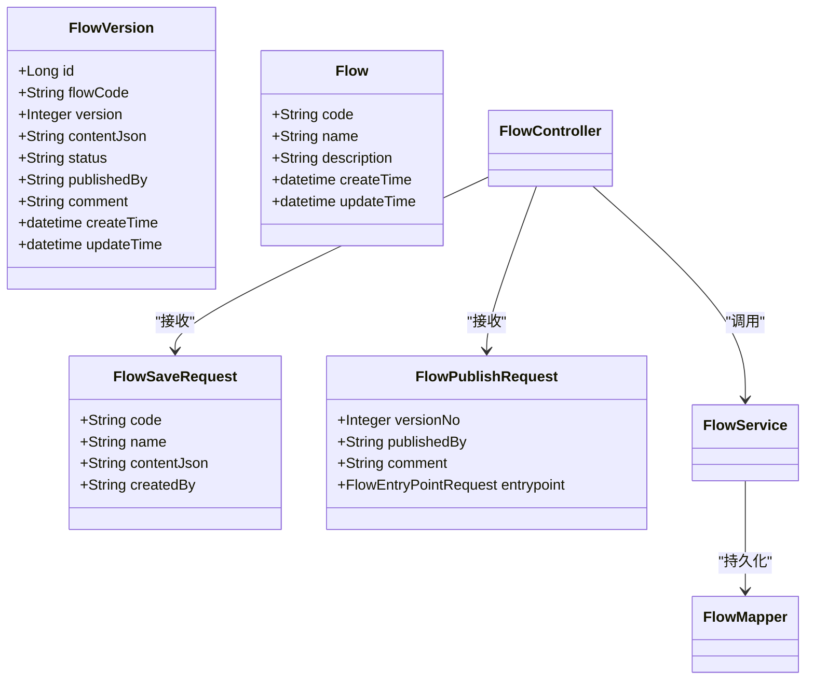
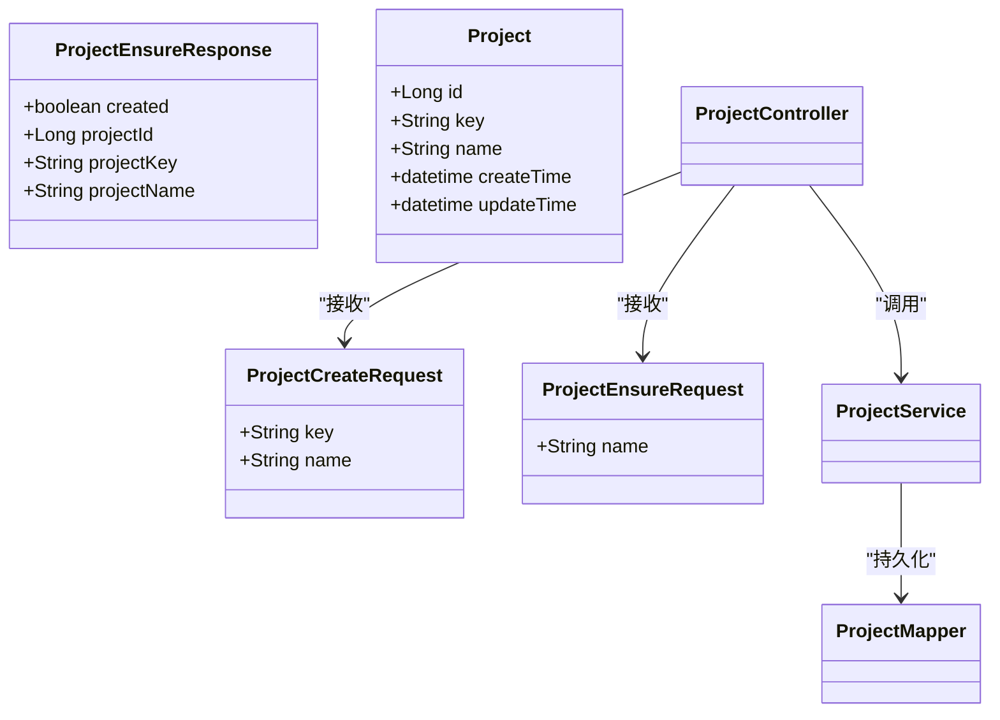
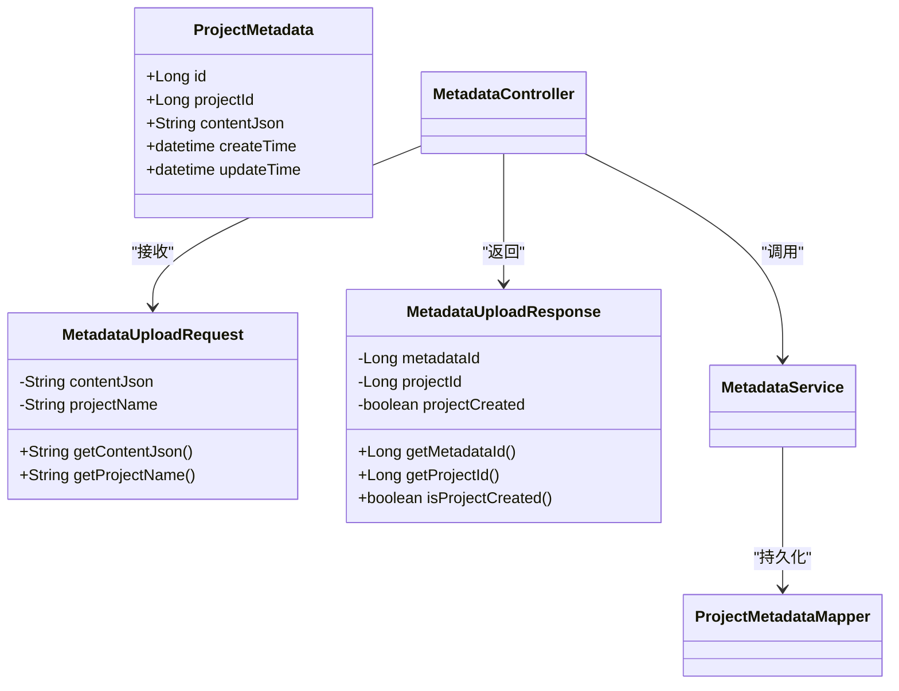
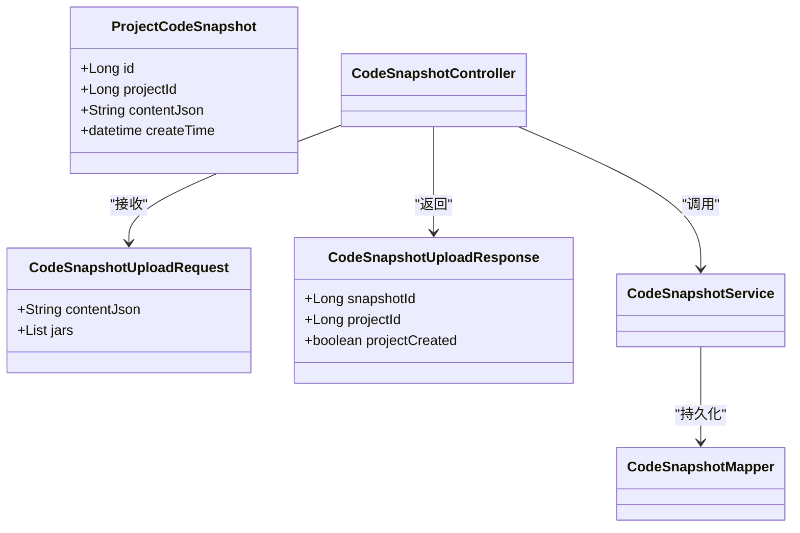
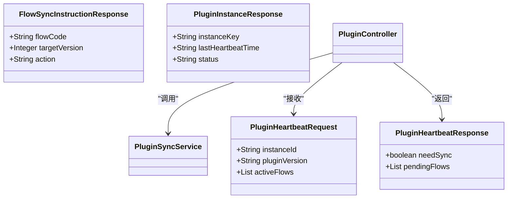

# API参考

<cite>
**本文档中引用的文件**  
- [FlowController.java](file://yglue-orchestrator/src/main/java/org/yglue/flow/orch/web/controller/FlowController.java)
- [ProjectController.java](file://yglue-orchestrator/src/main/java/org/yglue/flow/orch/web/controller/ProjectController.java)
- [MetadataController.java](file://yglue-orchestrator/src/main/java/org/yglue/flow/orch/web/controller/MetadataController.java)
- [CodeSnapshotController.java](file://yglue-orchestrator/src/main/java/org/yglue/flow/orch/web/controller/CodeSnapshotController.java)
- [PluginController.java](file://yglue-orchestrator/src/main/java/org/yglue/flow/orch/web/controller/PluginController.java)
- [FlowSaveRequest.java](file://yglue-orchestrator/src/main/java/org/yglue/flow/orch/web/dto/flow/request/FlowSaveRequest.java)
- [FlowPublishRequest.java](file://yglue-orchestrator/src/main/java/org/yglue/flow/orch/web/dto/flow/request/FlowPublishRequest.java)
- [ProjectCreateRequest.java](file://yglue-orchestrator/src/main/java/org/yglue/flow/orch/web/dto/project/request/ProjectCreateRequest.java)
- [ProjectEnsureRequest.java](file://yglue-orchestrator/src/main/java/org/yglue/flow/orch/web/dto/project/request/ProjectEnsureRequest.java)
- [MetadataUploadRequest.java](file://yglue-orchestrator/src/main/java/org/yglue/flow/orch/web/dto/metadata/request/MetadataUploadRequest.java)
- [CodeSnapshotUploadRequest.java](file://yglue-orchestrator/src/main/java/org/yglue/flow/orch/web/dto/snapshot/request/CodeSnapshotUploadRequest.java)
- [PluginHeartbeatRequest.java](file://yglue-orchestrator/src/main/java/org/yglue/flow/orch/web/dto/plugin/request/PluginHeartbeatRequest.java)
- [FlowModelResponse.java](file://yglue-orchestrator/src/main/java/org/yglue/flow/orch/web/dto/flow/response/FlowModelResponse.java)
- [ProjectEnsureResponse.java](file://yglue-orchestrator/src/main/java/org/yglue/flow/orch/web/dto/project/response/ProjectEnsureResponse.java)
- [MetadataUploadResponse.java](file://yglue-orchestrator/src/main/java/org/yglue/flow/orch/web/dto/metadata/response/MetadataUploadResponse.java)
- [CodeSnapshotUploadResponse.java](file://yglue-orchestrator/src/main/java/org/yglue/flow/orch/web/dto/snapshot/response/CodeSnapshotUploadResponse.java)
- [PluginHeartbeatResponse.java](file://yglue-orchestrator/src/main/java/org/yglue/flow/orch/web/dto/plugin/response/PluginHeartbeatResponse.java)
</cite>

## 目录
1. [简介](#简介)
2. [认证与版本控制](#认证与版本控制)
3. [流程管理API](#流程管理api)
4. [项目管理API](#项目管理api)
5. [元数据上传API](#元数据上传api)
6. [代码快照API](#代码快照api)
7. [插件同步API](#插件同步api)

## 简介
本文档为 `yglue-orchestrator` 模块提供的RESTful API提供详尽的参考说明。重点涵盖流程管理、项目管理、元数据上传和规则同步等核心功能。所有API均基于HTTP协议，使用JSON格式进行数据交换。

**API基础URL**: `https://<host>:<port>/api`

**内容类型**: 所有请求和响应均使用 `application/json`。

**路径参数**: 多数API路径包含 `{projectKey}`，用于指定项目标识。

## 认证与版本控制

### 认证要求
所有API端点均要求进行身份验证。当前系统采用 **JWT（JSON Web Token）** 作为主要的认证机制。客户端必须在每个请求的HTTP头中包含有效的JWT令牌。

**请求头示例**:
```
Authorization: Bearer <your-jwt-token>
```

### 版本控制策略
API的版本控制通过URL路径实现。当前所有端点均位于 `/api` 路径下，代表v1版本。未来若发布新版本，将通过 `/api/v2` 等路径进行区分。

## 流程管理API

`FlowController` 负责管理流程（Flow）的创建、保存、发布和查询。



**Diagram sources**
- [FlowController.java](file://yglue-orchestrator/src/main/java/org/yglue/flow/orch/web/controller/FlowController.java#L18-L57)
- [FlowSaveRequest.java](file://yglue-orchestrator/src/main/java/org/yglue/flow/orch/web/dto/flow/request/FlowSaveRequest.java#L1-L17)
- [FlowPublishRequest.java](file://yglue-orchestrator/src/main/java/org/yglue/flow/orch/web/dto/flow/request/FlowPublishRequest.java#L1-L18)

### 保存流程定义
创建或更新一个流程的草稿版本。

- **HTTP方法**: `POST`
- **URL路径**: `/api/projects/{projectKey}/flows`
- **请求头**: `Authorization: Bearer <token>`
- **请求体 (JSON Schema)**:
```json
{
  "code": "string, 流程的唯一标识符，必填",
  "name": "string, 流程的显示名称，必填",
  "contentJson": "string, 流程的DSL或JSON定义内容，以字符串形式传递，必填",
  "createdBy": "string, 创建者标识，可选"
}
```
- **成功响应 (200 OK)**: 返回 `FlowVersion` 对象。
- **错误响应**:
  - `400 Bad Request`: 请求体验证失败（如缺少必填字段）。
  - `401 Unauthorized`: 认证失败。
  - `404 Not Found`: 指定的 `projectKey` 不存在。

**Section sources**
- [FlowController.java](file://yglue-orchestrator/src/main/java/org/yglue/flow/orch/web/controller/FlowController.java#L28-L31)

### 发布流程
将流程的草稿发布为一个正式版本。

- **HTTP方法**: `POST`
- **URL路径**: `/api/projects/{projectKey}/flows/{code}/publish`
- **路径参数**:
  - `code`: 要发布的流程的代码。
- **请求头**: `Authorization: Bearer <token>`
- **请求体 (JSON Schema)**:
```json
{
  "versionNo": "integer, 要发布的版本号，必填",
  "publishedBy": "string, 发布者标识，可选",
  "comment": "string, 发布说明，可选",
  "entrypoint": { "FlowEntryPointRequest对象，包含入口配置" }
}
```
- **成功响应 (200 OK)**: 返回发布的 `FlowVersion` 对象。
- **错误响应**:
  - `400 Bad Request`: 请求体验证失败。
  - `401 Unauthorized`: 认证失败。
  - `404 Not Found`: 流程或项目不存在。

**Section sources**
- [FlowController.java](file://yglue-orchestrator/src/main/java/org/yglue/flow/orch/web/controller/FlowController.java#L33-L38)

### 查询流程列表
获取指定项目下的所有流程。

- **HTTP方法**: `GET`
- **URL路径**: `/api/projects/{projectKey}/flows`
- **请求头**: `Authorization: Bearer <token>`
- **成功响应 (200 OK)**: 返回 `Flow` 对象的数组。
- **错误响应**:
  - `401 Unauthorized`: 认证失败。
  - `404 Not Found`: 项目不存在。

**Section sources**
- [FlowController.java](file://yglue-orchestrator/src/main/java/org/yglue/flow/orch/web/controller/FlowController.java#L40-L43)

### 查询流程版本
获取指定流程的所有版本列表。

- **HTTP方法**: `GET`
- **URL路径**: `/api/projects/{projectKey}/flows/{code}/versions`
- **路径参数**:
  - `code`: 流程代码。
- **请求头**: `Authorization: Bearer <token>`
- **成功响应 (200 OK)**: 返回 `FlowVersion` 对象的数组。
- **错误响应**:
  - `401 Unauthorized`: 认证失败。
  - `404 Not Found`: 流程或项目不存在。

**Section sources**
- [FlowController.java](file://yglue-orchestrator/src/main/java/org/yglue/flow/orch/web/controller/FlowController.java#L45-L49)

### 获取特定版本
获取流程的某个特定版本。

- **HTTP方法**: `GET`
- **URL路径**: `/api/projects/{projectKey}/flows/{code}/versions/{ver}`
- **路径参数**:
  - `code`: 流程代码。
  - `ver`: 版本号。
- **请求头**: `Authorization: Bearer <token>`
- **成功响应 (200 OK)**: 返回指定的 `FlowVersion` 对象。
- **错误响应**:
  - `401 Unauthorized`: 认证失败。
  - `404 Not Found`: 指定的版本不存在。

**Section sources**
- [FlowController.java](file://yglue-orchestrator/src/main/java/org/yglue/flow/orch/web/controller/FlowController.java#L51-L57)

## 项目管理API

`ProjectController` 负责项目的创建、查询和确保（ensure）操作。



**Diagram sources**
- [ProjectController.java](file://yglue-orchestrator/src/main/java/org/yglue/flow/orch/web/controller/ProjectController.java#L19-L53)
- [ProjectCreateRequest.java](file://yglue-orchestrator/src/main/java/org/yglue/flow/orch/web/dto/project/request/ProjectCreateRequest.java#L1-L12)
- [ProjectEnsureRequest.java](file://yglue-orchestrator/src/main/java/org/yglue/flow/orch/web/dto/project/request/ProjectEnsureRequest.java#L1-L15)
- [ProjectEnsureResponse.java](file://yglue-orchestrator/src/main/java/org/yglue/flow/orch/web/dto/project/response/ProjectEnsureResponse.java#L1-L55)

### 创建项目
创建一个新项目。

- **HTTP方法**: `POST`
- **URL路径**: `/api/projects`
- **请求头**: `Authorization: Bearer <token>`
- **请求体 (JSON Schema)**:
```json
{
  "key": "string, 项目的唯一键，必填",
  "name": "string, 项目的显示名称，必填"
}
```
- **成功响应 (200 OK)**: 返回创建的 `Project` 对象。
- **错误响应**:
  - `400 Bad Request`: 请求体验证失败。
  - `401 Unauthorized`: 认证失败。
  - `409 Conflict`: 项目键已存在。

**Section sources**
- [ProjectController.java](file://yglue-orchestrator/src/main/java/org/yglue/flow/orch/web/controller/ProjectController.java#L29-L32)

### 确保项目存在
此端点用于确保一个项目存在。如果项目不存在，则创建它；如果已存在，则返回现有项目信息。常用于客户端自动初始化项目。

- **HTTP方法**: `POST`
- **URL路径**: `/api/projects/{projectKey}/ensure`
- **路径参数**:
  - `projectKey`: 项目的键。
- **请求头**: `Authorization: Bearer <token>`
- **请求体 (可选, JSON Schema)**:
```json
{
  "name": "string, 项目的显示名称，如果提供则用于创建或更新名称"
}
```
- **成功响应 (200 OK)**: 返回 `ProjectEnsureResponse` 对象。
- **错误响应**:
  - `401 Unauthorized`: 认证失败。

**Section sources**
- [ProjectController.java](file://yglue-orchestrator/src/main/java/org/yglue/flow/orch/web/controller/ProjectController.java#L34-L41)

### 查询项目列表
获取所有项目。

- **HTTP方法**: `GET`
- **URL路径**: `/api/projects`
- **请求头**: `Authorization: Bearer <token>`
- **成功响应 (200 OK)**: 返回 `Project` 对象的数组。
- **错误响应**:
  - `401 Unauthorized`: 认证失败。

**Section sources**
- [ProjectController.java](file://yglue-orchestrator/src/main/java/org/yglue/flow/orch/web/controller/ProjectController.java#L43-L46)

### 获取项目详情
根据项目键获取单个项目详情。

- **HTTP方法**: `GET`
- **URL路径**: `/api/projects/{projectKey}`
- **请求头**: `Authorization: Bearer <token>`
- **成功响应 (200 OK)**: 返回 `Project` 对象。
- **错误响应**:
  - `401 Unauthorized`: 认证失败。
  - `404 Not Found`: 项目不存在。

**Section sources**
- [ProjectController.java](file://yglue-orchestrator/src/main/java/org/yglue/flow/orch/web/controller/ProjectController.java#L48-L52)

## 元数据上传API

`MetadataController` 负责接收和存储项目相关的元数据。



**Diagram sources**
- [MetadataController.java](file://yglue-orchestrator/src/main/java/org/yglue/flow/orch/web/controller/MetadataController.java#L17-L45)
- [MetadataUploadRequest.java](file://yglue-orchestrator/src/main/java/org/yglue/flow/orch/web/dto/metadata/request/MetadataUploadRequest.java#L1-L26)
- [MetadataUploadResponse.java](file://yglue-orchestrator/src/main/java/org/yglue/flow/orch/web/dto/metadata/response/MetadataUploadResponse.java#L1-L33)

### 上传元数据
上传项目的元数据。

- **HTTP方法**: `POST`
- **URL路径**: `/api/projects/{projectKey}/metadata`
- **请求头**: `Authorization: Bearer <token>`
- **请求体 (JSON Schema)**:
```json
{
  "contentJson": "string, 元数据内容，以JSON字符串形式传递，必填",
  "projectName": "string, 项目的显示名称，可选。如果未提供，则使用projectKey"
}
```
- **成功响应 (200 OK)**: 返回 `MetadataUploadResponse` 对象。
- **错误响应**:
  - `400 Bad Request`: 请求体验证失败。
  - `401 Unauthorized`: 认证失败。

**Section sources**
- [MetadataController.java](file://yglue-orchestrator/src/main/java/org/yglue/flow/orch/web/controller/MetadataController.java#L27-L39)

### 查询元数据列表
获取指定项目的所有元数据记录。

- **HTTP方法**: `GET`
- **URL路径**: `/api/projects/{projectKey}/metadata`
- **请求头**: `Authorization: Bearer <token>`
- **成功响应 (200 OK)**: 返回 `ProjectMetadata` 对象的数组。
- **错误响应**:
  - `401 Unauthorized`: 认证失败。
  - `404 Not Found`: 项目不存在。

**Section sources**
- [MetadataController.java](file://yglue-orchestrator/src/main/java/org/yglue/flow/orch/web/controller/MetadataController.java#L41-L44)

## 代码快照API

`CodeSnapshotController` 提供了与IDE插件交互的接口，用于上传代码快照和获取代码辅助信息。



**Diagram sources**
- [CodeSnapshotController.java](file://yglue-orchestrator/src/main/java/org/yglue/flow/orch/web/controller/CodeSnapshotController.java#L17-L145)
- [CodeSnapshotUploadRequest.java](file://yglue-orchestrator/src/main/java/org/yglue/flow/orch/web/dto/snapshot/request/CodeSnapshotUploadRequest.java)
- [CodeSnapshotUploadResponse.java](file://yglue-orchestrator/src/main/java/org/yglue/flow/orch/web/dto/snapshot/response/CodeSnapshotUploadResponse.java#L1-L32)

### 上传代码快照
由IDE插件调用，上传当前项目的代码结构快照。

- **HTTP方法**: `POST`
- **URL路径**: `/api/projects/{projectKey}/code-snapshots`
- **请求头**: `Authorization: Bearer <token>`
- **请求体**: 包含项目代码结构和依赖JAR信息的JSON。
- **成功响应 (200 OK)**: 返回 `CodeSnapshotUploadResponse` 对象。
- **错误响应**:
  - `400 Bad Request`: 请求体格式错误。
  - `401 Unauthorized`: 认证失败。

**Section sources**
- [CodeSnapshotController.java](file://yglue-orchestrator/src/main/java/org/yglue/flow/orch/web/controller/CodeSnapshotController.java#L36-L46)

### 获取最新代码快照
获取指定项目的最新代码快照。

- **HTTP方法**: `GET`
- **URL路径**: `/api/projects/{projectKey}/code-snapshots/latest`
- **请求头**: `Authorization: Bearer <token>`
- **成功响应 (200 OK)**: 返回 `ProjectCodeSnapshot` 对象。
- **错误响应**:
  - `401 Unauthorized`: 认证失败。
  - `404 Not Found`: 项目或快照不存在。

**Section sources**
- [CodeSnapshotController.java](file://yglue-orchestrator/src/main/java/org/yglue/flow/orch/web/controller/CodeSnapshotController.java#L48-L53)

### 获取代码辅助信息
为IDE提供代码补全和成员查询所需的数据。

- **HTTP方法**: `GET`
- **URL路径**: `/api/projects/{projectKey}/code-snapshots/helpers`
- **请求头**: `Authorization: Bearer <token>`
- **查询参数**:
  - `endpointId` (可选): 端点ID。
- **成功响应 (200 OK)**: 返回一个包含 `snapshotId`, `classes`, 和 `selectedJars` 的JSON对象。
- **错误响应**:
  - `401 Unauthorized`: 认证失败。

**Section sources**
- [CodeSnapshotController.java](file://yglue-orchestrator/src/main/java/org/yglue/flow/orch/web/controller/CodeSnapshotController.java#L55-L95)

### 查询类成员
根据类的全限定名查询其字段或方法。

- **HTTP方法**: `GET`
- **URL路径**: `/api/projects/{projectKey}/code-snapshots/class-members`
- **请求头**: `Authorization: Bearer <token>`
- **查询参数**:
  - `qualifiedName`: 类的全限定名，必填。
  - `kind`: 查询类型，`fields` 或 `methods`，必填。
  - `page`: 分页页码，可选，默认为1。
  - `size`: 每页数量，可选，默认为50。
- **成功响应 (200 OK)**: 返回一个包含 `items` 数组的JSON对象，数组元素为字段或方法的信息。
- **错误响应**:
  - `400 Bad Request`: 参数缺失。
  - `401 Unauthorized`: 认证失败。

**Section sources**
- [CodeSnapshotController.java](file://yglue-orchestrator/src/main/java/org/yglue/flow/orch/web/controller/CodeSnapshotController.java#L97-L143)

## 插件同步API

`PluginController` 处理来自IDE插件的心跳和同步确认。



**Diagram sources**
- [PluginController.java](file://yglue-orchestrator/src/main/java/org/yglue/flow/orch/web/controller/PluginController.java#L19-L48)
- [PluginHeartbeatRequest.java](file://yglue-orchestrator/src/main/java/org/yglue/flow/orch/web/dto/plugin/request/PluginHeartbeatRequest.java)
- [PluginHeartbeatResponse.java](file://yglue-orchestrator/src/main/java/org/yglue/flow/orch/web/dto/plugin/response/PluginHeartbeatResponse.java#L1-L30)

### 插件心跳
插件定期发送心跳，报告其状态并检查是否有待同步的流程。

- **HTTP方法**: `POST`
- **URL路径**: `/api/projects/{projectKey}/plugins/heartbeat`
- **请求头**: `Authorization: Bearer <token>`
- **请求体**: `PluginHeartbeatRequest` 对象。
- **成功响应 (200 OK)**: 返回 `PluginHeartbeatResponse` 对象，指示是否需要同步以及待同步的流程列表。
- **错误响应**:
  - `400 Bad Request`: 请求体格式错误。
  - `401 Unauthorized`: 认证失败。

**Section sources**
- [PluginController.java](file://yglue-orchestrator/src/main/java/org/yglue/flow/orch/web/controller/PluginController.java#L29-L34)

### 同步确认
插件在完成流程同步后发送确认。

- **HTTP方法**: `POST`
- **URL路径**: `/api/projects/{projectKey}/plugins/{instanceKey}/sync/ack`
- **路径参数**:
  - `instanceKey`: 插件实例的唯一键。
- **请求头**: `Authorization: Bearer <token>`
- **请求体**: `FlowSyncAckRequest` 对象。
- **成功响应 (200 OK)**: 无返回内容。
- **错误响应**:
  - `400 Bad Request`: 请求体格式错误。
  - `401 Unauthorized`: 认证失败。
  - `404 Not Found`: 插件实例不存在。

**Section sources**
- [PluginController.java](file://yglue-orchestrator/src/main/java/org/yglue/flow/orch/web/controller/PluginController.java#L36-L41)

### 查询插件实例列表
获取指定项目下所有已连接的插件实例。

- **HTTP方法**: `GET`
- **URL路径**: `/api/projects/{projectKey}/plugins`
- **请求头**: `Authorization: Bearer <token>`
- **成功响应 (200 OK)**: 返回 `PluginInstanceResponse` 对象的数组。
- **错误响应**:
  - `401 Unauthorized`: 认证失败。

**Section sources**
- [PluginController.java](file://yglue-orchestrator/src/main/java/org/yglue/flow/orch/web/controller/PluginController.java#L43-L46)