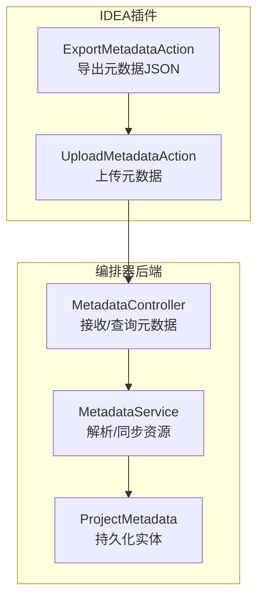
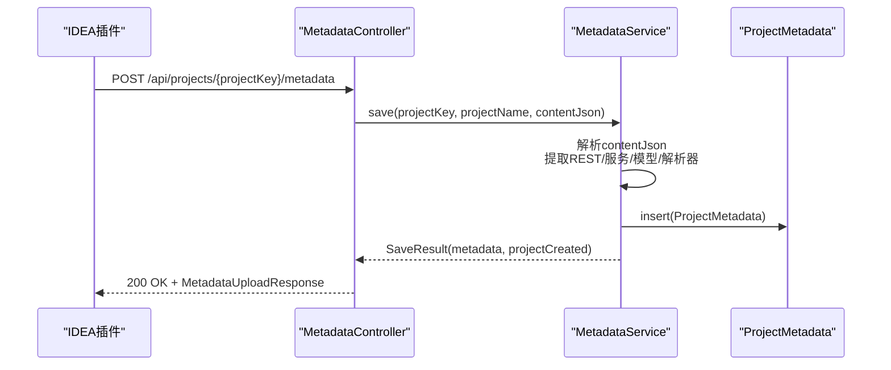
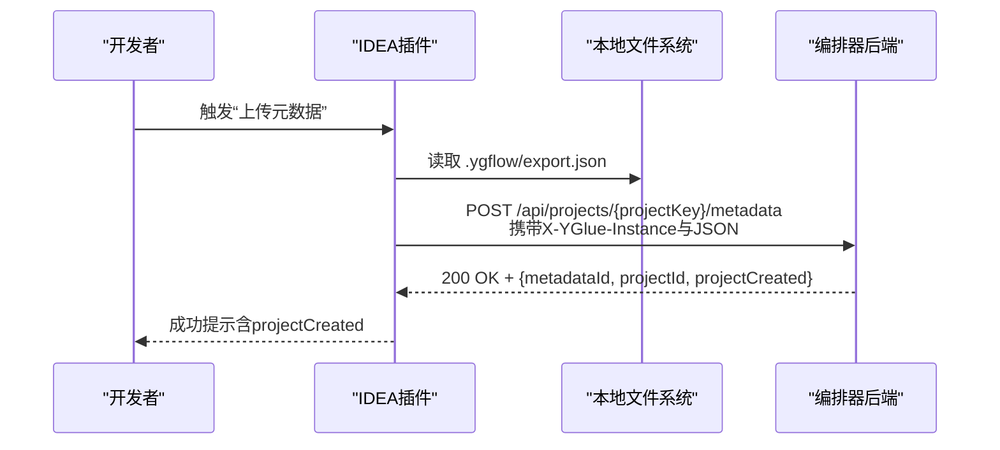
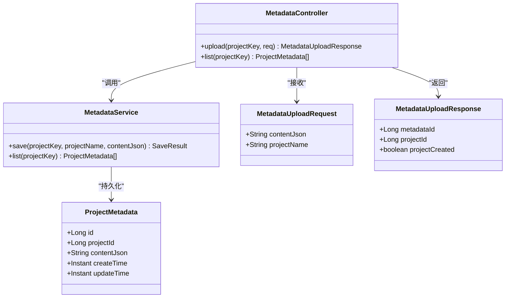

# 元数据管理API

<cite>
**本文引用的文件**
- [MetadataController.java](file://yglue-orchestrator/src/main/java/org/yglue/flow/orch/web/controller/MetadataController.java)
- [MetadataService.java](file://yglue-orchestrator/src/main/java/org/yglue/flow/orch/service/MetadataService.java)
- [ProjectMetadata.java](file://yglue-orchestrator/src/main/java/org/yglue/flow/orch/domain/ProjectMetadata.java)
- [MetadataUploadRequest.java](file://yglue-orchestrator/src/main/java/org/yglue/flow/orch/web/dto/metadata/request/MetadataUploadRequest.java)
- [MetadataUploadResponse.java](file://yglue-orchestrator/src/main/java/org/yglue/flow/orch/web/dto/metadata/response/MetadataUploadResponse.java)
- [UploadMetadataAction.java](file://yglue-idea-plugin/src/main/java/org/yglue/flow/idea/UploadMetadataAction.java)
- [ExportMetadataAction.java](file://yglue-idea-plugin/src/main/java/org/yglue/flow/idea/ExportMetadataAction.java)
- [FlowApi.java](file://yglue-annotations/src/main/java/org/yglue/flow/annotations/FlowApi.java)
</cite>

## 目录
1. [简介](#简介)
2. [项目结构](#项目结构)
3. [核心组件](#核心组件)
4. [架构总览](#架构总览)
5. [详细组件分析](#详细组件分析)
6. [依赖关系分析](#依赖关系分析)
7. [性能考量](#性能考量)
8. [故障排查指南](#故障排查指南)
9. [结论](#结论)
10. [附录](#附录)

## 简介
本文件面向IDEA插件与编排器之间的元数据同步场景，聚焦于MetadataController提供的两个关键API：
- POST /api/projects/{projectKey}/metadata：接收来自IDEA插件的代码元数据快照，解析其中的注解信息（如@FlowApi、@FlowModel、@FlowResolver、Spring MVC REST端点等），并同步更新项目端点、流程模型与流程解析器等资源。
- GET /api/projects/{projectKey}/metadata：列出该项目的历史元数据记录，便于回溯与审计。

同时，文档结合IDEA插件的UploadMetadataAction与ExportMetadataAction，说明从“导出元数据”到“上传元数据”的完整工作流，这是实现低代码与源码双向同步的关键机制。

## 项目结构
围绕元数据管理API的相关模块分布如下：
- 后端控制器与服务层：负责接收、解析与落库；并同步REST端点、流程模型与流程解析器。
- 前端IDEA插件：负责扫描源码与注解，生成元数据JSON，并通过HTTP上传至后端。
- 注解定义：提供FlowApi等注解的语义，驱动IDEA插件扫描与导出。

图表来源
- [MetadataController.java](file://yglue-orchestrator/src/main/java/org/yglue/flow/orch/web/controller/MetadataController.java#L1-L46)
- [MetadataService.java](file://yglue-orchestrator/src/main/java/org/yglue/flow/orch/service/MetadataService.java#L1-L120)
- [ProjectMetadata.java](file://yglue-orchestrator/src/main/java/org/yglue/flow/orch/domain/ProjectMetadata.java#L1-L79)
- [UploadMetadataAction.java](file://yglue-idea-plugin/src/main/java/org/yglue/flow/idea/UploadMetadataAction.java#L1-L154)
- [ExportMetadataAction.java](file://yglue-idea-plugin/src/main/java/org/yglue/flow/idea/ExportMetadataAction.java#L1-L120)

章节来源
- [MetadataController.java](file://yglue-orchestrator/src/main/java/org/yglue/flow/orch/web/controller/MetadataController.java#L1-L46)
- [MetadataService.java](file://yglue-orchestrator/src/main/java/org/yglue/flow/orch/service/MetadataService.java#L1-L120)
- [UploadMetadataAction.java](file://yglue-idea-plugin/src/main/java/org/yglue/flow/idea/UploadMetadataAction.java#L1-L154)
- [ExportMetadataAction.java](file://yglue-idea-plugin/src/main/java/org/yglue/flow/idea/ExportMetadataAction.java#L1-L120)

## 核心组件
- MetadataController：暴露POST/GET接口，负责路由与参数校验，调用MetadataService执行业务逻辑，并封装返回。
- MetadataService：解析contentJson，同步REST端点、流程服务端点、流程模型与流程解析器；保存元数据记录。
- ProjectMetadata：持久化实体，承载元数据JSON与项目关联信息。
- MetadataUploadRequest/MetadataUploadResponse：请求/响应DTO，承载contentJson与辅助字段。
- IDEA插件UploadMetadataAction/ExportMetadataAction：负责导出与上传元数据，构造请求体并调用后端API。

章节来源
- [MetadataController.java](file://yglue-orchestrator/src/main/java/org/yglue/flow/orch/web/controller/MetadataController.java#L1-L46)
- [MetadataService.java](file://yglue-orchestrator/src/main/java/org/yglue/flow/orch/service/MetadataService.java#L60-L120)
- [ProjectMetadata.java](file://yglue-orchestrator/src/main/java/org/yglue/flow/orch/domain/ProjectMetadata.java#L1-L79)
- [MetadataUploadRequest.java](file://yglue-orchestrator/src/main/java/org/yglue/flow/orch/web/dto/metadata/request/MetadataUploadRequest.java#L1-L26)
- [MetadataUploadResponse.java](file://yglue-orchestrator/src/main/java/org/yglue/flow/orch/web/dto/metadata/response/MetadataUploadResponse.java#L1-L33)
- [UploadMetadataAction.java](file://yglue-idea-plugin/src/main/java/org/yglue/flow/idea/UploadMetadataAction.java#L1-L154)
- [ExportMetadataAction.java](file://yglue-idea-plugin/src/main/java/org/yglue/flow/idea/ExportMetadataAction.java#L1-L120)

## 架构总览
后端采用Spring MVC控制器+服务层的分层设计。IDEA插件通过HTTP向后端提交元数据JSON，后端解析并同步相关资源，同时持久化元数据记录以便后续查询。

图表来源
- [MetadataController.java](file://yglue-orchestrator/src/main/java/org/yglue/flow/orch/web/controller/MetadataController.java#L27-L45)
- [MetadataService.java](file://yglue-orchestrator/src/main/java/org/yglue/flow/orch/service/MetadataService.java#L74-L103)
- [ProjectMetadata.java](file://yglue-orchestrator/src/main/java/org/yglue/flow/orch/domain/ProjectMetadata.java#L1-L79)
- [UploadMetadataAction.java](file://yglue-idea-plugin/src/main/java/org/yglue/flow/idea/UploadMetadataAction.java#L110-L133)

## 详细组件分析

### POST /api/projects/{projectKey}/metadata
- 功能概述
  - 接收IDEA插件上传的元数据快照，解析其中的注解信息，同步REST端点、流程服务端点、流程模型与流程解析器，并持久化元数据记录。
  - 返回metadataId、projectId与projectCreated标志位，便于前端与插件侧进行后续处理与提示。

- 请求体
  - MetadataUploadRequest
    - contentJson：必填，字符串格式的元数据JSON，包含rests、services、models、resolvers等数组字段。
    - projectName：可选，若提供则用于项目命名；否则使用projectKey作为项目名。
  - 参数绑定
    - 路径参数projectKey：项目唯一标识。
    - 请求体：@Valid校验，确保contentJson非空。

- 处理流程
  - 控制器调用MetadataService.save(projectKey, projectName, contentJson)，返回SaveResult。
  - 构造MetadataUploadResponse，填充metadataId、projectId与projectCreated。

- 返回体
  - MetadataUploadResponse
    - metadataId：本次保存的元数据记录ID。
    - projectId：所属项目ID。
    - projectCreated：布尔值，表示是否为新创建的项目。

- contentJson结构要点（由IDEA插件导出）
  - 顶层字段
    - project：项目名称（导出时使用）
    - services：流程服务数组，每项包含class、name、bean、version、description、operations等。
    - rests：REST端点数组，每项包含httpMethod、path、class、method、name、description、requestSchemaJson、responseSchema等。
    - models：流程模型数组，每项包含id/name/class/description/category/version/tags/schema等。
    - resolvers：流程解析器数组，每项包含type/name/description/category/configSchema/builtin/class等。
  - 其他
    - 项目级信息（如snapshotKey、generatedAt、ide、classes、dependencies、selectedJars、jarMetadata、contentHash等）由IDEA插件导出，但后端仅解析上述四大数组字段用于同步。

- 与注解的关系
  - @FlowApi：用于识别流程服务类与操作，生成services与models/resolvers等信息。
  - @FlowModel、@FlowResolver：用于识别模型与解析器，生成models与resolvers信息。
  - Spring MVC注解：用于识别REST端点，生成rests信息。

- 错误与边界
  - contentJson为空或格式不合法时，解析根节点失败，后端不会抛异常，但不会同步任何资源。
  - projectName为空时，使用projectKey作为项目名。

章节来源
- [MetadataController.java](file://yglue-orchestrator/src/main/java/org/yglue/flow/orch/web/controller/MetadataController.java#L27-L45)
- [MetadataUploadRequest.java](file://yglue-orchestrator/src/main/java/org/yglue/flow/orch/web/dto/metadata/request/MetadataUploadRequest.java#L1-L26)
- [MetadataUploadResponse.java](file://yglue-orchestrator/src/main/java/org/yglue/flow/orch/web/dto/metadata/response/MetadataUploadResponse.java#L1-L33)
- [MetadataService.java](file://yglue-orchestrator/src/main/java/org/yglue/flow/orch/service/MetadataService.java#L74-L103)
- [ExportMetadataAction.java](file://yglue-idea-plugin/src/main/java/org/yglue/flow/idea/ExportMetadataAction.java#L122-L171)
- [FlowApi.java](file://yglue-annotations/src/main/java/org/yglue/flow/annotations/FlowApi.java#L1-L33)

### GET /api/projects/{projectKey}/metadata
- 功能概述
  - 查询指定projectKey下的历史元数据列表，便于查看与审计。

- 返回
  - List<ProjectMetadata>：按时间倒序排列的元数据记录列表，每条记录包含metadataId、projectId、contentJson、createTime/updateTime等。

- 适用场景
  - 回溯某次上传的元数据内容。
  - 定位问题时比对不同版本的差异。

章节来源
- [MetadataController.java](file://yglue-orchestrator/src/main/java/org/yglue/flow/orch/web/controller/MetadataController.java#L41-L44)
- [MetadataService.java](file://yglue-orchestrator/src/main/java/org/yglue/flow/orch/service/MetadataService.java#L105-L108)
- [ProjectMetadata.java](file://yglue-orchestrator/src/main/java/org/yglue/flow/orch/domain/ProjectMetadata.java#L1-L79)

### IDEA插件元数据同步工作流
- 导出阶段
  - ExportMetadataAction扫描项目中的Java类，基于注解（@FlowApi、@FlowModel、@FlowResolver、Spring MVC注解）构建元数据JSON，保存为项目根目录下的“.ygflow/export.json”。

- 上传阶段
  - UploadMetadataAction读取export.json，构造MetadataUploadRequest，向后端发起POST请求，携带X-YGlue-Instance头与contentJson、projectName。
  - 若上传成功，根据响应体中的projectCreated标志位提示“项目已创建”。

- 自动化触发
  - IDEA插件还提供定时任务与启动活动，可在特定条件下自动导出与上传，保证源码与低代码平台的实时一致性。

图表来源
- [UploadMetadataAction.java](file://yglue-idea-plugin/src/main/java/org/yglue/flow/idea/UploadMetadataAction.java#L57-L154)
- [ExportMetadataAction.java](file://yglue-idea-plugin/src/main/java/org/yglue/flow/idea/ExportMetadataAction.java#L122-L131)
- [MetadataController.java](file://yglue-orchestrator/src/main/java/org/yglue/flow/orch/web/controller/MetadataController.java#L27-L45)

章节来源
- [UploadMetadataAction.java](file://yglue-idea-plugin/src/main/java/org/yglue/flow/idea/UploadMetadataAction.java#L1-L154)
- [ExportMetadataAction.java](file://yglue-idea-plugin/src/main/java/org/yglue/flow/idea/ExportMetadataAction.java#L1-L171)

## 依赖关系分析
- 控制器依赖服务层，服务层依赖领域实体与DAO层（通过Mapper），并调用多个子服务完成端点、模型与解析器的同步。
- IDEA插件依赖注解定义与Schema生成工具，导出JSON后上传至后端。

图表来源
- [MetadataController.java](file://yglue-orchestrator/src/main/java/org/yglue/flow/orch/web/controller/MetadataController.java#L1-L46)
- [MetadataService.java](file://yglue-orchestrator/src/main/java/org/yglue/flow/orch/service/MetadataService.java#L1-L120)
- [ProjectMetadata.java](file://yglue-orchestrator/src/main/java/org/yglue/flow/orch/domain/ProjectMetadata.java#L1-L79)
- [MetadataUploadRequest.java](file://yglue-orchestrator/src/main/java/org/yglue/flow/orch/web/dto/metadata/request/MetadataUploadRequest.java#L1-L26)
- [MetadataUploadResponse.java](file://yglue-orchestrator/src/main/java/org/yglue/flow/orch/web/dto/metadata/response/MetadataUploadResponse.java#L1-L33)

章节来源
- [MetadataController.java](file://yglue-orchestrator/src/main/java/org/yglue/flow/orch/web/controller/MetadataController.java#L1-L46)
- [MetadataService.java](file://yglue-orchestrator/src/main/java/org/yglue/flow/orch/service/MetadataService.java#L1-L120)
- [ProjectMetadata.java](file://yglue-orchestrator/src/main/java/org/yglue/flow/orch/domain/ProjectMetadata.java#L1-L79)

## 性能考量
- 解析复杂度
  - contentJson解析与字段遍历为线性复杂度O(N)，N为数组元素数量。
  - 端点、模型与解析器同步涉及多次数据库写入，建议在事务中批量处理以减少往返开销。
- 并发与幂等
  - 同一快照重复上传应幂等，避免重复同步与重复记录。
- I/O与网络
  - IDEA插件导出与上传均涉及磁盘I/O与HTTP请求，建议在网络不稳定时增加重试与超时控制。

## 故障排查指南
- 常见问题
  - 上传失败（HTTP 4xx/5xx）：检查IDEA插件配置（endpoint、projectKey、instanceKey）、网络连通性与后端日志。
  - contentJson为空或格式错误：确认IDEA插件已成功导出export.json，且内容符合预期结构。
  - 项目未创建：若projectCreated为true，需在前端或后端初始化项目资源。
- 建议步骤
  - 在IDEA中重新导出并上传，观察返回体中的projectCreated。
  - 使用GET /api/projects/{projectKey}/metadata查看历史记录，定位最近一次上传的metadataId。
  - 如需回滚，可基于历史记录中的contentJson进行二次同步或手工修复。

章节来源
- [UploadMetadataAction.java](file://yglue-idea-plugin/src/main/java/org/yglue/flow/idea/UploadMetadataAction.java#L126-L154)
- [MetadataController.java](file://yglue-orchestrator/src/main/java/org/yglue/flow/orch/web/controller/MetadataController.java#L27-L45)

## 结论
MetadataController提供的元数据上传与查询API，配合IDEA插件的导出与上传流程，构成了低代码与源码双向同步的核心通道。通过解析@FlowApi、@FlowModel、@FlowResolver与Spring MVC注解，后端能够自动同步REST端点、流程服务端点、流程模型与流程解析器，从而实现开发态与运行态的一致性。建议在生产环境中完善幂等性、重试与审计能力，确保同步过程稳定可靠。

## 附录

### API定义与字段说明
- POST /api/projects/{projectKey}/metadata
  - 请求头：Content-Type: application/json；可选X-YGlue-Instance
  - 请求体：MetadataUploadRequest
    - contentJson：必填，字符串，元数据JSON
    - projectName：可选，字符串，项目显示名
  - 响应体：MetadataUploadResponse
    - metadataId：长整型，本次元数据记录ID
    - projectId：长整型，项目ID
    - projectCreated：布尔值，是否新创建项目
- GET /api/projects/{projectKey}/metadata
  - 响应体：List<ProjectMetadata>
    - id、projectId、contentJson、createTime、updateTime等

章节来源
- [MetadataController.java](file://yglue-orchestrator/src/main/java/org/yglue/flow/orch/web/controller/MetadataController.java#L27-L45)
- [MetadataUploadRequest.java](file://yglue-orchestrator/src/main/java/org/yglue/flow/orch/web/dto/metadata/request/MetadataUploadRequest.java#L1-L26)
- [MetadataUploadResponse.java](file://yglue-orchestrator/src/main/java/org/yglue/flow/orch/web/dto/metadata/response/MetadataUploadResponse.java#L1-L33)
- [ProjectMetadata.java](file://yglue-orchestrator/src/main/java/org/yglue/flow/orch/domain/ProjectMetadata.java#L1-L79)