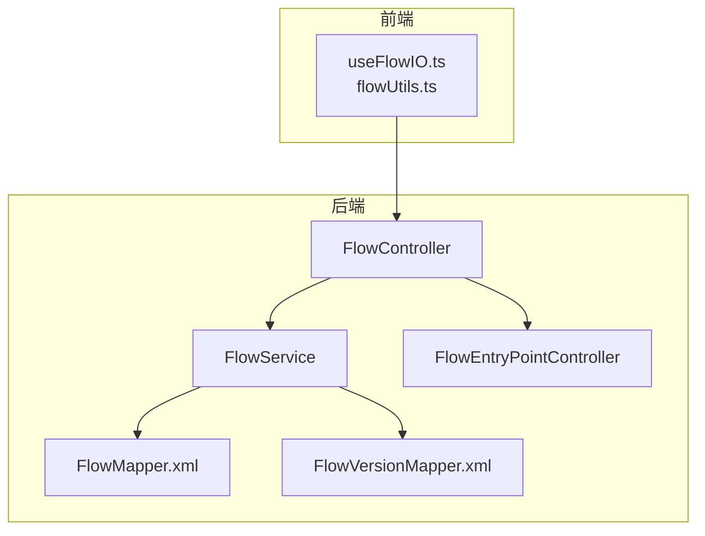
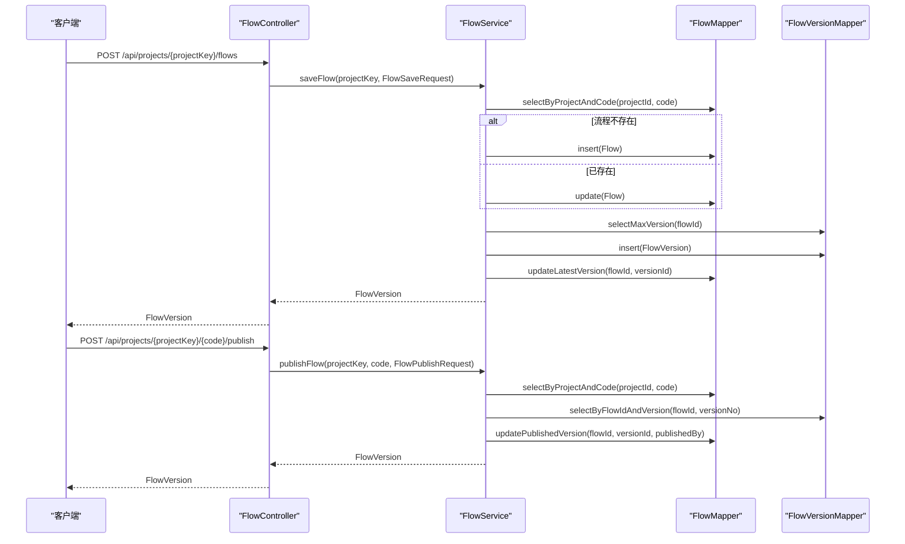
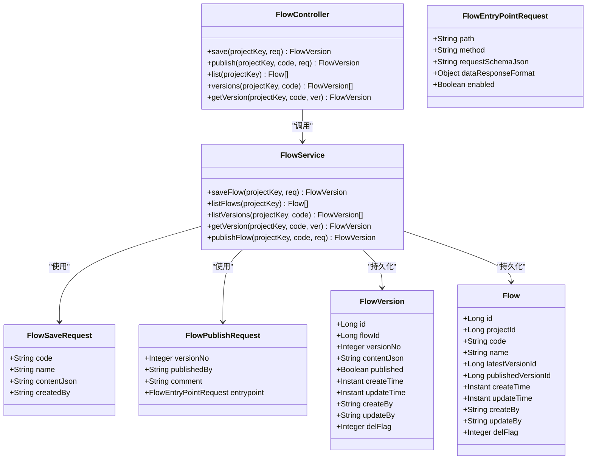
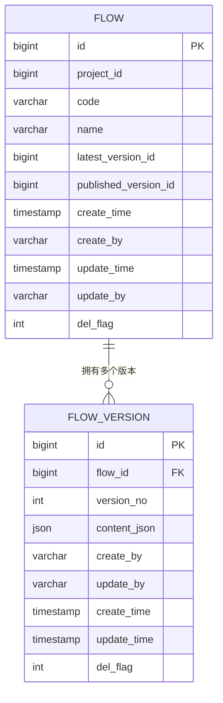

# 流程管理API

<cite>
**本文引用的文件**
- [FlowController.java](file://yglue-orchestrator/src/main/java/org/yglue/flow/orch/web/controller/FlowController.java)
- [FlowService.java](file://yglue-orchestrator/src/main/java/org/yglue/flow/orch/service/FlowService.java)
- [FlowSaveRequest.java](file://yglue-orchestrator/src/main/java/org/yglue/flow/orch/web/dto/flow/request/FlowSaveRequest.java)
- [FlowPublishRequest.java](file://yglue-orchestrator/src/main/java/org/yglue/flow/orch/web/dto/flow/request/FlowPublishRequest.java)
- [FlowEntryPointRequest.java](file://yglue-orchestrator/src/main/java/org/yglue/flow/orch/web/dto/flow/request/FlowEntryPointRequest.java)
- [FlowVersion.java](file://yglue-orchestrator/src/main/java/org/yglue/flow/orch/domain/FlowVersion.java)
- [Flow.java](file://yglue-orchestrator/src/main/java/org/yglue/flow/orch/domain/Flow.java)
- [FlowMapper.xml](file://yglue-orchestrator/src/main/resources/mapper/FlowMapper.xml)
- [FlowVersionMapper.xml](file://yglue-orchestrator/src/main/resources/mapper/FlowVersionMapper.xml)
- [FlowEntryPointController.java](file://yglue-orchestrator/src/main/java/org/yglue/flow/orch/web/controller/FlowEntryPointController.java)
- [FlowEntryPoint.java](file://yglue-orchestrator/src/main/java/org/yglue/flow/orch/domain/FlowEntryPoint.java)
- [useFlowIO.ts](file://apps/ygflow-orchestrator-ui/src/components/composables/useFlowIO.ts)
- [flowUtils.ts](file://apps/ygflow-orchestrator-ui/src/components/composables/flowUtils.ts)
</cite>

## 目录
1. [简介](#简介)
2. [项目结构](#项目结构)
3. [核心组件](#核心组件)
4. [架构总览](#架构总览)
5. [详细组件分析](#详细组件分析)
6. [依赖关系分析](#依赖关系分析)
7. [性能考虑](#性能考虑)
8. [故障排查指南](#故障排查指南)
9. [结论](#结论)
10. [附录](#附录)

## 简介
本文件为 FlowController 的全面 API 文档，覆盖流程的全生命周期管理：新增、查询、版本列表、版本详情、保存草稿、发布等。重点说明以下端点：
- GET /api/projects/{projectKey}/flows
- POST /api/projects/{projectKey}/flows
- POST /api/projects/{projectKey}/{code}/publish
- GET /api/projects/{projectKey}/{code}/versions
- GET /api/projects/{projectKey}/{code}/versions/{ver}

同时深入解析请求体 FlowSaveRequest 的结构，特别是 contentJson 中的节点（nodes）与边（edges）的 JSON 结构来源与清理规则，并给出 FlowModelResponse 的响应格式说明。最后解释版本控制与发布状态的管理机制，并提供保存一个包含任务节点与分支节点的复杂流程的请求示例路径与要点。

## 项目结构
- 控制层：FlowController 提供 REST 接口，路由位于 /api/projects/{projectKey}/flows。
- 服务层：FlowService 实现业务逻辑，负责保存、发布、版本查询与内容清洗。
- 数据访问层：FlowMapper、FlowVersionMapper 映射 yglue_flow 与 yglue_flow_version 表。
- 请求/响应 DTO：FlowSaveRequest、FlowPublishRequest、FlowEntryPointRequest。
- 前端集成：useFlowIO.ts 与 flowUtils.ts 定义了 normalizeFlowData 的行为与 contentJson 的结构，确保前后端一致。

图表来源
- [FlowController.java](file://yglue-orchestrator/src/main/java/org/yglue/flow/orch/web/controller/FlowController.java#L1-L58)
- [FlowService.java](file://yglue-orchestrator/src/main/java/org/yglue/flow/orch/service/FlowService.java#L1-L342)
- [FlowMapper.xml](file://yglue-orchestrator/src/main/resources/mapper/FlowMapper.xml#L1-L82)
- [FlowVersionMapper.xml](file://yglue-orchestrator/src/main/resources/mapper/FlowVersionMapper.xml#L1-L62)
- [FlowEntryPointController.java](file://yglue-orchestrator/src/main/java/org/yglue/flow/orch/web/controller/FlowEntryPointController.java#L1-L101)
- [useFlowIO.ts](file://apps/ygflow-orchestrator-ui/src/components/composables/useFlowIO.ts#L1-L767)
- [flowUtils.ts](file://apps/ygflow-orchestrator-ui/src/components/composables/flowUtils.ts#L134-L162)

章节来源
- [FlowController.java](file://yglue-orchestrator/src/main/java/org/yglue/flow/orch/web/controller/FlowController.java#L1-L58)
- [FlowService.java](file://yglue-orchestrator/src/main/java/org/yglue/flow/orch/service/FlowService.java#L1-L342)

## 核心组件
- FlowController：暴露流程管理 REST 接口，处理保存、发布、查询等请求。
- FlowService：实现保存/发布/版本查询；在获取版本时清理 contentJson 中的 UI 字段，仅保留核心业务数据。
- FlowSaveRequest：保存草稿时的请求体，包含 code、name、contentJson、createdBy。
- FlowPublishRequest：发布时的请求体，包含 versionNo、publishedBy、comment、entrypoint。
- FlowEntryPointRequest：入口点配置的请求体，包含 path、method、requestSchemaJson、dataResponseFormat、enabled。
- FlowVersion：版本实体，包含 contentJson、published 标志、时间戳与创建者。
- Flow：流程实体，包含 latestVersionId、publishedVersionId 等。

章节来源
- [FlowController.java](file://yglue-orchestrator/src/main/java/org/yglue/flow/orch/web/controller/FlowController.java#L1-L58)
- [FlowService.java](file://yglue-orchestrator/src/main/java/org/yglue/flow/orch/service/FlowService.java#L1-L342)
- [FlowSaveRequest.java](file://yglue-orchestrator/src/main/java/org/yglue/flow/orch/web/dto/flow/request/FlowSaveRequest.java#L1-L17)
- [FlowPublishRequest.java](file://yglue-orchestrator/src/main/java/org/yglue/flow/orch/web/dto/flow/request/FlowPublishRequest.java#L1-L18)
- [FlowEntryPointRequest.java](file://yglue-orchestrator/src/main/java/org/yglue/flow/orch/web/dto/flow/request/FlowEntryPointRequest.java#L1-L57)
- [FlowVersion.java](file://yglue-orchestrator/src/main/java/org/yglue/flow/orch/domain/FlowVersion.java#L1-L97)
- [Flow.java](file://yglue-orchestrator/src/main/java/org/yglue/flow/orch/domain/Flow.java#L1-L109)

## 架构总览
FlowController 作为入口，调用 FlowService 完成业务处理；FlowService 通过 MyBatis Mapper 访问数据库表 yglue_flow 与 yglue_flow_version。发布流程时，FlowService 同步更新 Flow 的 publishedVersionId，并通过 FlowEntryPointService 更新入口点配置。

图表来源
- [FlowController.java](file://yglue-orchestrator/src/main/java/org/yglue/flow/orch/web/controller/FlowController.java#L1-L58)
- [FlowService.java](file://yglue-orchestrator/src/main/java/org/yglue/flow/orch/service/FlowService.java#L70-L174)
- [FlowMapper.xml](file://yglue-orchestrator/src/main/resources/mapper/FlowMapper.xml#L41-L56)
- [FlowVersionMapper.xml](file://yglue-orchestrator/src/main/resources/mapper/FlowVersionMapper.xml#L23-L41)

## 详细组件分析

### API 端点定义与行为

- GET /api/projects/{projectKey}/flows
  - 功能：列出项目下所有流程。
  - 返回：流程列表（Flow）。
  - 章节来源
    - [FlowController.java](file://yglue-orchestrator/src/main/java/org/yglue/flow/orch/web/controller/FlowController.java#L40-L43)
    - [FlowService.java](file://yglue-orchestrator/src/main/java/org/yglue/flow/orch/service/FlowService.java#L114-L123)

- POST /api/projects/{projectKey}/flows
  - 功能：保存流程草稿，创建新版本。
  - 请求体：FlowSaveRequest（见下节）。
  - 返回：FlowVersion（包含版本号、发布时间、发布标志等）。
  - 章节来源
    - [FlowController.java](file://yglue-orchestrator/src/main/java/org/yglue/flow/orch/web/controller/FlowController.java#L28-L31)
    - [FlowService.java](file://yglue-orchestrator/src/main/java/org/yglue/flow/orch/service/FlowService.java#L78-L112)

- POST /api/projects/{projectKey}/{code}/publish
  - 功能：发布指定版本为已发布版本，并更新入口点。
  - 请求体：FlowPublishRequest（见下节）。
  - 返回：FlowVersion（published=true）。
  - 章节来源
    - [FlowController.java](file://yglue-orchestrator/src/main/java/org/yglue/flow/orch/web/controller/FlowController.java#L33-L38)
    - [FlowService.java](file://yglue-orchestrator/src/main/java/org/yglue/flow/orch/service/FlowService.java#L291-L320)

- GET /api/projects/{projectKey}/{code}/versions
  - 功能：列出流程的所有版本，标记每个版本是否已发布。
  - 返回：版本列表（FlowVersion），其中每个版本带有 published 标志。
  - 章节来源
    - [FlowController.java](file://yglue-orchestrator/src/main/java/org/yglue/flow/orch/web/controller/FlowController.java#L44-L49)
    - [FlowService.java](file://yglue-orchestrator/src/main/java/org/yglue/flow/orch/service/FlowService.java#L135-L144)

- GET /api/projects/{projectKey}/{code}/versions/{ver}
  - 功能：获取指定版本详情，并清理 contentJson 中的 UI 字段，仅保留核心业务数据。
  - 返回：FlowVersion（contentJson 经过清洗）。
  - 章节来源
    - [FlowController.java](file://yglue-orchestrator/src/main/java/org/yglue/flow/orch/web/controller/FlowController.java#L50-L56)
    - [FlowService.java](file://yglue-orchestrator/src/main/java/org/yglue/flow/orch/service/FlowService.java#L146-L174)

### FlowSaveRequest 请求体结构
- 字段
  - code：流程代码，必填。
  - name：流程名称，必填。
  - contentJson：流程内容 JSON 字符串，必填。结构包含 nodes、edges、settings 等。
  - createdBy：创建者标识，可选。
- contentJson 的结构要点
  - nodes：节点数组，每个节点包含核心业务字段（如 id、type、data 等），UI 相关字段会在服务端清洗时移除。
  - edges：边数组，每条边包含核心业务字段（如 id、source、target 等），UI 相关字段会在服务端清洗时移除。
  - settings：流程设置对象，包含流程基本信息（如 code、name 等），入口点（entrypoint）单独存储于 FlowEntryPoint 表。
- 前端生成与清洗
  - 前端 useFlowIO.ts 会将 nodes、edges、settings 序列化为 contentJson，并在保存前清理 UI 字段（如 position、selected 等）。
  - 服务端 FlowService 在 getVersion 时再次清洗 contentJson，移除 UI 字段，保留核心业务数据。
- 章节来源
  - [FlowSaveRequest.java](file://yglue-orchestrator/src/main/java/org/yglue/flow/orch/web/dto/flow/request/FlowSaveRequest.java#L1-L17)
  - [useFlowIO.ts](file://apps/ygflow-orchestrator-ui/src/components/composables/useFlowIO.ts#L333-L357)
  - [useFlowIO.ts](file://apps/ygflow-orchestrator-ui/src/components/composables/useFlowIO.ts#L441-L475)
  - [FlowService.java](file://yglue-orchestrator/src/main/java/org/yglue/flow/orch/service/FlowService.java#L176-L237)

### FlowPublishRequest 请求体结构
- 字段
  - versionNo：要发布的版本号，必填。
  - publishedBy：发布者标识，可选。
  - comment：发布备注，可选。
  - entrypoint：入口点配置，类型为 FlowEntryPointRequest。
- FlowEntryPointRequest 字段
  - path：入口路径，必填。
  - method：HTTP 方法，可选。
  - requestSchemaJson：请求模式 JSON，可选。
  - dataResponseFormat：数据响应格式，可选。
  - enabled：是否启用，可选，默认启用。
- 章节来源
  - [FlowPublishRequest.java](file://yglue-orchestrator/src/main/java/org/yglue/flow/orch/web/dto/flow/request/FlowPublishRequest.java#L1-L18)
  - [FlowEntryPointRequest.java](file://yglue-orchestrator/src/main/java/org/yglue/flow/orch/web/dto/flow/request/FlowEntryPointRequest.java#L1-L57)

### FlowModelResponse 响应格式
- 字段
  - id：模型主键。
  - identifier：模型标识。
  - name：模型名称。
  - className：类名。
  - description：描述。
  - category：分类。
  - version：版本号。
  - tags：标签列表。
  - schemaJson：Schema JSON。
  - updateTime：更新时间。
- 说明
  - tags 字段由 schemaJson 解析而来，若解析失败则为空列表。
- 章节来源
  - [FlowModelResponse.java](file://yglue-orchestrator/src/main/java/org/yglue/flow/orch/web/dto/flow/response/FlowModelResponse.java#L1-L57)

### 版本控制与发布状态管理
- 版本生成
  - 每次保存草稿都会创建新版本，版本号为当前最大版本号+1。
  - FlowService 在保存时插入 FlowVersion，并更新 Flow 的 latestVersionId。
- 发布流程
  - 发布时将 Flow 的 publishedVersionId 指向目标版本，并设置 FlowVersion 的 published=true。
  - FlowService 同步更新 FlowEntryPoint（入口点）。
- 查询与标记
  - listVersions 会遍历版本并标记 published=true/false。
  - getVersion 会清理 contentJson 的 UI 字段，仅保留核心业务数据。
- 章节来源
  - [FlowService.java](file://yglue-orchestrator/src/main/java/org/yglue/flow/orch/service/FlowService.java#L78-L112)
  - [FlowService.java](file://yglue-orchestrator/src/main/java/org/yglue/flow/orch/service/FlowService.java#L135-L174)
  - [FlowService.java](file://yglue-orchestrator/src/main/java/org/yglue/flow/orch/service/FlowService.java#L291-L320)
  - [Flow.java](file://yglue-orchestrator/src/main/java/org/yglue/flow/orch/domain/Flow.java#L1-L109)
  - [FlowVersion.java](file://yglue-orchestrator/src/main/java/org/yglue/flow/orch/domain/FlowVersion.java#L1-L97)

### 复杂流程保存示例（步骤说明）
以下为保存一个包含“任务节点”和“分支节点”的复杂流程的完整请求步骤说明（不直接展示具体 JSON 内容）：
- 准备 nodes
  - 包含至少一个任务节点与一个分支节点，每个节点包含核心字段（如 id、type、data 等）。
  - 前端 useFlowIO.ts 会清理 UI 字段（如 position、selected 等），并确保 data 中的输入输出参数结构完整。
- 准备 edges
  - 边连接 nodes，确保 source/target 指向有效节点 id。
  - 前端 useFlowIO.ts 会清理边的 UI 字段（如 sourcePosition、targetPosition、selected 等）。
- 准备 settings
  - 包含 code、name 等基本信息；入口点（entrypoint）单独存储，不在 settings 中。
- 组装 contentJson
  - 将 nodes、edges、settings 组合为 contentJson 字符串。
- 组装 FlowSaveRequest
  - code：流程代码。
  - name：流程名称。
  - contentJson：上述 contentJson。
  - createdBy：可选。
- 发送请求
  - POST /api/projects/{projectKey}/flows
  - 返回 FlowVersion，包含新版本号与发布时间。
- 发布流程（可选）
  - POST /api/projects/{projectKey}/{code}/publish
  - 请求体包含 versionNo、publishedBy、entrypoint（包含 path、method、enabled 等）。
- 章节来源
  - [useFlowIO.ts](file://apps/ygflow-orchestrator-ui/src/components/composables/useFlowIO.ts#L333-L357)
  - [useFlowIO.ts](file://apps/ygflow-orchestrator-ui/src/components/composables/useFlowIO.ts#L441-L475)
  - [FlowSaveRequest.java](file://yglue-orchestrator/src/main/java/org/yglue/flow/orch/web/dto/flow/request/FlowSaveRequest.java#L1-L17)
  - [FlowPublishRequest.java](file://yglue-orchestrator/src/main/java/org/yglue/flow/orch/web/dto/flow/request/FlowPublishRequest.java#L1-L18)
  - [FlowEntryPointRequest.java](file://yglue-orchestrator/src/main/java/org/yglue/flow/orch/web/dto/flow/request/FlowEntryPointRequest.java#L1-L57)

## 依赖关系分析

图表来源
- [FlowController.java](file://yglue-orchestrator/src/main/java/org/yglue/flow/orch/web/controller/FlowController.java#L1-L58)
- [FlowService.java](file://yglue-orchestrator/src/main/java/org/yglue/flow/orch/service/FlowService.java#L1-L342)
- [FlowSaveRequest.java](file://yglue-orchestrator/src/main/java/org/yglue/flow/orch/web/dto/flow/request/FlowSaveRequest.java#L1-L17)
- [FlowPublishRequest.java](file://yglue-orchestrator/src/main/java/org/yglue/flow/orch/web/dto/flow/request/FlowPublishRequest.java#L1-L18)
- [FlowEntryPointRequest.java](file://yglue-orchestrator/src/main/java/org/yglue/flow/orch/web/dto/flow/request/FlowEntryPointRequest.java#L1-L57)
- [FlowVersion.java](file://yglue-orchestrator/src/main/java/org/yglue/flow/orch/domain/FlowVersion.java#L1-L97)
- [Flow.java](file://yglue-orchestrator/src/main/java/org/yglue/flow/orch/domain/Flow.java#L1-L109)

## 性能考虑
- 版本查询排序：listVersions 按版本号降序返回，避免额外排序开销。
- 内容清洗：getVersion 仅在获取版本时进行一次 JSON 解析与字段过滤，避免频繁清洗。
- 数据库索引：建议在 yglue_flow_version 上对 flow_id、version_no 建立联合索引以优化查询。
- 并发控制：保存与发布均使用事务，保证一致性。

## 故障排查指南
- 404 错误
  - 流程或版本不存在：FlowService 在 getVersion 与 publishFlow 中抛出 404。
  - 章节来源
    - [FlowService.java](file://yglue-orchestrator/src/main/java/org/yglue/flow/orch/service/FlowService.java#L158-L174)
    - [FlowService.java](file://yglue-orchestrator/src/main/java/org/yglue/flow/orch/service/FlowService.java#L303-L320)
- 入口点问题
  - 发布后入口点缺失：FlowEntryPointController 提供入口点查询与开关接口，确认入口点已创建并启用。
  - 章节来源
    - [FlowEntryPointController.java](file://yglue-orchestrator/src/main/java/org/yglue/flow/orch/web/controller/FlowEntryPointController.java#L31-L57)
    - [FlowEntryPoint.java](file://yglue-orchestrator/src/main/java/org/yglue/flow/orch/domain/FlowEntryPoint.java#L1-L124)
- 前端内容不一致
  - 确认前端 useFlowIO.ts 已清理 UI 字段（position、selected、sourcePosition、targetPosition 等），并正确序列化 contentJson。
  - 章节来源
    - [useFlowIO.ts](file://apps/ygflow-orchestrator-ui/src/components/composables/useFlowIO.ts#L203-L218)
    - [useFlowIO.ts](file://apps/ygflow-orchestrator-ui/src/components/composables/useFlowIO.ts#L293-L331)
    - [useFlowIO.ts](file://apps/ygflow-orchestrator-ui/src/components/composables/useFlowIO.ts#L436-L440)

## 结论
FlowController 提供了完善的流程全生命周期管理能力：保存草稿、查询流程、查询版本、获取版本详情以及发布流程。FlowService 在保存与发布过程中承担关键职责，并通过内容清洗确保返回给运行时的数据干净、稳定。结合前端 useFlowIO.ts 的标准化序列化与清洗流程，能够可靠地支持包含任务节点与分支节点的复杂流程的保存与发布。

## 附录

### 数据模型图

图表来源
- [FlowMapper.xml](file://yglue-orchestrator/src/main/resources/mapper/FlowMapper.xml#L1-L82)
- [FlowVersionMapper.xml](file://yglue-orchestrator/src/main/resources/mapper/FlowVersionMapper.xml#L1-L62)