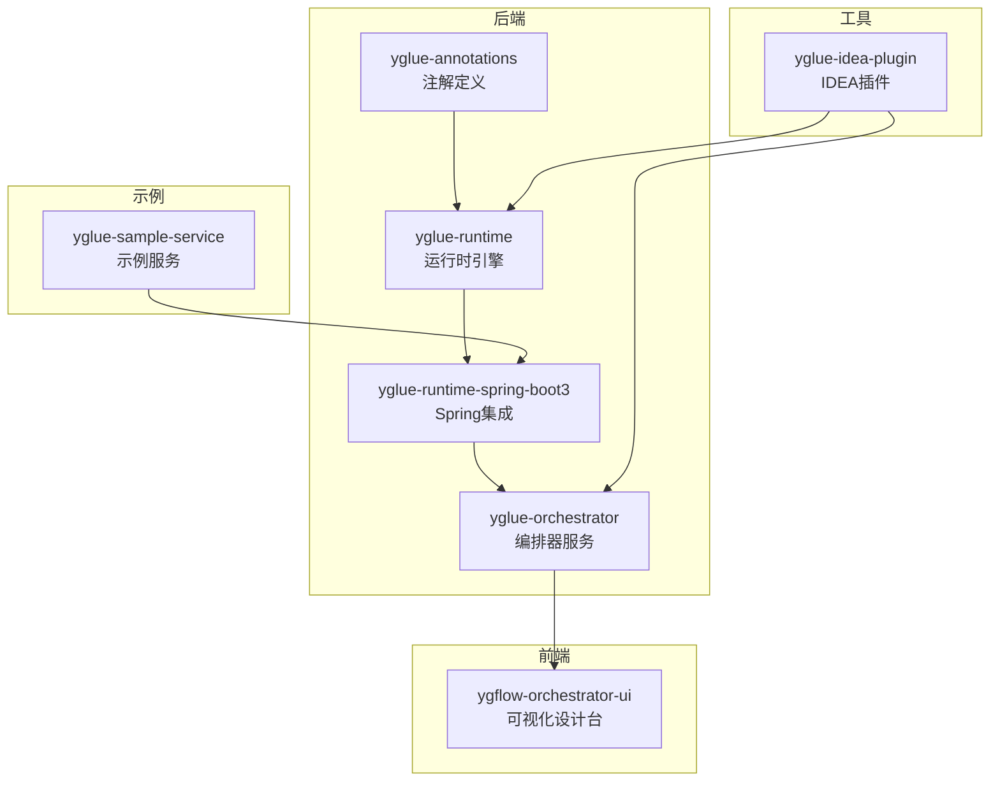
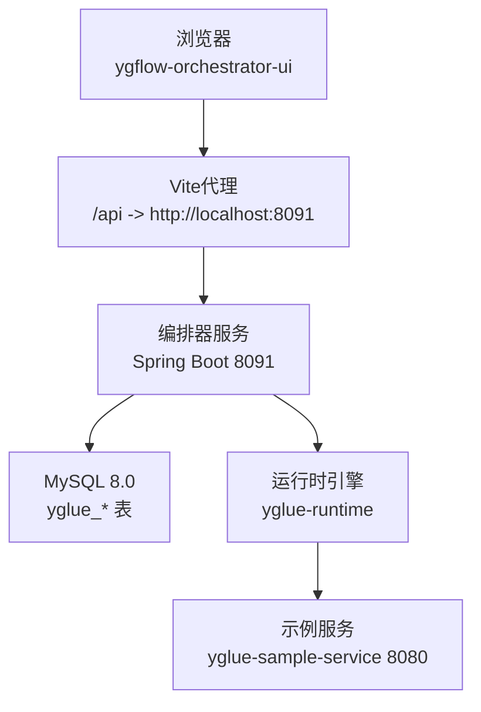
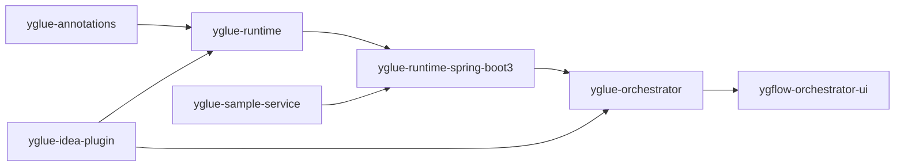

# 快速开始

<cite>
**本文引用的文件列表**
- [根POM](file://pom.xml)
- [编排器服务POM](file://yglue-orchestrator/pom.xml)
- [编排器服务应用入口](file://yglue-orchestrator/src/main/java/org/yglue/flow/orch/YGlueOrchestratorApplication.java)
- [编排器服务配置](file://yglue-orchestrator/src/main/resources/application.yml)
- [编排器服务数据库初始化脚本](file://yglue-orchestrator/src/main/resources/db/migration/V1__init.sql)
- [前端应用包配置](file://apps/ygflow-orchestrator-ui/package.json)
- [前端应用Vite配置](file://apps/ygflow-orchestrator-ui/vite.config.ts)
- [前端应用入口](file://apps/ygflow-orchestrator-ui/src/main.ts)
- [IDEA插件Gradle配置](file://yglue-idea-plugin/build.gradle.kts)
- [IDEA插件插件描述](file://yglue-idea-plugin/src/main/resources/META-INF/plugin.xml)
- [示例服务应用入口](file://samples/yglue-sample-service/src/main/java/org/yglue/flow/sample/YgflowSampleApplication.java)
- [示例服务配置](file://samples/yglue-sample-service/src/main/resources/application.yml)
- [项目总README](file://README.md)
</cite>

## 目录
1. [引言](#引言)
2. [项目结构](#项目结构)
3. [核心组件](#核心组件)
4. [架构概览](#架构概览)
5. [详细组件分析](#详细组件分析)
6. [依赖关系分析](#依赖关系分析)
7. [性能注意事项](#性能注意事项)
8. [故障排除指南](#故障排除指南)
9. [结论](#结论)
10. [附录](#附录)

## 引言
本指南面向初次接触 YGFlow Suite 的用户，目标是在最短时间内完成环境准备、项目构建、服务启动与前端访问，并完成 IntelliJ IDEA 插件的安装与使用。内容覆盖：
- 环境要求：Java 17+、Maven 3.8+、Node.js 18+、MySQL 8.0+、IntelliJ IDEA 2024.2+（插件开发）
- 仓库克隆与后端模块构建
- 前端应用构建与开发服务器启动
- 编排器服务运行与访问
- IDEA 插件构建与手动安装流程
- 常见问题与排查建议（依赖下载失败、端口冲突等）

## 项目结构
- 多模块 Maven 项目，包含注解、运行时引擎、编排器服务、IDEA 插件、可视化设计台（前端）、示例服务等模块。
- 后端使用 Spring Boot 3.3.4，前端使用 Vue 3 + Vite。
- MySQL 8.0+ 作为编排器服务的数据存储。

图表来源
- [根POM](file://pom.xml#L19-L26)
- [编排器服务POM](file://yglue-orchestrator/pom.xml#L12-L14)

章节来源
- [根POM](file://pom.xml#L19-L26)
- [项目总README](file://README.md#L169-L192)

## 核心组件
- 编排器服务（yglue-orchestrator）：提供 REST API、流程与元数据管理、规则同步等能力，使用 Spring Boot + MyBatis + MySQL。
- 可视化设计台（ygflow-orchestrator-ui）：基于 Vue 3 + Vite 的前端应用，通过代理访问编排器服务。
- 运行时引擎（yglue-runtime）：基于 LiteFlow 的流程执行引擎，配合 Spring 集成模块使用。
- IDEA 插件（yglue-idea-plugin）：扫描注解、导出元数据、同步规则、上传代码快照等。
- 示例服务（yglue-sample-service）：演示如何在业务服务中启用 YGFlow 运行时。

章节来源
- [编排器服务POM](file://yglue-orchestrator/pom.xml#L16-L44)
- [前端应用包配置](file://apps/ygflow-orchestrator-ui/package.json#L1-L34)
- [IDEA插件Gradle配置](file://yglue-idea-plugin/build.gradle.kts#L1-L64)
- [示例服务应用入口](file://samples/yglue-sample-service/src/main/java/org/yglue/flow/sample/YgflowSampleApplication.java#L1-L12)

## 架构概览
下图展示从浏览器到后端服务再到运行时引擎的整体交互路径。

图表来源
- [前端应用Vite配置](file://apps/ygflow-orchestrator-ui/vite.config.ts#L1-L31)
- [编排器服务配置](file://yglue-orchestrator/src/main/resources/application.yml#L1-L23)
- [示例服务配置](file://samples/yglue-sample-service/src/main/resources/application.yml#L1-L18)

## 详细组件分析

### 环境要求与前置准备
- 后端：Java 17+、Maven 3.8+
- 前端：Node.js 18+（仅前端需要）
- 数据库：MySQL 8.0+（仅编排器服务需要）
- 插件开发：IntelliJ IDEA 2024.2+

章节来源
- [项目总README](file://README.md#L68-L75)

### 克隆仓库与后端构建
- 在本地克隆仓库后，进入项目根目录执行 Maven 构建，完成所有后端模块打包。
- 若网络较慢或依赖下载失败，可配置 Maven 使用国内镜像源或调整超时设置。

命令步骤
- 在项目根目录执行 Maven 清理并安装，构建所有模块。
- 进入前端目录执行 npm 安装与构建。

章节来源
- [项目总README](file://README.md#L76-L91)
- [根POM](file://pom.xml#L28-L31)

### 运行编排器服务
- 进入编排器服务模块目录，使用 Spring Boot Maven 插件启动服务。
- 默认监听端口为 8091；若端口被占用，可在配置文件中修改 server.port。

命令步骤
- 在编排器服务模块目录执行 Spring Boot 运行命令。
- 访问健康检查接口确认服务可用。

章节来源
- [项目总README](file://README.md#L92-L105)
- [编排器服务应用入口](file://yglue-orchestrator/src/main/java/org/yglue/flow/orch/YGlueOrchestratorApplication.java#L1-L12)
- [编排器服务配置](file://yglue-orchestrator/src/main/resources/application.yml#L12-L13)

### 运行前端开发服务器
- 进入前端应用目录，先安装依赖，再启动开发服务器。
- 前端默认端口为 5173；代理将 /api 请求转发至后端 8091 端口。

命令步骤
- 在前端应用目录执行 npm 安装与开发服务器启动。
- 打开浏览器访问前端地址，即可看到可视化设计台。

章节来源
- [项目总README](file://README.md#L99-L105)
- [前端应用包配置](file://apps/ygflow-orchestrator-ui/package.json#L1-L10)
- [前端应用Vite配置](file://apps/ygflow-orchestrator-ui/vite.config.ts#L1-L31)
- [前端应用入口](file://apps/ygflow-orchestrator-ui/src/main.ts#L1-L9)

### 安装 IntelliJ IDEA 插件
- 在插件模块目录使用 Gradle 构建插件包。
- 在 IDEA 中通过“从磁盘安装插件”方式手动安装生成的插件包。

命令步骤
- 在插件模块目录执行 Gradle 构建插件命令。
- 在 IDEA 设置中选择“从磁盘安装插件”，选择生成的插件包文件。

章节来源
- [项目总README](file://README.md#L106-L114)
- [IDEA插件Gradle配置](file://yglue-idea-plugin/build.gradle.kts#L1-L64)
- [IDEA插件插件描述](file://yglue-idea-plugin/src/main/resources/META-INF/plugin.xml#L1-L46)

### 数据库初始化与访问
- 编排器服务使用 MySQL 8.0+，默认连接地址为 localhost:3306，数据库名为 yglue。
- 初次启动时，数据库表结构由 Flyway 初始化脚本创建。
- 如需自定义数据库账号密码，可在配置文件中修改。

命令步骤
- 准备好 MySQL 8.0+ 实例，创建 yglue 数据库。
- 启动编排器服务，Flyway 将自动执行初始化脚本创建所需表。

章节来源
- [编排器服务配置](file://yglue-orchestrator/src/main/resources/application.yml#L1-L11)
- [编排器服务数据库初始化脚本](file://yglue-orchestrator/src/main/resources/db/migration/V1__init.sql#L1-L181)

### 示例服务运行
- 示例服务演示了如何在业务服务中启用 YGFlow 运行时。
- 默认端口为 8080；可通过配置文件调整。

命令步骤
- 在示例服务模块目录启动 Spring Boot 应用。
- 结合编排器服务进行流程编排与调试。

章节来源
- [示例服务应用入口](file://samples/yglue-sample-service/src/main/java/org/yglue/flow/sample/YgflowSampleApplication.java#L1-L12)
- [示例服务配置](file://samples/yglue-sample-service/src/main/resources/application.yml#L1-L18)

## 依赖关系分析
- 后端模块间依赖：注解模块为运行时引擎提供元数据标注；运行时引擎与 Spring 集成模块共同支撑编排器服务。
- 前端依赖：Vue 3、Vite、Vue Flow、Monaco Editor 等。
- 插件依赖：IntelliJ 平台 SDK、Java 模块、JSON/ASM 等第三方库。

图表来源
- [根POM](file://pom.xml#L19-L26)
- [编排器服务POM](file://yglue-orchestrator/pom.xml#L16-L44)
- [前端应用包配置](file://apps/ygflow-orchestrator-ui/package.json#L1-L34)
- [IDEA插件Gradle配置](file://yglue-idea-plugin/build.gradle.kts#L1-L64)

## 性能注意事项
- 前端开发服务器在首次启动时会预构建依赖，耗时较长；后续热更新较快。
- 后端服务启动时会加载 MyBatis 映射与 Flyway 迁移，首次启动略慢。
- 生产环境下建议关闭开发模式的自动重载与调试日志级别，以减少资源消耗。

## 故障排除指南
- 依赖下载失败（Maven/Gradle/NPM）
  - 症状：构建过程中出现网络超时或下载失败。
  - 解决方案：配置 Maven 使用国内镜像源；Gradle 可设置镜像；前端可更换 npm 源或使用 pnpm。
- 端口冲突
  - 症状：启动编排器服务或前端开发服务器时报端口占用。
  - 解决方案：修改编排器服务配置中的 server.port 或前端 Vite 的 server.port；或释放占用端口。
- 数据库连接失败
  - 症状：启动编排器服务时报数据库连接异常。
  - 解决方案：确认 MySQL 服务已启动、数据库存在且账号密码正确；必要时在配置文件中调整连接参数。
- IDEA 插件无法安装
  - 症状：从磁盘安装插件时报版本不兼容或找不到插件。
  - 解决方案：确保使用 2024.2 平台版本构建插件；在 IDEA 设置中选择“从磁盘安装插件”，选择正确的插件包文件。

章节来源
- [编排器服务配置](file://yglue-orchestrator/src/main/resources/application.yml#L1-L23)
- [前端应用Vite配置](file://apps/ygflow-orchestrator-ui/vite.config.ts#L1-L31)
- [IDEA插件Gradle配置](file://yglue-idea-plugin/build.gradle.kts#L21-L30)
- [IDEA插件插件描述](file://yglue-idea-plugin/src/main/resources/META-INF/plugin.xml#L1-L46)

## 结论
按照本指南的步骤，您可以在本地快速搭建并运行 YGFlow Suite 的后端服务与前端设计台，并完成 IDEA 插件的安装与使用。遇到问题时，可依据“故障排除指南”进行定位与修复。建议在开发阶段保持数据库与服务端口的默认配置，便于快速验证；生产部署时再按需调整。

## 附录
- 快速命令清单
  - 克隆与后端构建：在项目根目录执行 Maven 清理安装。
  - 前端构建：进入前端目录执行 npm 安装与构建。
  - 启动编排器服务：在编排器服务模块目录执行 Spring Boot 运行命令。
  - 启动前端开发服务器：在前端目录执行 npm 开发服务器命令。
  - 构建 IDEA 插件：在插件模块目录执行 Gradle 构建插件命令，随后在 IDEA 中从磁盘安装插件包。

章节来源
- [项目总README](file://README.md#L76-L114)