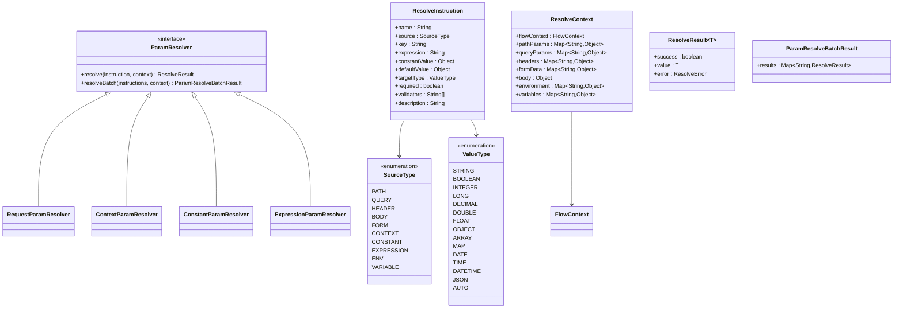
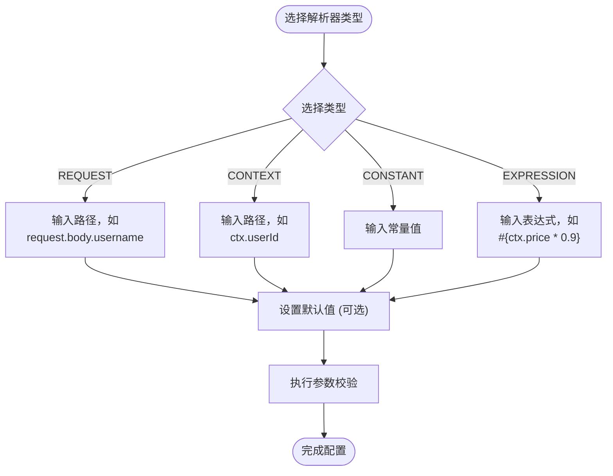
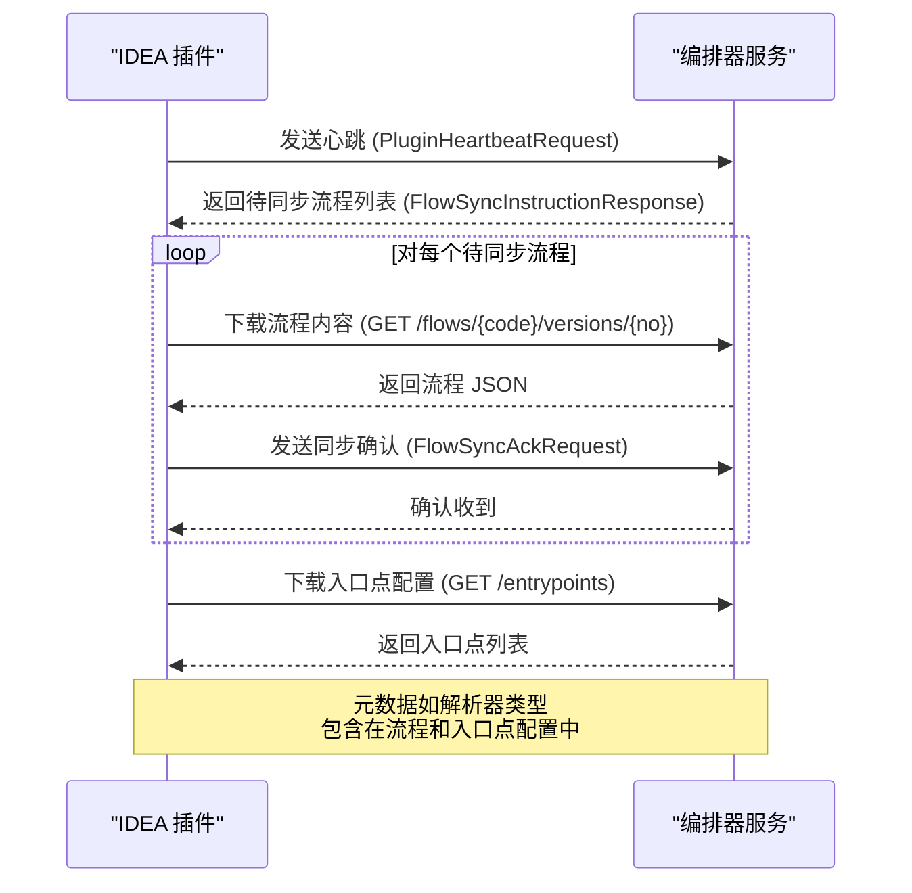
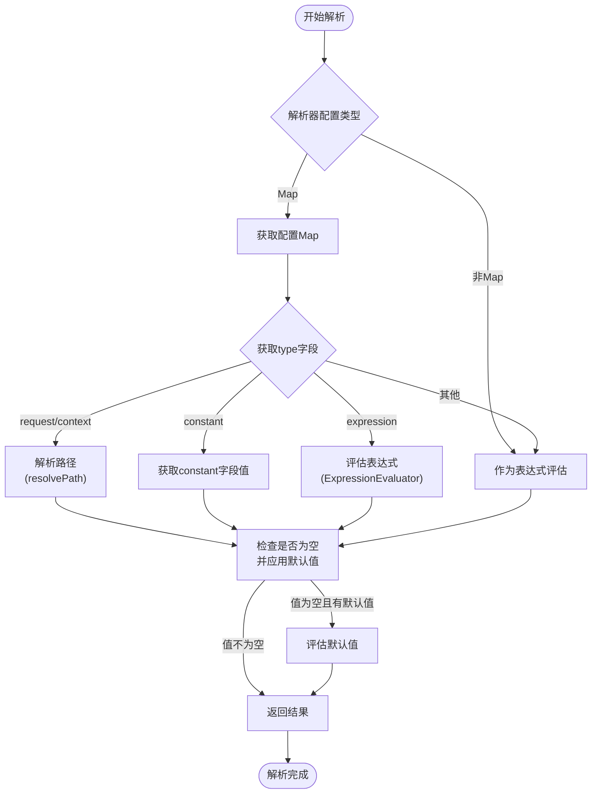

# 参数解析器（Param Resolver）

<cite>
**本文档引用的文件**   
- [ParamResolver.java](file://yglue-runtime/src/main/java/org/yglue/flow/runtime/core/param/ParamResolver.java)
- [ResolveInstruction.java](file://yglue-runtime/src/main/java/org/yglue/flow/runtime/core/param/ResolveInstruction.java)
- [ResolveContext.java](file://yglue-runtime/src/main/java/org/yglue/flow/runtime/core/param/ResolveContext.java)
- [ParamResolver.java](file://yglue-runtime/src/main/java/org/yglue/flow/runtime/core/util/ParamResolver.java)
- [ExpressionEvaluator.java](file://yglue-runtime/src/main/java/org/yglue/flow/runtime/core/util/ExpressionEvaluator.java)
- [RequestParamResolverMetadata.java](file://yglue-runtime/src/main/java/org/yglue/flow/runtime/core/param/resolvers/RequestParamResolverMetadata.java)
- [ContextParamResolverMetadata.java](file://yglue-runtime/src/main/java/org/yglue/flow/runtime/core/param/resolvers/ContextParamResolverMetadata.java)
- [ConstantParamResolverMetadata.java](file://yglue-runtime/src/main/java/org/yglue/flow/runtime/core/param/resolvers/ConstantParamResolverMetadata.java)
- [ExpressionParamResolverMetadata.java](file://yglue-runtime/src/main/java/org/yglue/flow/runtime/core/param/resolvers/ExpressionParamResolverMetadata.java)
- [FlowResolver.java](file://yglue-annotations/src/main/java/org/yglue/flow/annotations/FlowResolver.java)
- [ParamResolverEditor.vue](file://apps/ygflow-orchestrator-ui/src/components/ParamResolverEditor.vue)
- [RuleSyncService.java](file://yglue-idea-plugin/src/main/java/org/yglue/flow/idea/sync/RuleSyncService.java)
- [ServiceNodeExecutor.java](file://yglue-runtime/src/main/java/org/yglue/flow/runtime/core/executors/ServiceNodeExecutor.java)
- [SourceType.java](file://yglue-runtime/src/main/java/org/yglue/flow/runtime/core/param/SourceType.java)
- [ValueType.java](file://yglue-runtime/src/main/java/org/yglue/flow/runtime/core/param/ValueType.java)
</cite>

## 目录
1. [简介](#简介)
2. [核心组件](#核心组件)
3. [四种内置解析器详解](#四种内置解析器详解)
4. [解析器在节点配置中的使用](#解析器在节点配置中的使用)
5. [元数据扫描与同步机制](#元数据扫描与同步机制)
6. [运行时解析逻辑](#运行时解析逻辑)
7. [代码示例：表达式拼接参数](#代码示例表达式拼接参数)

## 简介
参数解析器（Param Resolver）是流程编排系统中的核心组件，负责从多种来源解析流程执行所需的数据。它允许用户在服务节点、转换节点等配置输入参数时，灵活地选择数据来源，包括HTTP请求、流程上下文、常量值或通过表达式计算。该机制极大地增强了流程的动态性和可配置性，使得同一个流程模板能够适应不同的输入场景。

## 核心组件

参数解析器系统由多个核心组件构成，包括解析指令（ResolveInstruction）、解析上下文（ResolveContext）、解析器接口（ParamResolver）以及具体的解析器实现。

**核心组件关系图**


**图源**
- [ParamResolver.java](file://yglue-runtime/src/main/java/org/yglue/flow/runtime/core/param/ParamResolver.java)
- [ResolveInstruction.java](file://yglue-runtime/src/main/java/org/yglue/flow/runtime/core/param/ResolveInstruction.java)
- [ResolveContext.java](file://yglue-runtime/src/main/java/org/yglue/flow/runtime/core/param/ResolveContext.java)
- [SourceType.java](file://yglue-runtime/src/main/java/org/yglue/flow/runtime/core/param/SourceType.java)
- [ValueType.java](file://yglue-runtime/src/main/java/org/yglue/flow/runtime/core/param/ValueType.java)

**本节源**
- [ParamResolver.java](file://yglue-runtime/src/main/java/org/yglue/flow/runtime/core/param/ParamResolver.java#L1-L29)
- [ResolveInstruction.java](file://yglue-runtime/src/main/java/org/yglue/flow/runtime/core/param/ResolveInstruction.java#L1-L162)
- [ResolveContext.java](file://yglue-runtime/src/main/java/org/yglue/flow/runtime/core/param/ResolveContext.java#L1-L175)
- [SourceType.java](file://yglue-runtime/src/main/java/org/yglue/flow/runtime/core/param/SourceType.java#L1-L22)
- [ValueType.java](file://yglue-runtime/src/main/java/org/yglue/flow/runtime/core/param/ValueType.java#L1-L27)

## 四种内置解析器详解

系统提供了四种内置的参数解析器，每种解析器都有其特定的用途和配置方式。

### REQUEST 解析器
REQUEST 解析器用于从 HTTP 请求的各个部分提取数据，包括路径参数、查询参数、Header、请求体（Body）和表单数据（Form）。它通过点号分隔的路径语法来定位数据，例如 `request.path.projectKey` 表示从路径参数中获取名为 `projectKey` 的值，`request.query.page` 表示从查询参数中获取 `page` 值，`request.body.username` 表示从请求体的 JSON 数据中获取 `username` 字段。

### CONTEXT 解析器
CONTEXT 解析器用于从流程上下文（Flow Context）或变量池中读取数据。流程上下文是贯穿整个流程执行周期的数据容器，可以存储节点间传递的数据。通过 `ctx` 前缀访问上下文变量，例如 `ctx.userId` 表示读取上下文中的 `userId` 变量。变量池则用于存储更广泛的共享变量。

### CONSTANT 解析器
CONSTANT 解析器用于将一个固定的常量值作为节点的输入参数。这在需要传递硬编码的配置值、默认值或标识符时非常有用。例如，可以将一个固定的 API 密钥或一个默认的分页大小配置为常量。

### EXPRESSION 解析器
EXPRESSION 解析器通过 SpEL（Spring Expression Language）或 Groovy 表达式来动态计算参数值。它能够组合来自请求、上下文、常量等多种来源的数据，执行算术运算、逻辑判断、字符串拼接等操作。表达式通常以 `#{}` 包裹，例如 `#{ctx.price * 0.9}` 表示将上下文中的 `price` 字段打九折。

## 解析器在节点配置中的使用

在流程编排器的 UI 界面中，用户可以在服务节点的输入参数配置中选择不同的解析器类型。`ParamResolverEditor.vue` 组件提供了直观的编辑界面，允许用户选择解析器类型，并根据所选类型填写相应的配置项。

**解析器配置界面流程图**


**图源**
- [ParamResolverEditor.vue](file://apps/ygflow-orchestrator-ui/src/components/ParamResolverEditor.vue)

**本节源**
- [ParamResolverEditor.vue](file://apps/ygflow-orchestrator-ui/src/components/ParamResolverEditor.vue#L1-L381)

## 元数据扫描与同步机制

参数解析器的元数据通过 IDEA 插件进行扫描并同步到编排器服务。`@FlowResolver` 注解是这一机制的核心，它被应用于元数据类上，以声明解析器的类型、名称、描述等信息。

**元数据同步序列图**


**图源**
- [RuleSyncService.java](file://yglue-idea-plugin/src/main/java/org/yglue/flow/idea/sync/RuleSyncService.java)
- [FlowResolver.java](file://yglue-annotations/src/main/java/org/yglue/flow/annotations/FlowResolver.java)

**本节源**
- [RuleSyncService.java](file://yglue-idea-plugin/src/main/java/org/yglue/flow/idea/sync/RuleSyncService.java#L1-L499)
- [FlowResolver.java](file://yglue-annotations/src/main/java/org/yglue/flow/annotations/FlowResolver.java#L1-L54)
- [RequestParamResolverMetadata.java](file://yglue-runtime/src/main/java/org/yglue/flow/runtime/core/param/resolvers/RequestParamResolverMetadata.java#L1-L27)
- [ContextParamResolverMetadata.java](file://yglue-runtime/src/main/java/org/yglue/flow/runtime/core/param/resolvers/ContextParamResolverMetadata.java#L1-L24)
- [ConstantParamResolverMetadata.java](file://yglue-runtime/src/main/java/org/yglue/flow/runtime/core/param/resolvers/ConstantParamResolverMetadata.java#L1-L24)
- [ExpressionParamResolverMetadata.java](file://yglue-runtime/src/main/java/org/yglue/flow/runtime/core/param/resolvers/ExpressionParamResolverMetadata.java#L1-L24)

## 运行时解析逻辑

在流程执行时，运行时引擎会根据节点配置的解析指令执行解析逻辑。`ParamResolver` 工具类是实际执行解析的核心。

**运行时解析流程图**


**图源**
- [ParamResolver.java](file://yglue-runtime/src/main/java/org/yglue/flow/runtime/core/util/ParamResolver.java)
- [ExpressionEvaluator.java](file://yglue-runtime/src/main/java/org/yglue/flow/runtime/core/util/ExpressionEvaluator.java)

**本节源**
- [ParamResolver.java](file://yglue-runtime/src/main/java/org/yglue/flow/runtime/core/util/ParamResolver.java#L1-L146)
- [ServiceNodeExecutor.java](file://yglue-runtime/src/main/java/org/yglue/flow/runtime/core/executors/ServiceNodeExecutor.java#L184-L751)

## 代码示例：表达式拼接参数

以下是一个使用表达式解析器将多个请求参数拼接为一个服务调用参数的代码示例。假设有一个服务节点需要接收一个格式为 `"{projectKey}-{env}-{version}"` 的完整版本标识符。

**配置示例**
```json
{
  "inputs": [
    {
      "name": "fullVersion",
      "resolver": {
        "type": "expression",
        "expression": "#{request.path.projectKey + '-' + request.query.env + '-' + request.body.versionNo}",
        "default": "default-dev-latest"
      },
      "required": true
    }
  ]
}
```

在这个配置中，`expression` 字段定义了一个 SpEL 表达式，它将路径参数 `projectKey`、查询参数 `env` 和请求体中的 `versionNo` 字段用连字符 `-` 拼接起来。如果任何一个部分为空，整个表达式可能返回 `null`，此时会使用 `default` 字段指定的默认值。

**本节源**
- [ParamResolver.java](file://yglue-runtime/src/main/java/org/yglue/flow/runtime/core/util/ParamResolver.java#L62-L68)
- [ExpressionEvaluator.java](file://yglue-runtime/src/main/java/org/yglue/flow/runtime/core/util/ExpressionEvaluator.java)