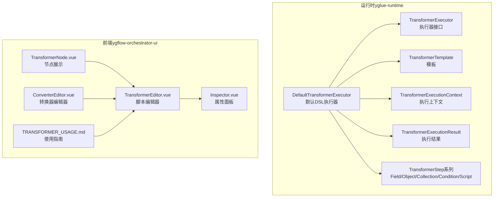
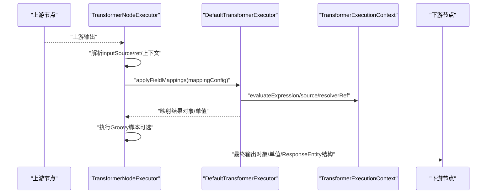
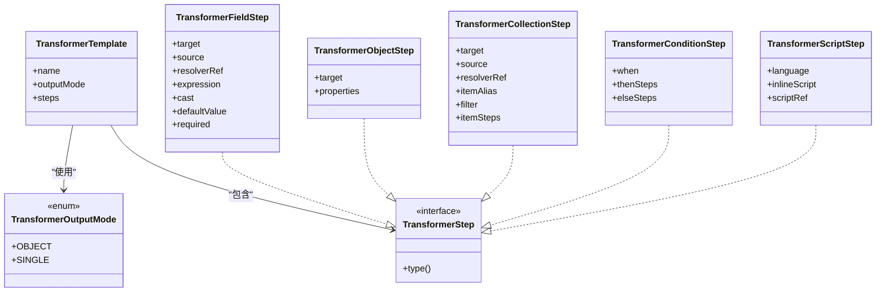
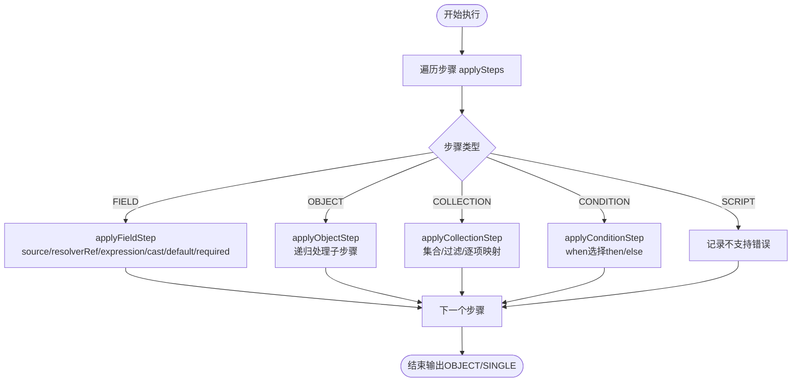
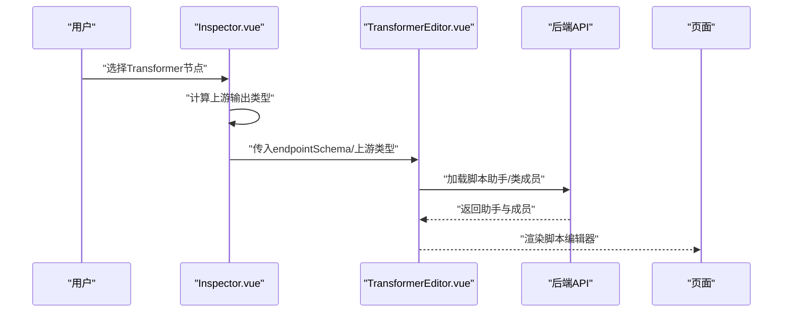
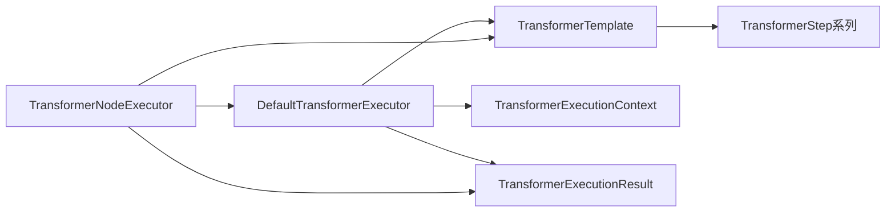

# 数据转换器（Transformer）

<cite>
**本文引用的文件**
- [DefaultTransformerExecutor.java](file://yglue-runtime/src/main/java/org/yglue/flow/runtime/core/transformer/runtime/DefaultTransformerExecutor.java)
- [TransformerExecutor.java](file://yglue-runtime/src/main/java/org/yglue/flow/runtime/core/transformer/runtime/TransformerExecutor.java)
- [TransformerExecutionContext.java](file://yglue-runtime/src/main/java/org/yglue/flow/runtime/core/transformer/runtime/TransformerExecutionContext.java)
- [TransformerExecutionResult.java](file://yglue-runtime/src/main/java/org/yglue/flow/runtime/core/transformer/runtime/TransformerExecutionResult.java)
- [TransformerNodeExecutor.java](file://yglue-runtime/src/main/java/org/yglue/flow/runtime/core/executors/TransformerNodeExecutor.java)
- [TransformerFieldStep.java](file://yglue-runtime/src/main/java/org/yglue/flow/runtime/core/transformer/dsl/TransformerFieldStep.java)
- [TransformerObjectStep.java](file://yglue-runtime/src/main/java/org/yglue/flow/runtime/core/transformer/dsl/TransformerObjectStep.java)
- [TransformerCollectionStep.java](file://yglue-runtime/src/main/java/org/yglue/flow/runtime/core/transformer/dsl/TransformerCollectionStep.java)
- [TransformerConditionStep.java](file://yglue-runtime/src/main/java/org/yglue/flow/runtime/core/transformer/dsl/TransformerConditionStep.java)
- [TransformerScriptStep.java](file://yglue-runtime/src/main/java/org/yglue/flow/runtime/core/transformer/dsl/TransformerScriptStep.java)
- [TransformerStep.java](file://yglue-runtime/src/main/java/org/yglue/flow/runtime/core/transformer/dsl/TransformerStep.java)
- [TransformerStepType.java](file://yglue-runtime/src/main/java/org/yglue/flow/runtime/core/transformer/dsl/TransformerStepType.java)
- [TransformerOutputMode.java](file://yglue-runtime/src/main/java/org/yglue/flow/runtime/core/transformer/dsl/TransformerOutputMode.java)
- [TransformerTemplate.java](file://yglue-runtime/src/main/java/org/yglue/flow/runtime/core/transformer/dsl/TransformerTemplate.java)
- [TransformerEditor.vue](file://apps/ygflow-orchestrator-ui/src/components/TransformerEditor.vue)
- [TransformerNode.vue](file://apps/ygflow-orchestrator-ui/src/components/TransformerNode.vue)
- [Inspector.vue](file://apps/ygflow-orchestrator-ui/src/components/Inspector.vue)
- [ConverterEditor.vue](file://apps/ygflow-orchestrator-ui/src/components/ConverterEditor.vue)
- [TRANSFORMER_USAGE.md](file://apps/ygflow-orchestrator-ui/docs/TRANSFORMER_USAGE.md)
</cite>

## 目录
1. [简介](#简介)
2. [项目结构](#项目结构)
3. [核心组件](#核心组件)
4. [架构总览](#架构总览)
5. [详细组件分析](#详细组件分析)
6. [依赖关系分析](#依赖关系分析)
7. [性能考量](#性能考量)
8. [故障排查指南](#故障排查指南)
9. [结论](#结论)
10. [附录](#附录)

## 简介
本文件系统性阐述数据转换器（Transformer）在流程编排中的作用与实现，重点覆盖：
- 在服务节点之间的典型位置与职责：适配不同服务的数据结构，完成字段映射、集合处理、条件转换与复杂逻辑扩展。
- 两种模式：声明式DSL（用于字段映射、集合处理、条件转换）与Groovy脚本（用于复杂逻辑扩展）。
- 配置结构与输入源（inputSource）的自动推导优化。
- 运行时引擎：默认的DefaultTransformerExecutor与自定义执行逻辑。
- 提供将API响应数据结构转换为内部模型的DSL配置示例路径与说明。

## 项目结构
Transformer相关代码主要分布在运行时模块与可视化编辑器前端组件中：
- 运行时（yglue-runtime）：定义DSL步骤、执行器接口与默认实现、执行上下文与结果封装。
- 前端（apps/ygflow-orchestrator-ui）：提供Transformer节点的可视化编辑器、节点展示组件与辅助工具。

图表来源
- [DefaultTransformerExecutor.java](file://yglue-runtime/src/main/java/org/yglue/flow/runtime/core/transformer/runtime/DefaultTransformerExecutor.java#L1-L334)
- [TransformerExecutor.java](file://yglue-runtime/src/main/java/org/yglue/flow/runtime/core/transformer/runtime/TransformerExecutor.java#L1-L12)
- [TransformerExecutionContext.java](file://yglue-runtime/src/main/java/org/yglue/flow/runtime/core/transformer/runtime/TransformerExecutionContext.java#L141-L157)
- [TransformerExecutionResult.java](file://yglue-runtime/src/main/java/org/yglue/flow/runtime/core/transformer/runtime/TransformerExecutionResult.java#L1-L33)
- [TransformerTemplate.java](file://yglue-runtime/src/main/java/org/yglue/flow/runtime/core/transformer/dsl/TransformerTemplate.java#L1-L20)
- [TransformerFieldStep.java](file://yglue-runtime/src/main/java/org/yglue/flow/runtime/core/transformer/dsl/TransformerFieldStep.java#L1-L34)
- [TransformerObjectStep.java](file://yglue-runtime/src/main/java/org/yglue/flow/runtime/core/transformer/dsl/TransformerObjectStep.java#L1-L27)
- [TransformerCollectionStep.java](file://yglue-runtime/src/main/java/org/yglue/flow/runtime/core/transformer/dsl/TransformerCollectionStep.java#L1-L35)
- [TransformerConditionStep.java](file://yglue-runtime/src/main/java/org/yglue/flow/runtime/core/transformer/dsl/TransformerConditionStep.java#L1-L30)
- [TransformerScriptStep.java](file://yglue-runtime/src/main/java/org/yglue/flow/runtime/core/transformer/dsl/TransformerScriptStep.java#L1-L30)
- [TransformerEditor.vue](file://apps/ygflow-orchestrator-ui/src/components/TransformerEditor.vue#L1-L800)
- [TransformerNode.vue](file://apps/ygflow-orchestrator-ui/src/components/TransformerNode.vue#L1-L81)
- [Inspector.vue](file://apps/ygflow-orchestrator-ui/src/components/Inspector.vue#L1-L60)
- [ConverterEditor.vue](file://apps/ygflow-orchestrator-ui/src/components/ConverterEditor.vue#L1-L82)
- [TRANSFORMER_USAGE.md](file://apps/ygflow-orchestrator-ui/docs/TRANSFORMER_USAGE.md#L1-L363)

章节来源
- [DefaultTransformerExecutor.java](file://yglue-runtime/src/main/java/org/yglue/flow/runtime/core/transformer/runtime/DefaultTransformerExecutor.java#L1-L334)
- [TransformerEditor.vue](file://apps/ygflow-orchestrator-ui/src/components/TransformerEditor.vue#L1-L800)

## 核心组件
- DSL步骤与模板
  - Field：字段映射、表达式计算、类型转换、默认值与必填校验。
  - Object：嵌套对象构建，支持递归子步骤。
  - Collection：集合处理，支持别名、过滤表达式与逐项映射。
  - Condition：条件分支，按when表达式选择then/else分支。
  - Script：脚本步骤（当前默认执行器不支持，保留扩展能力）。
  - OutputMode：输出模式（OBJECT/SINGLE）。
  - Template：包含名称、输出模式与步骤列表。
- 执行器与上下文
  - TransformerExecutor：定义execute(template, context)接口。
  - DefaultTransformerExecutor：实现DSL步骤的顺序执行与输出组装。
  - TransformerExecutionContext：提供表达式求值、条件判断、解析器结果读取等能力。
  - TransformerExecutionResult：封装输出与错误列表。
- 前端编辑器
  - TransformerEditor.vue：Groovy脚本编辑与变量/函数助手。
  - TransformerNode.vue：节点UI展示。
  - Inspector.vue：节点属性面板，支持输出类型与上游类型推断。
  - ConverterEditor.vue：通用转换器编辑（目标类型、数组元素类型、脚本等）。

章节来源
- [TransformerFieldStep.java](file://yglue-runtime/src/main/java/org/yglue/flow/runtime/core/transformer/dsl/TransformerFieldStep.java#L1-L34)
- [TransformerObjectStep.java](file://yglue-runtime/src/main/java/org/yglue/flow/runtime/core/transformer/dsl/TransformerObjectStep.java#L1-L27)
- [TransformerCollectionStep.java](file://yglue-runtime/src/main/java/org/yglue/flow/runtime/core/transformer/dsl/TransformerCollectionStep.java#L1-L35)
- [TransformerConditionStep.java](file://yglue-runtime/src/main/java/org/yglue/flow/runtime/core/transformer/dsl/TransformerConditionStep.java#L1-L30)
- [TransformerScriptStep.java](file://yglue-runtime/src/main/java/org/yglue/flow/runtime/core/transformer/dsl/TransformerScriptStep.java#L1-L30)
- [TransformerOutputMode.java](file://yglue-runtime/src/main/java/org/yglue/flow/runtime/core/transformer/dsl/TransformerOutputMode.java#L1-L10)
- [TransformerTemplate.java](file://yglue-runtime/src/main/java/org/yglue/flow/runtime/core/transformer/dsl/TransformerTemplate.java#L1-L20)
- [TransformerExecutor.java](file://yglue-runtime/src/main/java/org/yglue/flow/runtime/core/transformer/runtime/TransformerExecutor.java#L1-L12)
- [DefaultTransformerExecutor.java](file://yglue-runtime/src/main/java/org/yglue/flow/runtime/core/transformer/runtime/DefaultTransformerExecutor.java#L1-L334)
- [TransformerExecutionContext.java](file://yglue-runtime/src/main/java/org/yglue/flow/runtime/core/transformer/runtime/TransformerExecutionContext.java#L141-L157)
- [TransformerExecutionResult.java](file://yglue-runtime/src/main/java/org/yglue/flow/runtime/core/transformer/runtime/TransformerExecutionResult.java#L1-L33)
- [TransformerEditor.vue](file://apps/ygflow-orchestrator-ui/src/components/TransformerEditor.vue#L1-L800)
- [TransformerNode.vue](file://apps/ygflow-orchestrator-ui/src/components/TransformerNode.vue#L1-L81)
- [Inspector.vue](file://apps/ygflow-orchestrator-ui/src/components/Inspector.vue#L1-L60)
- [ConverterEditor.vue](file://apps/ygflow-orchestrator-ui/src/components/ConverterEditor.vue#L1-L82)

## 架构总览
Transformer在流程中的典型位置位于服务节点之间，负责将上游输出转换为下游所需的数据结构。前端编辑器提供可视化配置，运行时执行器负责实际的映射、聚合与脚本执行。

图表来源
- [TransformerNodeExecutor.java](file://yglue-runtime/src/main/java/org/yglue/flow/runtime/core/executors/TransformerNodeExecutor.java#L22-L105)
- [DefaultTransformerExecutor.java](file://yglue-runtime/src/main/java/org/yglue/flow/runtime/core/transformer/runtime/DefaultTransformerExecutor.java#L32-L128)
- [TransformerExecutionContext.java](file://yglue-runtime/src/main/java/org/yglue/flow/runtime/core/transformer/runtime/TransformerExecutionContext.java#L141-L157)

## 详细组件分析

### DSL步骤与模板
- 步骤类型
  - FIELD：支持source、resolverRef、expression、cast、defaultValue、required等。
  - OBJECT：支持嵌套属性集合。
  - COLLECTION：支持source/resolverRef、itemAlias、filter、itemSteps。
  - CONDITION：支持when、thenSteps、elseSteps。
  - SCRIPT：支持language、inlineScript、scriptRef（当前默认执行器不支持）。
- 模板与输出模式
  - TransformerTemplate包含name、outputMode（OBJECT/SINGLE）、steps。
  - SINGLE模式下，若未指定target路径，直接返回单值；否则返回对象。

图表来源
- [TransformerTemplate.java](file://yglue-runtime/src/main/java/org/yglue/flow/runtime/core/transformer/dsl/TransformerTemplate.java#L1-L20)
- [TransformerStep.java](file://yglue-runtime/src/main/java/org/yglue/flow/runtime/core/transformer/dsl/TransformerStep.java#L1-L21)
- [TransformerFieldStep.java](file://yglue-runtime/src/main/java/org/yglue/flow/runtime/core/transformer/dsl/TransformerFieldStep.java#L1-L34)
- [TransformerObjectStep.java](file://yglue-runtime/src/main/java/org/yglue/flow/runtime/core/transformer/dsl/TransformerObjectStep.java#L1-L27)
- [TransformerCollectionStep.java](file://yglue-runtime/src/main/java/org/yglue/flow/runtime/core/transformer/dsl/TransformerCollectionStep.java#L1-L35)
- [TransformerConditionStep.java](file://yglue-runtime/src/main/java/org/yglue/flow/runtime/core/transformer/dsl/TransformerConditionStep.java#L1-L30)
- [TransformerScriptStep.java](file://yglue-runtime/src/main/java/org/yglue/flow/runtime/core/transformer/dsl/TransformerScriptStep.java#L1-L30)
- [TransformerOutputMode.java](file://yglue-runtime/src/main/java/org/yglue/flow/runtime/core/transformer/dsl/TransformerOutputMode.java#L1-L10)

章节来源
- [TransformerStepType.java](file://yglue-runtime/src/main/java/org/yglue/flow/runtime/core/transformer/dsl/TransformerStepType.java#L1-L13)
- [TransformerFieldStep.java](file://yglue-runtime/src/main/java/org/yglue/flow/runtime/core/transformer/dsl/TransformerFieldStep.java#L1-L34)
- [TransformerObjectStep.java](file://yglue-runtime/src/main/java/org/yglue/flow/runtime/core/transformer/dsl/TransformerObjectStep.java#L1-L27)
- [TransformerCollectionStep.java](file://yglue-runtime/src/main/java/org/yglue/flow/runtime/core/transformer/dsl/TransformerCollectionStep.java#L1-L35)
- [TransformerConditionStep.java](file://yglue-runtime/src/main/java/org/yglue/flow/runtime/core/transformer/dsl/TransformerConditionStep.java#L1-L30)
- [TransformerScriptStep.java](file://yglue-runtime/src/main/java/org/yglue/flow/runtime/core/transformer/dsl/TransformerScriptStep.java#L1-L30)
- [TransformerTemplate.java](file://yglue-runtime/src/main/java/org/yglue/flow/runtime/core/transformer/dsl/TransformerTemplate.java#L1-L20)

### 运行时执行器与上下文
- DefaultTransformerExecutor
  - 顺序执行步骤，支持FIELD/OBJECT/COLLECTION/CONDITION分支。
  - SINGLE模式下，若未指定target路径，直接返回单值；否则返回对象。
  - 支持resolverRef、expression、cast、defaultValue、required等。
  - SCRIPT步骤在默认执行器中被标记为不支持（保留扩展）。
- TransformerExecutionContext
  - 提供evaluateExpression、evaluateCondition、resolved等能力。
- TransformerExecutionResult
  - 包含output与errors，hasErrors用于快速判断。

图表来源
- [DefaultTransformerExecutor.java](file://yglue-runtime/src/main/java/org/yglue/flow/runtime/core/transformer/runtime/DefaultTransformerExecutor.java#L57-L192)
- [TransformerExecutionContext.java](file://yglue-runtime/src/main/java/org/yglue/flow/runtime/core/transformer/runtime/TransformerExecutionContext.java#L141-L157)

章节来源
- [DefaultTransformerExecutor.java](file://yglue-runtime/src/main/java/org/yglue/flow/runtime/core/transformer/runtime/DefaultTransformerExecutor.java#L32-L192)
- [TransformerExecutor.java](file://yglue-runtime/src/main/java/org/yglue/flow/runtime/core/transformer/runtime/TransformerExecutor.java#L1-L12)
- [TransformerExecutionResult.java](file://yglue-runtime/src/main/java/org/yglue/flow/runtime/core/transformer/runtime/TransformerExecutionResult.java#L1-L33)

### 前端可视化编辑器
- TransformerEditor.vue
  - 提供Groovy脚本编辑区域，内置变量组（ctx、input、output、请求参数等）与函数组（jsonPath、assert、formatDate、mapValues、safeNumber等）。
  - 支持从REST入口schema动态生成初始脚本片段。
- TransformerNode.vue
  - 展示“🔄”图标与节点标签，显示字段映射数量与脚本配置状态。
- Inspector.vue
  - 计算上游节点输出类型（valueType/typeName），用于脚本编辑器的变量/函数助手提示。
- ConverterEditor.vue
  - 通用转换器编辑（目标类型、数组元素类型、脚本等），与TransformerEditor互补。

图表来源
- [Inspector.vue](file://apps/ygflow-orchestrator-ui/src/components/Inspector.vue#L1-L60)
- [TransformerEditor.vue](file://apps/ygflow-orchestrator-ui/src/components/TransformerEditor.vue#L1-L800)
- [ConverterEditor.vue](file://apps/ygflow-orchestrator-ui/src/components/ConverterEditor.vue#L1-L82)

章节来源
- [TransformerEditor.vue](file://apps/ygflow-orchestrator-ui/src/components/TransformerEditor.vue#L1-L800)
- [TransformerNode.vue](file://apps/ygflow-orchestrator-ui/src/components/TransformerNode.vue#L1-L81)
- [Inspector.vue](file://apps/ygflow-orchestrator-ui/src/components/Inspector.vue#L1-L60)
- [ConverterEditor.vue](file://apps/ygflow-orchestrator-ui/src/components/ConverterEditor.vue#L1-L82)
- [TRANSFORMER_USAGE.md](file://apps/ygflow-orchestrator-ui/docs/TRANSFORMER_USAGE.md#L1-L363)

### 输入源（inputSource）自动推导优化
- TransformerNodeExecutor.inputSource优先级
  1) 节点配置中的inputSource（如ctx.xxx）。
  2) 上下文中的ret（返回值）。
  3) 上下文中的最近非空输出值（向后兼容）。
- 前端Inspector根据上游节点输出类型动态提示变量/函数，提升脚本编写效率。
- 文档明确说明inputSource的配置方式与自动写入规则，避免节点重排导致引用错误。

章节来源
- [TransformerNodeExecutor.java](file://yglue-runtime/src/main/java/org/yglue/flow/runtime/core/executors/TransformerNodeExecutor.java#L107-L158)
- [Inspector.vue](file://apps/ygflow-orchestrator-ui/src/components/Inspector.vue#L1-L60)
- [TRANSFORMER_USAGE.md](file://apps/ygflow-orchestrator-ui/docs/TRANSFORMER_USAGE.md#L1-L363)

### 将API响应数据结构转换为内部模型的DSL配置示例
- 示例思路（以路径引用而非代码片段形式呈现）：
  - 使用FIELD步骤将上游响应字段映射到目标模型字段，并通过expression进行类型转换或格式化。
  - 使用OBJECT步骤构建嵌套对象，或通过COLLECTION步骤对数组进行过滤与逐项映射。
  - 使用CONDITION步骤根据条件分支选择不同的映射策略。
  - 若存在复杂逻辑，可在Groovy脚本中进行二次加工（脚本节点）。
- 配置要点：
  - outputMode设为OBJECT或SINGLE，依据下游期望。
  - 为每个FIELD设置cast、defaultValue、required，确保健壮性。
  - 在COLLECTION中合理设置itemAlias与filter，减少无效处理。
  - SCRIPT步骤在默认执行器中不生效，建议使用脚本节点（Groovy）承载复杂逻辑。

章节来源
- [TransformerFieldStep.java](file://yglue-runtime/src/main/java/org/yglue/flow/runtime/core/transformer/dsl/TransformerFieldStep.java#L1-L34)
- [TransformerObjectStep.java](file://yglue-runtime/src/main/java/org/yglue/flow/runtime/core/transformer/dsl/TransformerObjectStep.java#L1-L27)
- [TransformerCollectionStep.java](file://yglue-runtime/src/main/java/org/yglue/flow/runtime/core/transformer/dsl/TransformerCollectionStep.java#L1-L35)
- [TransformerConditionStep.java](file://yglue-runtime/src/main/java/org/yglue/flow/runtime/core/transformer/dsl/TransformerConditionStep.java#L1-L30)
- [TransformerScriptStep.java](file://yglue-runtime/src/main/java/org/yglue/flow/runtime/core/transformer/dsl/TransformerScriptStep.java#L1-L30)
- [DefaultTransformerExecutor.java](file://yglue-runtime/src/main/java/org/yglue/flow/runtime/core/transformer/runtime/DefaultTransformerExecutor.java#L66-L77)

## 依赖关系分析
- 组件耦合
  - DefaultTransformerExecutor依赖TransformerTemplate、TransformerStep系列、TransformerExecutionContext与类型转换工具。
  - TransformerNodeExecutor负责字段映射与Groovy脚本执行，依赖上下文与表达式评估器。
- 外部依赖
  - 前端编辑器依赖后端API提供的脚本助手与类成员信息，以增强开发体验。
- 循环依赖
  - DSL步骤通过@JsonSubTypes与@JsonTypeInfo进行多态反序列化，避免循环依赖问题。

图表来源
- [DefaultTransformerExecutor.java](file://yglue-runtime/src/main/java/org/yglue/flow/runtime/core/transformer/runtime/DefaultTransformerExecutor.java#L1-L334)
- [TransformerNodeExecutor.java](file://yglue-runtime/src/main/java/org/yglue/flow/runtime/core/executors/TransformerNodeExecutor.java#L1-L415)
- [TransformerTemplate.java](file://yglue-runtime/src/main/java/org/yglue/flow/runtime/core/transformer/dsl/TransformerTemplate.java#L1-L20)

章节来源
- [DefaultTransformerExecutor.java](file://yglue-runtime/src/main/java/org/yglue/flow/runtime/core/transformer/runtime/DefaultTransformerExecutor.java#L1-L334)
- [TransformerNodeExecutor.java](file://yglue-runtime/src/main/java/org/yglue/flow/runtime/core/executors/TransformerNodeExecutor.java#L1-L415)

## 性能考量
- 步骤顺序执行：FIELD/OBJECT/COLLECTION/CONDITION按序处理，避免不必要的嵌套层级。
- 集合处理：COLLECTION支持过滤表达式，建议在filter中尽量缩小数据规模。
- 类型转换：cast在必要时进行，避免重复转换与异常开销。
- 单值模式：SINGLE模式下直接返回单值，减少对象构建成本。
- 脚本执行：Groovy脚本在TransformerNodeExecutor中执行，建议将复杂逻辑集中在脚本节点，避免在DSL中过度嵌套。

## 故障排查指南
- 常见问题
  - SCRIPT步骤不生效：默认执行器不支持SCRIPT步骤，需改用脚本节点（Groovy）。
  - 字段缺失或为空：检查FIELD的required与defaultValue配置。
  - 集合处理异常：确认source/resolverRef类型与itemAlias、filter表达式正确。
  - 输入源错误：核对inputSource路径是否指向正确的上下文键。
- 前端辅助
  - Inspector根据上游输出类型动态提示变量/函数，便于快速定位问题。
  - TransformerEditor提供jsonPath/assert/formatDate/mapValues/safeNumber等常用函数，降低脚本复杂度。

章节来源
- [DefaultTransformerExecutor.java](file://yglue-runtime/src/main/java/org/yglue/flow/runtime/core/transformer/runtime/DefaultTransformerExecutor.java#L66-L77)
- [TransformerNodeExecutor.java](file://yglue-runtime/src/main/java/org/yglue/flow/runtime/core/executors/TransformerNodeExecutor.java#L293-L330)
- [Inspector.vue](file://apps/ygflow-orchestrator-ui/src/components/Inspector.vue#L1-L60)
- [TransformerEditor.vue](file://apps/ygflow-orchestrator-ui/src/components/TransformerEditor.vue#L1-L800)

## 结论
Transformer在流程编排中承担着“数据适配器”的关键角色。通过声明式DSL与Groovy脚本的组合，既能高效完成字段映射、集合处理与条件转换，又能灵活扩展复杂逻辑。前端编辑器提供了强大的脚本辅助与变量提示，配合运行时执行器的健壮实现，能够稳定支撑多样化的数据转换需求。

## 附录
- 使用指南参考：[TRANSFORMER_USAGE.md](file://apps/ygflow-orchestrator-ui/docs/TRANSFORMER_USAGE.md#L1-L363)
- 节点展示组件：[TransformerNode.vue](file://apps/ygflow-orchestrator-ui/src/components/TransformerNode.vue#L1-L81)
- 脚本编辑器组件：[TransformerEditor.vue](file://apps/ygflow-orchestrator-ui/src/components/TransformerEditor.vue#L1-L800)