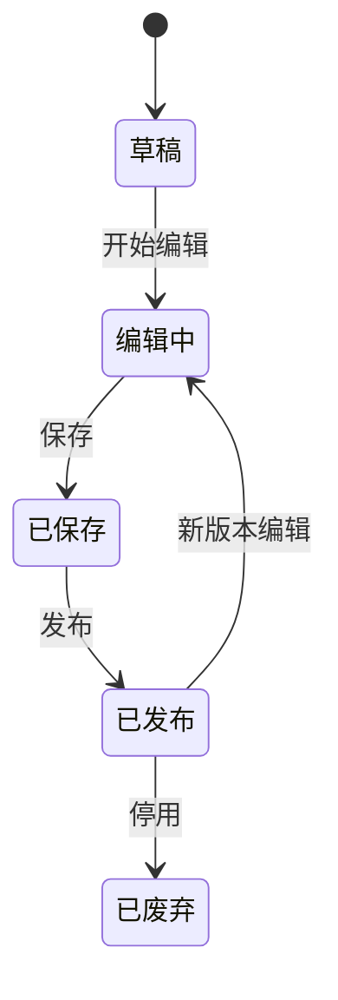
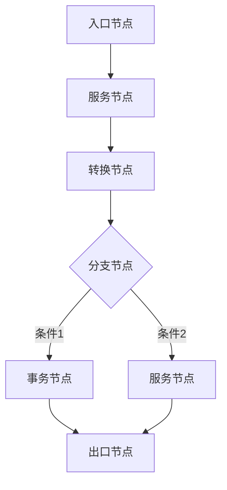
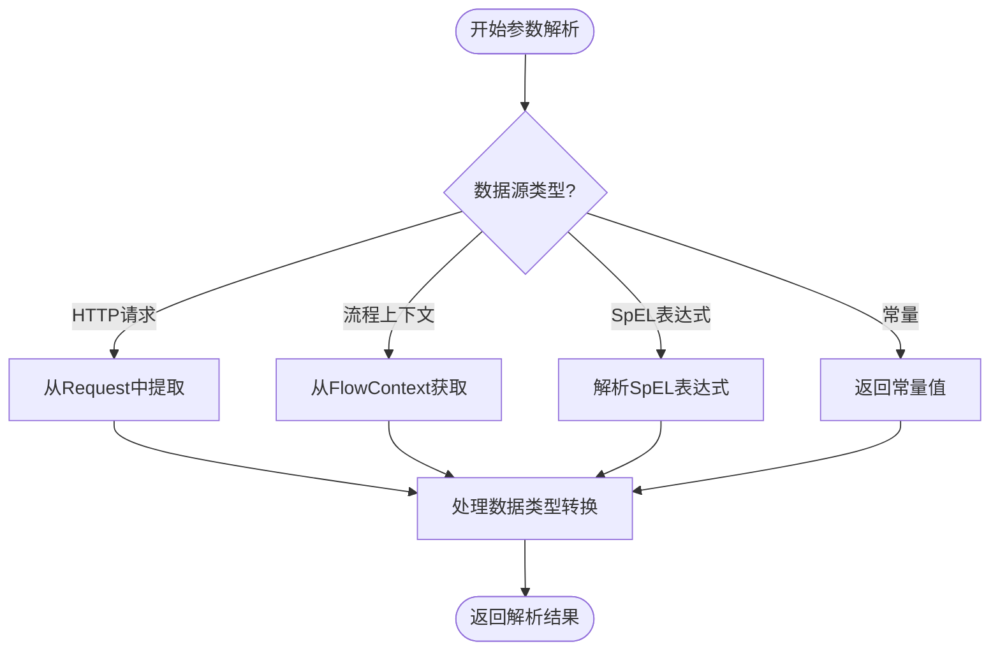
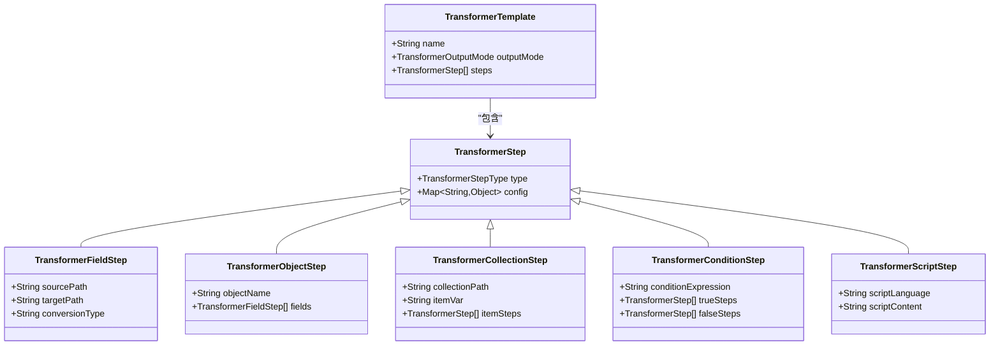
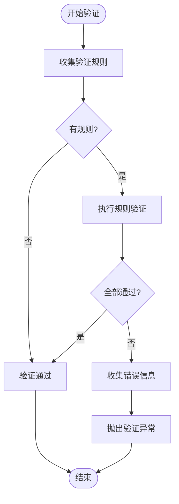

# 核心概念

<cite>
**本文档中引用的文件**  
- [Flow.java](file://yglue-orchestrator/src/main/java/org/yglue/flow/orch/domain/Flow.java)
- [FlowVersion.java](file://yglue-orchestrator/src/main/java/org/yglue/flow/orch/domain/FlowVersion.java)
- [FlowDefinition.java](file://yglue-runtime/src/main/java/org/yglue/flow/runtime/core/definition/FlowDefinition.java)
- [NodeDefinition.java](file://yglue-runtime/src/main/java/org/yglue/flow/runtime/core/definition/NodeDefinition.java)
- [ParamResolver.java](file://yglue-runtime/src/main/java/org/yglue/flow/runtime/core/param/ParamResolver.java)
- [ResolveContext.java](file://yglue-runtime/src/main/java/org/yglue/flow/runtime/core/param/ResolveContext.java)
- [TransformerTemplate.java](file://yglue-runtime/src/main/java/org/yglue/flow/runtime/core/transformer/dsl/TransformerTemplate.java)
- [ValidationRule.java](file://yglue-runtime/src/main/java/org/yglue/flow/runtime/core/validator/ValidationRule.java)
- [FlowModel.java](file://yglue-annotations/src/main/java/org/yglue/flow/annotations/FlowModel.java)
</cite>

## 目录
1. [流程（Flow）](#流程flow)
2. [节点（Node）](#节点node)
3. [参数解析器（Param Resolver）](#参数解析器param-resolver)
4. [数据转换器（Transformer）](#数据转换器transformer)
5. [验证器（Validator）](#验证器validator)

## 流程（Flow）

在YGFlow Suite中，"流程（Flow）"是业务逻辑编排的核心单元，代表一个完整的、可执行的业务流程定义。每个流程由一系列相互连接的节点组成，这些节点按照预定义的顺序和条件执行，以完成特定的业务目标。

流程具有完整的生命周期管理机制，包括创建、编辑、保存、发布和版本控制。系统通过`Flow`实体类来管理流程的元数据，包括流程ID、项目ID、代码标识、名称、最新版本ID和已发布版本ID等。流程的版本管理通过`FlowVersion`实体实现，每个版本包含版本号、JSON格式的内容定义、发布时间戳和发布状态。

当流程被编辑时，会生成一个新的版本记录，但不会立即影响线上服务。只有经过显式"发布"操作的版本才会成为当前生效的版本，这确保了生产环境的稳定性。这种机制支持安全的灰度发布和快速回滚。

**图示来源**
- [Flow.java](file://yglue-orchestrator/src/main/java/org/yglue/flow/orch/domain/Flow.java#L8-L108)
- [FlowVersion.java](file://yglue-orchestrator/src/main/java/org/yglue/flow/orch/domain/FlowVersion.java#L5-L96)

**本节来源**
- [Flow.java](file://yglue-orchestrator/src/main/java/org/yglue/flow/orch/domain/Flow.java#L8-L108)
- [FlowVersion.java](file://yglue-orchestrator/src/main/java/org/yglue/flow/orch/domain/FlowVersion.java#L5-L96)

## 节点（Node）

"节点（Node）"是流程中的基本执行单元，每个节点代表一个具体的操作或决策点。系统通过`NodeDefinition`类定义节点的结构，包含ID、类型、配置参数和子节点列表。节点类型体系构成了流程图的语义基础。

### 入口节点（Entry Node）
作为流程的起点，负责接收外部触发信号（如HTTP请求）并初始化流程上下文。它是所有流程执行的入口点。

### 服务节点（Service Node）
执行具体的业务逻辑，可以调用内部服务或外部API。服务节点是实现业务功能的核心组件。

### 转换节点（Transformer Node）
负责数据的转换和映射，支持DSL和Groovy脚本两种模式，能够将输入数据转换为符合下游节点要求的格式。

### 分支节点（Branch Node）
实现条件路由功能，根据表达式计算结果决定流程的走向。它支持复杂的条件判断和多路径选择。

### 事务节点（Transaction Node）
确保一组操作的原子性执行，所有包含在事务节点中的操作要么全部成功，要么全部回滚。

### 出口节点（Exit Node）
作为流程的终点，负责返回最终结果给调用方，并结束流程执行。

**图示来源**
- [NodeDefinition.java](file://yglue-runtime/src/main/java/org/yglue/flow/runtime/core/definition/NodeDefinition.java#L7-L42)
- [FlowDefinition.java](file://yglue-runtime/src/main/java/org/yglue/flow/runtime/core/definition/FlowDefinition.java#L11-L78)

**本节来源**
- [NodeDefinition.java](file://yglue-runtime/src/main/java/org/yglue/flow/runtime/core/definition/NodeDefinition.java#L7-L42)
- [FlowDefinition.java](file://yglue-runtime/src/main/java/org/yglue/flow/runtime/core/definition/FlowDefinition.java#L11-L78)

## 参数解析器（Param Resolver）

参数解析器是YGFlow Suite中负责数据获取和解析的核心组件，其工作原理基于`ParamResolver`接口和`ResolveContext`上下文对象。它能够从多种数据源中提取和解析参数值，为节点执行提供所需的数据。

参数解析器支持四种主要的数据源类型：
- **HTTP请求**：从传入的HTTP请求中提取参数，包括路径参数、查询参数、请求头和请求体
- **流程上下文**：访问当前流程执行过程中的共享数据和状态
- **SpEL表达式**：通过Spring Expression Language动态计算表达式结果
- **常量**：直接使用预定义的常量值

解析过程在`ResolveContext`提供的执行环境中进行，确保了类型安全和错误处理。解析器会根据配置的源类型和路径表达式，从相应数据源中定位并提取数据，支持嵌套对象和复杂数据结构的访问。

**图示来源**
- [ParamResolver.java](file://yglue-runtime/src/main/java/org/yglue/flow/runtime/core/param/ParamResolver.java)
- [ResolveContext.java](file://yglue-runtime/src/main/java/org/yglue/flow/runtime/core/param/ResolveContext.java)

**本节来源**
- [ParamResolver.java](file://yglue-runtime/src/main/java/org/yglue/flow/runtime/core/param/ParamResolver.java)
- [ResolveContext.java](file://yglue-runtime/src/main/java/org/yglue/flow/runtime/core/param/ResolveContext.java)

## 数据转换器（Transformer）

数据转换器提供了强大的数据转换能力，支持声明式DSL和编程式Groovy脚本两种模式。其核心是`TransformerTemplate`模板定义，包含转换名称、输出模式和转换步骤列表。

转换器的DSL基于`TransformerStep`步骤链，每个步骤代表一种转换操作，如字段映射、对象创建、集合处理等。系统提供了丰富的内置步骤类型：
- `TransformerFieldStep`：字段级映射和转换
- `TransformerObjectStep`：对象结构创建
- `TransformerCollectionStep`：集合数据处理
- `TransformerConditionStep`：条件分支转换
- `TransformerScriptStep`：嵌入Groovy脚本

转换执行引擎会按照步骤顺序处理输入数据，每一步的输出作为下一步的输入，最终生成符合要求的输出数据。输出模式（`TransformerOutputMode`）定义了最终结果的组织形式，支持单对象、列表等多种模式。

**图示来源**
- [TransformerTemplate.java](file://yglue-runtime/src/main/java/org/yglue/flow/runtime/core/transformer/dsl/TransformerTemplate.java#L6-L15)
- [TransformerStep.java](file://yglue-runtime/src/main/java/org/yglue/flow/runtime/core/transformer/dsl/TransformerStep.java)

**本节来源**
- [TransformerTemplate.java](file://yglue-runtime/src/main/java/org/yglue/flow/runtime/core/transformer/dsl/TransformerTemplate.java#L6-L15)

## 验证器（Validator）

验证器组件负责确保流程执行过程中的数据质量和完整性，实现了基于规则的验证体系。系统通过`ValidationRule`定义验证规则，支持多种验证类型：

- **必填验证**（Required）：确保字段不为空
- **非空验证**（NotBlank/NotEmpty）：确保字符串或集合不为空白或空
- **类型验证**（Type）：验证数据类型匹配
- **长度验证**（Length）：验证字符串或集合的长度范围
- **正则验证**（Regex）：通过正则表达式验证格式
- **范围验证**（Range）：验证数值的上下限
- **表达式验证**（Expression）：通过SpEL表达式进行复杂逻辑验证

验证引擎会收集所有适用的验证规则，在数据处理前进行批量验证。验证失败时会生成详细的错误信息，包括失败的规则、错误消息和受影响的字段路径。系统还支持嵌套对象的深度验证和条件验证，能够处理复杂的业务规则场景。

**图示来源**
- [ValidationRule.java](file://yglue-runtime/src/main/java/org/yglue/flow/runtime/core/validator/ValidationRule.java)
- [Validator.java](file://yglue-runtime/src/main/java/org/yglue/flow/runtime/core/validator/Validator.java)

**本节来源**
- [ValidationRule.java](file://yglue-runtime/src/main/java/org/yglue/flow/runtime/core/validator/ValidationRule.java)
- [validators包](file://yglue-runtime/src/main/java/org/yglue/flow/runtime/core/validator/validators/)