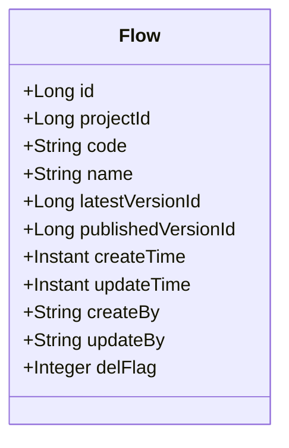
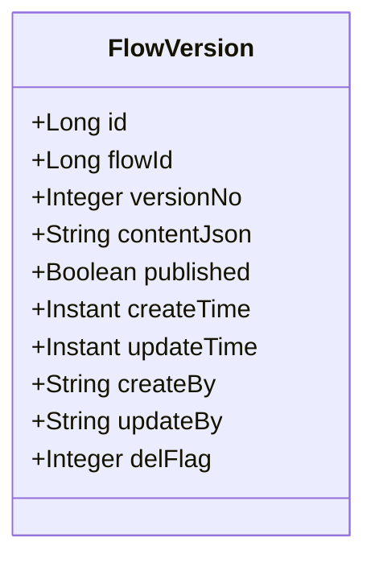
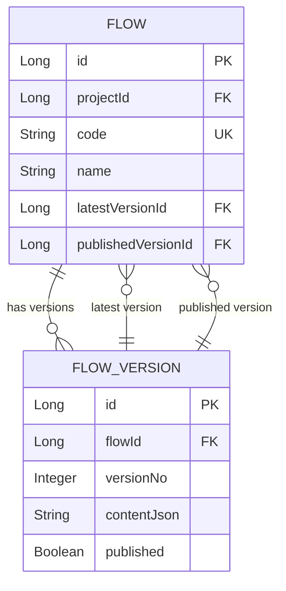
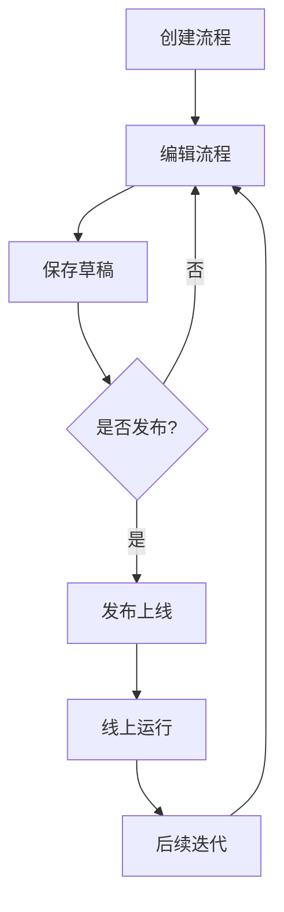
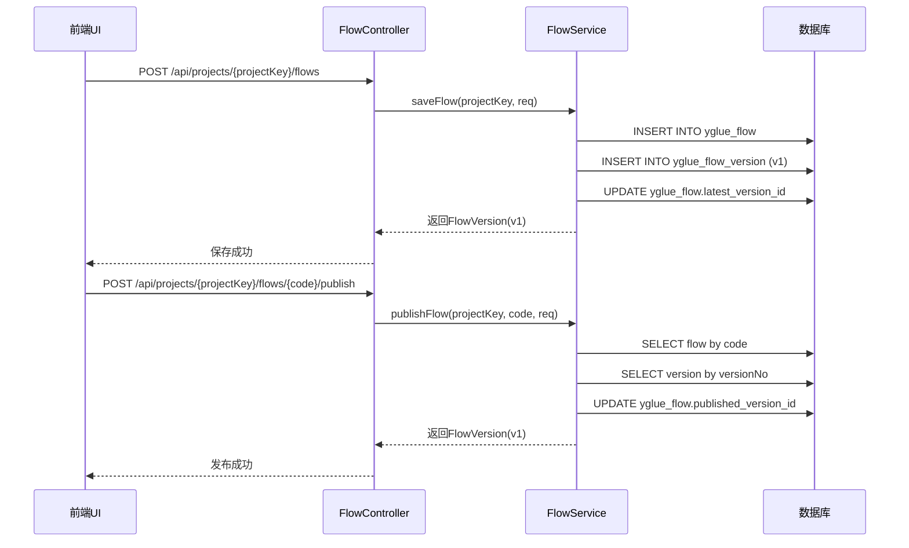
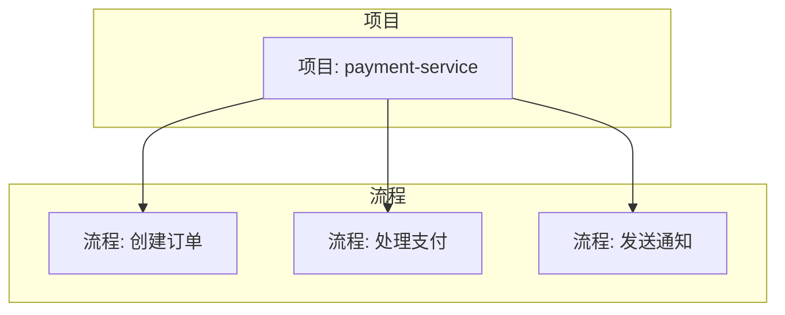
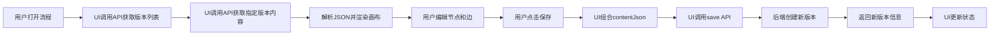
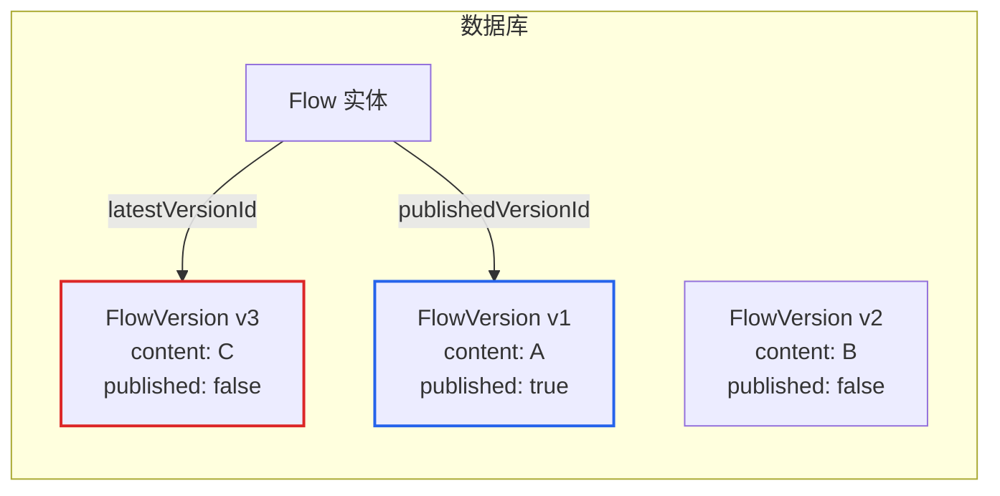
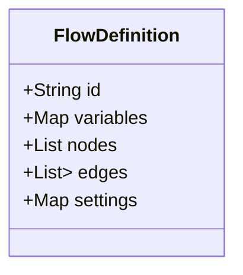
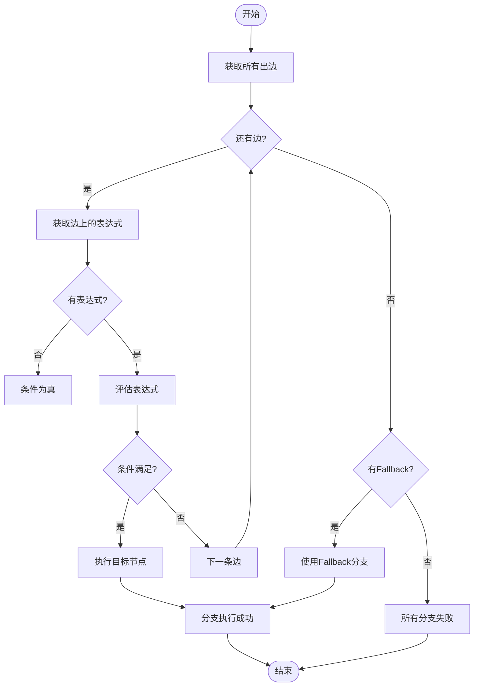

# 流程（Flow）

<cite>
**本文档引用的文件**
- [Flow.java](file://yglue-orchestrator/src/main/java/org/yglue/flow/orch/domain/Flow.java)
- [FlowVersion.java](file://yglue-orchestrator/src/main/java/org/yglue/flow/orch/domain/FlowVersion.java)
- [FlowService.java](file://yglue-orchestrator/src/main/java/org/yglue/flow/orch/service/FlowService.java)
- [FlowController.java](file://yglue-orchestrator/src/main/java/org/yglue/flow/orch/web/controller/FlowController.java)
- [FlowMapper.xml](file://yglue-orchestrator/src/main/resources/mapper/FlowMapper.xml)
- [V3__flow_publish.sql](file://yglue-orchestrator/src/main/resources/db/migration/V3__flow_publish.sql)
- [CanvasEditor.vue](file://apps/ygflow-orchestrator-ui/src/components/CanvasEditor.vue)
- [FlowSettingsPanel.vue](file://apps/ygflow-orchestrator-ui/src/components/FlowSettingsPanel.vue)
- [flowUtils.ts](file://apps/ygflow-orchestrator-ui/src/components/composables/flowUtils.ts)
- [flowSettings.ts](file://apps/ygflow-orchestrator-ui/src/data/flowSettings.ts)
- [BranchNodeExecutor.java](file://yglue-runtime/src/main/java/org/yglue/flow/runtime/core/executors/BranchNodeExecutor.java)
- [FlowDefinition.java](file://yglue-runtime/src/main/java/org/yglue/flow/runtime/core/definition/FlowDefinition.java)
</cite>

## 目录
1. [简介](#简介)
2. [流程数据模型](#流程数据模型)
3. [流程生命周期](#流程生命周期)
4. [流程与项目的关系](#流程与项目的关系)
5. [前端设计画布与后端API交互](#前端设计画布与后端api交互)
6. [版本控制机制](#版本控制机制)
7. [流程执行与节点类型](#流程执行与节点类型)
8. [使用示例：从创建到发布](#使用示例从创建到发布)
9. [结论](#结论)

## 简介

流程（Flow）是本系统中的核心业务逻辑编排单元，它提供了一种可视化的方式来定义和管理复杂的业务流程。一个流程由多个节点组成，支持顺序执行、条件分支和并行处理等复杂场景。用户可以通过前端UI的设计画布来创建和编辑流程，而后端服务负责流程的持久化、版本管理和执行。流程与项目（Project）紧密关联，每个流程都属于一个特定的项目。通过完善的版本控制机制，系统能够确保线上服务的稳定性，允许在不影响现有服务的情况下进行流程的迭代和更新。

## 流程数据模型

流程在系统中的数据模型主要由两个核心实体组成：`Flow` 和 `FlowVersion`。`Flow` 实体代表流程的元数据，而 `FlowVersion` 实体则存储了流程的具体内容和版本信息。

### Flow 实体

`Flow` 类定义了流程的基本属性，这些属性在流程的整个生命周期中保持相对稳定。

**图源**
- [Flow.java](file://yglue-orchestrator/src/main/java/org/yglue/flow/orch/domain/Flow.java#L8-L108)

**关键字段说明**：
- **code**: 流程的唯一标识符，通常是一个UUID。它在流程创建时生成，用于在系统中唯一地识别一个流程。
- **name**: 流程的名称，用于人类可读的展示。
- **projectId**: 关联的项目ID，表明该流程属于哪个项目。
- **latestVersionId**: 指向当前最新的流程版本ID。每次保存流程时，都会创建一个新版本，并更新此字段。
- **publishedVersionId**: 指向当前已发布（上线）的流程版本ID。这是实际在生产环境中执行的版本。

### FlowVersion 实体

`FlowVersion` 类存储了流程在某一特定时间点的完整定义，实现了流程的版本化。

**图源**
- [FlowVersion.java](file://yglue-orchestrator/src/main/java/org/yglue/flow/orch/domain/FlowVersion.java#L5-L96)

**关键字段说明**：
- **flowId**: 外键，关联到 `Flow` 实体的ID。
- **versionNo**: 版本号，按顺序递增。第一个版本为1，后续每次保存递增1。
- **contentJson**: 流程的完整定义，以JSON格式存储。这包括了所有节点、边、连接关系和配置信息。
- **published**: 一个计算得出的布尔值，表示此版本是否为当前已发布的版本。

**数据模型关系图**

**图源**
- [Flow.java](file://yglue-orchestrator/src/main/java/org/yglue/flow/orch/domain/Flow.java)
- [FlowVersion.java](file://yglue-orchestrator/src/main/java/org/yglue/flow/orch/domain/FlowVersion.java)

## 流程生命周期

流程的生命周期涵盖了从创建到最终发布的完整过程，主要包括创建、编辑、保存草稿、版本管理和发布上线等阶段。

### 生命周期阶段

**图源**
- [FlowService.java](file://yglue-orchestrator/src/main/java/org/yglue/flow/orch/service/FlowService.java)
- [CanvasEditor.vue](file://apps/ygflow-orchestrator-ui/src/components/CanvasEditor.vue)

### 详细阶段说明

1.  **创建 (Creation)**:
    当用户在UI上点击“新建流程”时，系统会调用后端API。`FlowService` 会创建一个新的 `Flow` 实体，生成一个唯一的 `code`（UUID），并设置初始的 `name` 和 `projectId`。此时，`latestVersionId` 和 `publishedVersionId` 均为空。

2.  **编辑 (Editing)**:
    用户通过前端设计画布（Canvas）对流程进行编辑。他们可以拖拽节点、连接边、配置节点参数等。这些操作实时地修改了前端内存中的流程定义。

3.  **保存草稿 (Saving Draft)**:
    当用户点击“保存”按钮时，触发 `FlowController` 的 `save` 方法。`FlowService` 的 `saveFlow` 方法被调用，其核心逻辑如下：
    *   如果是首次保存，则创建一个新的 `FlowVersion` 实体。
    *   如果是更新保存，则创建一个新版本的 `FlowVersion` 实体，版本号在原有最大版本号基础上递增1。
    *   将当前流程的完整定义（`contentJson`）存入新的 `FlowVersion` 记录中。
    *   更新 `Flow` 实体的 `latestVersionId` 指向这个新创建的版本。
    *   新版本的 `published` 状态为 `false`。

4.  **发布上线 (Publishing)**:
    当用户对流程草稿满意后，可以点击“发布”按钮。这会调用 `FlowController` 的 `publish` 方法。`FlowService` 的 `publishFlow` 方法被调用，其核心逻辑如下：
    *   根据请求中的 `versionNo` 找到对应的 `FlowVersion`。
    *   更新 `Flow` 实体的 `publishedVersionId` 字段，使其指向这个被发布的版本。
    *   这个被发布的版本的 `published` 状态在查询时会被标记为 `true`。
    *   **关键点**：发布操作是原子的，它只改变 `publishedVersionId` 的指向，而不会修改任何版本的内容，从而保证了线上服务的稳定性。

**生命周期API调用序列图**

**图源**
- [FlowController.java](file://yglue-orchestrator/src/main/java/org/yglue/flow/orch/web/controller/FlowController.java#L28-L38)
- [FlowService.java](file://yglue-orchestrator/src/main/java/org/yglue/flow/orch/service/FlowService.java#L78-L112)
- [FlowService.java](file://yglue-orchestrator/src/main/java/org/yglue/flow/orch/service/FlowService.java#L303-L319)

## 流程与项目的关系

流程与项目之间存在着明确的从属关系。每个流程都必须归属于一个项目，这种设计有助于对流程进行组织和管理。

*   **项目 (Project)**: 代表一个业务域或一个应用。它可以包含多个相关的流程。
*   **流程 (Flow)**: 代表项目内的一个具体的业务逻辑单元。

在数据模型上，`Flow` 实体通过 `projectId` 字段与 `Project` 实体建立外键关联。`FlowController` 的所有API端点都以 `/api/projects/{projectKey}/flows` 为前缀，这表明了流程操作是基于项目上下文的。当用户在UI上选择一个项目后，系统会列出该项目下的所有流程。

**流程与项目关系图**

**图源**
- [FlowController.java](file://yglue-orchestrator/src/main/java/org/yglue/flow/orch/web/controller/FlowController.java#L19)

## 前端设计画布与后端API交互

流程的创建和编辑主要通过前端UI的设计画布完成，其与后端的交互遵循典型的RESTful模式。

### 前端UI组件

*   **CanvasEditor.vue**: 这是流程编辑器的主组件，它整合了画布、工具栏、调色板和检查器面板。
*   **FlowSettingsPanel.vue**: 一个侧边栏面板，用于配置流程的元数据，如名称、描述、日志策略和REST入口点。
*   **useCanvasEditor.ts**: 一个组合式函数，封装了画布编辑器的核心逻辑，包括节点操作、保存和发布等。

### 交互流程

1.  **加载流程**: 当用户打开一个流程时，UI会调用 `GET /api/projects/{projectKey}/flows/{code}/versions` 获取所有版本，并调用 `GET /api/projects/{projectKey}/flows/{code}/versions/{ver}` 获取指定版本（通常是最新版本或已发布版本）的 `contentJson`。前端解析JSON并渲染到画布上。
2.  **编辑流程**: 用户在画布上的所有操作（增删改节点和边）都会实时更新前端的 `nodes` 和 `edges` 数据。
3.  **保存草稿**: 用户点击“保存”时，UI将当前的 `nodes`、`edges` 和其他设置组合成一个完整的JSON对象，通过 `POST /api/projects/{projectKey}/flows` 请求发送给后端。请求体包含 `code`、`name` 和 `contentJson`。
4.  **发布上线**: 用户点击“发布”时，UI通过 `POST /api/projects/{projectKey}/flows/{code}/publish` 请求，指定要发布的 `versionNo`。

**交互流程图**

**图源**
- [CanvasEditor.vue](file://apps/ygflow-orchestrator-ui/src/components/CanvasEditor.vue)
- [FlowSettingsPanel.vue](file://apps/ygflow-orchestrator-ui/src/components/FlowSettingsPanel.vue)
- [flowUtils.ts](file://apps/ygflow-orchestrator-ui/src/components/composables/flowUtils.ts)

## 版本控制机制

系统的版本控制机制是保障线上服务稳定性的核心。它采用了一种“指针切换”的模式，而非直接修改线上版本。

### 核心原理

*   **不可变版本**: 每个 `FlowVersion` 一旦创建，其 `contentJson` 内容就是不可变的。这意味着已发布的流程版本永远不会被修改。
*   **双指针设计**: `Flow` 实体维护两个指针：
    *   `latestVersionId`: 指向最新的草稿版本。
    *   `publishedVersionId`: 指向当前正在线上运行的版本。
*   **安全发布**: 发布操作仅仅是将 `publishedVersionId` 从旧版本切换到新版本。这个操作是原子的，且不涉及任何内容的修改。

### 优势

1.  **稳定性**: 线上运行的流程版本是固定的，不会因为开发人员的误操作而被意外修改。
2.  **可追溯性**: 所有历史版本都被完整保留，可以随时查看、对比或回滚。
3.  **并行开发**: 开发人员可以在不影响线上服务的情况下，持续编辑和保存草稿。
4.  **原子切换**: 发布操作是瞬间完成的，避免了服务在新旧版本之间“摇摆”的风险。

**图源**
- [Flow.java](file://yglue-orchestrator/src/main/java/org/yglue/flow/orch/domain/Flow.java)
- [FlowService.java](file://yglue-orchestrator/src/main/java/org/yglue/flow/orch/service/FlowService.java)

## 流程执行与节点类型

流程的执行由 `yglue-runtime` 模块负责。当一个请求触发了流程的入口点后，运行时引擎会根据 `FlowDefinition` 加载对应的流程定义，并按照节点间的连接关系进行执行。

### 流程定义 (FlowDefinition)

`FlowDefinition` 是运行时对流程的内存表示，它包含了执行所需的所有信息。

**图源**
- [FlowDefinition.java](file://yglue-runtime/src/main/java/org/yglue/flow/runtime/core/definition/FlowDefinition.java#L11-L78)

### 节点执行器 (NodeExecutor)

系统通过一个 `NodeExecutorRegistry` 来管理不同类型的节点执行器。每个节点类型（如 `service`, `branch`, `delay`）都有一个对应的 `FlowExecutor` 实现。

#### 条件分支节点 (BranchNode)

`BranchNodeExecutor` 负责处理条件分支逻辑。它会遍历从该节点出发的所有边（edges），评估每条边上的条件表达式（SpEL），并选择第一个满足条件的分支进行执行。

**图源**
- [BranchNodeExecutor.java](file://yglue-runtime/src/main/java/org/yglue/flow/runtime/core/executors/BranchNodeExecutor.java#L42-L140)

#### 其他节点类型

*   **任务节点 (TaskNode)**: 通常执行一个具体的服务调用，由 `ServiceNodeExecutor` 或 `CallNodeExecutor` 处理。
*   **延迟节点 (DelayNode)**: 由 `DelayNodeExecutor` 处理，执行指定毫秒数的休眠。
*   **转换节点 (TransformerNode)**: 用于数据转换，由 `TransformerNodeExecutor` 处理。

## 使用示例从创建到发布

以下是一个完整的使用示例，演示如何从零开始创建一个流程并将其发布上线。

1.  **创建流程**: 用户在项目“订单服务”中点击“新建流程”。系统生成一个UUID作为 `code`，并创建一个空的 `Flow` 实体。
2.  **编辑流程**: 用户在画布上添加一个“开始”节点、一个“调用支付服务”任务节点和一个“结束”节点，并用边将它们连接起来。在“调用支付服务”节点的配置面板中，用户设置了服务的Bean名称和方法。
3.  **配置设置**: 用户打开“流程设置”面板，将流程 `name` 设置为“处理支付流程”，并配置了日志策略。
4.  **保存草稿**: 用户点击“保存”。前端将当前的节点、边和设置序列化为JSON，通过 `save` API发送。后端创建 `FlowVersion` v1，并更新 `Flow` 的 `latestVersionId`。
5.  **发布上线**: 用户确认无误后，点击“发布”。前端调用 `publish` API，指定版本号1。后端更新 `Flow` 的 `publishedVersionId` 指向v1。
6.  **线上运行**: 此时，流程已上线。当有外部请求匹配其REST入口点时，`yglue-runtime` 会加载v1版本的流程定义并执行。

**图源**
- [CanvasEditor.vue](file://apps/ygflow-orchestrator-ui/src/components/CanvasEditor.vue)
- [FlowSettingsPanel.vue](file://apps/ygflow-orchestrator-ui/src/components/FlowSettingsPanel.vue)
- [FlowService.java](file://yglue-orchestrator/src/main/java/org/yglue/flow/orch/service/FlowService.java)

## 结论

流程（Flow）作为业务逻辑的核心编排单元，通过其清晰的数据模型、严谨的生命周期管理和强大的版本控制机制，为复杂业务的实现提供了可靠的基础。前端设计画布与后端API的紧密结合，使得流程的创建和维护变得直观而高效。通过将流程与项目关联，并采用“不可变版本+指针切换”的发布模式，系统在保证开发灵活性的同时，最大程度地确保了线上服务的稳定性和可追溯性。开发者可以放心地进行迭代，而无需担心对线上业务造成影响。