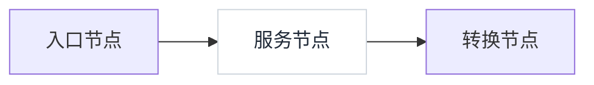
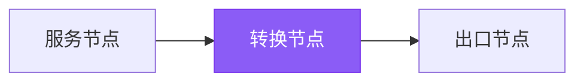
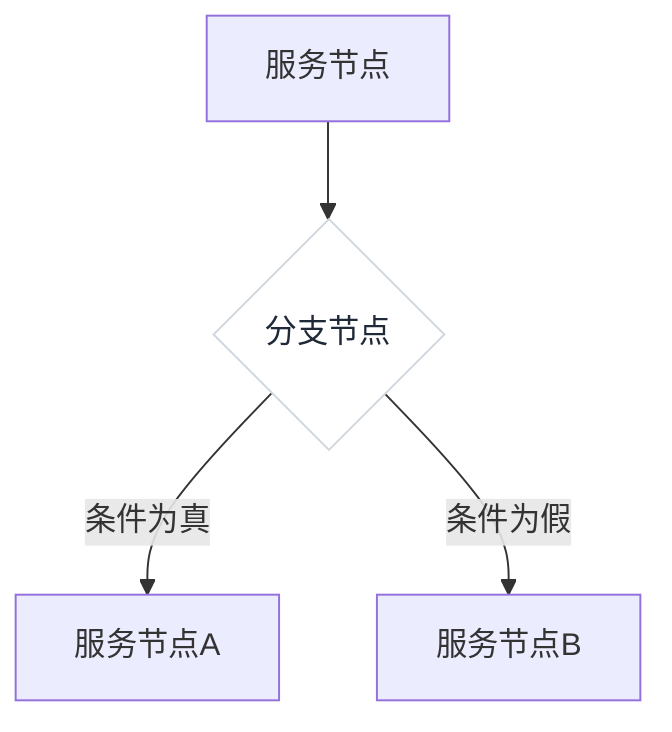
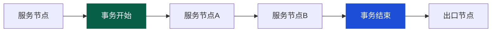
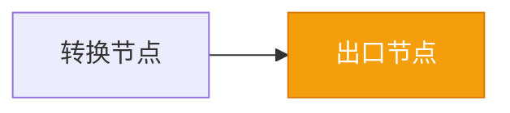
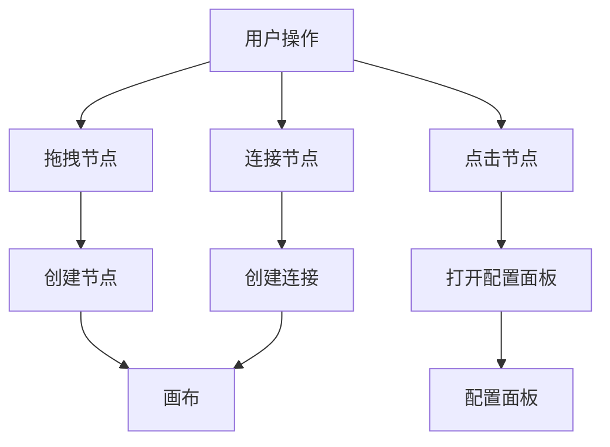
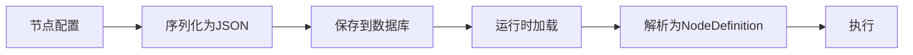

# 节点（Node）

<cite>
**本文档引用的文件**   
- [EntryNode.vue](file://apps\ygflow-orchestrator-ui\src\components\EntryNode.vue)
- [ExitNode.vue](file://apps\ygflow-orchestrator-ui\src\components\ExitNode.vue)
- [TaskNode.vue](file://apps\ygflow-orchestrator-ui\src\components\TaskNode.vue)
- [TransformerNode.vue](file://apps\ygflow-orchestrator-ui\src\components\TransformerNode.vue)
- [BranchNode.vue](file://apps\ygflow-orchestrator-ui\src\components\BranchNode.vue)
- [TransactionNode.vue](file://apps\ygflow-orchestrator-ui\src\components\TransactionNode.vue)
- [entryExitNodes.ts](file://apps\ygflow-orchestrator-ui\src\data\entryExitNodes.ts)
- [models.ts](file://apps\ygflow-orchestrator-ui\src\data\models.ts)
- [useNodeHandlers.ts](file://apps\ygflow-orchestrator-ui\src\composables\useNodeHandlers.ts)
- [useCanvasOperations.ts](file://apps\ygflow-orchestrator-ui\src\composables\useCanvasOperations.ts)
- [ValidationEditor.vue](file://apps\ygflow-orchestrator-ui\src\components\ValidationEditor.vue)
- [TransformerEditor.vue](file://apps\ygflow-orchestrator-ui\src\components\TransformerEditor.vue)
- [ParamResolverEditor.vue](file://apps\ygflow-orchestrator-ui\src\components\ParamResolverEditor.vue)
- [FlowLoader.java](file://yglue-runtime\src\main\java\org\yglue\flow\runtime\core\definition\FlowLoader.java)
- [NodeDefinition.java](file://yglue-runtime\src\main\java\org\yglue\flow\runtime\core\definition\NodeDefinition.java)
- [FlowResolverService.java](file://yglue-orchestrator\src\main\java\org\yglue\flow\orch\service\FlowResolverService.java)
- [FlowRuntimeAutoConfiguration.java](file://yglue-runtime-spring-boot3\src\main\java\org\yglue\flow\runtime\spring\FlowRuntimeAutoConfiguration.java)
</cite>

## 目录
1. [简介](#简介)
2. [节点类型详解](#节点类型详解)
   1. [入口节点](#入口节点)
   2. [服务节点](#服务节点)
   3. [转换节点](#转换节点)
   4. [分支节点](#分支节点)
   5. [事务节点](#事务节点)
   6. [出口节点](#出口节点)
3. [可视化画布行为](#可视化画布行为)
4. [节点配置结构与序列化](#节点配置结构与序列化)
5. [节点组合使用案例](#节点组合使用案例)
6. [结论](#结论)

## 简介

节点（Node）是流程编排系统中的基本执行单元，代表了流程中一个独立的操作或步骤。在本系统中，节点通过可视化画布进行设计和连接，形成完整的业务流程。每个节点都有其特定的类型和功能，共同协作以实现复杂的业务逻辑。节点系统的设计旨在提供一种直观、灵活且强大的方式来定义和执行业务流程，支持从简单的线性流程到复杂的条件分支和数据转换。

**节点类型与功能概览**
- **入口节点 (Entry Node)**: 流程的起点，定义了流程的触发方式和输入参数。
- **服务节点 (Service Node)**: 调用业务方法，执行核心业务逻辑。
- **转换节点 (Transformer Node)**: 执行数据映射与处理，转换数据格式。
- **分支节点 (Branch Node)**: 实现条件路由，根据表达式结果决定流程走向。
- **事务节点 (Transaction Node)**: 管理执行上下文，确保一系列操作的原子性。
- **出口节点 (Exit Node)**: 流程的终点，定义了流程的最终输出。

**节点在系统中的角色**
节点不仅是流程的构建块，也是数据流和控制流的载体。当流程执行时，运行时引擎会按照节点的连接顺序，依次执行每个节点。节点之间通过上下文（Context）共享数据，前一个节点的输出可以作为后一个节点的输入。这种设计使得流程具有高度的可组合性和可复用性。

## 节点类型详解

### 入口节点

入口节点是整个流程的起点，负责接收外部请求并初始化流程上下文。它定义了流程的触发方式，通常与一个REST API端点相关联。当外部系统调用该API时，流程即被启动。

入口节点的配置包括HTTP方法（如GET、POST）和请求路径，这些信息决定了如何访问该流程。此外，入口节点还定义了请求参数的结构（`requestSchema`），用于验证和解析传入的数据。在可视化画布上，入口节点通常显示为一个带有门形图标的绿色方块，只有一个向下的输出句柄，表示流程从此处开始。


**节点来源**
- [EntryNode.vue](file://apps\ygflow-orchestrator-ui\src\components\EntryNode.vue#L1-L48)
- [entryExitNodes.ts](file://apps\ygflow-orchestrator-ui\src\data\entryExitNodes.ts#L1-L28)

### 服务节点

服务节点用于调用预定义的业务方法，是执行核心业务逻辑的主要单元。在配置中，需要指定目标服务的Bean名称和方法名。运行时，系统会通过Spring容器查找该Bean并调用其方法。

服务节点的输入（`inputs`）和输出（`output`）定义了与上下文交互的数据。输入参数可以来自上游节点的输出、流程上下文或常量值。输出则会被写入上下文，供后续节点使用。在可视化画布上，服务节点显示为一个标准的矩形，有多个输入和输出句柄，允许灵活的连接。



**节点来源**
- [TaskNode.vue](file://apps\ygflow-orchestrator-ui\src\components\TaskNode.vue#L1-L56)
- [FlowRuntimeAutoConfiguration.java](file://yglue-runtime-spring-boot3\src\main\java\org\yglue\flow\runtime\spring\FlowRuntimeAutoConfiguration.java#L131-L139)

### 转换节点

转换节点用于执行数据映射与处理，是数据转换的核心。它支持两种主要模式：字段映射和Groovy脚本。字段映射允许用户将输入对象的字段直接映射到输出对象的字段，支持简单的数据转换。Groovy脚本则提供了强大的编程能力，可以执行复杂的逻辑处理。

转换节点的配置包括`mappingConfig`（字段映射配置）和`script`（Groovy脚本）。当节点执行时，会根据配置生成输出结果。在可视化画布上，转换节点显示为一个紫色的矩形，有一个向上的输入句柄和一个向下的输出句柄，图标为循环箭头，表示数据转换。



**节点来源**
- [TransformerNode.vue](file://apps\ygflow-orchestrator-ui\src\components\TransformerNode.vue#L1-L81)
- [TransformerEditor.vue](file://apps\ygflow-orchestrator-ui\src\components\TransformerEditor.vue#L1-L800)

### 分支节点

分支节点实现条件路由，根据表达式的结果决定流程的走向。它通常有两个或多个输出分支，每个分支可以配置一个条件表达式。当流程执行到分支节点时，系统会按顺序评估每个分支的条件，将流程导向第一个条件为真的分支。

分支节点的配置包括`expression`（条件表达式），通常使用Groovy语言编写。在可视化画布上，分支节点显示为一个菱形，有多个输入和输出句柄，直观地表示了条件判断的逻辑。



**节点来源**
- [BranchNode.vue](file://apps\ygflow-orchestrator-ui\src\components\BranchNode.vue#L1-L125)
- [FlowLoader.java](file://yglue-runtime\src\main\java\org\yglue\flow\runtime\core\definition\FlowLoader.java#L243-L282)

### 事务节点

事务节点用于管理执行上下文，确保一系列操作的原子性。它分为“事务开始”和“事务结束”两种模式。从“事务开始”节点到“事务结束”节点之间的所有操作被视为一个事务，要么全部成功提交，要么在发生错误时全部回滚。

事务节点的配置包括`transaction`（事务模式）和`txManager`（事务管理器）。在可视化画布上，“事务开始”节点显示为一个绿色虚线框的矩形，而“事务结束”节点显示为一个蓝色虚线框的矩形，通过颜色和样式区分其功能。



**节点来源**
- [TransactionNode.vue](file://apps\ygflow-orchestrator-ui\src\components\TransactionNode.vue#L1-L58)
- [Inspector.vue](file://apps\ygflow-orchestrator-ui\src\components\Inspector.vue#L454-L471)

### 出口节点

出口节点标识流程的终点，负责定义流程的最终输出。它将流程上下文中的数据映射到API响应，完成整个流程。出口节点的配置包括`responseMapping`，定义了如何将上下文中的数据转换为响应体。

在可视化画布上，出口节点显示为一个带有旗帜图标的橙色方块，只有一个向上的输入句柄，表示流程在此处结束。所有流程都必须以一个出口节点结束，以确保流程的完整性。



**节点来源**
- [ExitNode.vue](file://apps\ygflow-orchestrator-ui\src\components\ExitNode.vue#L1-L46)
- [entryExitNodes.ts](file://apps\ygflow-orchestrator-ui\src\data\entryExitNodes.ts#L8-L17)

## 可视化画布行为

节点在可视化画布上的行为是用户与流程设计交互的核心。用户可以通过拖拽操作将节点从组件面板添加到画布上，并通过连接操作将节点连接起来，形成流程图。

**拖拽与连接**
- **拖拽**: 用户可以从左侧的组件面板中拖拽节点图标到画布的任意位置。松开鼠标后，节点即被创建并放置在指定位置。
- **连接**: 用户可以通过点击节点上的句柄（Handle）并拖拽到另一个节点的句柄来创建连接。连接代表了流程的执行顺序，数据将从源节点流向目标节点。

**配置面板**
当用户点击画布上的节点时，右侧的配置面板会显示该节点的详细配置选项。配置面板的内容根据节点类型动态变化：
- **入口节点**: 配置HTTP方法、路径和请求参数。
- **服务节点**: 配置目标服务、方法和输入输出参数。
- **转换节点**: 配置字段映射或Groovy脚本。
- **分支节点**: 配置条件表达式。
- **事务节点**: 配置事务模式和事务管理器。
- **出口节点**: 配置响应映射。

**画布操作**
用户可以通过工具栏或快捷键对画布进行操作，如放大、缩小和适应视图。这些操作由`useCanvasOperations` composable提供支持，确保用户可以方便地查看和编辑复杂的流程图。



**节点来源**
- [useNodeHandlers.ts](file://apps\ygflow-orchestrator-ui\src\composables\useNodeHandlers.ts#L7-L178)
- [useCanvasOperations.ts](file://apps\ygflow-orchestrator-ui\src\composables\useCanvasOperations.ts#L7-L41)

## 节点配置结构与序列化

节点的配置结构是其功能定义的核心，决定了节点在运行时的行为。一个典型的节点配置包含`comp`、`inputs`、`output`和`label`等关键属性。

**配置结构详解**
- **comp**: 对于服务节点，此属性定义了要调用的目标组件，包括Bean名称和方法名。
- **inputs**: 定义了节点的输入参数，是一个参数解析器（ParamResolver）的数组。每个解析器指定了如何从上下文中获取值。
- **output**: 定义了节点的输出，指定了输出值的类型和存储路径。
- **label**: 节点的显示标签，用于在画布上标识节点。

**序列化与执行**
当用户在画布上设计完流程后，整个流程会被序列化为JSON格式并保存。`FlowResolverService`负责将节点的Map结构序列化为JSON字符串。运行时，`FlowLoader`会解析这个JSON，构建`NodeDefinition`对象，并通过拓扑排序确定执行顺序。`NodeExecutorRegistry`根据节点类型注册相应的执行器，如`ServiceNodeExecutor`用于执行服务节点。



**节点来源**
- [NodeDefinition.java](file://yglue-runtime\src\main\java\org\yglue\flow\runtime\core\definition\NodeDefinition.java#L7-L42)
- [FlowLoader.java](file://yglue-runtime\src\main\java\org\yglue\flow\runtime\core\definition\FlowLoader.java#L184-L291)
- [FlowResolverService.java](file://yglue-orchestrator\src\main\java\org\yglue\flow\orch\service\FlowResolverService.java#L203-L211)

## 节点组合使用案例

以下是一个包含参数验证、服务调用和数据转换的完整流程片段的案例。

**流程描述**
1. **入口节点**: 接收一个用户注册请求，包含用户名、邮箱和密码。
2. **验证节点**: 使用`ValidationEditor`对输入参数进行校验，确保邮箱格式正确、密码长度符合要求。
3. **服务节点**: 调用`UserService.createUser`方法创建用户。
4. **转换节点**: 使用Groovy脚本将用户对象转换为一个包含用户ID和欢迎消息的响应对象。
5. **出口节点**: 将转换后的对象作为API响应返回。

**配置示例**
```json
{
  "nodes": [
    {
      "id": "entry",
      "type": "entry",
      "data": {
        "method": "POST",
        "path": "/api/register",
        "requestSchema": [
          {"name": "username", "type": "string"},
          {"name": "email", "type": "string"},
          {"name": "password", "type": "string"}
        ]
      }
    },
    {
      "id": "validate",
      "type": "validation",
      "data": {
        "rules": [
          {
            "type": "regex",
            "config": {"pattern": "^[A-Za-z0-9+_.-]+@[A-Za-z0-9.-]+\\.[A-Za-z]{2,}$"},
            "message": "邮箱格式不正确"
          },
          {
            "type": "length",
            "config": {"minLength": 6},
            "message": "密码长度不能少于6位"
          }
        ]
      }
    },
    {
      "id": "createUser",
      "type": "service",
      "data": {
        "comp": {"bean": "userService", "method": "createUser"},
        "inputs": [
          {"type": "request", "path": "request.body"}
        ],
        "output": {"path": "ctx['user']"}
      }
    },
    {
      "id": "transform",
      "type": "transformer",
      "data": {
        "script": "def result = [:]\nresult.id = ctx['user'].id\nresult.message = '欢迎，' + ctx['user'].username\nreturn result"
      }
    },
    {
      "id": "exit",
      "type": "exit",
      "data": {
        "responseMapping": {"type": "field", "value": "ctx['result']"}
      }
    }
  ],
  "edges": [
    {"source": "entry", "target": "validate"},
    {"source": "validate", "target": "createUser"},
    {"source": "createUser", "target": "transform"},
    {"source": "transform", "target": "exit"}
  ]
}
```

**节点来源**
- [ValidationEditor.vue](file://apps\ygflow-orchestrator-ui\src\components\ValidationEditor.vue#L8-L17)
- [ParamResolverEditor.vue](file://apps\ygflow-orchestrator-ui\src\components\ParamResolverEditor.vue#L5-L12)

## 结论

节点作为流程编排系统的基本执行单元，通过其多样化的类型和灵活的配置，为构建复杂的业务流程提供了坚实的基础。从入口到出口，从服务调用到数据转换，每个节点都扮演着不可或缺的角色。可视化的设计方式极大地降低了流程编排的门槛，而强大的运行时引擎则确保了流程的高效和可靠执行。理解节点的配置结构和组合方式，是掌握整个系统的关键。