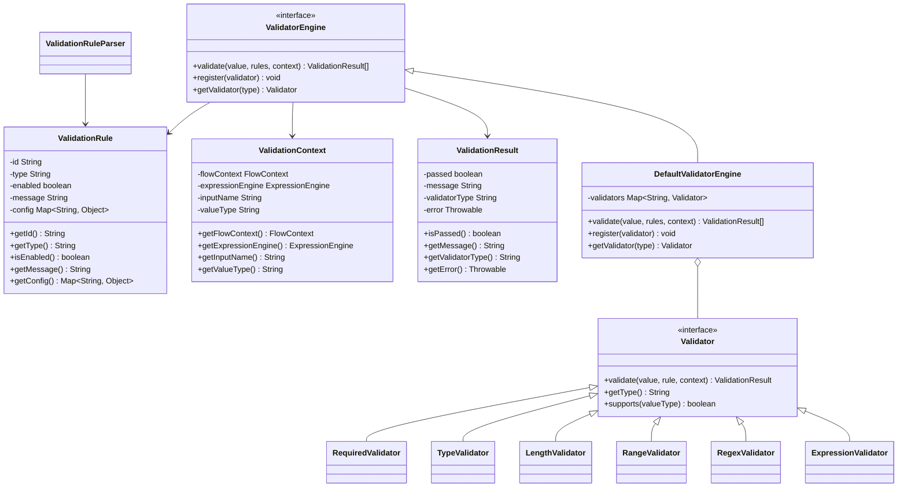
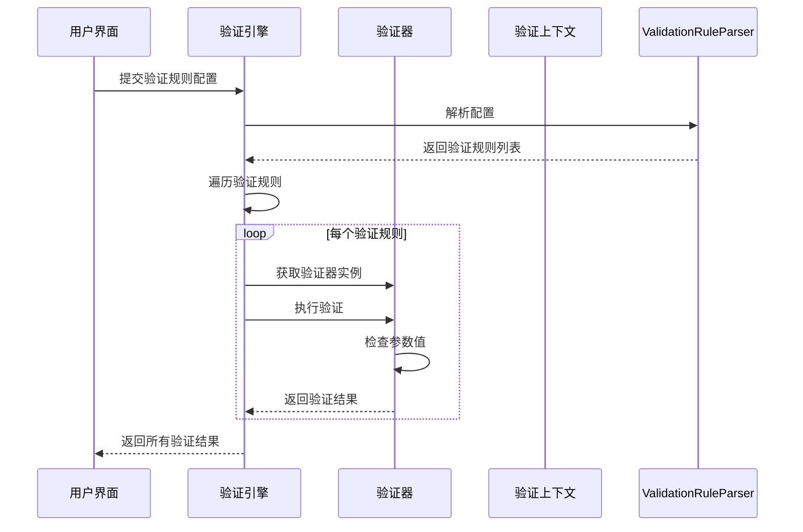
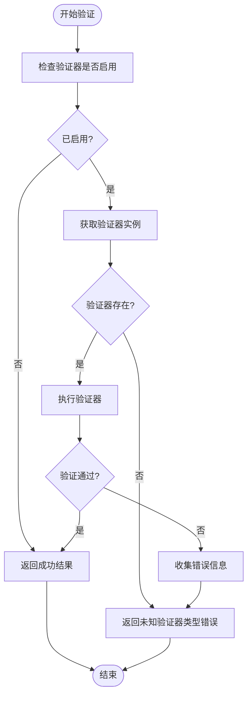

# 验证器（Validator）

<cite>
**本文档引用的文件**  
- [Validator.java](file://yglue-runtime/src/main/java/org/yglue/flow/runtime/core/validator/Validator.java)
- [DefaultValidatorEngine.java](file://yglue-runtime/src/main/java/org/yglue/flow/runtime/core/validator/DefaultValidatorEngine.java)
- [ValidationRule.java](file://yglue-runtime/src/main/java/org/yglue/flow/runtime/core/validator/ValidationRule.java)
- [ValidationContext.java](file://yglue-runtime/src/main/java/org/yglue/flow/runtime/core/validator/ValidationContext.java)
- [ValidationResult.java](file://yglue-runtime/src/main/java/org/yglue/flow/runtime/core/validator/ValidationResult.java)
- [RequiredValidator.java](file://yglue-runtime/src/main/java/org/yglue/flow/runtime/core/validator/validators/RequiredValidator.java)
- [TypeValidator.java](file://yglue-runtime/src/main/java/org/yglue/flow/runtime/core/validator/validators/TypeValidator.java)
- [LengthValidator.java](file://yglue-runtime/src/main/java/org/yglue/flow/runtime/core/validator/validators/LengthValidator.java)
- [RangeValidator.java](file://yglue-runtime/src/main/java/org/yglue/flow/runtime/core/validator/validators/RangeValidator.java)
- [RegexValidator.java](file://yglue-runtime/src/main/java/org/yglue/flow/runtime/core/validator/validators/RegexValidator.java)
- [ExpressionValidator.java](file://yglue-runtime/src/main/java/org/yglue/flow/runtime/core/validator/validators/ExpressionValidator.java)
- [ValidationRuleParser.java](file://yglue-runtime/src/main/java/org/yglue/flow/runtime/core/validator/ValidationRuleParser.java)
- [ValidationEditor.vue](file://apps/ygflow-orchestrator-ui/src/components/ValidationEditor.vue)
</cite>

## 目录
1. [引言](#引言)
2. [验证器核心组件](#验证器核心组件)
3. [支持的验证规则类型](#支持的验证规则类型)
4. [验证器配置与执行流程](#验证器配置与执行流程)
5. [验证失败处理机制](#验证失败处理机制)
6. [验证规则的可扩展性](#验证规则的可扩展性)
7. [手机号正则验证示例](#手机号正则验证示例)
8. [总结](#总结)

## 引言

验证器（Validator）是保障流程输入数据合法性的重要组件。在系统执行流程之前，验证器会对节点的输入参数进行校验，确保数据符合预定义的规则，从而提高系统的健壮性和安全性。本文档将详细介绍验证器的工作原理、支持的验证规则类型、配置方式、执行流程以及错误处理机制。

## 验证器核心组件

验证器系统由多个核心组件构成，包括验证器接口、验证规则、验证上下文、验证结果和验证引擎。这些组件协同工作，完成对输入参数的校验。



**图例来源**  
- [Validator.java](file://yglue-runtime/src/main/java/org/yglue/flow/runtime/core/validator/Validator.java)
- [ValidationRule.java](file://yglue-runtime/src/main/java/org/yglue/flow/runtime/core/validator/ValidationRule.java)
- [ValidationContext.java](file://yglue-runtime/src/main/java/org/yglue/flow/runtime/core/validator/ValidationContext.java)
- [ValidationResult.java](file://yglue-runtime/src/main/java/org/yglue/flow/runtime/core/validator/ValidationResult.java)
- [DefaultValidatorEngine.java](file://yglue-runtime/src/main/java/org/yglue/flow/runtime/core/validator/DefaultValidatorEngine.java)

**本节来源**  
- [Validator.java](file://yglue-runtime/src/main/java/org/yglue/flow/runtime/core/validator/Validator.java#L1-L40)
- [ValidationRule.java](file://yglue-runtime/src/main/java/org/yglue/flow/runtime/core/validator/ValidationRule.java#L1-L74)
- [ValidationContext.java](file://yglue-runtime/src/main/java/org/yglue/flow/runtime/core/validator/ValidationContext.java#L1-L56)
- [ValidationResult.java](file://yglue-runtime/src/main/java/org/yglue/flow/runtime/core/validator/ValidationResult.java#L1-L72)
- [DefaultValidatorEngine.java](file://yglue-runtime/src/main/java/org/yglue/flow/runtime/core/validator/DefaultValidatorEngine.java#L1-L83)

## 支持的验证规则类型

验证器支持多种验证规则类型，每种规则类型都有其特定的用途和配置方式。

### 必填（Required）验证器

必填验证器用于检查参数是否存在且不为 null。该验证器适用于所有数据类型。

**本节来源**  
- [RequiredValidator.java](file://yglue-runtime/src/main/java/org/yglue/flow/runtime/core/validator/validators/RequiredValidator.java#L1-L38)

### 类型（Type）验证器

类型验证器用于检查参数类型是否匹配。支持的基本类型包括 STRING、NUMBER、BOOLEAN、ARRAY 和 OBJECT。还可以通过完整类型名进行精确匹配。

**本节来源**  
- [TypeValidator.java](file://yglue-runtime/src/main/java/org/yglue/flow/runtime/core/validator/validators/TypeValidator.java#L1-L93)

### 长度（Length）验证器

长度验证器用于检查字符串、数组或集合的长度是否在指定范围内。可以设置最小长度和最大长度。

**本节来源**  
- [LengthValidator.java](file://yglue-runtime/src/main/java/org/yglue/flow/runtime/core/validator/validators/LengthValidator.java#L1-L95)

### 范围（Range）验证器

范围验证器用于检查数字是否在指定范围内。可以设置最小值和最大值。

**本节来源**  
- [RangeValidator.java](file://yglue-runtime/src/main/java/org/yglue/flow/runtime/core/validator/validators/RangeValidator.java#L1-L84)

### 正则表达式（Regex）验证器

正则表达式验证器用于检查字符串是否匹配正则表达式。支持预设的正则表达式（如邮箱、手机号、身份证号等）和自定义正则表达式。

**本节来源**  
- [RegexValidator.java](file://yglue-runtime/src/main/java/org/yglue/flow/runtime/core/validator/validators/RegexValidator.java#L1-L109)

### 表达式（Expression）验证器

表达式验证器使用 Groovy 表达式进行自定义校验。可以在表达式中访问流程上下文、当前参数值等变量。

**本节来源**  
- [ExpressionValidator.java](file://yglue-runtime/src/main/java/org/yglue/flow/runtime/core/validator/validators/ExpressionValidator.java#L1-L91)

## 验证器配置与执行流程

验证器在节点的输入参数上进行配置，运行时引擎在执行前对参数进行校验。配置信息以 JSON 格式存储，包含验证器类型、启用状态、错误消息和具体配置。



**图例来源**  
- [ValidationRuleParser.java](file://yglue-runtime/src/main/java/org/yglue/flow/runtime/core/validator/ValidationRuleParser.java)
- [DefaultValidatorEngine.java](file://yglue-runtime/src/main/java/org/yglue/flow/runtime/core/validator/DefaultValidatorEngine.java)
- [Validator.java](file://yglue-runtime/src/main/java/org/yglue/flow/runtime/core/validator/Validator.java)

**本节来源**  
- [ValidationRuleParser.java](file://yglue-runtime/src/main/java/org/yglue/flow/runtime/core/validator/ValidationRuleParser.java#L1-L121)
- [DefaultValidatorEngine.java](file://yglue-runtime/src/main/java/org/yglue/flow/runtime/core/validator/DefaultValidatorEngine.java#L40-L67)

## 验证失败处理机制

当验证失败时，系统会收集错误信息并返回给调用方。每个验证结果包含是否通过、错误消息、验证器类型和异常信息。



**图例来源**  
- [DefaultValidatorEngine.java](file://yglue-runtime/src/main/java/org/yglue/flow/runtime/core/validator/DefaultValidatorEngine.java)
- [ValidationResult.java](file://yglue-runtime/src/main/java/org/yglue/flow/runtime/core/validator/ValidationResult.java)

**本节来源**  
- [DefaultValidatorEngine.java](file://yglue-runtime/src/main/java/org/yglue/flow/runtime/core/validator/DefaultValidatorEngine.java#L52-L61)
- [ValidationResult.java](file://yglue-runtime/src/main/java/org/yglue/flow/runtime/core/validator/ValidationResult.java#L28-L53)

## 验证规则的可扩展性

验证器具有良好的可扩展性，开发者可以通过实现 Validator 接口来创建自定义验证逻辑。自定义验证器需要实现 validate、getType 和 supports 方法，并通过 ValidatorEngine 的 register 方法注册到系统中。

**本节来源**  
- [Validator.java](file://yglue-runtime/src/main/java/org/yglue/flow/runtime/core/validator/Validator.java#L12-L37)
- [DefaultValidatorEngine.java](file://yglue-runtime/src/main/java/org/yglue/flow/runtime/core/validator/DefaultValidatorEngine.java#L71-L74)

## 手机号正则验证示例

以下是一个配置手机号正则验证规则的 JSON 示例：

```json
{
  "validators": [
    {
      "id": "phone-validator",
      "type": "regex",
      "enabled": true,
      "message": "手机号格式不正确",
      "config": {
        "preset": "phone"
      }
    }
  ]
}
```

在运行时，该配置会被解析为 ValidationRule 对象，然后由 RegexValidator 执行验证。如果输入的手机号不符合 "^1[3-9]\\d{9}$" 的格式，验证将失败并返回指定的错误消息。

**本节来源**  
- [ValidationEditor.vue](file://apps/ygflow-orchestrator-ui/src/components/ValidationEditor.vue#L35)
- [RegexValidator.java](file://yglue-runtime/src/main/java/org/yglue/flow/runtime/core/validator/validators/RegexValidator.java#L21)

## 总结

验证器是保障流程输入数据合法性的重要组件，支持多种验证规则类型，包括必填、类型、长度、范围、正则表达式和表达式。通过在节点的输入参数上配置验证规则，运行时引擎可以在执行前对参数进行校验。验证失败时，系统会收集错误信息并返回给调用方。验证器具有良好的可扩展性，开发者可以通过实现 Validator 接口来创建自定义验证逻辑。