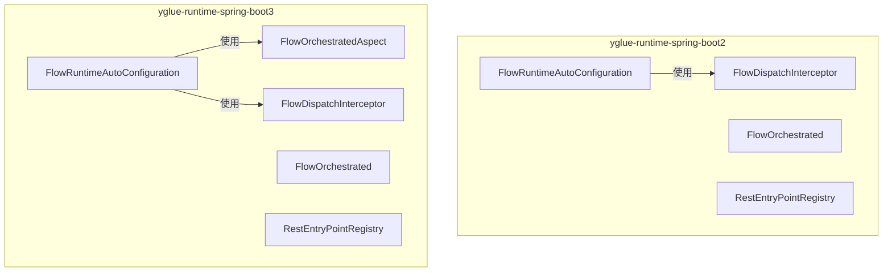
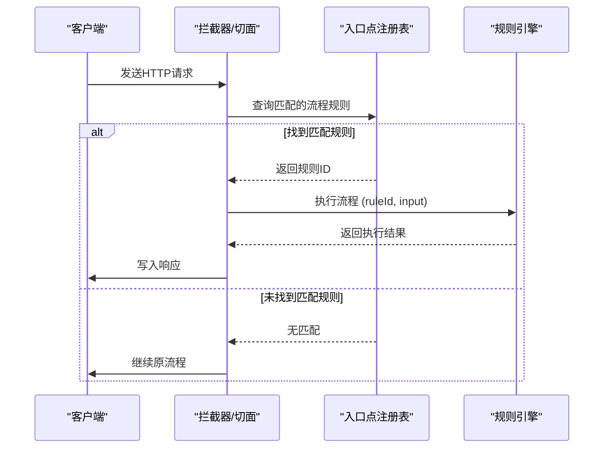
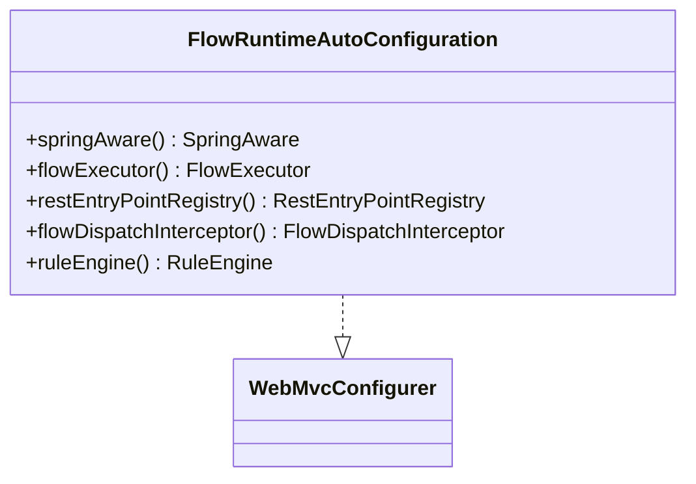
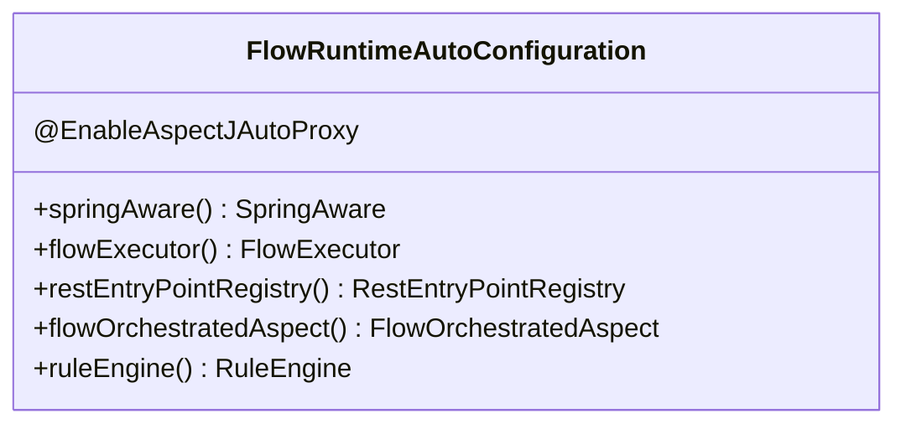
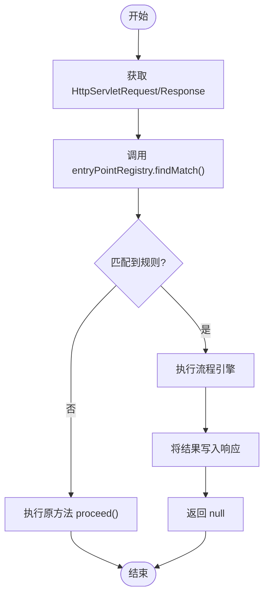
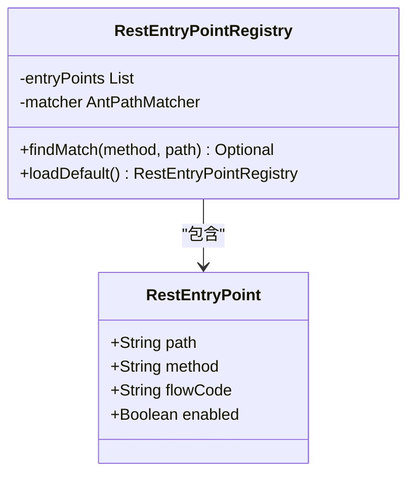
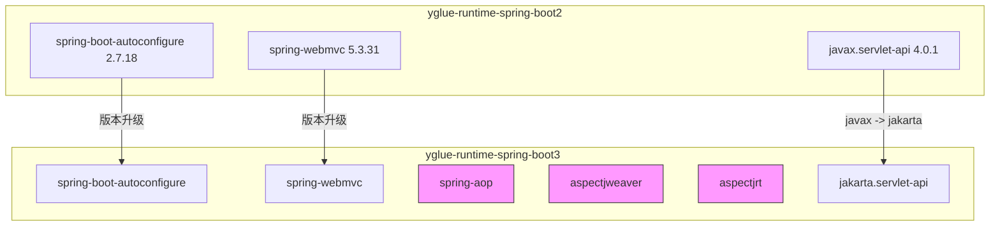

# Spring Boot 集成模块文档

<cite>
**本文档引用文件**  
- [FlowRuntimeAutoConfiguration.java](file://yglue-runtime-spring-boot2/src/main/java/org/yglue/flow/runtime/spring/FlowRuntimeAutoConfiguration.java)
- [FlowRuntimeAutoConfiguration.java](file://yglue-runtime-spring-boot3/src/main/java/org/yglue/flow/runtime/spring/FlowRuntimeAutoConfiguration.java)
- [FlowOrchestratedAspect.java](file://yglue-runtime-spring-boot3/src/main/java/org/yglue/flow/runtime/spring/FlowOrchestratedAspect.java)
- [RestEntryPointRegistry.java](file://yglue-runtime-spring-boot2/src/main/java/org/yglue/flow/runtime/spring/RestEntryPointRegistry.java)
- [RestEntryPointRegistry.java](file://yglue-runtime-spring-boot3/src/main/java/org/yglue/flow/runtime/spring/RestEntryPointRegistry.java)
- [FlowDispatchInterceptor.java](file://yglue-runtime-spring-boot2/src/main/java/org/yglue/flow/runtime/spring/FlowDispatchInterceptor.java)
- [FlowDispatchInterceptor.java](file://yglue-runtime-spring-boot3/src/main/java/org/yglue/flow/runtime/spring/FlowDispatchInterceptor.java)
- [application.yml](file://samples/yglue-sample-service/src/main/resources/application.yml)
- [pom.xml](file://yglue-runtime-spring-boot2/pom.xml)
- [pom.xml](file://yglue-runtime-spring-boot3/pom.xml)
</cite>

## 目录
1. [简介](#简介)
2. [项目结构](#项目结构)
3. [核心组件](#核心组件)
4. [架构概述](#架构概述)
5. [详细组件分析](#详细组件分析)
6. [依赖分析](#依赖分析)
7. [性能考虑](#性能考虑)
8. [故障排除指南](#故障排除指南)
9. [结论](#结论)

## 简介
本文档旨在为 `yglue-runtime-spring-boot2` 和 `yglue-runtime-spring-boot3` 模块提供全面的集成指导。文档重点对比了 Spring Boot 2.x 与 3.x 在 AOP（`FlowOrchestratedAspect`）和自动配置（`FlowRuntimeAutoConfiguration`）方面的实现差异。详细说明了 `FlowRuntimeAutoConfiguration` 如何自动装配核心组件，以及 `RestEntryPointRegistry` 如何注册 REST 入口点。同时，提供了在 Spring Boot 项目中引入对应版本运行时模块的依赖配置和基本使用示例，确保开发者能够正确集成并启用流程编排功能。

## 项目结构
`yglue-runtime-spring-boot2` 和 `yglue-runtime-spring-boot3` 是两个独立的模块，分别针对 Spring Boot 2.x 和 3.x 版本。它们共享相同的包结构和核心类名，但内部实现和依赖存在关键差异。

**图示来源**
- [FlowRuntimeAutoConfiguration.java](file://yglue-runtime-spring-boot2/src/main/java/org/yglue/flow/runtime/spring/FlowRuntimeAutoConfiguration.java)
- [FlowRuntimeAutoConfiguration.java](file://yglue-runtime-spring-boot3/src/main/java/org/yglue/flow/runtime/spring/FlowRuntimeAutoConfiguration.java)

**本节来源**
- [yglue-runtime-spring-boot2](file://yglue-runtime-spring-boot2)
- [yglue-runtime-spring-boot3](file://yglue-runtime-spring-boot3)

## 核心组件
两个模块的核心组件包括 `FlowRuntimeAutoConfiguration`（自动配置类）、`RestEntryPointRegistry`（REST入口点注册器）、`FlowDispatchInterceptor`（流程分发拦截器）以及 `FlowOrchestratedAspect`（仅限 Boot3，AOP切面）。这些组件共同协作，实现对 REST 请求的拦截、流程规则的匹配与执行。

**本节来源**
- [FlowRuntimeAutoConfiguration.java](file://yglue-runtime-spring-boot2/src/main/java/org/yglue/flow/runtime/spring/FlowRuntimeAutoConfiguration.java)
- [FlowRuntimeAutoConfiguration.java](file://yglue-runtime-spring-boot3/src/main/java/org/yglue/flow/runtime/spring/FlowRuntimeAutoConfiguration.java)
- [RestEntryPointRegistry.java](file://yglue-runtime-spring-boot2/src/main/java/org/yglue/flow/runtime/spring/RestEntryPointRegistry.java)
- [RestEntryPointRegistry.java](file://yglue-runtime-spring-boot3/src/main/java/org/yglue/flow/runtime/spring/RestEntryPointRegistry.java)

## 架构概述
`yglue-runtime-spring-boot` 模块通过 Spring Boot 的自动配置机制，在应用启动时加载必要的 Bean。其核心架构围绕着对 REST 请求的处理展开。当一个请求到达时，系统会查找是否存在与该请求匹配的流程规则。如果存在，则执行流程并返回结果；否则，请求将按原定逻辑处理。

在 Spring Boot 2.x 版本中，此功能主要通过 `HandlerInterceptor`（`FlowDispatchInterceptor`）实现。而在 Spring Boot 3.x 版本中，则升级为使用 `@Aspect` 切面（`FlowOrchestratedAspect`），以更好地适应 Spring 6 和 Jakarta EE 的变化。

**图示来源**
- [FlowDispatchInterceptor.java](file://yglue-runtime-spring-boot2/src/main/java/org/yglue/flow/runtime/spring/FlowDispatchInterceptor.java)
- [FlowOrchestratedAspect.java](file://yglue-runtime-spring-boot3/src/main/java/org/yglue/flow/runtime/spring/FlowOrchestratedAspect.java)
- [RestEntryPointRegistry.java](file://yglue-runtime-spring-boot2/src/main/java/org/yglue/flow/runtime/spring/RestEntryPointRegistry.java)

## 详细组件分析

### FlowRuntimeAutoConfiguration 分析
`FlowRuntimeAutoConfiguration` 是自动配置的核心，负责创建和注册所有必需的 Bean。

#### Spring Boot 2.x 实现
在 `yglue-runtime-spring-boot2` 中，`FlowRuntimeAutoConfiguration` 实现了 `WebMvcConfigurer` 接口，并通过 `addInterceptors` 方法将 `FlowDispatchInterceptor` 注册到 Spring MVC 的拦截器链中。

**图示来源**
- [FlowRuntimeAutoConfiguration.java](file://yglue-runtime-spring-boot2/src/main/java/org/yglue/flow/runtime/spring/FlowRuntimeAutoConfiguration.java)

#### Spring Boot 3.x 实现
在 `yglue-runtime-spring-boot3` 中，`FlowRuntimeAutoConfiguration` 的关键变化是引入了 `@EnableAspectJAutoProxy` 注解，并定义了一个名为 `flowOrchestratedAspect` 的 `@Bean`。这个 Bean 是一个 AOP 切面，它会自动拦截所有带有 Spring Web 映射注解（如 `@GetMapping`, `@PostMapping`）的方法。

**图示来源**
- [FlowRuntimeAutoConfiguration.java](file://yglue-runtime-spring-boot3/src/main/java/org/yglue/flow/runtime/spring/FlowRuntimeAutoConfiguration.java)

**本节来源**
- [FlowRuntimeAutoConfiguration.java](file://yglue-runtime-spring-boot2/src/main/java/org/yglue/flow/runtime/spring/FlowRuntimeAutoConfiguration.java)
- [FlowRuntimeAutoConfiguration.java](file://yglue-runtime-spring-boot3/src/main/java/org/yglue/flow/runtime/spring/FlowRuntimeAutoConfiguration.java)

### FlowOrchestratedAspect 分析
`FlowOrchestratedAspect` 是 `yglue-runtime-spring-boot3` 模块的关键组件，它利用 AOP 技术实现了对 REST 方法的无侵入式拦截。

#### AOP 切面实现
该切面使用 `@Around` 通知，其切入点（pointcut）定义为所有带有 Spring Web 映射注解的方法。当一个匹配的方法被调用时，切面会：
1.  从 `RequestContextHolder` 获取 `HttpServletRequest` 和 `HttpServletResponse`。
2.  使用 `RestEntryPointRegistry` 根据请求的 `method` 和 `path` 查找匹配的流程规则。
3.  如果找到规则，则执行流程，并将结果写入响应，然后返回 `null` 以阻止原方法执行。
4.  如果未找到规则，则通过 `proceed()` 方法放行，让原方法正常执行。

**图示来源**
- [FlowOrchestratedAspect.java](file://yglue-runtime-spring-boot3/src/main/java/org/yglue/flow/runtime/spring/FlowOrchestratedAspect.java)

**本节来源**
- [FlowOrchestratedAspect.java](file://yglue-runtime-spring-boot3/src/main/java/org/yglue/flow/runtime/spring/FlowOrchestratedAspect.java)

### RestEntryPointRegistry 分析
`RestEntryPointRegistry` 负责管理和查询 REST 入口点与流程规则的映射关系。

#### 功能与实现
该类的核心功能是 `findMatch(String method, String path)` 方法。它会遍历所有注册的 `RestEntryPoint`，使用 `AntPathMatcher` 来检查请求路径是否与配置的路径模式匹配，并检查 HTTP 方法是否一致。

`loadDefault()` 静态方法是创建 `RestEntryPointRegistry` 实例的入口。它会通过 `EntryPointLoader` 加载配置文件（如 `flow.el.xml`）中的入口点定义，并将其转换为 `RestEntryPoint` 列表。

**图示来源**
- [RestEntryPointRegistry.java](file://yglue-runtime-spring-boot2/src/main/java/org/yglue/flow/runtime/spring/RestEntryPointRegistry.java)
- [RestEntryPointRegistry.java](file://yglue-runtime-spring-boot3/src/main/java/org/yglue/flow/runtime/spring/RestEntryPointRegistry.java)

**本节来源**
- [RestEntryPointRegistry.java](file://yglue-runtime-spring-boot2/src/main/java/org/yglue/flow/runtime/spring/RestEntryPointRegistry.java)
- [RestEntryPointRegistry.java](file://yglue-runtime-spring-boot3/src/main/java/org/yglue/flow/runtime/spring/RestEntryPointRegistry.java)

## 依赖分析
两个模块的依赖差异反映了 Spring Boot 2.x 到 3.x 的技术栈迁移。

**图示来源**
- [pom.xml](file://yglue-runtime-spring-boot2/pom.xml)
- [pom.xml](file://yglue-runtime-spring-boot3/pom.xml)

**本节来源**
- [pom.xml](file://yglue-runtime-spring-boot2/pom.xml)
- [pom.xml](file://yglue-runtime-spring-boot3/pom.xml)

## 性能考虑
-   **规则加载**：通过 `yglue.runtime.flow.reload-on-execution` 配置项，开发者可以在开发环境（`true`）和生产环境（`false`）之间权衡。生产环境应关闭此选项以利用缓存，提升性能。
-   **AOP vs 拦截器**：Spring Boot 3.x 使用的 AOP 切面通常比 MVC 拦截器具有更细粒度的控制和更低的侵入性，但两者在性能上的差异通常可以忽略不计。
-   **序列化**：`FlowOrchestratedAspect` 中的 `filterNonSerializableObjects` 方法可以防止因序列化 LiteFlow 内部对象而导致的异常，避免了潜在的性能瓶颈。

## 故障排除指南
-   **流程未被触发**：检查 `application.yml` 中 `yglue.runtime.flow.enabled` 是否设置为 `true`。确认请求的路径和方法是否与 `flow.el.xml` 中定义的入口点完全匹配。
-   **AOP 切面不生效**：确保项目中已正确引入 `spring-aop` 和 `aspectjweaver` 依赖。检查 `FlowRuntimeAutoConfiguration` 是否被正确加载。
-   **404 错误**：如果使用了 `FlowOrchestrated` 注解，但对应的流程规则不存在，可能会导致请求无法被正确处理。请确保 `ruleId` 配置正确。
-   **依赖冲突**：在迁移项目时，注意 `javax.servlet` 到 `jakarta.servlet` 的包名变更，避免版本冲突。

**本节来源**
- [application.yml](file://samples/yglue-sample-service/src/main/resources/application.yml)
- [FlowOrchestratedAspect.java](file://yglue-runtime-spring-boot3/src/main/java/org/yglue/flow/runtime/spring/FlowOrchestratedAspect.java)

## 结论
`yglue-runtime-spring-boot2` 和 `yglue-runtime-spring-boot3` 模块为不同版本的 Spring Boot 应用提供了流程编排能力。`yglue-runtime-spring-boot3` 通过采用 AOP 切面替代 MVC 拦截器，并升级到 Jakarta EE 命名空间，更好地适配了现代 Spring 技术栈。开发者在集成时，应根据所使用的 Spring Boot 版本选择正确的模块，并正确配置 `pom.xml` 依赖和 `application.yml` 参数，即可轻松启用强大的流程编排功能。