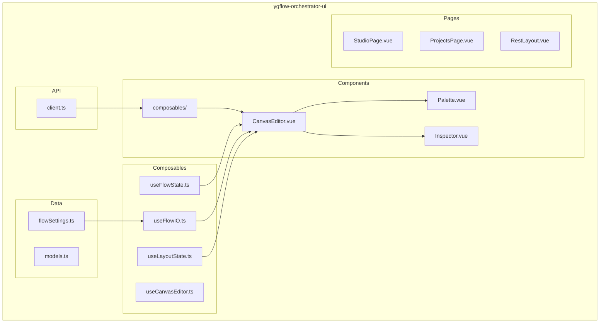
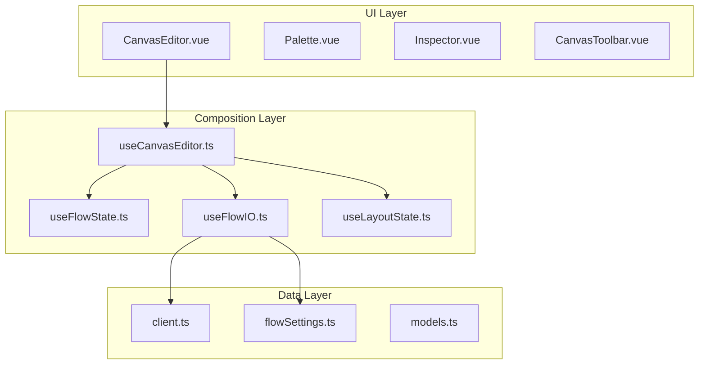
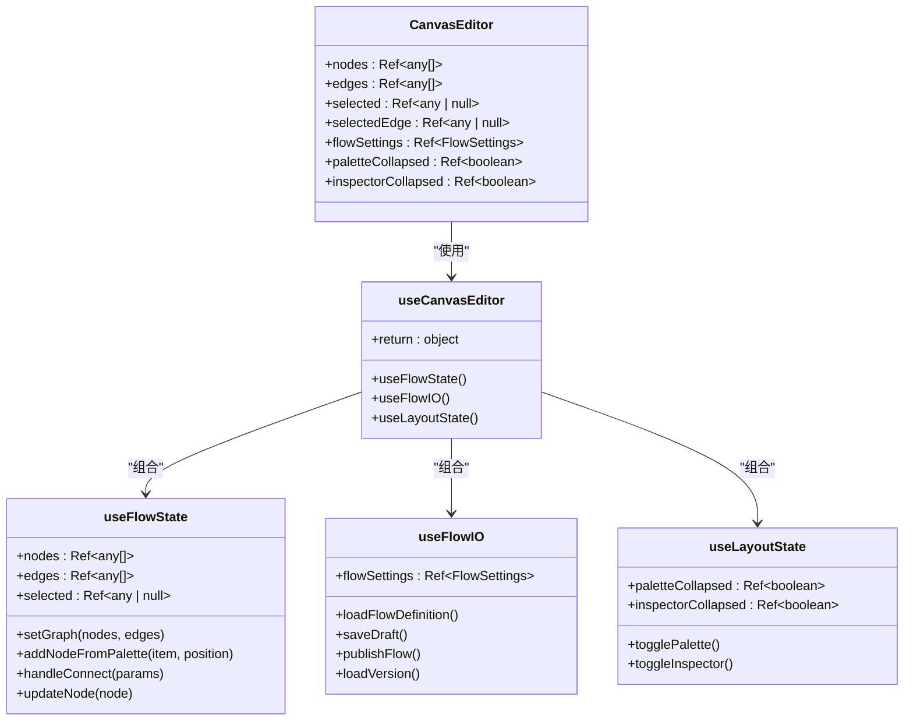
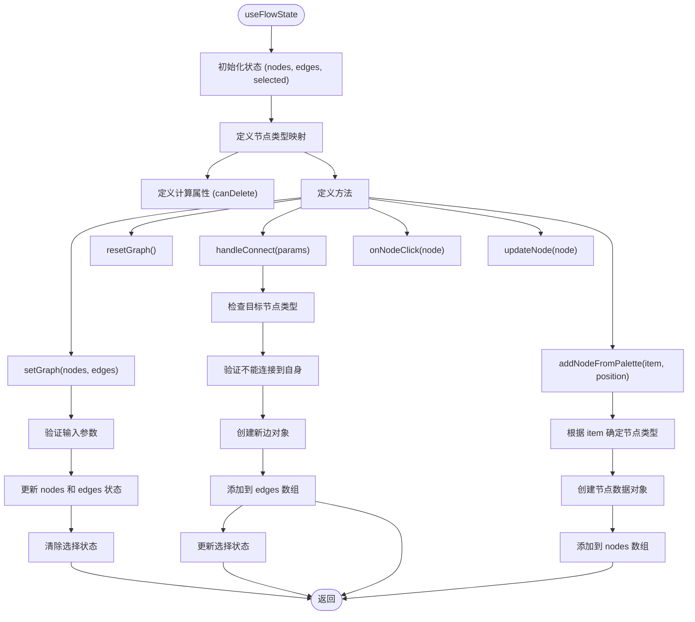
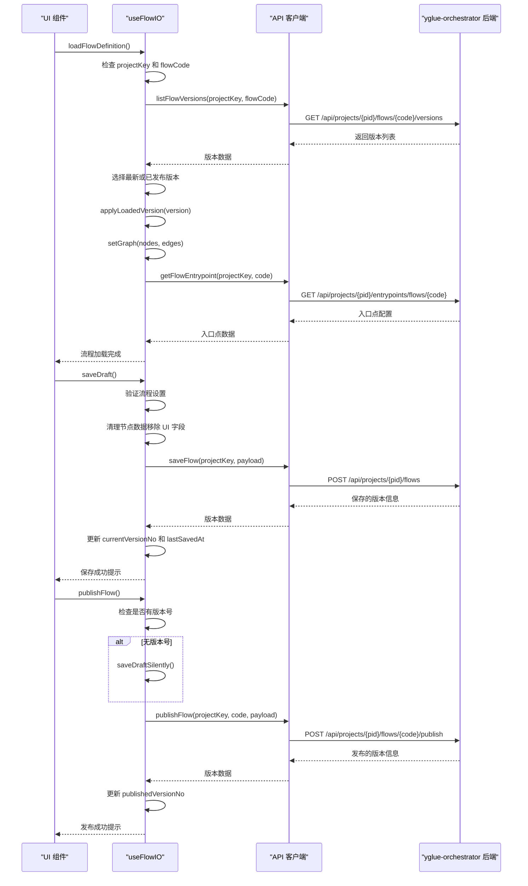
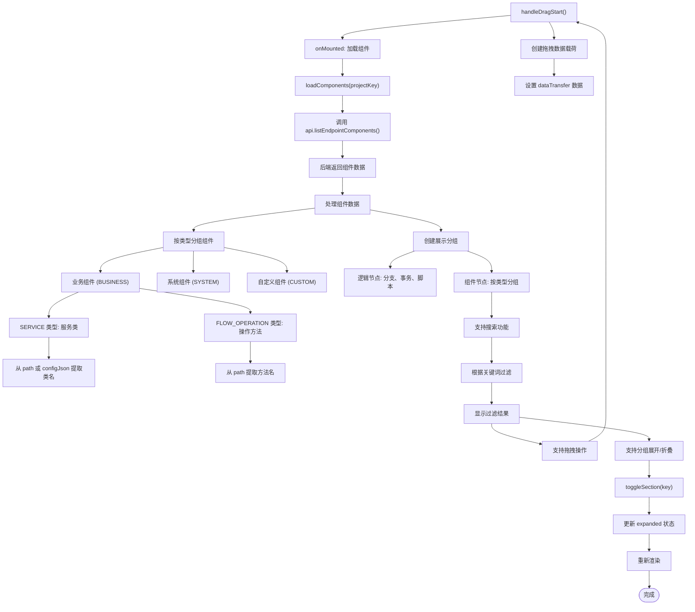
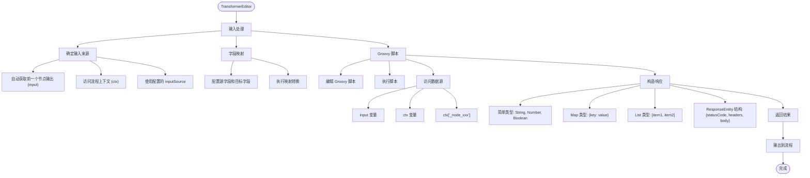
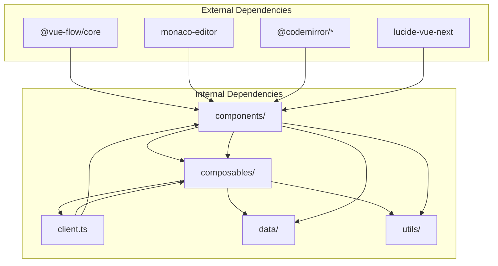

# ygflow-orchestrator-ui 模块文档

<cite>
**本文档引用的文件**  
- [README.md](file://apps/ygflow-orchestrator-ui/README.md)
- [package.json](file://apps/ygflow-orchestrator-ui/package.json)
- [main.ts](file://apps/ygflow-orchestrator-ui/src/main.ts)
- [App.vue](file://apps/ygflow-orchestrator-ui/src/App.vue)
- [client.ts](file://apps/ygflow-orchestrator-ui/src/api/client.ts)
- [useCanvasEditor.ts](file://apps/ygflow-orchestrator-ui/src/components/useCanvasEditor.ts)
- [useFlowState.ts](file://apps/ygflow-orchestrator-ui/src/components/composables/useFlowState.ts)
- [useFlowIO.ts](file://apps/ygflow-orchestrator-ui/src/components/composables/useFlowIO.ts)
- [useLayoutState.ts](file://apps/ygflow-orchestrator-ui/src/components/composables/useLayoutState.ts)
- [canvasTypes.ts](file://apps/ygflow-orchestrator-ui/src/components/composables/canvasTypes.ts)
- [CanvasEditor.vue](file://apps/ygflow-orchestrator-ui/src/components/CanvasEditor.vue)
- [Palette.vue](file://apps/ygflow-orchestrator-ui/src/components/Palette.vue)
- [TransformerEditor.vue](file://apps/ygflow-orchestrator-ui/src/components/TransformerEditor.vue)
- [TRANSFORMER_USAGE.md](file://apps/ygflow-orchestrator-ui/docs/TRANSFORMER_USAGE.md)
</cite>

## 目录
1. [简介](#简介)
2. [项目结构](#项目结构)
3. [核心组件](#核心组件)
4. [架构概述](#架构概述)
5. [详细组件分析](#详细组件分析)
6. [依赖分析](#依赖分析)
7. [性能考虑](#性能考虑)
8. [故障排除指南](#故障排除指南)
9. [结论](#结论)

## 简介
ygflow-orchestrator-ui 模块是基于 Vue 3 和 Vue Flow 构建的可视化流程编排工作台，为用户提供直观的图形化界面来设计和管理业务流程。该模块实现了完整的画布编辑功能，包括节点拖拽、连接、配置面板和调色板交互，支持通过组合式函数（composables）管理复杂的状态，并通过 REST API 与后端 yglue-orchestrator 服务进行通信。

**Section sources**
- [README.md](file://apps/ygflow-orchestrator-ui/README.md)

## 项目结构
ygflow-orchestrator-ui 模块采用标准的 Vue 3 项目结构，主要分为以下几个核心目录：

- `src/api/`: 包含与后端通信的 API 客户端
- `src/components/`: 包含所有 UI 组件和组合式函数
- `src/composables/`: 包含可复用的组合式函数
- `src/data/`: 包含数据模型和配置
- `src/pages/`: 包含页面级组件
- `src/router/`: 包含路由配置
- `src/utils/`: 包含工具函数

**Diagram sources**
- [README.md](file://apps/ygflow-orchestrator-ui/README.md)
- [package.json](file://apps/ygflow-orchestrator-ui/package.json)

**Section sources**
- [README.md](file://apps/ygflow-orchestrator-ui/README.md)
- [package.json](file://apps/ygflow-orchestrator-ui/package.json)

## 核心组件
ygflow-orchestrator-ui 的核心功能由多个关键组件和组合式函数构成，它们协同工作以提供完整的可视化设计体验。主要组件包括：

- **CanvasEditor**: 画布编辑器主组件，集成所有编辑功能
- **Palette**: 组件调色板，提供可拖拽的节点
- **Inspector**: 配置检查器，用于编辑节点属性
- **useCanvasEditor**: 组合式函数，整合画布状态管理
- **useFlowState**: 管理画布节点和边的状态
- **useFlowIO**: 处理与后端的通信和流程保存
- **useLayoutState**: 管理界面布局状态

这些组件通过组合式函数模式实现了关注点分离，使得代码更加模块化和可维护。

**Section sources**
- [CanvasEditor.vue](file://apps/ygflow-orchestrator-ui/src/components/CanvasEditor.vue)
- [useCanvasEditor.ts](file://apps/ygflow-orchestrator-ui/src/components/useCanvasEditor.ts)

## 架构概述
ygflow-orchestrator-ui 采用分层架构设计，将 UI 组件、状态管理和 API 通信分离。整体架构分为三层：

**Diagram sources**
- [CanvasEditor.vue](file://apps/ygflow-orchestrator-ui/src/components/CanvasEditor.vue)
- [useCanvasEditor.ts](file://apps/ygflow-orchestrator-ui/src/components/useCanvasEditor.ts)
- [useFlowState.ts](file://apps/ygflow-orchestrator-ui/src/components/composables/useFlowState.ts)
- [useFlowIO.ts](file://apps/ygflow-orchestrator-ui/src/components/composables/useFlowIO.ts)
- [useLayoutState.ts](file://apps/ygflow-orchestrator-ui/src/components/composables/useLayoutState.ts)

## 详细组件分析

### 画布编辑器分析
CanvasEditor 组件是整个可视化设计台的核心，它集成了画布、调色板、工具栏和配置面板，通过 useCanvasEditor 组合式函数管理所有状态和操作。

#### 组件关系图

**Diagram sources**
- [CanvasEditor.vue](file://apps/ygflow-orchestrator-ui/src/components/CanvasEditor.vue)
- [useCanvasEditor.ts](file://apps/ygflow-orchestrator-ui/src/components/useCanvasEditor.ts)
- [useFlowState.ts](file://apps/ygflow-orchestrator-ui/src/components/composables/useFlowState.ts)
- [useFlowIO.ts](file://apps/ygflow-orchestrator-ui/src/components/composables/useFlowIO.ts)
- [useLayoutState.ts](file://apps/ygflow-orchestrator-ui/src/components/composables/useLayoutState.ts)

**Section sources**
- [CanvasEditor.vue](file://apps/ygflow-orchestrator-ui/src/components/CanvasEditor.vue)
- [useCanvasEditor.ts](file://apps/ygflow-orchestrator-ui/src/components/useCanvasEditor.ts)

### 组合式函数分析
组合式函数是 ygflow-orchestrator-ui 状态管理的核心，它们通过组合式 API 提供了可复用的状态逻辑。

#### useFlowState 函数
useFlowState 函数管理画布的基本状态，包括节点、边和选择状态。

**Diagram sources**
- [useFlowState.ts](file://apps/ygflow-orchestrator-ui/src/components/composables/useFlowState.ts)

**Section sources**
- [useFlowState.ts](file://apps/ygflow-orchestrator-ui/src/components/composables/useFlowState.ts)

#### useFlowIO 函数
useFlowIO 函数处理与后端的通信和流程的持久化操作。

**Diagram sources**
- [useFlowIO.ts](file://apps/ygflow-orchestrator-ui/src/components/composables/useFlowIO.ts)
- [client.ts](file://apps/ygflow-orchestrator-ui/src/api/client.ts)

**Section sources**
- [useFlowIO.ts](file://apps/ygflow-orchestrator-ui/src/components/composables/useFlowIO.ts)

### API 客户端分析
API 客户端封装了与 yglue-orchestrator 后端的所有通信，提供了类型安全的接口。

#### API 接口定义
| 接口名称 | HTTP 方法 | 路径 | 描述 |
|---------|---------|------|------|
| listProjects | GET | /api/projects | 获取项目列表 |
| getProject | GET | /api/projects/{key} | 获取项目详情 |
| listEndpointComponents | GET | /api/projects/{key}/endpoints/components | 获取端点组件列表 |
| listEndpoints | GET | /api/projects/{key}/endpoints | 获取端点列表 |
| createEndpoint | POST | /api/projects/{key}/endpoints | 创建端点 |
| updateEndpoint | PATCH | /api/projects/{key}/endpoints/{id} | 更新端点 |
| listFlows | GET | /api/projects/{key}/flows | 获取流程列表 |
| saveFlow | POST | /api/projects/{key}/flows | 保存流程草稿 |
| publishFlow | POST | /api/projects/{key}/flows/{code}/publish | 发布流程 |
| listFlowModels | GET | /api/projects/{key}/models | 获取模型列表 |
| listFlowResolvers | GET | /api/projects/{key}/resolvers | 获取解析器列表 |

**Diagram sources**
- [client.ts](file://apps/ygflow-orchestrator-ui/src/api/client.ts)

**Section sources**
- [client.ts](file://apps/ygflow-orchestrator-ui/src/api/client.ts)

### 调色板组件分析
调色板组件（Palette）提供可拖拽的节点，支持搜索和分类展示。

**Diagram sources**
- [Palette.vue](file://apps/ygflow-orchestrator-ui/src/components/Palette.vue)

**Section sources**
- [Palette.vue](file://apps/ygflow-orchestrator-ui/src/components/Palette.vue)

### TransformerEditor 组件分析
TransformerEditor 组件用于编辑脚本节点，支持 Groovy 脚本和字段映射。

#### 脚本节点使用指南
根据 TRANSFORMER_USAGE.md 文档，脚本节点主要用于数据转换和响应构造，支持以下场景：

1. **类型转换**: 将简单类型转换为复杂类型
2. **数据格式转换**: 将流程上下文数据转换为 REST 接口需要的格式
3. **响应构造**: 构造符合 REST 接口返回类型的响应结构

**输入来源**:
- **前一个业务组件的输出**: 通过 `input` 变量自动获取
- **流程上下文**: 通过 `ctx` 变量访问，如 `ctx['_lastNodeResult']`、`ctx['request.path.projectKey']`
- **指定输入源路径**: 在配置中设置 `inputSource` 字段

**响应结构**:
- **简单类型**: 直接返回 String、Number、Boolean
- **Map 类型**: 返回会被直接序列化为 JSON 的对象
- **List 类型**: 返回数组
- **ResponseEntity 结构**: 当接口返回类型是 `ResponseEntity<T>` 时，需要返回包含 `statusCode`、`headers`、`body` 的结构

**Diagram sources**
- [TransformerEditor.vue](file://apps/ygflow-orchestrator-ui/src/components/TransformerEditor.vue)
- [TRANSFORMER_USAGE.md](file://apps/ygflow-orchestrator-ui/docs/TRANSFORMER_USAGE.md)

**Section sources**
- [TransformerEditor.vue](file://apps/ygflow-orchestrator-ui/src/components/TransformerEditor.vue)
- [TRANSFORMER_USAGE.md](file://apps/ygflow-orchestrator-ui/docs/TRANSFORMER_USAGE.md)

## 依赖分析
ygflow-orchestrator-ui 模块的依赖关系清晰，遵循了良好的分层架构原则。

**Diagram sources**
- [package.json](file://apps/ygflow-orchestrator-ui/package.json)
- [client.ts](file://apps/ygflow-orchestrator-ui/src/api/client.ts)

**Section sources**
- [package.json](file://apps/ygflow-orchestrator-ui/package.json)

## 性能考虑
ygflow-orchestrator-ui 在性能方面做了多项优化：

1. **状态管理优化**: 使用组合式函数分离关注点，避免单一组件过于复杂
2. **批量更新**: 在更新画布状态时，使用批量操作减少 Vue 的响应式系统开销
3. **防抖处理**: 对频繁操作（如保存）进行了防抖处理
4. **懒加载**: 组件数据在需要时才从后端加载
5. **虚拟滚动**: 在组件列表中使用了虚拟滚动技术

**Section sources**
- [useFlowIO.ts](file://apps/ygflow-orchestrator-ui/src/components/composables/useFlowIO.ts)
- [Palette.vue](file://apps/ygflow-orchestrator-ui/src/components/Palette.vue)

## 故障排除指南
### 常见问题及解决方案

1. **流程无法保存**
   - 检查流程名称是否为空
   - 检查事务节点是否成对存在（开始和结束）
   - 检查网络连接是否正常

2. **组件无法拖拽**
   - 检查项目标识（projectKey）是否正确
   - 检查后端服务是否正常运行
   - 检查浏览器控制台是否有错误信息

3. **脚本节点执行失败**
   - 检查 Groovy 脚本语法是否正确
   - 检查输入变量名称是否正确
   - 检查上下文路径是否正确

4. **版本加载失败**
   - 检查版本号是否存在
   - 检查流程代码是否正确
   - 检查网络连接是否正常

**Section sources**
- [useFlowIO.ts](file://apps/ygflow-orchestrator-ui/src/components/composables/useFlowIO.ts)
- [useFlowState.ts](file://apps/ygflow-orchestrator-ui/src/components/composables/useFlowState.ts)

## 结论
ygflow-orchestrator-ui 模块通过 Vue 3 和 Vue Flow 实现了一个功能完整的可视化流程编排工作台。该模块采用组合式函数模式，将状态管理、UI 逻辑和 API 通信分离，提高了代码的可维护性和可复用性。通过调色板、画布和配置面板的协同工作，用户可以直观地设计和管理业务流程。前端通过类型安全的 API 客户端与后端服务通信，确保了数据的一致性和可靠性。TransformerEditor 等关键组件提供了强大的数据转换能力，支持复杂的业务场景。