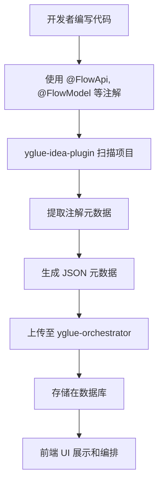
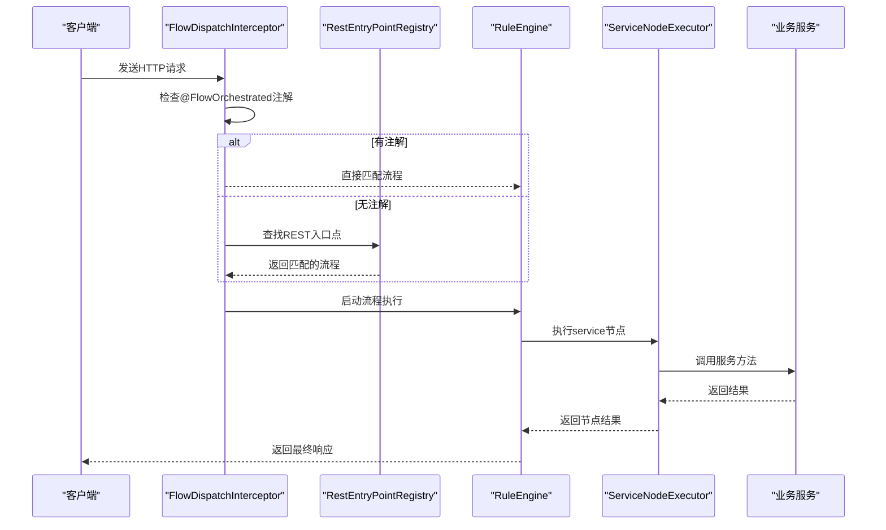

# yglue-annotations 模块文档

<cite>
**本文档引用文件**  
- [FlowApi.java](file://yglue-annotations/src/main/java/org/yglue/flow/annotations/FlowApi.java)
- [FlowModel.java](file://yglue-annotations/src/main/java/org/yglue/flow/annotations/FlowModel.java)
- [FlowOperation.java](file://yglue-annotations/src/main/java/org/yglue/flow/annotations/FlowOperation.java)
- [FlowResolver.java](file://yglue-annotations/src/main/java/org/yglue/flow/annotations/FlowResolver.java)
- [MathService.java](file://samples/yglue-sample-service/src/main/java/org/yglue/flow/sample/api/MathService.java)
- [ExportMetadataAction.java](file://yglue-idea-plugin/src/main/java/org/yglue/flow/idea/ExportMetadataAction.java)
- [CodeSnapshotExporter.java](file://yglue-idea-plugin/src/main/java/org/yglue/flow/idea/snapshot/CodeSnapshotExporter.java)
- [RuleSyncService.java](file://yglue-idea-plugin/src/main/java/org/yglue/flow/idea/sync/RuleSyncService.java)
- [Flow.java](file://yglue-orchestrator/src/main/java/org/yglue/flow/orch/domain/Flow.java)
- [FlowModel.java](file://yglue-orchestrator/src/main/java/org/yglue/flow/orch/domain/FlowModel.java)
- [FlowRuntimeAutoConfiguration.java](file://yglue-runtime-spring-boot3/src/main/java/org/yglue/flow/runtime/spring/FlowRuntimeAutoConfiguration.java)
- [FlowDispatchInterceptor.java](file://yglue-runtime-spring-boot3/src/main/java/org/yglue/flow/runtime/spring/FlowDispatchInterceptor.java)
- [ExpressionParamResolverMetadata.java](file://yglue-runtime/src/main/java/org/yglue/flow/runtime/core/param/resolvers/ExpressionParamResolverMetadata.java)
- [RequestParamResolverMetadata.java](file://yglue-runtime/src/main/java/org/yglue/flow/runtime/core/param/resolvers/RequestParamResolverMetadata.java)
- [ConstantParamResolverMetadata.java](file://yglue-runtime/src/main/java/org/yglue/flow/runtime/core/param/resolvers/ConstantParamResolverMetadata.java)
- [ContextParamResolverMetadata.java](file://yglue-runtime/src/main/java/org/yglue/flow/runtime/core/param/resolvers/ContextParamResolverMetadata.java)
</cite>

## 目录
1. [引言](#引言)
2. [核心注解详解](#核心注解详解)
   1. [@FlowApi 注解](#flowapi-注解)
   2. [@FlowModel 注解](#flowmodel-注解)
   3. [@FlowOperation 注解](#flowoperation-注解)
   4. [@FlowResolver 注解](#flowresolver-注解)
3. [元数据生成与扫描机制](#元数据生成与扫描机制)
4. [运行时解析与应用](#运行时解析与应用)
5. [Maven/Gradle 配置示例](#mavengradle-配置示例)
6. [代码示例](#代码示例)
7. [低代码集成的关键作用](#低代码集成的关键作用)
8. [总结](#总结)

## 引言

`yglue-annotations` 模块是 YGlue 低代码平台的核心组成部分，它通过一系列自定义 Java 注解（如 `@FlowApi`, `@FlowModel`, `@FlowOperation`, `@FlowResolver`）来定义和标记业务服务、数据模型和参数解析器的元数据。这些元数据是实现服务发现、流程编排和动态调用的基础。

该模块的设计理念是将业务能力的“契约”从代码中显式地提取出来，形成机器可读的描述。通过 `yglue-idea-plugin` 插件，这些注解可以被扫描并上传至 `yglue-orchestrator`（编排器），从而在前端可视化界面中展示和编排。在运行时，`yglue-runtime` 会解析这些元数据，实现对服务的动态调用和流程的执行。

本文档将深入解析每个注解的设计目的、使用场景和在整个系统中的流转机制。

## 核心注解详解

### @FlowApi 注解

`@FlowApi` 注解用于标记一个 Java 类，表明该类是一个可供流程编排调用的服务（Service）。它通常应用于被 `@Service` 注解的 Spring Bean 上。

**设计目的**：
- **服务发现**：标识出哪些类是对外暴露的业务服务。
- **元数据定义**：为服务提供一个结构化的描述，包括名称、描述和版本，便于在编排器中展示。

**使用场景**：
当您有一个 Spring Service 类，希望将其功能暴露给低代码流程使用时，应使用 `@FlowApi` 注解。

**属性说明**：
- `value`：服务的 Bean 名称。如果未指定，则使用 `name` 属性的值。此名称用于在 Spring 容器中查找对应的 Bean 实例。
- `name`：服务的显示名称。如果未指定，则使用类名。
- `description`：服务的描述信息。
- `version`：服务的版本号，默认为 "1.0.0"。

**元数据生成机制**：
IDE 插件会扫描所有被 `@FlowApi` 注解的类，并提取其元数据，包括类的全限定名、方法列表等，形成一个服务描述对象。

**Section sources**
- [FlowApi.java](file://yglue-annotations/src/main/java/org/yglue/flow/annotations/FlowApi.java#L1-L33)
- [ExportMetadataAction.java](file://yglue-idea-plugin/src/main/java/org/yglue/flow/idea/ExportMetadataAction.java#L224-L239)

### @FlowModel 注解

`@FlowModel` 注解用于标记一个 Java 类，表明该类是一个可在流程编排中复用的领域模型（Domain Model）。这通常是一个 POJO（Plain Old Java Object）。

**设计目的**：
- **模型复用**：定义在流程中可以传递和操作的数据结构。
- **前端展示**：为编排器提供模型的元数据，以便在 UI 上展示模型的字段和结构。

**使用场景**：
当您有一个数据传输对象（DTO）或实体类，希望在流程的不同节点之间传递时，应使用 `@FlowModel` 注解。

**属性说明**：
- `value`：模型的标识符，默认使用类名。
- `name`：模型的显示名称。
- `description`：模型的描述。
- `category`：模型的分类，可用于前端分组展示。
- `version`：模型的版本，默认为 "1.0.0"。
- `tags`：额外的标签数组。

**元数据生成机制**：
IDE 插件会扫描被 `@FlowModel` 注解的类，并提取其字段信息（如字段名、类型），生成一个包含模型结构的元数据对象。

**Section sources**
- [FlowModel.java](file://yglue-annotations/src/main/java/org/yglue/flow/annotations/FlowModel.java#L1-L48)
- [ExportMetadataAction.java](file://yglue-idea-plugin/src/main/java/org/yglue/flow/idea/ExportMetadataAction.java#L240-L257)

### @FlowOperation 注解

`@FlowOperation` 注解用于标记一个 Java 方法，表明该方法是服务中的一个可调用操作（Operation）。它必须与 `@FlowApi` 注解配合使用。

**设计目的**：
- **操作粒度**：在服务级别下，进一步定义具体可调用的方法。
- **方法描述**：为每个方法提供独立的名称和描述，增强可读性。

**使用场景**：
在被 `@FlowApi` 注解的类中，为每一个希望暴露给流程调用的公共方法添加 `@FlowOperation` 注解。

**属性说明**：
- `name`：操作的名称，必填。
- `description`：操作的描述，默认为空字符串。
- `tags`：操作的标签数组，默认为空。

**元数据生成机制**：
IDE 插件在处理 `@FlowApi` 类时，会遍历其所有公共方法，查找带有 `@FlowOperation` 注解的方法，并提取方法名、参数列表和注解属性，形成操作列表。

**Section sources**
- [FlowOperation.java](file://yglue-annotations/src/main/java/org/yglue/flow/annotations/FlowOperation.java#L1-L12)
- [ExportMetadataAction.java](file://yglue-idea-plugin/src/main/java/org/yglue/flow/idea/ExportMetadataAction.java#L141-L152)

### @FlowResolver 注解

`@FlowResolver` 注解用于标记一个参数解析器类，描述其类型、名称和配置结构。它主要用于定义如何从请求或上下文中提取参数。

**设计目的**：
- **解析器注册**：向系统注册一种新的参数解析方式。
- **配置描述**：通过 `configSchema` 属性，使用 JSON Schema 描述该解析器所需的配置项，使前端能够动态生成配置表单。

**使用场景**：
当您需要实现自定义的参数解析逻辑（如从特定消息队列、文件系统或自定义协议中提取数据）时，应创建一个解析器类并使用 `@FlowResolver` 注解。

**属性说明**：
- `value`：解析器类型的唯一标识，如 "REQUEST", "CONTEXT", "EXPRESSION"。
- `name`：解析器的显示名称。
- `description`：解析器的描述。
- `category`：解析器的分组/类别，如 "HTTP", "上下文"。
- `configSchema`：配置的 JSON Schema，描述前端所需的配置项。
- `builtin`：是否为平台内置解析器。

**元数据生成机制**：
IDE 插件会扫描所有被 `@FlowResolver` 注解的类，并将其元数据（包括 `configSchema`）上传至编排器，使前端能够识别并配置这些解析器。

**Section sources**
- [FlowResolver.java](file://yglue-annotations/src/main/java/org/yglue/flow/annotations/FlowResolver.java#L1-L53)
- [ExportMetadataAction.java](file://yglue-idea-plugin/src/main/java/org/yglue/flow/idea/ExportMetadataAction.java#L309-L328)

## 元数据生成与扫描机制

`yglue-annotations` 模块的元数据并非在编译时或运行时由 `yglue-runtime` 直接读取，而是通过 `yglue-idea-plugin` 插件在开发阶段进行扫描和导出。

**工作流程**：
1.  **开发阶段**：开发者在代码中使用 `@FlowApi`, `@FlowModel` 等注解。
2.  **扫描与导出**：`yglue-idea-plugin` 提供了 `ExportMetadataAction` 功能。当开发者触发此操作时，插件会：
    - 使用 IntelliJ IDEA 的 PSI（Program Structure Interface）API 扫描项目中的所有 Java 文件。
    - 查找带有特定注解（如 `@FlowApi`, `@FlowModel`）的类和方法。
    - 提取类名、方法名、参数、注解属性等信息。
    - 将这些信息结构化为 JSON 格式的元数据。
3.  **上传至编排器**：导出的元数据可以通过 `UploadMetadataAction` 上传到 `yglue-orchestrator`。此外，插件还支持自动上传和同步（`MetadataAutoUploadScheduler`）。
4.  **编排器存储**：`yglue-orchestrator` 接收元数据后，将其存储在数据库中（如 `yglue_flow_model` 表），供前端 UI 查询和展示。



**Diagram sources**
- [ExportMetadataAction.java](file://yglue-idea-plugin/src/main/java/org/yglue/flow/idea/ExportMetadataAction.java)
- [CodeSnapshotExporter.java](file://yglue-idea-plugin/src/main/java/org/yglue/flow/idea/snapshot/CodeSnapshotExporter.java)
- [FlowModel.java](file://yglue-orchestrator/src/main/java/org/yglue/flow/orch/domain/FlowModel.java)

## 运行时解析与应用

在应用运行时，`yglue-runtime` 模块负责解析和应用这些元数据，实现流程的执行。

**核心组件**：
- **RuleEngine**：流程规则引擎，负责加载和执行流程定义。
- **FlowDispatchInterceptor**：Spring MVC 拦截器，负责拦截 HTTP 请求，匹配到对应的流程或服务。
- **NodeExecutorRegistry**：节点执行器注册表，根据流程定义中的节点类型调用相应的执行器。

**工作流程**：
1.  **请求拦截**：当一个 HTTP 请求到达时，`FlowDispatchInterceptor` 会拦截该请求。
2.  **匹配流程**：拦截器首先检查请求的处理器（Handler）上是否有 `@FlowOrchestrated` 注解。如果有，则直接匹配到对应的流程。如果没有，则通过 `RestEntryPointRegistry` 在已注册的入口点中查找匹配的 REST 路径。
3.  **执行流程**：一旦匹配成功，`RuleEngine` 会根据流程定义（从编排器加载）执行一系列节点。
4.  **调用服务**：当流程执行到一个 `service` 节点时，`ServiceNodeExecutor` 会根据节点配置的服务名和操作名，从 Spring 容器中获取对应的 Bean（通过 `@FlowApi` 的 `value` 或 `name` 定位），并调用其方法。
5.  **参数解析**：在调用服务方法前，`ParamResolver` 会根据流程中配置的 `ResolveInstruction`（包含 `@FlowResolver` 定义的解析器类型），从请求或上下文中提取参数值。



**Diagram sources**
- [FlowDispatchInterceptor.java](file://yglue-runtime-spring-boot3/src/main/java/org/yglue/flow/runtime/spring/FlowDispatchInterceptor.java)
- [FlowRuntimeAutoConfiguration.java](file://yglue-runtime-spring-boot3/src/main/java/org/yglue/flow/runtime/spring/FlowRuntimeAutoConfiguration.java)
- [ServiceNodeExecutor.java](file://yglue-runtime/src/main/java/org/yglue/flow/runtime/core/executors/ServiceNodeExecutor.java)

## Maven/Gradle 配置示例

要在 Spring Boot 项目中使用 `yglue-annotations` 模块，您需要在项目的构建配置文件中添加相应的依赖。

### Maven 配置 (pom.xml)

```xml
<dependencies>
    <!-- yglue-annotations 核心模块 -->
    <dependency>
        <groupId>org.yg</groupId>
        <artifactId>yglue-annotations</artifactId>
        <version>0.1.0-SNAPSHOT</version>
    </dependency>
    
    <!-- yglue-runtime 运行时模块 -->
    <dependency>
        <groupId>org.yg</groupId>
        <artifactId>yglue-runtime</artifactId>
        <version>0.1.0-SNAPSHOT</version>
    </dependency>
    
    <!-- 根据您的Spring Boot版本选择 -->
    <!-- Spring Boot 2.x -->
    <dependency>
        <groupId>org.yg</groupId>
        <artifactId>yglue-runtime-spring-boot2</artifactId>
        <version>0.1.0-SNAPSHOT</version>
    </dependency>
    
    <!-- 或者 Spring Boot 3.x -->
    <dependency>
        <groupId>org.yg</groupId>
        <artifactId>yglue-runtime-spring-boot3</artifactId>
        <version>0.1.0-SNAPSHOT</version>
    </dependency>
</dependencies>
```

### Gradle 配置 (build.gradle.kts)

```kotlin
dependencies {
    // yglue-annotations 核心模块
    implementation("org.yg:yglue-annotations:0.1.0-SNAPSHOT")
    
    // yglue-runtime 运行时模块
    implementation("org.yg:yglue-runtime:0.1.0-SNAPSHOT")
    
    // 根据您的Spring Boot版本选择
    // Spring Boot 2.x
    implementation("org.yg:yglue-runtime-spring-boot2:0.1.0-SNAPSHOT")
    
    // 或者 Spring Boot 3.x
    implementation("org.yg:yglue-runtime-spring-boot3:0.1.0-SNAPSHOT")
}
```

**Section sources**
- [pom.xml](file://pom.xml#L1-L94)
- [build.gradle.kts](file://yglue-annotations/build.gradle.kts)

## 代码示例

以下是一个使用 `yglue-annotations` 模块的完整代码示例。

### 1. 定义一个 Flow API 服务

```java
package org.yglue.flow.sample.api;

import org.yglue.flow.annotations.FlowApi;
import org.yglue.flow.annotations.FlowOperation;
import org.springframework.stereotype.Service;

@FlowApi(name = "MathService", description = "常见数学能力：加/减/乘/除")
@Service
public class MathService {

    @FlowOperation(name = "add", description = "两数相加")
    public int add(int a, int b) { return a + b; }

    @FlowOperation(name = "sub", description = "两数相减")
    public int sub(int a, int b) { return a - b; }

    @FlowOperation(name = "mul", description = "两数相乘")
    public int mul(int a, int b) { return a * b; }

    @FlowOperation(name = "div", description = "两数相除（整数除法）")
    public int div(int a, int b) { return a / b; }
}
```

在这个示例中：
- `@FlowApi` 注解将 `MathService` 类标记为一个可编排的服务。
- `@Service` 注解确保它是一个 Spring Bean。
- 四个公共方法都使用了 `@FlowOperation` 注解，使其成为可调用的操作。

**Section sources**
- [MathService.java](file://samples/yglue-sample-service/src/main/java/org/yglue/flow/sample/api/MathService.java#L1-L23)

### 2. 内置解析器示例

`yglue-runtime` 模块定义了多个内置的解析器元数据类，它们使用 `@FlowResolver` 注解：

```java
// 请求参数解析器
@FlowResolver(
    value = "REQUEST",
    name = "请求参数",
    description = "从 HTTP 请求体、路径、查询、Header、Form 等位置提取字段",
    category = "HTTP",
    builtin = true
)
public final class RequestParamResolverMetadata { ... }

// 表达式解析器
@FlowResolver(
    value = "EXPRESSION",
    name = "表达式",
    description = "通过 SpEL / Groovy 表达式组合请求与上下文数据",
    category = "表达式",
    builtin = true
)
public final class ExpressionParamResolverMetadata { ... }
```

这些类本身不包含业务逻辑，仅用于暴露注解元数据，便于 IDE 插件识别和扫描。

**Section sources**
- [RequestParamResolverMetadata.java](file://yglue-runtime/src/main/java/org/yglue/flow/runtime/core/param/resolvers/RequestParamResolverMetadata.java)
- [ExpressionParamResolverMetadata.java](file://yglue-runtime/src/main/java/org/yglue/flow/runtime/core/param/resolvers/ExpressionParamResolverMetadata.java)

## 低代码集成的关键作用

`yglue-annotations` 模块是实现低代码集成的关键桥梁，其作用体现在以下几个方面：

1.  **无侵入式契约定义**：开发者只需在现有代码上添加注解，无需改变业务逻辑，即可将服务暴露给低代码平台。这极大地降低了集成成本。
2.  **元数据驱动**：通过注解生成的元数据，编排器可以动态地了解系统中有哪些服务、模型和操作可用，从而实现“所见即所得”的流程设计。
3.  **动态调用**：运行时通过元数据中的服务名和操作名，可以动态地反射调用对应的方法，实现了流程的灵活性和可配置性。
4.  **统一配置**：`@FlowResolver` 的 `configSchema` 属性使得前端可以为不同的解析器动态生成配置表单，无需为每种解析器硬编码 UI。
5.  **生态整合**：与 `yglue-idea-plugin` 和 `yglue-orchestrator` 紧密配合，形成了从开发、扫描、上传到执行的完整闭环，是整个 YGlue 平台的核心。

## 总结

`yglue-annotations` 模块通过精心设计的注解系统，为 YGlue 低代码平台提供了强大的元数据定义能力。它将代码中的业务能力转化为结构化的描述，使得服务、模型和参数解析器可以被 IDE 插件扫描、被编排器管理、被运行时引擎执行。这种基于注解的元数据驱动架构，是实现高效、灵活的低代码集成的关键所在。