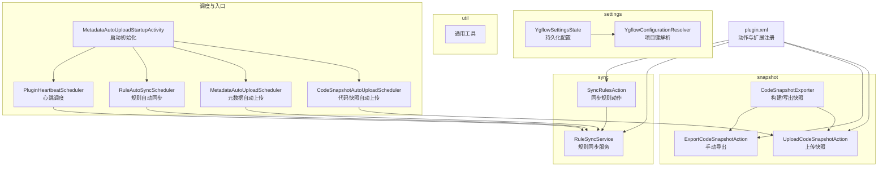
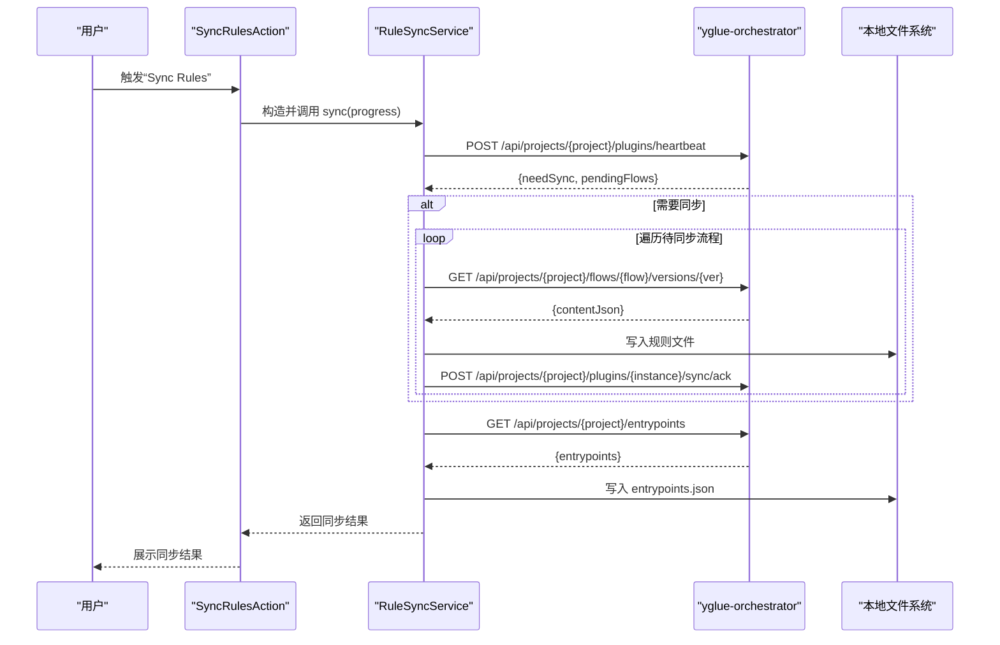
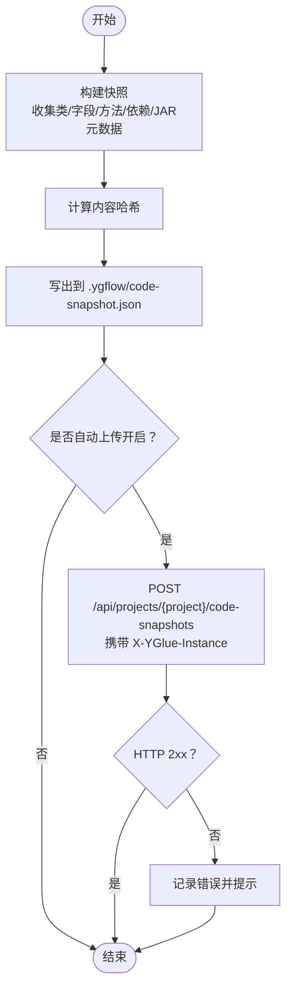
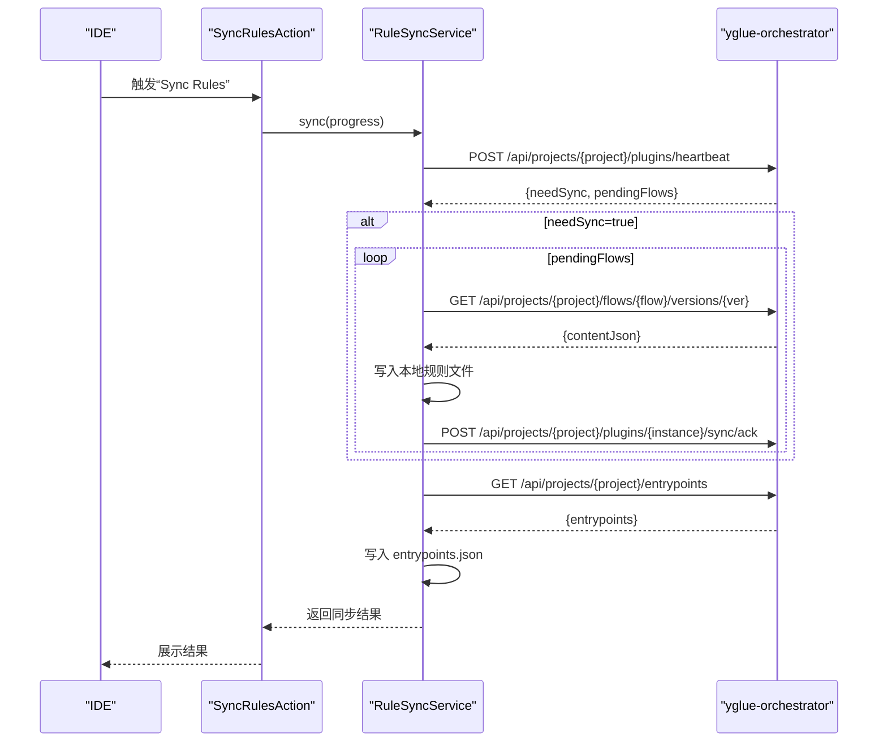
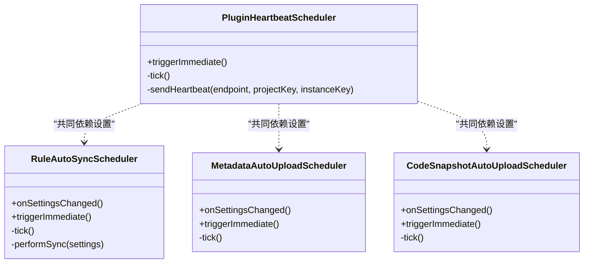
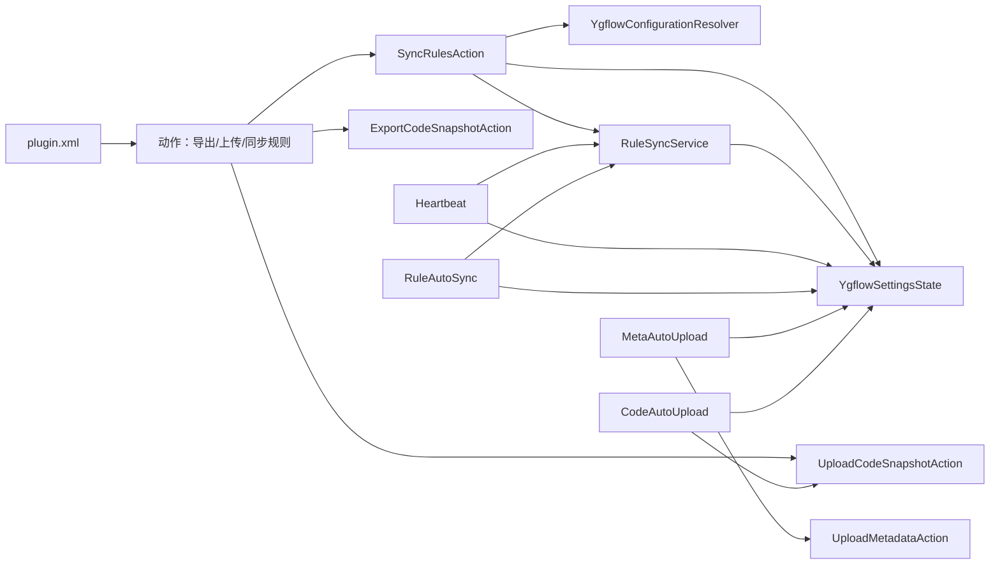

# yglue-idea-plugin 模块文档

<cite>
**本文引用的文件**
- [YgflowSettingsState.java](file://yglue-idea-plugin/src/main/java/org/yglue/flow/idea/settings/YgflowSettingsState.java)
- [YgflowConfigurationResolver.java](file://yglue-idea-plugin/src/main/java/org/yglue/flow/idea/util/YgflowConfigurationResolver.java)
- [CodeSnapshotExporter.java](file://yglue-idea-plugin/src/main/java/org/yglue/flow/idea/snapshot/CodeSnapshotExporter.java)
- [ExportCodeSnapshotAction.java](file://yglue-idea-plugin/src/main/java/org/yglue/flow/idea/snapshot/ExportCodeSnapshotAction.java)
- [UploadCodeSnapshotAction.java](file://yglue-idea-plugin/src/main/java/org/yglue/flow/idea/snapshot/UploadCodeSnapshotAction.java)
- [SyncRulesAction.java](file://yglue-idea-plugin/src/main/java/org/yglue/flow/idea/sync/SyncRulesAction.java)
- [RuleSyncService.java](file://yglue-idea-plugin/src/main/java/org/yglue/flow/idea/sync/RuleSyncService.java)
- [PluginHeartbeatScheduler.java](file://yglue-idea-plugin/src/main/java/org/yglue/flow/idea/PluginHeartbeatScheduler.java)
- [RuleAutoSyncScheduler.java](file://yglue-idea-plugin/src/main/java/org/yglue/flow/idea/RuleAutoSyncScheduler.java)
- [MetadataAutoUploadScheduler.java](file://yglue-idea-plugin/src/main/java/org/yglue/flow/idea/MetadataAutoUploadScheduler.java)
- [CodeSnapshotAutoUploadScheduler.java](file://yglue-idea-plugin/src/main/java/org/yglue/flow/idea/CodeSnapshotAutoUploadScheduler.java)
- [MetadataAutoUploadStartupActivity.java](file://yglue-idea-plugin/src/main/java/org/yglue/flow/idea/MetadataAutoUploadStartupActivity.java)
- [plugin.xml](file://yglue-idea-plugin/src/main/resources/META-INF/plugin.xml)
</cite>

## 目录
1. [简介](#简介)
2. [项目结构](#项目结构)
3. [核心组件](#核心组件)
4. [架构总览](#架构总览)
5. [详细组件分析](#详细组件分析)
6. [依赖关系分析](#依赖关系分析)
7. [性能与可靠性考量](#性能与可靠性考量)
8. [故障排查指南](#故障排查指南)
9. [结论](#结论)
10. [附录：安装与使用指南](#附录安装与使用指南)

## 简介
本文件面向 yglue-idea-plugin 插件使用者与维护者，系统性阐述该插件在 IntelliJ IDEA 中的功能与实现，重点覆盖以下方面：
- 配置机制：YgflowSettingsState 的持久化与默认值管理
- 代码快照：CodeSnapshotExporter 的自动导出与上传流程
- 元数据扫描与同步：SyncRulesAction 与 RuleSyncService 的交互
- 与 yglue-orchestrator 服务的通信：心跳、规则同步、元数据上传、代码快照上传
- 后台任务调度：PluginHeartbeatScheduler、RuleAutoSyncScheduler、MetadataAutoUploadScheduler、CodeSnapshotAutoUploadScheduler
- 安装、配置与使用：如何设置服务器地址、项目密钥等连接参数

## 项目结构
yglue-idea-plugin 模块位于 yglue-idea-plugin 目录，主要由以下层次构成：
- settings：插件配置状态与解析工具
- snapshot：代码快照导出与上传
- sync：规则同步动作与服务
- util：通用工具类（配置解析）
- 根级：后台调度器、启动活动、动作入口

图表来源
- [YgflowSettingsState.java](file://yglue-idea-plugin/src/main/java/org/yglue/flow/idea/settings/YgflowSettingsState.java#L1-L127)
- [YgflowConfigurationResolver.java](file://yglue-idea-plugin/src/main/java/org/yglue/flow/idea/util/YgflowConfigurationResolver.java#L1-L274)
- [CodeSnapshotExporter.java](file://yglue-idea-plugin/src/main/java/org/yglue/flow/idea/snapshot/CodeSnapshotExporter.java#L1-L440)
- [ExportCodeSnapshotAction.java](file://yglue-idea-plugin/src/main/java/org/yglue/flow/idea/snapshot/ExportCodeSnapshotAction.java#L1-L37)
- [UploadCodeSnapshotAction.java](file://yglue-idea-plugin/src/main/java/org/yglue/flow/idea/snapshot/UploadCodeSnapshotAction.java#L1-L131)
- [SyncRulesAction.java](file://yglue-idea-plugin/src/main/java/org/yglue/flow/idea/sync/SyncRulesAction.java#L1-L152)
- [RuleSyncService.java](file://yglue-idea-plugin/src/main/java/org/yglue/flow/idea/sync/RuleSyncService.java#L1-L499)
- [PluginHeartbeatScheduler.java](file://yglue-idea-plugin/src/main/java/org/yglue/flow/idea/PluginHeartbeatScheduler.java#L1-L213)
- [RuleAutoSyncScheduler.java](file://yglue-idea-plugin/src/main/java/org/yglue/flow/idea/RuleAutoSyncScheduler.java#L1-L251)
- [MetadataAutoUploadScheduler.java](file://yglue-idea-plugin/src/main/java/org/yglue/flow/idea/MetadataAutoUploadScheduler.java#L1-L111)
- [CodeSnapshotAutoUploadScheduler.java](file://yglue-idea-plugin/src/main/java/org/yglue/flow/idea/CodeSnapshotAutoUploadScheduler.java#L1-L73)
- [MetadataAutoUploadStartupActivity.java](file://yglue-idea-plugin/src/main/java/org/yglue/flow/idea/MetadataAutoUploadStartupActivity.java#L1-L60)
- [plugin.xml](file://yglue-idea-plugin/src/main/resources/META-INF/plugin.xml#L1-L46)

章节来源
- [plugin.xml](file://yglue-idea-plugin/src/main/resources/META-INF/plugin.xml#L1-L46)

## 核心组件
- 配置中心：YgflowSettingsState 提供插件的持久化配置，包含服务器地址、项目密钥、实例密钥、规则目录、自动上传/心跳/规则同步/代码快照上传开关与周期等。
- 配置解析：YgflowConfigurationResolver 支持从系统属性/环境变量/持久化设置/项目推断/用户输入解析项目键。
- 规则同步：SyncRulesAction 触发同步；RuleSyncService 与 orchestrator 交互，完成心跳、拉取待同步规则、确认同步、下载入口点配置。
- 快照导出与上传：CodeSnapshotExporter 构建快照；ExportCodeSnapshotAction 手动导出；UploadCodeSnapshotAction 上传至 orchestrator。
- 后台调度：PluginHeartbeatScheduler、RuleAutoSyncScheduler、MetadataAutoUploadScheduler、CodeSnapshotAutoUploadScheduler 分别负责心跳、规则自动同步、元数据自动上传、代码快照自动上传。
- 启动初始化：MetadataAutoUploadStartupActivity 在项目启动时初始化各调度器与监听器。

章节来源
- [YgflowSettingsState.java](file://yglue-idea-plugin/src/main/java/org/yglue/flow/idea/settings/YgflowSettingsState.java#L1-L127)
- [YgflowConfigurationResolver.java](file://yglue-idea-plugin/src/main/java/org/yglue/flow/idea/util/YgflowConfigurationResolver.java#L1-L274)
- [SyncRulesAction.java](file://yglue-idea-plugin/src/main/java/org/yglue/flow/idea/sync/SyncRulesAction.java#L1-L152)
- [RuleSyncService.java](file://yglue-idea-plugin/src/main/java/org/yglue/flow/idea/sync/RuleSyncService.java#L1-L499)
- [CodeSnapshotExporter.java](file://yglue-idea-plugin/src/main/java/org/yglue/flow/idea/snapshot/CodeSnapshotExporter.java#L1-L440)
- [ExportCodeSnapshotAction.java](file://yglue-idea-plugin/src/main/java/org/yglue/flow/idea/snapshot/ExportCodeSnapshotAction.java#L1-L37)
- [UploadCodeSnapshotAction.java](file://yglue-idea-plugin/src/main/java/org/yglue/flow/idea/snapshot/UploadCodeSnapshotAction.java#L1-L131)
- [PluginHeartbeatScheduler.java](file://yglue-idea-plugin/src/main/java/org/yglue/flow/idea/PluginHeartbeatScheduler.java#L1-L213)
- [RuleAutoSyncScheduler.java](file://yglue-idea-plugin/src/main/java/org/yglue/flow/idea/RuleAutoSyncScheduler.java#L1-L251)
- [MetadataAutoUploadScheduler.java](file://yglue-idea-plugin/src/main/java/org/yglue/flow/idea/MetadataAutoUploadScheduler.java#L1-L111)
- [CodeSnapshotAutoUploadScheduler.java](file://yglue-idea-plugin/src/main/java/org/yglue/flow/idea/CodeSnapshotAutoUploadScheduler.java#L1-L73)
- [MetadataAutoUploadStartupActivity.java](file://yglue-idea-plugin/src/main/java/org/yglue/flow/idea/MetadataAutoUploadStartupActivity.java#L1-L60)

## 架构总览
插件通过“动作入口 + 后台调度器 + 服务层”的方式与 yglue-orchestrator 交互：
- 动作入口：菜单“Yglue”组下的导出/上传/同步规则等动作
- 后台调度器：定时心跳、规则自动同步、元数据自动上传、代码快照自动上传
- 服务层：RuleSyncService 统一处理与 orchestrator 的 HTTP 通信（心跳、拉取规则、确认、下载入口点）

图表来源
- [SyncRulesAction.java](file://yglue-idea-plugin/src/main/java/org/yglue/flow/idea/sync/SyncRulesAction.java#L1-L152)
- [RuleSyncService.java](file://yglue-idea-plugin/src/main/java/org/yglue/flow/idea/sync/RuleSyncService.java#L1-L499)

## 详细组件分析

### 配置机制：YgflowSettingsState
- 职责：提供插件持久化配置，包含服务器地址、项目密钥、实例密钥、规则目录、自动上传/心跳/规则同步/代码快照上传开关与周期等。
- 关键点：
  - 默认值与校验：对关键配置进行默认值与正数校验，保证运行安全
  - 实例密钥保障：若为空则自动生成 UUID
  - 可配置性：isConfigured 用于判断是否具备完整连接参数

章节来源
- [YgflowSettingsState.java](file://yglue-idea-plugin/src/main/java/org/yglue/flow/idea/settings/YgflowSettingsState.java#L1-L127)

### 配置解析：YgflowConfigurationResolver
- 职责：解析项目键，支持多来源优先级（系统属性/环境变量/持久化设置/项目推断/用户输入），并在必要时提示用户输入或保存设置。
- 关键点：
  - 推断策略：优先使用项目根目录名，否则回退到项目名
  - 交互式输入：当解析失败且允许提示时，弹窗让用户选择目录或直接输入

章节来源
- [YgflowConfigurationResolver.java](file://yglue-idea-plugin/src/main/java/org/yglue/flow/idea/util/YgflowConfigurationResolver.java#L1-L274)

### 代码快照：CodeSnapshotExporter、ExportCodeSnapshotAction、UploadCodeSnapshotAction
- CodeSnapshotExporter：
  - 构建快照：收集项目 Java 类（公共类/方法/字段）、依赖 JAR 信息、可选的 JAR 元数据（仅对勾选坐标）
  - 写出快照：输出到项目根目录下的 .ygflow/code-snapshot.json
  - 哈希校验：对快照内容计算 SHA-256，便于服务端去重与一致性校验
- ExportCodeSnapshotAction：手动导出快照
- UploadCodeSnapshotAction：上传快照到 orchestrator 的 /api/projects/{project}/code-snapshots 接口，携带 X-YGlue-Instance 头

图表来源
- [CodeSnapshotExporter.java](file://yglue-idea-plugin/src/main/java/org/yglue/flow/idea/snapshot/CodeSnapshotExporter.java#L1-L440)
- [ExportCodeSnapshotAction.java](file://yglue-idea-plugin/src/main/java/org/yglue/flow/idea/snapshot/ExportCodeSnapshotAction.java#L1-L37)
- [UploadCodeSnapshotAction.java](file://yglue-idea-plugin/src/main/java/org/yglue/flow/idea/snapshot/UploadCodeSnapshotAction.java#L1-L131)

章节来源
- [CodeSnapshotExporter.java](file://yglue-idea-plugin/src/main/java/org/yglue/flow/idea/snapshot/CodeSnapshotExporter.java#L1-L440)
- [ExportCodeSnapshotAction.java](file://yglue-idea-plugin/src/main/java/org/yglue/flow/idea/snapshot/ExportCodeSnapshotAction.java#L1-L37)
- [UploadCodeSnapshotAction.java](file://yglue-idea-plugin/src/main/java/org/yglue/flow/idea/snapshot/UploadCodeSnapshotAction.java#L1-L131)

### 规则同步：SyncRulesAction 与 RuleSyncService
- SyncRulesAction：
  - 校验项目根路径与设置可用性
  - 解析项目键（必要时引导用户配置）
  - 解析规则目录（相对路径解析为绝对路径）
  - 后台进度任务执行 RuleSyncService.sync
- RuleSyncService：
  - 发送心跳获取 needSync/pendingFlows
  - 下载待同步流程内容并写入本地规则文件，随后发送 ACK
  - 自动检查缺失的本地文件并按发布版本或最新版本补全
  - 下载入口点配置 entrypoints.json

图表来源
- [SyncRulesAction.java](file://yglue-idea-plugin/src/main/java/org/yglue/flow/idea/sync/SyncRulesAction.java#L1-L152)
- [RuleSyncService.java](file://yglue-idea-plugin/src/main/java/org/yglue/flow/idea/sync/RuleSyncService.java#L1-L499)

章节来源
- [SyncRulesAction.java](file://yglue-idea-plugin/src/main/java/org/yglue/flow/idea/sync/SyncRulesAction.java#L1-L152)
- [RuleSyncService.java](file://yglue-idea-plugin/src/main/java/org/yglue/flow/idea/sync/RuleSyncService.java#L1-L499)

### 后台任务调度：心跳、规则同步、元数据上传、代码快照上传
- PluginHeartbeatScheduler：
  - 定时心跳：固定周期检查是否需要发送心跳，携带 IDE 信息与实例键
  - 触发机制：支持立即触发，便于启动后快速上线
- RuleAutoSyncScheduler：
  - 自动同步：根据配置周期检查并执行同步，避免并发重复执行
  - 设置变更：onSettingsChanged 会重置计时并立即触发
- MetadataAutoUploadScheduler：
  - 自动上传元数据：按周期检查并调用 UploadMetadataAction.upload
  - 立即触发：triggerImmediate 支持即时上传
- CodeSnapshotAutoUploadScheduler：
  - 自动上传代码快照：按周期检查并调用 UploadCodeSnapshotAction.upload
  - 立即触发：triggerImmediate 支持即时上传

图表来源
- [PluginHeartbeatScheduler.java](file://yglue-idea-plugin/src/main/java/org/yglue/flow/idea/PluginHeartbeatScheduler.java#L1-L213)
- [RuleAutoSyncScheduler.java](file://yglue-idea-plugin/src/main/java/org/yglue/flow/idea/RuleAutoSyncScheduler.java#L1-L251)
- [MetadataAutoUploadScheduler.java](file://yglue-idea-plugin/src/main/java/org/yglue/flow/idea/MetadataAutoUploadScheduler.java#L1-L111)
- [CodeSnapshotAutoUploadScheduler.java](file://yglue-idea-plugin/src/main/java/org/yglue/flow/idea/CodeSnapshotAutoUploadScheduler.java#L1-L73)

章节来源
- [PluginHeartbeatScheduler.java](file://yglue-idea-plugin/src/main/java/org/yglue/flow/idea/PluginHeartbeatScheduler.java#L1-L213)
- [RuleAutoSyncScheduler.java](file://yglue-idea-plugin/src/main/java/org/yglue/flow/idea/RuleAutoSyncScheduler.java#L1-L251)
- [MetadataAutoUploadScheduler.java](file://yglue-idea-plugin/src/main/java/org/yglue/flow/idea/MetadataAutoUploadScheduler.java#L1-L111)
- [CodeSnapshotAutoUploadScheduler.java](file://yglue-idea-plugin/src/main/java/org/yglue/flow/idea/CodeSnapshotAutoUploadScheduler.java#L1-L73)

### 启动初始化：MetadataAutoUploadStartupActivity
- 在项目启动时初始化四大调度器与监听器，确保插件上线后能尽快执行心跳与自动上传/同步
- 触发顺序：元数据自动上传调度器 → 代码快照自动上传调度器 → 心跳调度器 → 规则自动同步调度器 → 文件变化监听器

章节来源
- [MetadataAutoUploadStartupActivity.java](file://yglue-idea-plugin/src/main/java/org/yglue/flow/idea/MetadataAutoUploadStartupActivity.java#L1-L60)

## 依赖关系分析
- 动作与扩展注册：plugin.xml 将“Yglue”菜单组、导出/上传/同步规则动作注册到 IDE
- 组件耦合：
  - SyncRulesAction 依赖 YgflowSettingsState 与 YgflowConfigurationResolver
  - RuleSyncService 依赖 YgflowSettingsState 并与 orchestrator 交互
  - 各调度器依赖 YgflowSettingsState 与项目服务生命周期
  - 上传动作依赖 CodeSnapshotExporter 或 UploadMetadataAction

图表来源
- [plugin.xml](file://yglue-idea-plugin/src/main/resources/META-INF/plugin.xml#L1-L46)
- [SyncRulesAction.java](file://yglue-idea-plugin/src/main/java/org/yglue/flow/idea/sync/SyncRulesAction.java#L1-L152)
- [RuleSyncService.java](file://yglue-idea-plugin/src/main/java/org/yglue/flow/idea/sync/RuleSyncService.java#L1-L499)
- [YgflowSettingsState.java](file://yglue-idea-plugin/src/main/java/org/yglue/flow/idea/settings/YgflowSettingsState.java#L1-L127)
- [YgflowConfigurationResolver.java](file://yglue-idea-plugin/src/main/java/org/yglue/flow/idea/util/YgflowConfigurationResolver.java#L1-L274)
- [PluginHeartbeatScheduler.java](file://yglue-idea-plugin/src/main/java/org/yglue/flow/idea/PluginHeartbeatScheduler.java#L1-L213)
- [RuleAutoSyncScheduler.java](file://yglue-idea-plugin/src/main/java/org/yglue/flow/idea/RuleAutoSyncScheduler.java#L1-L251)
- [MetadataAutoUploadScheduler.java](file://yglue-idea-plugin/src/main/java/org/yglue/flow/idea/MetadataAutoUploadScheduler.java#L1-L111)
- [CodeSnapshotAutoUploadScheduler.java](file://yglue-idea-plugin/src/main/java/org/yglue/flow/idea/CodeSnapshotAutoUploadScheduler.java#L1-L73)

## 性能与可靠性考量
- 线程模型：调度器使用 AppExecutorUtil 的计划线程池，避免阻塞 UI 线程
- 并发控制：RuleAutoSyncScheduler 使用原子布尔位避免并发重复执行
- 超时与重试：HTTP 请求设置合理超时；失败时记录日志并跳过，不影响后续周期
- 周期优化：心跳与规则自动同步采用较短检查周期（开发友好），同时尊重配置最小间隔
- 哈希校验：快照内容与 JAR 元数据均计算哈希，有助于服务端去重与一致性校验

[本节为通用指导，无需列出具体文件来源]

## 故障排查指南
- 无法连接 orchestrator
  - 检查设置中的 baseUrl 与 projectKey 是否正确
  - 若未配置，插件会提示用户在设置中配置
- 规则同步失败
  - 查看同步结果对话框中的错误信息
  - 确认 orchestrator 的 /api/projects/{project}/plugins/heartbeat 接口可达
  - 检查网络代理与防火墙
- 快照上传失败
  - 确认已导出快照并位于 .ygflow/code-snapshot.json
  - 检查 HTTP 状态码与响应体
  - 确认 X-YGlue-Instance 头与项目键一致
- 自动上传/同步未生效
  - 检查对应开关与周期设置
  - 在设置变更后，调度器会立即触发一次，确认日志输出
- 启动后未及时心跳
  - 通过“立即触发心跳”或重启 IDE 后观察日志

章节来源
- [UploadCodeSnapshotAction.java](file://yglue-idea-plugin/src/main/java/org/yglue/flow/idea/snapshot/UploadCodeSnapshotAction.java#L1-L131)
- [SyncRulesAction.java](file://yglue-idea-plugin/src/main/java/org/yglue/flow/idea/sync/SyncRulesAction.java#L1-L152)
- [PluginHeartbeatScheduler.java](file://yglue-idea-plugin/src/main/java/org/yglue/flow/idea/PluginHeartbeatScheduler.java#L1-L213)
- [MetadataAutoUploadScheduler.java](file://yglue-idea-plugin/src/main/java/org/yglue/flow/idea/MetadataAutoUploadScheduler.java#L1-L111)
- [CodeSnapshotAutoUploadScheduler.java](file://yglue-idea-plugin/src/main/java/org/yglue/flow/idea/CodeSnapshotAutoUploadScheduler.java#L1-L73)

## 结论
yglue-idea-plugin 通过完善的配置解析、健壮的后台调度与清晰的动作入口，实现了与 yglue-orchestrator 的高效协作。其设计强调：
- 易用性：自动解析项目键、默认值与提示引导
- 可靠性：严格的超时与错误处理、并发控制与日志记录
- 可扩展性：模块化组件与清晰的职责边界，便于后续功能扩展

[本节为总结性内容，无需列出具体文件来源]

## 附录：安装与使用指南
- 安装
  - 在 IntelliJ IDEA 中安装插件（通过本地插件包或 Marketplace）
- 配置
  - 打开“Settings/Preferences” → “Tools” → “yglue”，设置以下参数：
    - 服务器地址（baseUrl）
    - 项目密钥（projectKey）
    - 规则目录（rulesDir，默认 .ygflow/rules）
    - 自动上传开关与周期（autoUploadEnabled/autoUploadIntervalSeconds）
    - 心跳周期（heartbeatIntervalSeconds）
    - 规则自动同步开关与周期（autoRuleSyncEnabled/autoRuleSyncIntervalSeconds）
    - 代码快照自动上传开关与周期（codeSnapshotAutoUploadEnabled/codeSnapshotUploadIntervalSeconds）
    - 可选：JAR 上传开关与勾选的坐标集合（jarUploadEnabled/selectedJarCoordinates）
- 使用
  - 在“Tools”菜单中找到“Yglue”组：
    - 导出元数据：Export Metadata
    - 上传元数据：Upload Metadata
    - 导出代码快照：Export Code Snapshot
    - 上传代码快照：Upload Code Snapshot
    - 同步规则：Sync Rules
  - 启动后插件会自动初始化心跳与自动上传/同步任务

章节来源
- [plugin.xml](file://yglue-idea-plugin/src/main/resources/META-INF/plugin.xml#L1-L46)
- [YgflowSettingsState.java](file://yglue-idea-plugin/src/main/java/org/yglue/flow/idea/settings/YgflowSettingsState.java#L1-L127)
- [YgflowConfigurationResolver.java](file://yglue-idea-plugin/src/main/java/org/yglue/flow/idea/util/YgflowConfigurationResolver.java#L1-L274)
- [ExportCodeSnapshotAction.java](file://yglue-idea-plugin/src/main/java/org/yglue/flow/idea/snapshot/ExportCodeSnapshotAction.java#L1-L37)
- [UploadCodeSnapshotAction.java](file://yglue-idea-plugin/src/main/java/org/yglue/flow/idea/snapshot/UploadCodeSnapshotAction.java#L1-L131)
- [SyncRulesAction.java](file://yglue-idea-plugin/src/main/java/org/yglue/flow/idea/sync/SyncRulesAction.java#L1-L152)