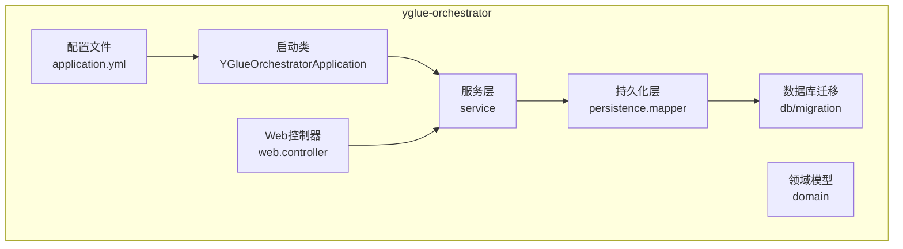
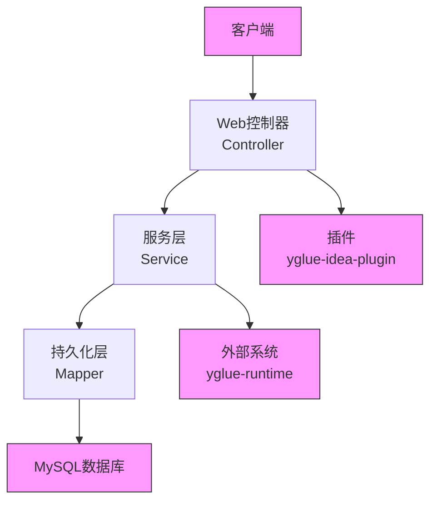
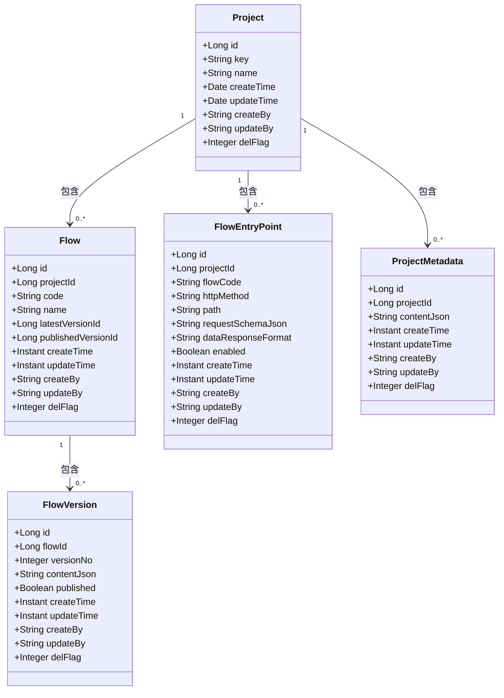
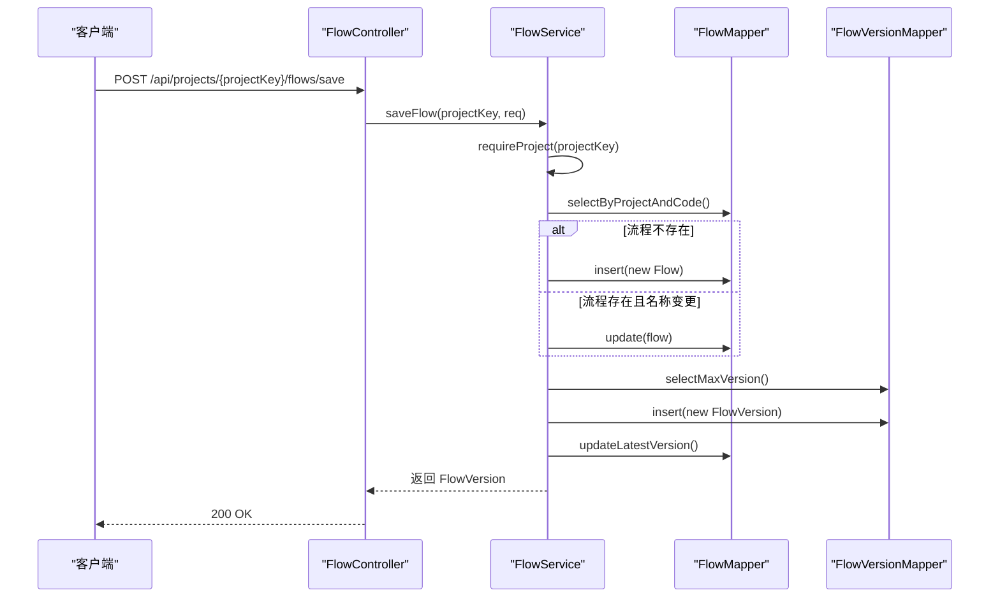
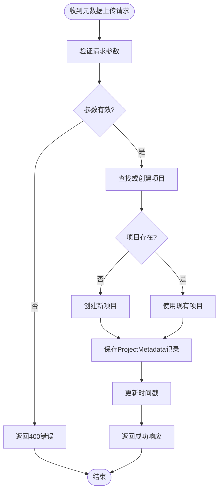
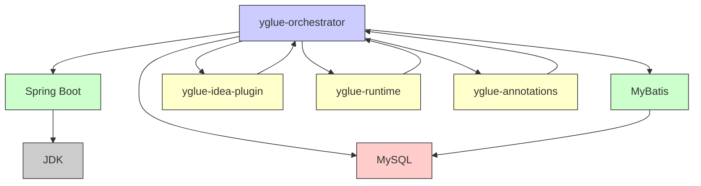

# yglue-orchestrator 模块文档

<cite>
**本文档引用的文件**  
- [YGlueOrchestratorApplication.java](file://yglue-orchestrator/src/main/java/org/yglue/flow/orch/YGlueOrchestratorApplication.java)
- [application.yml](file://yglue-orchestrator/src/main/resources/application.yml)
- [V1__init.sql](file://yglue-orchestrator/src/main/resources/db/migration/V1__init.sql)
- [V2__plugin_sync.sql](file://yglue-orchestrator/src/main/resources/db/migration/V2__plugin_sync.sql)
- [Project.java](file://yglue-orchestrator/src/main/java/org/yglue/flow/orch/domain/Project.java)
- [Flow.java](file://yglue-orchestrator/src/main/java/org/yglue/flow/orch/domain/Flow.java)
- [FlowVersion.java](file://yglue-orchestrator/src/main/java/org/yglue/flow/orch/domain/FlowVersion.java)
- [FlowEntryPoint.java](file://yglue-orchestrator/src/main/java/org/yglue/flow/orch/domain/FlowEntryPoint.java)
- [ProjectMetadata.java](file://yglue-orchestrator/src/main/java/org/yglue/flow/orch/domain/ProjectMetadata.java)
- [ProjectService.java](file://yglue-orchestrator/src/main/java/org/yglue/flow/orch/service/ProjectService.java)
- [FlowService.java](file://yglue-orchestrator/src/main/java/org/yglue/flow/orch/service/FlowService.java)
- [ProjectController.java](file://yglue-orchestrator/src/main/java/org/yglue/flow/orch/web/controller/ProjectController.java)
- [MetadataController.java](file://yglue-orchestrator/src/main/java/org/yglue/flow/orch/web/controller/MetadataController.java)
- [PluginController.java](file://yglue-orchestrator/src/main/java/org/yglue/flow/orch/web/controller/PluginController.java)
</cite>

## 目录
1. [简介](#简介)
2. [项目结构](#项目结构)
3. [核心组件](#核心组件)
4. [架构概述](#架构概述)
5. [详细组件分析](#详细组件分析)
6. [依赖分析](#依赖分析)
7. [性能考虑](#性能考虑)
8. [故障排除指南](#故障排除指南)
9. [结论](#结论)

## 简介
yglue-orchestrator 是 ygflow-suite 系统的管理与协调中心，作为 Spring Boot 应用负责流程的全生命周期管理。该模块提供基于 MyBatis 的持久化层、服务层的业务逻辑封装以及 REST 控制器的 API 暴露机制。它管理项目、流程、版本、入口点和元数据等核心领域模型，并与 yglue-runtime 和 yglue-idea-plugin 进行集成，实现流程定义的同步和执行协调。

## 项目结构
yglue-orchestrator 模块遵循典型的 Spring Boot 项目结构，包含领域模型、持久化层、服务层和 Web 控制器。其核心功能通过 REST API 暴露，数据持久化通过 MyBatis 与 MySQL 数据库交互。



**图示来源**
- [YGlueOrchestratorApplication.java](file://yglue-orchestrator/src/main/java/org/yglue/flow/orch/YGlueOrchestratorApplication.java)
- [application.yml](file://yglue-orchestrator/src/main/resources/application.yml)

**章节来源**
- [YGlueOrchestratorApplication.java](file://yglue-orchestrator/src/main/java/org/yglue/flow/orch/YGlueOrchestratorApplication.java)
- [application.yml](file://yglue-orchestrator/src/main/resources/application.yml)

## 核心组件
本模块的核心组件包括领域模型（Project, Flow, FlowVersion 等）、基于 MyBatis 的 Mapper 接口、封装业务逻辑的 Service 类以及暴露 REST API 的 Controller。

**章节来源**
- [Project.java](file://yglue-orchestrator/src/main/java/org/yglue/flow/orch/domain/Project.java)
- [Flow.java](file://yglue-orchestrator/src/main/java/org/yglue/flow/orch/domain/Flow.java)
- [ProjectService.java](file://yglue-orchestrator/src/main/java/org/yglue/flow/orch/service/ProjectService.java)
- [ProjectController.java](file://yglue-orchestrator/src/main/java/org/yglue/flow/orch/web/controller/ProjectController.java)

## 架构概述
yglue-orchestrator 采用典型的分层架构，从上至下分为 Web 层、服务层、持久化层和数据存储层。各层职责分明，通过依赖注入进行协作。



**图示来源**
- [ProjectController.java](file://yglue-orchestrator/src/main/java/org/yglue/flow/orch/web/controller/ProjectController.java)
- [ProjectService.java](file://yglue-orchestrator/src/main/java/org/yglue/flow/orch/service/ProjectService.java)
- [Project.java](file://yglue-orchestrator/src/main/java/org/yglue/flow/orch/domain/Project.java)

## 详细组件分析

### 领域模型分析
yglue-orchestrator 定义了多个核心领域模型，这些模型与数据库表一一对应，通过 MyBatis 进行持久化。

#### 核心领域模型类图


**图示来源**
- [Project.java](file://yglue-orchestrator/src/main/java/org/yglue/flow/orch/domain/Project.java)
- [Flow.java](file://yglue-orchestrator/src/main/java/org/yglue/flow/orch/domain/Flow.java)
- [FlowVersion.java](file://yglue-orchestrator/src/main/java/org/yglue/flow/orch/domain/FlowVersion.java)
- [FlowEntryPoint.java](file://yglue-orchestrator/src/main/java/org/yglue/flow/orch/domain/FlowEntryPoint.java)
- [ProjectMetadata.java](file://yglue-orchestrator/src/main/java/org/yglue/flow/orch/domain/ProjectMetadata.java)

### 数据库表结构
核心领域模型对应的数据库表结构通过 Flyway 迁移脚本定义，确保了数据库模式的版本控制。

#### 核心数据库表结构
```mermaid
erDiagram
yglue_project {
BIGINT id PK
VARCHAR(64) project_key UK
VARCHAR(128) name
TIMESTAMP create_time
VARCHAR(64) create_by
TIMESTAMP update_time
VARCHAR(64) update_by
TINYINT del_flag
}
yglue_flow {
BIGINT id PK
BIGINT project_id FK
VARCHAR(128) code
VARCHAR(256) name
BIGINT latest_version_id
BIGINT published_version_id
TIMESTAMP create_time
VARCHAR(64) create_by
TIMESTAMP update_time
VARCHAR(64) update_by
TINYINT del_flag
UK: (project_id, code)
}
yglue_flow_version {
BIGINT id PK
BIGINT flow_id FK
INT version_no
LONGTEXT content_json
BOOLEAN published
TIMESTAMP create_time
VARCHAR(128) create_by
TIMESTAMP update_time
VARCHAR(128) update_by
TINYINT del_flag
UK: (flow_id, version_no)
}
yglue_project_metadata {
BIGINT id PK
BIGINT project_id FK
LONGTEXT content_json
TIMESTAMP create_time
VARCHAR(64) create_by
TIMESTAMP update_time
VARCHAR(64) update_by
TINYINT del_flag
}
yglue_flow_entrypoint {
BIGINT id PK
BIGINT project_id FK
VARCHAR(128) flow_code
VARCHAR(16) http_method
VARCHAR(256) path
TEXT request_schema_json
VARCHAR(64) data_response_format
BOOLEAN enabled
TIMESTAMP create_time
VARCHAR(64) create_by
TIMESTAMP update_time
VARCHAR(64) update_by
TINYINT del_flag
}
yglue_project ||--o{ yglue_flow : "1对多"
yglue_flow ||--o{ yglue_flow_version : "1对多"
yglue_project ||--o{ yglue_project_metadata : "1对多"
yglue_project ||--o{ yglue_flow_entrypoint : "1对多"
```

**图示来源**
- [V1__init.sql](file://yglue-orchestrator/src/main/resources/db/migration/V1__init.sql)
- [V2__plugin_sync.sql](file://yglue-orchestrator/src/main/resources/db/migration/V2__plugin_sync.sql)

### 服务层分析
服务层封装了核心业务逻辑，如项目的创建与确保存在、流程的保存与发布等。`ProjectService` 和 `FlowService` 是其中的关键服务。

#### 流程保存与发布序列图


**图示来源**
- [FlowService.java](file://yglue-orchestrator/src/main/java/org/yglue/flow/orch/service/FlowService.java)
- [FlowMapper.java](file://yglue-orchestrator/src/main/java/org/yglue/flow/orch/persistence/mapper/FlowMapper.java)
- [FlowVersionMapper.java](file://yglue-orchestrator/src/main/java/org/yglue/flow/orch/persistence/mapper/FlowVersionMapper.java)

### Web控制器分析
Web控制器暴露 REST API，处理来自客户端、插件和运行时的请求。`ProjectController`、`MetadataController` 和 `PluginController` 分别处理项目管理、元数据同步和插件通信。

#### 元数据同步流程


**图示来源**
- [MetadataController.java](file://yglue-orchestrator/src/main/java/org/yglue/flow/orch/web/controller/MetadataController.java)
- [ProjectService.java](file://yglue-orchestrator/src/main/java/org/yglue/flow/orch/service/ProjectService.java)
- [MetadataService.java](file://yglue-orchestrator/src/main/java/org/yglue/flow/orch/service/MetadataService.java)

**章节来源**
- [MetadataController.java](file://yglue-orchestrator/src/main/java/org/yglue/flow/orch/web/controller/MetadataController.java)
- [ProjectController.java](file://yglue-orchestrator/src/main/java/org/yglue/flow/orch/web/controller/ProjectController.java)
- [PluginController.java](file://yglue-orchestrator/src/main/java/org/yglue/flow/orch/web/controller/PluginController.java)

## 依赖分析
yglue-orchestrator 模块依赖于多个外部组件和内部模块，形成了一个复杂的依赖网络。



**图示来源**
- [pom.xml](file://yglue-orchestrator/pom.xml)
- [YGlueOrchestratorApplication.java](file://yglue-orchestrator/src/main/java/org/yglue/flow/orch/YGlueOrchestratorApplication.java)

**章节来源**
- [pom.xml](file://yglue-orchestrator/pom.xml)
- [application.yml](file://yglue-orchestrator/src/main/resources/application.yml)

## 性能考虑
该模块在设计时考虑了性能因素，如使用 MyBatis 的缓存机制、对数据库查询添加索引、以及在服务层进行事务管理。对于频繁访问的数据，可以考虑引入 Redis 等缓存层以进一步提升性能。

## 故障排除指南
常见问题包括数据库连接失败、MyBatis 映射错误和 REST API 调用异常。排查时应首先检查 `application.yml` 中的数据库配置，然后查看日志文件 `logs/ygflow-orchestrator.log` 中的错误信息。对于 API 调用问题，应验证请求参数是否符合 DTO 定义。

**章节来源**
- [application.yml](file://yglue-orchestrator/src/main/resources/application.yml)
- [RequestLoggingInterceptor.java](file://yglue-orchestrator/src/main/java/org/yglue/flow/orch/web/RequestLoggingInterceptor.java)

## 结论
yglue-orchestrator 作为系统的管理与协调中心，成功实现了流程的全生命周期管理。其清晰的分层架构、完善的领域模型和健壮的 REST API 使其能够有效地与 yglue-idea-plugin 和 yglue-runtime 集成，为整个 ygflow-suite 系统提供了稳定可靠的核心支持。