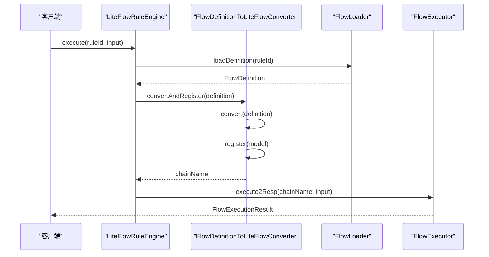
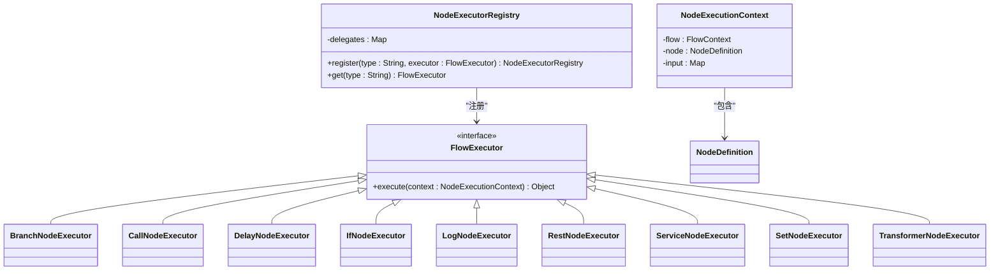
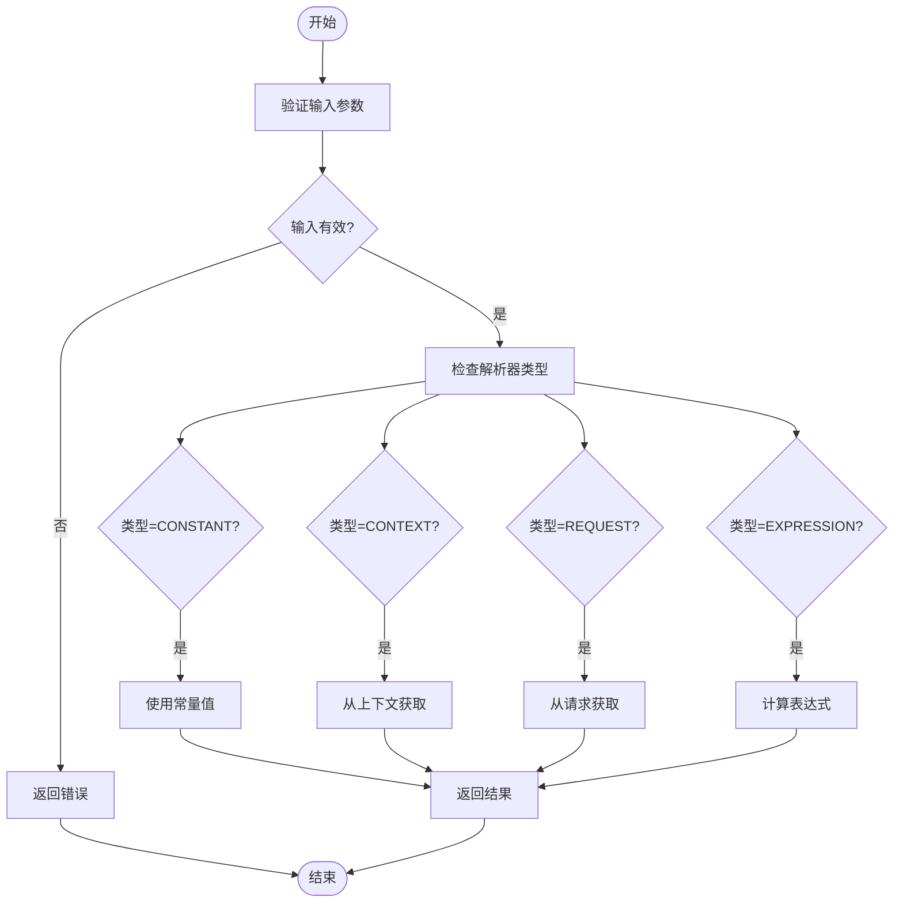
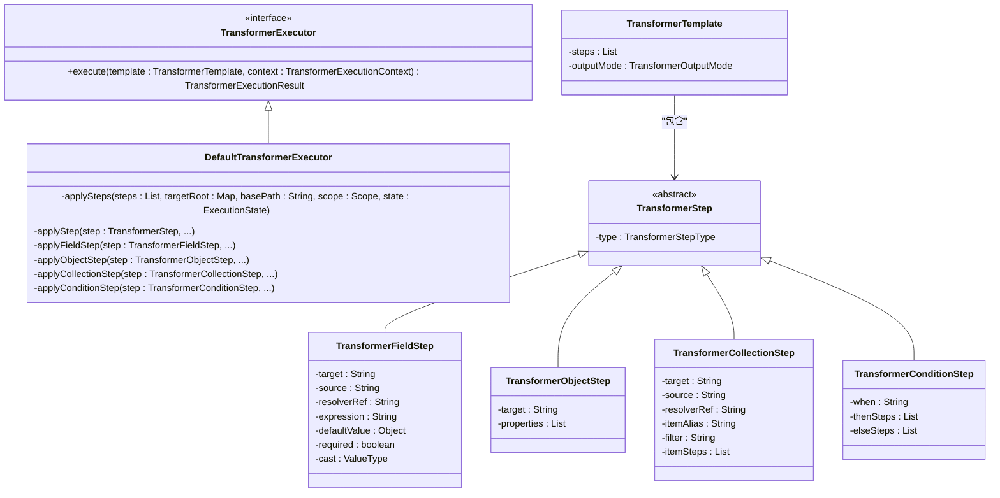
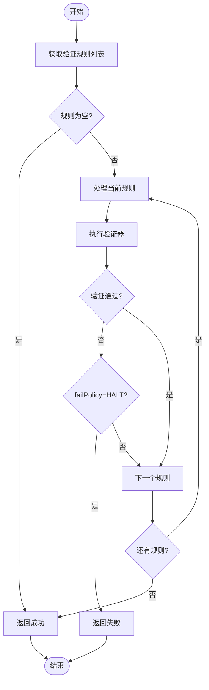
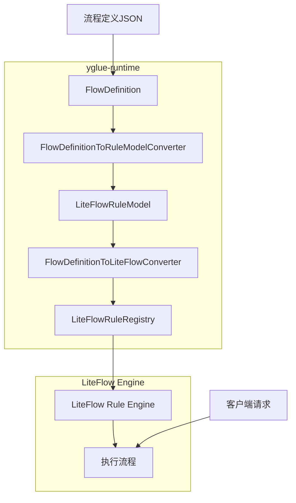
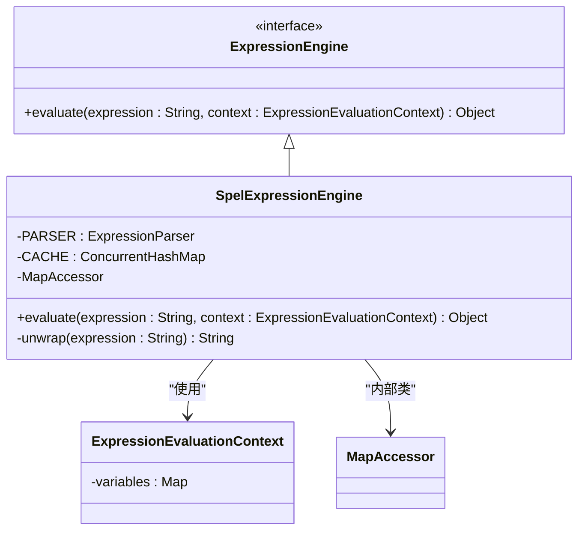

# yglue-runtime 模块文档

<cite>
**本文档引用的文件**  
- [FlowExecutor.java](file://yglue-runtime/src/main/java/org/yglue/flow/runtime/core/FlowExecutor.java)
- [NodeExecutorRegistry.java](file://yglue-runtime/src/main/java/org/yglue/flow/runtime/core/NodeExecutorRegistry.java)
- [FlowDefinitionToLiteFlowConverter.java](file://yglue-runtime/src/main/java/org/yglue/flow/runtime/liteflow/FlowDefinitionToLiteFlowConverter.java)
- [SpelExpressionEngine.java](file://yglue-runtime/src/main/java/org/yglue/flow/runtime/core/expression/SpelExpressionEngine.java)
- [ParamResolver.java](file://yglue-runtime/src/main/java/org/yglue/flow/runtime/core/param/ParamResolver.java)
- [ValidatorEngine.java](file://yglue-runtime/src/main/java/org/yglue/flow/runtime/core/validator/ValidatorEngine.java)
- [DefaultTransformerExecutor.java](file://yglue-runtime/src/main/java/org/yglue/flow/runtime/core/transformer/runtime/DefaultTransformerExecutor.java)
- [LiteFlowRuleEngine.java](file://yglue-runtime/src/main/java/org/yglue/flow/runtime/liteflow/LiteFlowRuleEngine.java)
- [FlowDefinition.java](file://yglue-runtime/src/main/java/org/yglue/flow/runtime/core/definition/FlowDefinition.java)
- [NodeDefinition.java](file://yglue-runtime/src/main/java/org/yglue/flow/runtime/core/definition/NodeDefinition.java)
- [ConstantParamResolverMetadata.java](file://yglue-runtime/src/main/java/org/yglue/flow/runtime/core/param/resolvers/ConstantParamResolverMetadata.java)
</cite>

## 目录
1. [简介](#简介)
2. [核心执行流程](#核心执行流程)
3. [节点执行器机制](#节点执行器机制)
4. [参数解析链式处理](#参数解析链式处理)
5. [数据转换器DSL解析](#数据转换器dsl解析)
6. [验证器规则校验](#验证器规则校验)
7. [基于LiteFlow的流程构建](#基于liteflow的流程构建)
8. [表达式引擎作用](#表达式引擎作用)
9. [扩展开发指南](#扩展开发指南)

## 简介
yglue-runtime 模块是流程执行的核心引擎，负责将高级流程定义转换为可执行的规则，并通过一系列组件实现复杂的业务流程编排。该模块基于 LiteFlow 构建，提供了完整的流程执行能力，包括节点执行、参数解析、数据转换和验证等功能。

**文档来源**  
- [README.md](file://README.md)

## 核心执行流程

yglue-runtime 的核心执行流程由 `FlowExecutor` 接口定义，所有节点执行器都实现了该接口。执行流程从 `LiteFlowRuleEngine` 开始，通过加载流程定义、转换为 LiteFlow 规则并最终执行。



**图示来源**  
- [LiteFlowRuleEngine.java](file://yglue-runtime/src/main/java/org/yglue/flow/runtime/liteflow/LiteFlowRuleEngine.java#L62-L78)
- [FlowDefinitionToLiteFlowConverter.java](file://yglue-runtime/src/main/java/org/yglue/flow/runtime/liteflow/FlowDefinitionToLiteFlowConverter.java#L58-L84)

**本节来源**  
- [FlowExecutor.java](file://yglue-runtime/src/main/java/org/yglue/flow/runtime/core/FlowExecutor.java#L3-L5)
- [LiteFlowRuleEngine.java](file://yglue-runtime/src/main/java/org/yglue/flow/runtime/liteflow/LiteFlowRuleEngine.java#L62-L78)

## 节点执行器机制

节点执行器（NodeExecutor）通过 `NodeExecutorRegistry` 进行注册和管理。每个节点类型对应一个执行器实例，执行器通过 `FlowExecutor` 接口定义执行逻辑。



**图示来源**  
- [NodeExecutorRegistry.java](file://yglue-runtime/src/main/java/org/yglue/flow/runtime/core/NodeExecutorRegistry.java#L7-L26)
- [FlowExecutor.java](file://yglue-runtime/src/main/java/org/yglue/flow/runtime/core/FlowExecutor.java#L3-L5)

**本节来源**  
- [NodeExecutorRegistry.java](file://yglue-runtime/src/main/java/org/yglue/flow/runtime/core/NodeExecutorRegistry.java#L7-L26)
- [FlowExecutor.java](file://yglue-runtime/src/main/java/org/yglue/flow/runtime/core/FlowExecutor.java#L3-L5)

## 参数解析链式处理

参数解析器（ParamResolver）采用链式处理模式，支持多种解析方式，包括常量、上下文、请求参数和表达式等。解析过程通过 `ResolveInstruction` 和 `ResolveContext` 控制。



**图示来源**  
- [ParamResolver.java](file://yglue-runtime/src/main/java/org/yglue/flow/runtime/core/param/ParamResolver.java#L6-L29)
- [ConstantParamResolverMetadata.java](file://yglue-runtime/src/main/java/org/yglue/flow/runtime/core/param/resolvers/ConstantParamResolverMetadata.java#L8-L14)

**本节来源**  
- [ParamResolver.java](file://yglue-runtime/src/main/java/org/yglue/flow/runtime/core/param/ParamResolver.java#L6-L29)
- [ConstantParamResolverMetadata.java](file://yglue-runtime/src/main/java/org/yglue/flow/runtime/core/param/resolvers/ConstantParamResolverMetadata.java#L8-L14)

## 数据转换器DSL解析

数据转换器（Transformer）通过 DSL 定义数据转换规则，由 `DefaultTransformerExecutor` 执行。支持字段映射、对象嵌套、集合处理、条件分支等操作。



**图示来源**  
- [DefaultTransformerExecutor.java](file://yglue-runtime/src/main/java/org/yglue/flow/runtime/core/transformer/runtime/DefaultTransformerExecutor.java#L30-L334)
- [TransformerTemplate.java](file://yglue-runtime/src/main/java/org/yglue/flow/runtime/core/transformer/dsl/TransformerTemplate.java)

**本节来源**  
- [DefaultTransformerExecutor.java](file://yglue-runtime/src/main/java/org/yglue/flow/runtime/core/transformer/runtime/DefaultTransformerExecutor.java#L30-L334)
- [TransformerTemplate.java](file://yglue-runtime/src/main/java/org/yglue/flow/runtime/core/transformer/dsl/TransformerTemplate.java)

## 验证器规则校验

验证器（Validator）通过 `ValidatorEngine` 统一管理，支持多种验证规则，包括必填、长度、范围、正则表达式等。验证过程按照规则列表顺序执行，可根据失败策略决定是否继续。



**图示来源**  
- [ValidatorEngine.java](file://yglue-runtime/src/main/java/org/yglue/flow/runtime/core/validator/ValidatorEngine.java#L14-L45)
- [ValidationRule.java](file://yglue-runtime/src/main/java/org/yglue/flow/runtime/core/validator/ValidationRule.java)

**本节来源**  
- [ValidatorEngine.java](file://yglue-runtime/src/main/java/org/yglue/flow/runtime/core/validator/ValidatorEngine.java#L14-L45)
- [ValidationRule.java](file://yglue-runtime/src/main/java/org/yglue/flow/runtime/core/validator/ValidationRule.java)

## 基于LiteFlow的流程构建

yglue-runtime 通过 `FlowDefinitionToLiteFlowConverter` 将高级流程定义转换为 LiteFlow 规则。转换过程采用分层架构：FlowDefinition → LiteFlowRuleModel → 注册到LiteFlow。



**图示来源**  
- [FlowDefinitionToLiteFlowConverter.java](file://yglue-runtime/src/main/java/org/yglue/flow/runtime/liteflow/FlowDefinitionToLiteFlowConverter.java#L18-L101)
- [FlowDefinition.java](file://yglue-runtime/src/main/java/org/yglue/flow/runtime/core/definition/FlowDefinition.java#L11-L79)

**本节来源**  
- [FlowDefinitionToLiteFlowConverter.java](file://yglue-runtime/src/main/java/org/yglue/flow/runtime/liteflow/FlowDefinitionToLiteFlowConverter.java#L18-L101)
- [FlowDefinition.java](file://yglue-runtime/src/main/java/org/yglue/flow/runtime/core/definition/FlowDefinition.java#L11-L79)

## 表达式引擎作用

表达式引擎（ExpressionEngine）基于 Spring 表达式语言（SpEL）实现，用于条件判断和参数计算。`SpelExpressionEngine` 提供了表达式解析和求值功能，支持变量注入和上下文访问。



**图示来源**  
- [SpelExpressionEngine.java](file://yglue-runtime/src/main/java/org/yglue/flow/runtime/core/expression/SpelExpressionEngine.java#L18-L95)
- [ExpressionEngine.java](file://yglue-runtime/src/main/java/org/yglue/flow/runtime/core/expression/ExpressionEngine.java)

**本节来源**  
- [SpelExpressionEngine.java](file://yglue-runtime/src/main/java/org/yglue/flow/runtime/core/expression/SpelExpressionEngine.java#L18-L95)
- [ExpressionEngine.java](file://yglue-runtime/src/main/java/org/yglue/flow/runtime/core/expression/ExpressionEngine.java)

## 扩展开发指南

开发者可以通过实现相应的接口来扩展 yglue-runtime 的功能：

1. **自定义节点执行器**：实现 `FlowExecutor` 接口，并在 `NodeExecutorRegistry` 中注册
2. **自定义参数解析器**：实现 `ParamResolver` 接口，并使用 `@FlowResolver` 注解标记
3. **自定义转换器**：扩展 `TransformerExecutor` 接口，实现新的 DSL 步骤类型
4. **自定义验证器**：实现 `Validator` 接口，并在 `ValidatorEngine` 中注册

```mermaid
graph TD
A[扩展点] --> B[节点执行器]
A --> C[参数解析器]
A --> D[数据转换器]
A --> E[验证器]
B --> F[实现FlowExecutor]
B --> G[注册到NodeExecutorRegistry]
C --> H[实现ParamResolver]
C --> I[使用@FlowResolver注解]
D --> J[扩展TransformerExecutor]
D --> K[实现新DSL步骤]
E --> L[实现Validator]
E --> M[注册到ValidatorEngine]
```

**本节来源**  
- [FlowExecutor.java](file://yglue-runtime/src/main/java/org/yglue/flow/runtime/core/FlowExecutor.java#L3-L5)
- [ParamResolver.java](file://yglue-runtime/src/main/java/org/yglue/flow/runtime/core/param/ParamResolver.java#L6-L29)
- [ValidatorEngine.java](file://yglue-runtime/src/main/java/org/yglue/flow/runtime/core/validator/ValidatorEngine.java#L34-L35)
- [DefaultTransformerExecutor.java](file://yglue-runtime/src/main/java/org/yglue/flow/runtime/core/transformer/runtime/DefaultTransformerExecutor.java#L30-L334)