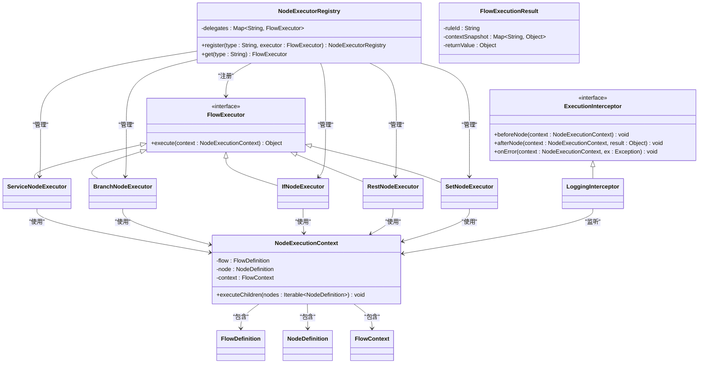

# 流程执行引擎

<cite>
**本文档引用的文件**
- [FlowExecutor.java](file://yglue-runtime/src/main/java/org/yglue/flow/runtime/core/FlowExecutor.java)
- [NodeExecutorRegistry.java](file://yglue-runtime/src/main/java/org/yglue/flow/runtime/core/NodeExecutorRegistry.java)
- [NodeExecutionContext.java](file://yglue-runtime/src/main/java/org/yglue/flow/runtime/core/NodeExecutionContext.java)
- [ServiceNodeExecutor.java](file://yglue-runtime/src/main/java/org/yglue/flow/runtime/core/executors/ServiceNodeExecutor.java)
- [BranchNodeExecutor.java](file://yglue-runtime/src/main/java/org/yglue/flow/runtime/core/executors/BranchNodeExecutor.java)
- [IfNodeExecutor.java](file://yglue-runtime/src/main/java/org/yglue/flow/runtime/core/executors/IfNodeExecutor.java)
- [RestNodeExecutor.java](file://yglue-runtime/src/main/java/org/yglue/flow/runtime/core/executors/RestNodeExecutor.java)
- [SetNodeExecutor.java](file://yglue-runtime/src/main/java/org/yglue/flow/runtime/core/executors/SetNodeExecutor.java)
- [FlowExecutionResult.java](file://yglue-runtime/src/main/java/org/yglue/flow/runtime/core/FlowExecutionResult.java)
- [ExecutionInterceptor.java](file://yglue-runtime/src/main/java/org/yglue/flow/runtime/core/ExecutionInterceptor.java)
- [LoggingInterceptor.java](file://yglue-runtime/src/main/java/org/yglue/flow/runtime/interceptors/LoggingInterceptor.java)
- [FlowDefinition.java](file://yglue-runtime/src/main/java/org/yglue/flow/runtime/core/definition/FlowDefinition.java)
- [NodeDefinition.java](file://yglue-runtime/src/main/java/org/yglue/flow/runtime/core/definition/NodeDefinition.java)
</cite>

## 目录
1. [简介](#简介)
2. [核心组件](#核心组件)
3. [流程执行器 (FlowExecutor)](#流程执行器-flowexecutor)
4. [节点执行器注册表 (NodeExecutorRegistry)](#节点执行器注册表-nodeexecutorregistry)
5. [节点执行上下文 (NodeExecutionContext)](#节点执行上下文-nodeexecutioncontext)
6. [节点执行器实现](#节点执行器实现)
7. [流程执行结果 (FlowExecutionResult)](#流程执行结果-flowexecutionresult)
8. [执行拦截器 (ExecutionInterceptor)](#执行拦截器-executioninterceptor)
9. [自定义节点执行器开发](#自定义节点执行器开发)

## 简介
流程执行引擎是 Ygflow Suite 的核心组件，负责解析和执行流程定义。该引擎通过节点执行器（NodeExecutor）机制，支持多种类型的节点执行逻辑，包括服务调用、条件分支、REST 调用等。引擎通过节点执行上下文（NodeExecutionContext）在执行过程中传递数据，并通过执行拦截器（ExecutionInterceptor）提供扩展点。本技术文档详细阐述了流程执行引擎的核心组件和工作机制。

## 核心组件
流程执行引擎由多个核心组件构成，包括流程执行器（FlowExecutor）、节点执行器注册表（NodeExecutorRegistry）、节点执行上下文（NodeExecutionContext）和流程执行结果（FlowExecutionResult）。这些组件协同工作，实现了流程的解析、执行和结果返回。



**图示来源**
- [FlowExecutor.java](file://yglue-runtime/src/main/java/org/yglue/flow/runtime/core/FlowExecutor.java)
- [NodeExecutorRegistry.java](file://yglue-runtime/src/main/java/org/yglue/flow/runtime/core/NodeExecutorRegistry.java)
- [NodeExecutionContext.java](file://yglue-runtime/src/main/java/org/yglue/flow/runtime/core/NodeExecutionContext.java)
- [FlowExecutionResult.java](file://yglue-runtime/src/main/java/org/yglue/flow/runtime/core/FlowExecutionResult.java)
- [ExecutionInterceptor.java](file://yglue-runtime/src/main/java/org/yglue/flow/runtime/core/ExecutionInterceptor.java)
- [ServiceNodeExecutor.java](file://yglue-runtime/src/main/java/org/yglue/flow/runtime/core/executors/ServiceNodeExecutor.java)
- [BranchNodeExecutor.java](file://yglue-runtime/src/main/java/org/yglue/flow/runtime/core/executors/BranchNodeExecutor.java)
- [IfNodeExecutor.java](file://yglue-runtime/src/main/java/org/yglue/flow/runtime/core/executors/IfNodeExecutor.java)
- [RestNodeExecutor.java](file://yglue-runtime/src/main/java/org/yglue/flow/runtime/core/executors/RestNodeExecutor.java)
- [SetNodeExecutor.java](file://yglue-runtime/src/main/java/org/yglue/flow/runtime/core/executors/SetNodeExecutor.java)

## 流程执行器 (FlowExecutor)

`FlowExecutor` 是流程执行引擎的核心接口，定义了所有节点执行器必须实现的 `execute` 方法。该接口接受 `NodeExecutionContext` 作为参数，并返回执行结果。

```java
public interface FlowExecutor {
    Object execute(NodeExecutionContext context) throws Exception;
}
```

所有具体的节点执行器都实现了这个接口，通过多态机制，引擎可以根据节点类型调用相应的执行器。

**本节来源**
- [FlowExecutor.java](file://yglue-runtime/src/main/java/org/yglue/flow/runtime/core/FlowExecutor.java)

## 节点执行器注册表 (NodeExecutorRegistry)

`NodeExecutorRegistry` 是一个注册表，用于管理和注册不同类型的节点执行器。它使用一个 `LinkedHashMap` 来存储节点类型与执行器的映射关系。

```java
public class NodeExecutorRegistry {
    private final Map<String, FlowExecutor> delegates = new LinkedHashMap<>();

    public NodeExecutorRegistry register(String type, FlowExecutor executor) {
        Objects.requireNonNull(type, "type");
        Objects.requireNonNull(executor, "executor");
        delegates.put(type.toLowerCase(), executor);
        return this;
    }

    public FlowExecutor get(String type) {
        FlowExecutor executor = delegates.get(type == null ? null : type.toLowerCase());
        if (executor == null) {
            throw new IllegalArgumentException("No executor registered for node type: " + type);
        }
        return executor;
    }
}
```

注册表提供了 `register` 方法用于注册执行器，以及 `get` 方法用于根据节点类型获取对应的执行器实例。类型名称不区分大小写。

**本节来源**
- [NodeExecutorRegistry.java](file://yglue-runtime/src/main/java/org/yglue/flow/runtime/core/NodeExecutorRegistry.java)

## 节点执行上下文 (NodeExecutionContext)

`NodeExecutionContext` 封装了节点执行所需的所有上下文信息，包括流程定义、当前节点定义和流程上下文。

```java
@Getter
public class NodeExecutionContext {
    private final FlowDefinition flow;
    private final NodeDefinition node;
    private final FlowContext context;

    public NodeExecutionContext(FlowDefinition flow,
                                NodeDefinition node,
                                FlowContext context) {
        this.flow = flow;
        this.node = node;
        this.context = context;
    }

    public void executeChildren(Iterable<NodeDefinition> nodes) {
        // 在 LiteFlow 引擎中，子节点执行由框架自动处理
    }
}
```

执行上下文通过构造函数注入，确保了执行器可以访问到执行所需的所有数据。

**本节来源**
- [NodeExecutionContext.java](file://yglue-runtime/src/main/java/org/yglue/flow/runtime/core/NodeExecutionContext.java)

## 节点执行器实现

### 服务节点执行器 (ServiceNodeExecutor)

`ServiceNodeExecutor` 用于执行本地服务调用，通过反射调用 Spring Bean 方法。它支持通过 Groovy 脚本获取参数值，并提供参数校验功能。

```java
public class ServiceNodeExecutor implements FlowExecutor {
    private final ApplicationContext applicationContext;
    private final ObjectMapper objectMapper;
    private final ValidatorEngine validatorEngine;

    public ServiceNodeExecutor(ApplicationContext applicationContext) {
        this.applicationContext = applicationContext;
        this.objectMapper = new ObjectMapper();
        this.validatorEngine = new DefaultValidatorEngine();
    }

    @Override
    public Object execute(NodeExecutionContext context) throws Exception {
        // 解析配置、获取 Bean、解析参数、调用方法等
        // ...
    }
}
```

执行器通过 `ApplicationContext` 获取 Bean 实例，并使用 `AopProxyUtils` 处理代理类，确保能够正确调用目标方法。

**本节来源**
- [ServiceNodeExecutor.java](file://yglue-runtime/src/main/java/org/yglue/flow/runtime/core/executors/ServiceNodeExecutor.java)

### 分支节点执行器 (BranchNodeExecutor)

`BranchNodeExecutor` 用于处理条件分支节点，评估每个边上的条件表达式，并选择第一个满足条件的边执行。

```java
public class BranchNodeExecutor implements FlowExecutor {
    @Override
    public Object execute(NodeExecutionContext context) {
        // 获取流程定义中的 edges
        FlowDefinition flow = context.getFlow();
        List<Map<String, Object>> edges = flow.getEdges();
        
        // 查找从当前分支节点出发的所有 edges
        List<Map<String, Object>> outgoingEdges = new ArrayList<>();
        for (Map<String, Object> edge : edges) {
            String source = (String) edge.get("source");
            if (nodeId.equals(source)) {
                outgoingEdges.add(edge);
            }
        }
        
        // 评估每个 edge 的条件表达式，选择第一个满足条件的
        for (Map<String, Object> edge : outgoingEdges) {
            // ...
            boolean conditionMet = ExpressionEvaluator.evaluateBoolean(expression, context.getContext());
            if (conditionMet) {
                // 执行目标节点
                context.executeChildren(List.of(targetNode));
                return true;
            }
        }
        
        return false;
    }
}
```

分支节点的执行逻辑依赖于流程定义中的 `edges` 列表。

**本节来源**
- [BranchNodeExecutor.java](file://yglue-runtime/src/main/java/org/yglue/flow/runtime/core/executors/BranchNodeExecutor.java)
- [FlowDefinition.java](file://yglue-runtime/src/main/java/org/yglue/flow/runtime/core/definition/FlowDefinition.java)

### 条件节点执行器 (IfNodeExecutor)

`IfNodeExecutor` 实现了简单的 if-else 逻辑，根据条件表达式的值决定执行 `then` 或 `else` 分支。

```java
public class IfNodeExecutor implements FlowExecutor {
    @Override
    public Object execute(NodeExecutionContext context) {
        Object condition = context.getNode().getConfig().get("condition");
        boolean result = ExpressionEvaluator.evaluateBoolean(condition, context.getContext());
        Object blocks = context.getNode().getConfig().get("blocks");
        if (blocks instanceof Map<?, ?> map) {
            List<NodeDefinition> thenNodes = (List<NodeDefinition>) map.get("then");
            List<NodeDefinition> elseNodes = (List<NodeDefinition>) map.get("else");
            if (result && thenNodes != null) {
                context.executeChildren(thenNodes);
            } else if (!result && elseNodes != null) {
                context.executeChildren(elseNodes);
            }
        }
        return result;
    }
}
```

**本节来源**
- [IfNodeExecutor.java](file://yglue-runtime/src/main/java/org/yglue/flow/runtime/core/executors/IfNodeExecutor.java)

### REST 节点执行器 (RestNodeExecutor)

`RestNodeExecutor` 用于执行 REST API 调用，通过 `RestInvocationRegistry` 调用具体的 REST 策略。

```java
public class RestNodeExecutor implements FlowExecutor {
    private final RestInvocationRegistry registry;
    private final ApplicationContext applicationContext;

    public RestNodeExecutor(RestInvocationRegistry registry,
                            ApplicationContext applicationContext) {
        this.registry = registry;
        this.applicationContext = applicationContext;
    }

    @Override
    public Object execute(NodeExecutionContext context) throws Exception {
        RestInvocationContext invocationContext = new RestInvocationContext(
                context.getNode(), context.getContext(), context.getNode().getConfig(), applicationContext);
        Object result = registry.invoke(invocationContext);
        Object alias = context.getNode().getConfig().get("as");
        if (alias != null) {
            context.getContext().set(String.valueOf(alias), result);
        }
        return result;
    }
}
```

**本节来源**
- [RestNodeExecutor.java](file://yglue-runtime/src/main/java/org/yglue/flow/runtime/core/executors/RestNodeExecutor.java)

### 赋值节点执行器 (SetNodeExecutor)

`SetNodeExecutor` 用于在流程上下文中设置变量值。

```java
public class SetNodeExecutor implements FlowExecutor {
    @Override
    public Object execute(NodeExecutionContext context) {
        Map<String, Object> config = context.getNode().getConfig();
        String target = String.valueOf(config.get("target"));
        Object valueExpression = config.get("value");
        Object value = ExpressionEvaluator.evaluate(valueExpression, context.getContext());
        context.getContext().set(target, value);
        return value;
    }
}
```

**本节来源**
- [SetNodeExecutor.java](file://yglue-runtime/src/main/java/org/yglue/flow/runtime/core/executors/SetNodeExecutor.java)

## 流程执行结果 (FlowExecutionResult)

`FlowExecutionResult` 封装了流程执行的最终结果，包括规则 ID、上下文快照和返回值。

```java
public class FlowExecutionResult {
    private final String ruleId;
    private final Map<String, Object> contextSnapshot;
    private final Object returnValue;

    public FlowExecutionResult(String ruleId,
                               Map<String, Object> contextSnapshot,
                               Object returnValue) {
        this.ruleId = ruleId;
        this.contextSnapshot = contextSnapshot;
        this.returnValue = returnValue;
    }

    public String getRuleId() {
        return ruleId;
    }

    public Map<String, Object> getContextSnapshot() {
        return contextSnapshot;
    }

    public Object getReturnValue() {
        return returnValue;
    }
}
```

**本节来源**
- [FlowExecutionResult.java](file://yglue-runtime/src/main/java/org/yglue/flow/runtime/core/FlowExecutionResult.java)

## 执行拦截器 (ExecutionInterceptor)

`ExecutionInterceptor` 是一个扩展点接口，允许在节点执行前后以及发生错误时插入自定义逻辑。

```java
public interface ExecutionInterceptor {
    default void beforeNode(NodeExecutionContext context) {
    }

    default void afterNode(NodeExecutionContext context, Object result) {
    }

    default void onError(NodeExecutionContext context, Exception ex) {
    }
}
```

`LoggingInterceptor` 是一个具体的实现，用于记录节点执行的日志。

```java
public class LoggingInterceptor implements ExecutionInterceptor {
    private static final Logger log = LoggerFactory.getLogger(LoggingInterceptor.class);

    @Override
    public void beforeNode(NodeExecutionContext context) {
        log.debug("Executing node {} ({})", context.getNode().getId(), context.getNode().getType());
    }

    @Override
    public void afterNode(NodeExecutionContext context, Object result) {
        log.debug("Node {} completed with result {}", context.getNode().getId(), result);
    }

    @Override
    public void onError(NodeExecutionContext context, Exception ex) {
        log.warn("Node {} failed: {}", context.getNode().getId(), ex.getMessage());
    }
}
```

**本节来源**
- [ExecutionInterceptor.java](file://yglue-runtime/src/main/java/org/yglue/flow/runtime/core/ExecutionInterceptor.java)
- [LoggingInterceptor.java](file://yglue-runtime/src/main/java/org/yglue/flow/runtime/interceptors/LoggingInterceptor.java)

## 自定义节点执行器开发

要开发自定义节点执行器，需要实现 `FlowExecutor` 接口，并在 `execute` 方法中编写具体的执行逻辑。然后通过 `NodeExecutorRegistry` 注册该执行器。

```java
@Component
public class CustomNodeExecutor implements FlowExecutor {
    @Override
    public Object execute(NodeExecutionContext context) throws Exception {
        // 自定义执行逻辑
        return null;
    }
}

@Configuration
public class CustomExecutorConfig {
    @Autowired
    private NodeExecutorRegistry nodeExecutorRegistry;

    @PostConstruct
    public void registerCustomExecutor() {
        nodeExecutorRegistry.register("custom", new CustomNodeExecutor());
    }
}
```

通过这种方式，可以轻松扩展流程执行引擎的功能。

**本节来源**
- [FlowExecutor.java](file://yglue-runtime/src/main/java/org/yglue/flow/runtime/core/FlowExecutor.java)
- [NodeExecutorRegistry.java](file://yglue-runtime/src/main/java/org/yglue/flow/runtime/core/NodeExecutorRegistry.java)