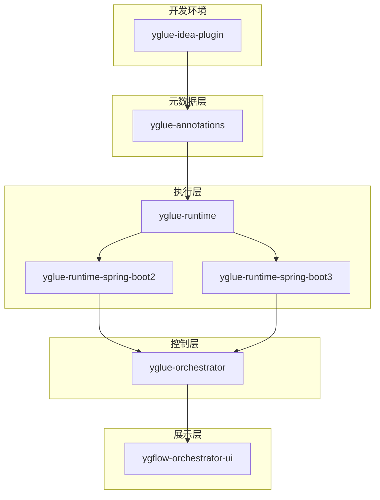
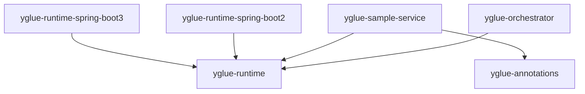
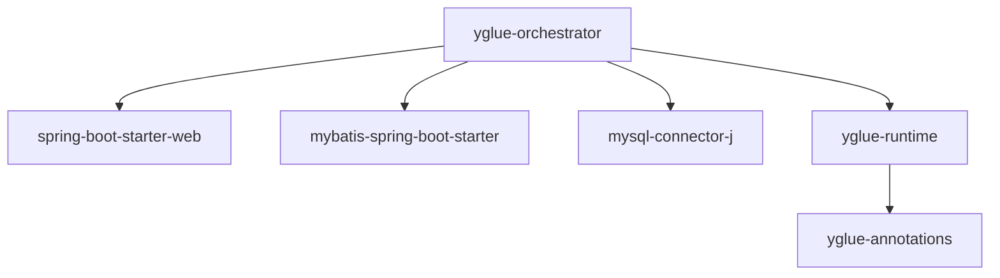
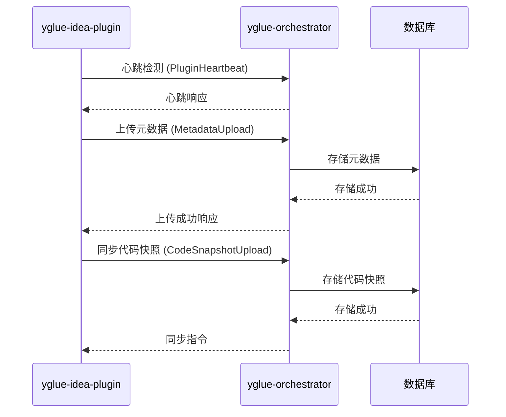
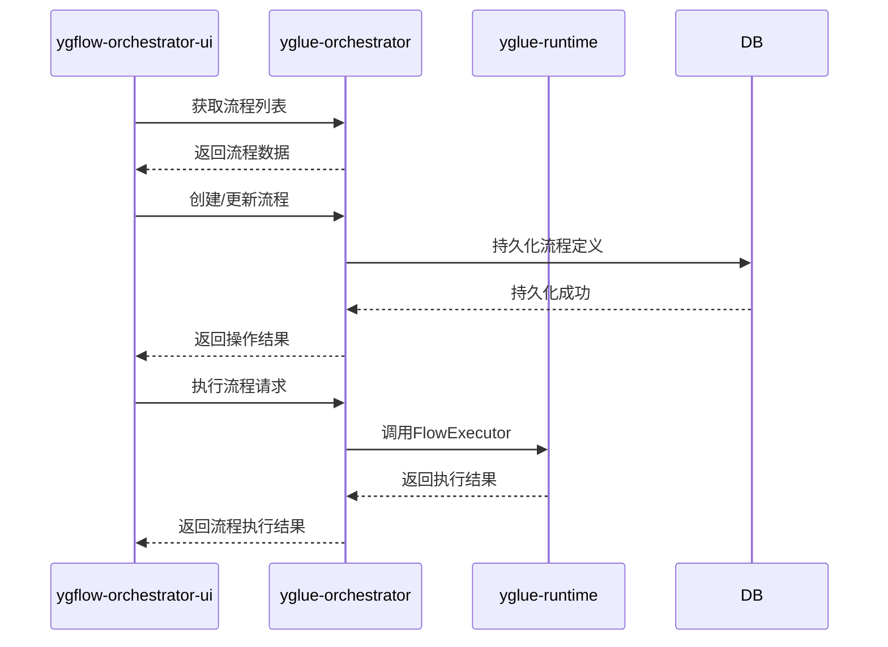

# 模块文档

<cite>
**本文档中引用的文件**
- [pom.xml](file://pom.xml)
- [yglue-annotations/pom.xml](file://yglue-annotations/pom.xml)
- [yglue-annotations/src/main/java/org/yglue/flow/annotations/FlowApi.java](file://yglue-annotations/src/main/java/org/yglue/flow/annotations/FlowApi.java)
- [yglue-annotations/src/main/java/org/yglue/flow/annotations/FlowModel.java](file://yglue-annotations/src/main/java/org/yglue/flow/annotations/FlowModel.java)
- [yglue-annotations/src/main/java/org/yglue/flow/annotations/FlowOperation.java](file://yglue-annotations/src/main/java/org/yglue/flow/annotations/FlowOperation.java)
- [yglue-annotations/src/main/java/org/yglue/flow/annotations/FlowResolver.java](file://yglue-annotations/src/main/java/org/yglue/flow/annotations/FlowResolver.java)
- [yglue-runtime/pom.xml](file://yglue-runtime/pom.xml)
- [yglue-runtime/src/main/java/org/yglue/flow/runtime/core/FlowExecutor.java](file://yglue-runtime/src/main/java/org/yglue/flow/runtime/core/FlowExecutor.java)
- [yglue-runtime/src/main/java/org/yglue/flow/runtime/core/definition/FlowDefinition.java](file://yglue-runtime/src/main/java/org/yglue/flow/runtime/core/definition/FlowDefinition.java)
- [yglue-runtime-spring-boot2/pom.xml](file://yglue-runtime-spring-boot2/pom.xml)
- [yglue-runtime-spring-boot3/pom.xml](file://yglue-runtime-spring-boot3/pom.xml)
- [yglue-orchestrator/pom.xml](file://yglue-orchestrator/pom.xml)
- [yglue-orchestrator/src/main/java/org/yglue/flow/orch/domain/Flow.java](file://yglue-orchestrator/src/main/java/org/yglue/flow/orch/domain/Flow.java)
- [yglue-orchestrator/src/main/java/org/yglue/flow/orch/web/controller/FlowController.java](file://yglue-orchestrator/src/main/java/org/yglue/flow/orch/web/controller/FlowController.java)
- [yglue-idea-plugin/build.gradle.kts](file://yglue-idea-plugin/build.gradle.kts)
- [apps/ygflow-orchestrator-ui/package.json](file://apps/ygflow-orchestrator-ui/package.json)
</cite>

## 目录
1. [简介](#简介)
2. [模块化架构设计](#模块化架构设计)
3. [核心模块概览](#核心模块概览)
4. [模块间依赖关系](#模块间依赖关系)
5. [集成与通信机制](#集成与通信机制)
6. [总结](#总结)

## 简介
YGFlow Suite 是一个模块化的流程编排系统，旨在通过清晰的职责划分实现系统的可维护性和可扩展性。本文档详细说明了各核心模块的设计理念、功能职责以及它们之间的依赖关系。系统由多个独立但相互协作的模块组成，包括元数据定义、流程执行、管理API、IDE集成和用户界面等组件。

## 模块化架构设计

YGFlow Suite 采用模块化架构设计，将系统功能分解为独立的、可重用的组件。这种设计方法具有以下优势：

- **可维护性**：每个模块都有明确的职责边界，便于单独开发、测试和维护。
- **可扩展性**：新功能可以通过添加新模块或扩展现有模块来实现，而不会影响其他部分。
- **可重用性**：核心功能（如流程执行）被封装在独立模块中，可在不同环境中重复使用。
- **技术独立性**：不同模块可以使用最适合其需求的技术栈，例如前端使用Vue.js，后端使用Spring Boot。

该架构遵循关注点分离原则，将元数据定义、流程执行、服务编排、开发工具集成和用户界面等职责分配给不同的模块。

**模块化架构图**

**图示来源**
- [pom.xml](file://pom.xml)
- [yglue-annotations/pom.xml](file://yglue-annotations/pom.xml)
- [yglue-runtime/pom.xml](file://yglue-runtime/pom.xml)
- [yglue-runtime-spring-boot2/pom.xml](file://yglue-runtime-spring-boot2/pom.xml)
- [yglue-runtime-spring-boot3/pom.xml](file://yglue-runtime-spring-boot3/pom.xml)
- [yglue-orchestrator/pom.xml](file://yglue-orchestrator/pom.xml)
- [apps/ygflow-orchestrator-ui/package.json](file://apps/ygflow-orchestrator-ui/package.json)

## 核心模块概览

### yglue-annotations 模块
`yglue-annotations` 模块负责定义系统中的元数据注解，为流程编排提供类型安全的元数据描述。该模块包含用于标记API、模型和解析器的注解。

主要注解包括：
- `@FlowApi`：用于标记流程API类，定义服务名称、显示名称、描述和版本
- `@FlowModel`：用于标记可在流程编排中复用的领域模型
- `@FlowOperation`：用于标记具体的操作方法
- `@FlowResolver`：用于标注参数解析器的元数据

这些注解在运行时保留（RetentionPolicy.RUNTIME），允许框架在运行时通过反射读取元数据信息。

**模块来源**
- [yglue-annotations/pom.xml](file://yglue-annotations/pom.xml)
- [yglue-annotations/src/main/java/org/yglue/flow/annotations/FlowApi.java](file://yglue-annotations/src/main/java/org/yglue/flow/annotations/FlowApi.java)
- [yglue-annotations/src/main/java/org/yglue/flow/annotations/FlowModel.java](file://yglue-annotations/src/main/java/org/yglue/flow/annotations/FlowModel.java)
- [yglue-annotations/src/main/java/org/yglue/flow/annotations/FlowOperation.java](file://yglue-annotations/src/main/java/org/yglue/flow/annotations/FlowOperation.java)
- [yglue-annotations/src/main/java/org/yglue/flow/annotations/FlowResolver.java](file://yglue-annotations/src/main/java/org/yglue/flow/annotations/FlowResolver.java)

### yglue-runtime 模块
`yglue-runtime` 模块是流程执行的核心引擎，负责解析流程定义、执行节点操作和管理流程状态。该模块提供了流程执行所需的所有核心功能。

主要功能组件：
- `FlowExecutor`：流程执行器接口，定义了流程执行的核心方法
- `FlowDefinition`：流程定义类，描述了流程的结构和配置
- 节点执行器：包括分支节点、调用节点、延迟节点、条件节点等多种类型的节点执行器
- 表达式引擎：支持SpEL等表达式语言的求值
- 参数解析器：处理流程执行过程中的参数解析
- 转换器：负责数据格式的转换和映射

该模块设计为与具体框架解耦，可独立于Spring等容器运行。

**模块来源**
- [yglue-runtime/pom.xml](file://yglue-runtime/pom.xml)
- [yglue-runtime/src/main/java/org/yglue/flow/runtime/core/FlowExecutor.java](file://yglue-runtime/src/main/java/org/yglue/flow/runtime/core/FlowExecutor.java)
- [yglue-runtime/src/main/java/org/yglue/flow/runtime/core/definition/FlowDefinition.java](file://yglue-runtime/src/main/java/org/yglue/flow/runtime/core/definition/FlowDefinition.java)

### yglue-runtime-spring-boot2/3 模块
`yglue-runtime-spring-boot2` 和 `yglue-runtime-spring-boot3` 模块为Spring Boot 2和3环境提供了自动配置支持，使`yglue-runtime`能够无缝集成到Spring Boot应用中。

两个模块的主要区别在于：
- `yglue-runtime-spring-boot2` 使用Servlet 4.0 API和Spring Boot 2.7.x版本
- `yglue-runtime-spring-boot3` 使用Jakarta Servlet API和Spring Boot 3.x版本，支持AOP和AspectJ

共同功能包括：
- 自动配置流程执行器
- 提供REST端点注册机制
- 实现请求拦截和参数提取
- 配置属性管理

**模块来源**
- [yglue-runtime-spring-boot2/pom.xml](file://yglue-runtime-spring-boot2/pom.xml)
- [yglue-runtime-spring-boot3/pom.xml](file://yglue-runtime-spring-boot3/pom.xml)

### yglue-orchestrator 模块
`yglue-orchestrator` 模块提供流程编排的管理API，作为系统的核心控制中心。该模块基于Spring Boot构建，提供RESTful API用于流程的管理、执行和监控。

主要功能：
- 流程管理：创建、更新、删除和查询流程定义
- 版本控制：支持流程定义的版本管理和发布
- 元数据管理：管理项目、组件和依赖的元数据信息
- 执行监控：提供流程执行状态的监控和统计
- 插件通信：与IDE插件进行元数据同步和心跳检测

该模块依赖`yglue-runtime`进行实际的流程执行，同时为前端UI提供数据接口。

**模块来源**
- [yglue-orchestrator/pom.xml](file://yglue-orchestrator/pom.xml)
- [yglue-orchestrator/src/main/java/org/yglue/flow/orch/domain/Flow.java](file://yglue-orchestrator/src/main/java/org/yglue/flow/orch/domain/Flow.java)
- [yglue-orchestrator/src/main/java/org/yglue/flow/orch/web/controller/FlowController.java](file://yglue-orchestrator/src/main/java/org/yglue/flow/orch/web/controller/FlowController.java)

### yglue-idea-plugin 模块
`yglue-idea-plugin` 模块为IntelliJ IDEA提供了集成支持，使开发者能够在IDE中直接进行流程开发和元数据管理。

主要功能：
- 代码快照导出：自动导出项目代码结构作为快照
- 元数据上传：将注解元数据上传到编排器服务
- 规则同步：同步流程规则定义到服务器
- 自动调度：提供定时任务调度器，实现自动上传和同步
- 插件配置：管理插件的设置和状态

该模块使用Gradle构建，针对IntelliJ IDEA 2024.2平台开发。

**模块来源**
- [yglue-idea-plugin/build.gradle.kts](file://yglue-idea-plugin/build.gradle.kts)

### ygflow-orchestrator-ui 模块
`ygflow-orchestrator-ui` 模块提供图形化的用户界面，基于Vue.js和Vite构建，为用户提供直观的流程设计和管理体验。

技术栈：
- 前端框架：Vue 3
- 构建工具：Vite
- UI组件：Lucide图标库
- 代码编辑：CodeMirror
- 流程图：Vue Flow

主要功能：
- 流程画布：可视化流程设计界面
- 组件面板：可拖拽的节点组件库
- 属性检查器：节点属性配置面板
- 版本管理：流程版本历史和比较
- 脚本编辑：内嵌的脚本编辑器

**模块来源**
- [apps/ygflow-orchestrator-ui/package.json](file://apps/ygflow-orchestrator-ui/package.json)

## 模块间依赖关系

YGFlow Suite的模块间存在明确的依赖层次，形成了一个清晰的调用链。以下是主要的依赖关系：

### 运行时模块依赖

`yglue-runtime-spring-boot2` 和 `yglue-runtime-spring-boot3` 模块都依赖于 `yglue-runtime` 核心模块，为其提供Spring Boot环境的集成能力。`yglue-orchestrator` 和 `yglue-sample-service` 也直接依赖 `yglue-runtime` 来执行流程。

**图示来源**
- [yglue-runtime/pom.xml](file://yglue-runtime/pom.xml)
- [yglue-runtime-spring-boot2/pom.xml](file://yglue-runtime-spring-boot2/pom.xml)
- [yglue-runtime-spring-boot3/pom.xml](file://yglue-runtime-spring-boot3/pom.xml)
- [yglue-orchestrator/pom.xml](file://yglue-orchestrator/pom.xml)
- [samples/yglue-sample-service/pom.xml](file://samples/yglue-sample-service/pom.xml)

### 编排器模块依赖

`yglue-orchestrator` 模块依赖Spring Boot Web组件提供REST API，使用MyBatis进行数据库访问，MySQL作为持久化存储，并依赖 `yglue-runtime` 进行流程执行。

**图示来源**
- [yglue-orchestrator/pom.xml](file://yglue-orchestrator/pom.xml)
- [yglue-runtime/pom.xml](file://yglue-runtime/pom.xml)
- [yglue-annotations/pom.xml](file://yglue-annotations/pom.xml)

## 集成与通信机制

### IDE到服务器的通信流程

IDE插件通过REST API与编排器服务通信，定期发送心跳、上传元数据和代码快照，并接收同步指令。

**图示来源**
- [yglue-idea-plugin/build.gradle.kts](file://yglue-idea-plugin/build.gradle.kts)
- [yglue-orchestrator/src/main/java/org/yglue/flow/orch/web/controller/PluginController.java](file://yglue-orchestrator/src/main/java/org/yglue/flow/orch/web/controller/PluginController.java)

### 前端到后端的通信流程

前端UI通过REST API与编排器服务交互，进行流程的CRUD操作和执行调用，编排器服务再调用运行时模块执行具体流程。

**图示来源**
- [apps/ygflow-orchestrator-ui/package.json](file://apps/ygflow-orchestrator-ui/package.json)
- [yglue-orchestrator/pom.xml](file://yglue-orchestrator/pom.xml)
- [yglue-runtime/pom.xml](file://yglue-runtime/pom.xml)

## 总结
YGFlow Suite通过模块化架构实现了高度的可维护性和可扩展性。各模块职责清晰，依赖关系明确：

- `yglue-annotations` 提供元数据定义，是系统类型安全的基础
- `yglue-runtime` 作为核心执行引擎，实现了流程执行的核心逻辑
- `yglue-runtime-spring-boot2/3` 为不同版本的Spring Boot环境提供集成支持
- `yglue-orchestrator` 作为控制中心，提供管理API和持久化能力
- `yglue-idea-plugin` 实现IDE集成，提升开发效率
- `ygflow-orchestrator-ui` 提供直观的图形化界面，改善用户体验

这种分层架构使得系统能够灵活适应不同的技术环境和业务需求，同时保持核心功能的稳定性和一致性。通过清晰的接口定义和松耦合的设计，各模块可以独立演进，为系统的长期发展奠定了坚实的基础。