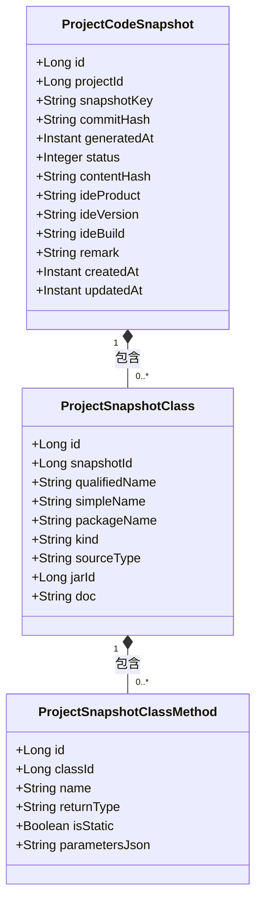
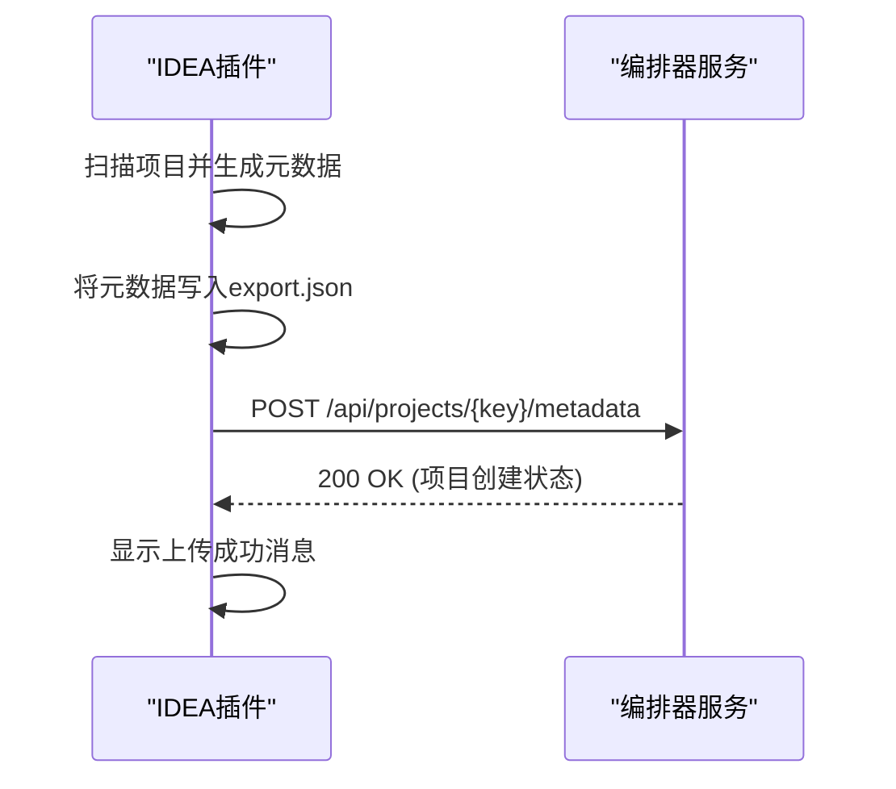

# IDEA 元数据结构

<cite>
**本文档引用的文件**   
- [SchemaGenerator.java](file://yglue-idea-plugin/src/main/java/org/yglue/flow/idea/schema/SchemaGenerator.java)
- [CodeSnapshotExporter.java](file://yglue-idea-plugin/src/main/java/org/yglue/flow/idea/snapshot/CodeSnapshotExporter.java)
- [ExportCodeSnapshotAction.java](file://yglue-idea-plugin/src/main/java/org/yglue/flow/idea/snapshot/ExportCodeSnapshotAction.java)
- [UploadCodeSnapshotAction.java](file://yglue-idea-plugin/src/main/java/org/yglue/flow/idea/snapshot/UploadCodeSnapshotAction.java)
- [ExportMetadataAction.java](file://yglue-idea-plugin/src/main/java/org/yglue/flow/idea/ExportMetadataAction.java)
- [UploadMetadataAction.java](file://yglue-idea-plugin/src/main/java/org/yglue/flow/idea/UploadMetadataAction.java)
- [plugin.xml](file://yglue-idea-plugin/src/main/resources/META-INF/plugin.xml)
- [FlowApi.java](file://yglue-annotations/src/main/java/org/yglue/flow/annotations/FlowApi.java)
- [FlowModel.java](file://yglue-annotations/src/main/java/org/yglue/flow/annotations/FlowModel.java)
- [FlowOperation.java](file://yglue-annotations/src/main/java/org/yglue/flow/annotations/FlowOperation.java)
- [FlowResolver.java](file://yglue-annotations/src/main/java/org/yglue/flow/annotations/FlowResolver.java)
- [ProjectCodeSnapshot.java](file://yglue-orchestrator/src/main/java/org/yglue/flow/orch/domain/snapshot/ProjectCodeSnapshot.java)
- [ProjectSnapshotClass.java](file://yglue-orchestrator/src/main/java/org/yglue/flow/orch/domain/snapshot/ProjectSnapshotClass.java)
- [ProjectSnapshotClassMethod.java](file://yglue-orchestrator/src/main/java/org/yglue/flow/orch/domain/snapshot/ProjectSnapshotClassMethod.java)
- [CodeSnapshotService.java](file://yglue-orchestrator/src/main/java/org/yglue/flow/orch/service/CodeSnapshotService.java)
</cite>

## 目录
1. [简介](#简介)
2. [核心组件](#核心组件)
3. [元数据收集与导出](#元数据收集与导出)
4. [代码快照数据结构](#代码快照数据结构)
5. [序列化与上传流程](#序列化与上传流程)
6. [编排器服务解析](#编排器服务解析)
7. [结论](#结论)

## 简介
本文档详细阐述了IDEA插件的元数据结构，重点描述了插件如何利用`SchemaGenerator`扫描项目中的`yglue-annotations`（如`@FlowApi`、`@FlowModel`）来生成代码快照（CodeSnapshot）。文档深入解析了`ProjectCodeSnapshot`及其相关类（`ProjectSnapshotClass`, `ProjectSnapshotMethod`）的数据结构和字段含义，说明了元数据（Metadata）的收集、序列化和上传过程，以及编排器服务如何解析这些元数据以构建流程入口点（EntryPoint）和依赖关系。

## 核心组件
IDEA插件的核心功能围绕元数据的生成和上传。`SchemaGenerator`类负责根据IntelliJ IDEA的PSI（Program Structure Interface）信息生成JSON Schema，支持生成请求参数Schema和模型Schema。`ExportMetadataAction`类扫描项目中的Java类，提取带有特定注解的信息并导出为JSON。`CodeSnapshotExporter`类则负责导出项目的Java语义结构，包括源码和选中的Jar包。

**本文档引用的文件**   
- [SchemaGenerator.java](file://yglue-idea-plugin/src/main/java/org/yglue/flow/idea/schema/SchemaGenerator.java)
- [ExportMetadataAction.java](file://yglue-idea-plugin/src/main/java/org/yglue/flow/idea/ExportMetadataAction.java)
- [CodeSnapshotExporter.java](file://yglue-idea-plugin/src/main/java/org/yglue/flow/idea/snapshot/CodeSnapshotExporter.java)

## 元数据收集与导出
IDEA插件通过`ExportMetadataAction`类实现元数据的收集。该类扫描项目中的Java文件，识别并处理带有`@FlowApi`、`@FlowModel`、`@FlowResolver`等注解的类。对于`@FlowModel`注解的类，插件会调用`SchemaGenerator.generateModelSchema()`方法生成其JSON Schema。收集到的信息被组织成一个包含服务、REST端点、模型和解析器的JSON对象，并导出到项目根目录下的`.ygflow/export.json`文件中。

```mermaid
flowchart TD
A[开始扫描项目] --> B{遍历所有Java文件}
B --> C[查找@FlowApi注解]
C --> D[提取服务信息和操作列表]
B --> E{查找@FlowModel注解}
E --> F[生成模型Schema]
B --> G{查找@FlowResolver注解}
G --> H[提取解析器信息]
B --> I{查找Spring MVC注解}
I --> J[提取REST端点信息]
D --> K[构建元数据JSON]
F --> K
H --> K
J --> K
K --> L[导出到export.json]
```

**图源**
- [ExportMetadataAction.java](file://yglue-idea-plugin/src/main/java/org/yglue/flow/idea/ExportMetadataAction.java#L139-L171)

**本文档引用的文件**   
- [ExportMetadataAction.java](file://yglue-idea-plugin/src/main/java/org/yglue/flow/idea/ExportMetadataAction.java)
- [SchemaGenerator.java](file://yglue-idea-plugin/src/main/java/org/yglue/flow/idea/schema/SchemaGenerator.java)

## 代码快照数据结构
代码快照的核心是`ProjectCodeSnapshot`类，它代表了项目在某一时刻的完整代码结构快照。该类包含项目ID、快照键、生成时间、内容哈希等基本信息。`ProjectSnapshotClass`类表示快照中的一个Java类，包含类的全限定名、简单名、包名、类型（类、接口、枚举）等信息。`ProjectSnapshotClassMethod`类表示类中的一个方法，包含方法名、返回类型、是否为静态方法以及参数列表的JSON字符串。



**图源**
- [ProjectCodeSnapshot.java](file://yglue-orchestrator/src/main/java/org/yglue/flow/orch/domain/snapshot/ProjectCodeSnapshot.java)
- [ProjectSnapshotClass.java](file://yglue-orchestrator/src/main/java/org/yglue/flow/orch/domain/snapshot/ProjectSnapshotClass.java)
- [ProjectSnapshotClassMethod.java](file://yglue-orchestrator/src/main/java/org/yglue/flow/orch/domain/snapshot/ProjectSnapshotClassMethod.java)

**本文档引用的文件**   
- [ProjectCodeSnapshot.java](file://yglue-orchestrator/src/main/java/org/yglue/flow/orch/domain/snapshot/ProjectCodeSnapshot.java)
- [ProjectSnapshotClass.java](file://yglue-orchestrator/src/main/java/org/yglue/flow/orch/domain/snapshot/ProjectSnapshotClass.java)
- [ProjectSnapshotClassMethod.java](file://yglue-orchestrator/src/main/java/org/yglue/flow/orch/domain/snapshot/ProjectSnapshotClassMethod.java)

## 序列化与上传流程
元数据和代码快照的上传由`UploadMetadataAction`和`UploadCodeSnapshotAction`类负责。`UploadMetadataAction`首先检查`.ygflow/export.json`文件是否存在，如果不存在或在自动上报模式下，会先调用`ExportMetadataAction.exportProject()`重新生成元数据。然后，它构建一个包含元数据内容和项目名称的JSON请求体，通过HTTP POST请求发送到编排器服务器的`/api/projects/{projectKey}/metadata`端点。`UploadCodeSnapshotAction`的流程类似，它调用`CodeSnapshotExporter.buildSnapshot()`生成快照，然后上传到`/api/projects/{projectKey}/code-snapshots`端点。



**图源**
- [UploadMetadataAction.java](file://yglue-idea-plugin/src/main/java/org/yglue/flow/idea/UploadMetadataAction.java#L57-L154)
- [UploadCodeSnapshotAction.java](file://yglue-idea-plugin/src/main/java/org/yglue/flow/idea/snapshot/UploadCodeSnapshotAction.java#L35-L86)

**本文档引用的文件**   
- [UploadMetadataAction.java](file://yglue-idea-plugin/src/main/java/org/yglue/flow/idea/UploadMetadataAction.java)
- [UploadCodeSnapshotAction.java](file://yglue-idea-plugin/src/main/java/org/yglue/flow/idea/snapshot/UploadCodeSnapshotAction.java)

## 编排器服务解析
编排器服务通过`CodeSnapshotService`类接收和处理上传的代码快照。`save`方法是入口点，它首先确保项目存在，然后根据快照键查找并删除旧的快照记录。接着，它将`ProjectCodeSnapshot`实体插入数据库，并通过`persistClasses`和`persistDependencies`方法递归地将类、方法、字段和依赖关系持久化到相应的数据库表中。对于选中的Jar包，服务会更新`JarLibrary`表，并将Jar包内的类结构也保存到数据库，以便在流程编排时提供代码补全功能。

**本文档引用的文件**   
- [CodeSnapshotService.java](file://yglue-orchestrator/src/main/java/org/yglue/flow/orch/service/CodeSnapshotService.java)

## 结论
IDEA插件通过一套完整的机制，实现了从代码注解扫描、元数据生成、快照序列化到远程上传的自动化流程。`ProjectCodeSnapshot`及其关联类构成了一个层次化的数据模型，精确地描述了项目的代码结构。编排器服务端通过`CodeSnapshotService`将这些JSON数据持久化到关系型数据库中，为后续的流程设计、代码补全和依赖分析提供了坚实的数据基础。整个系统的设计体现了从开发环境到运行时环境的无缝集成。