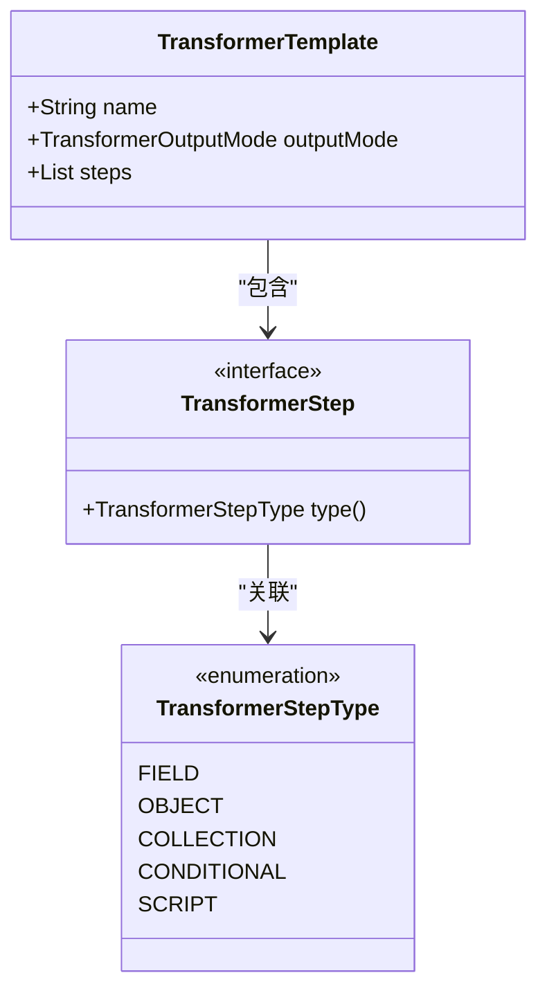
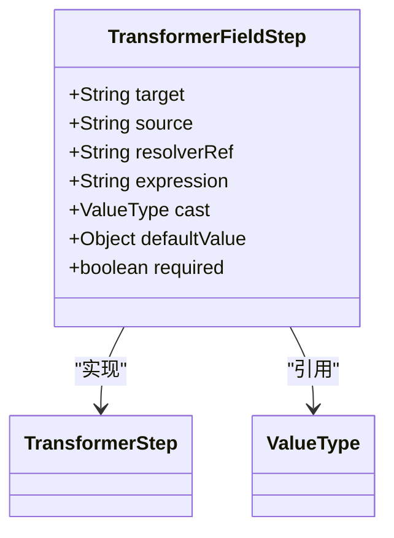
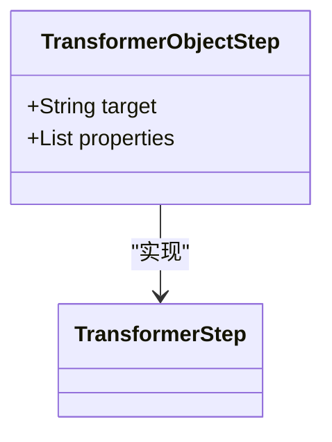
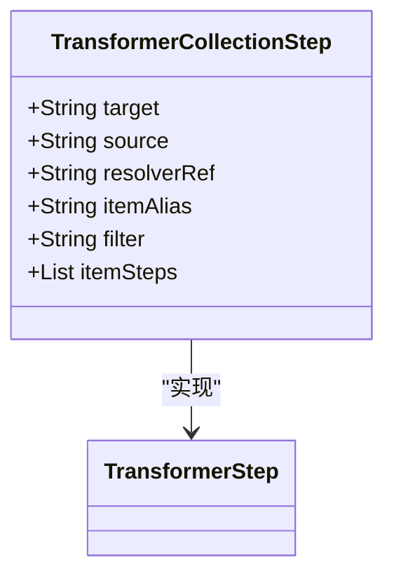
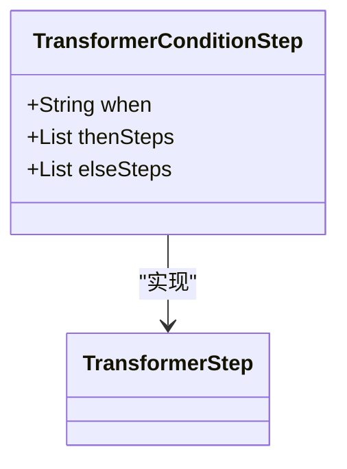
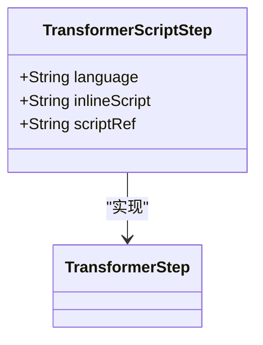
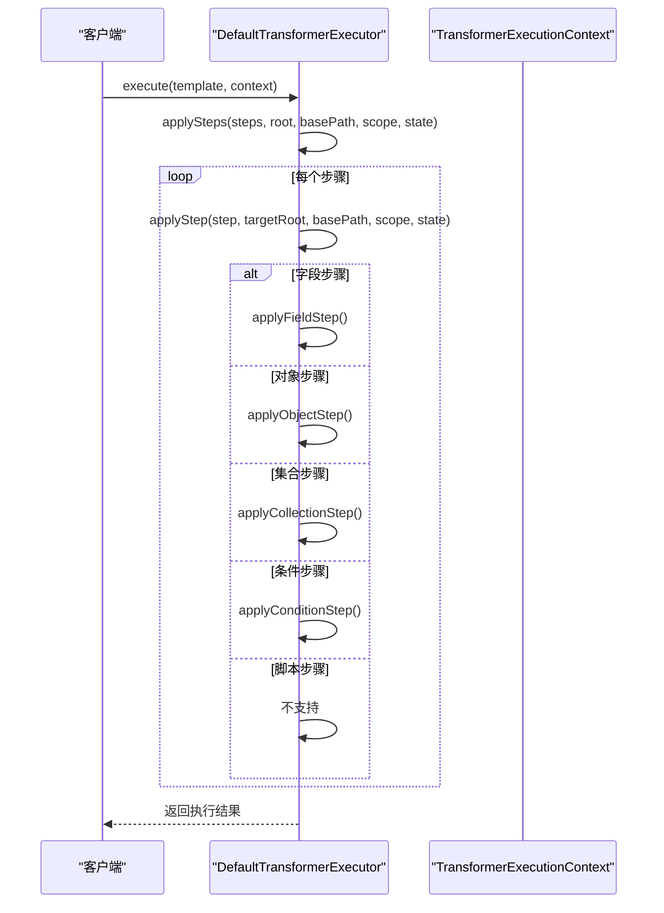
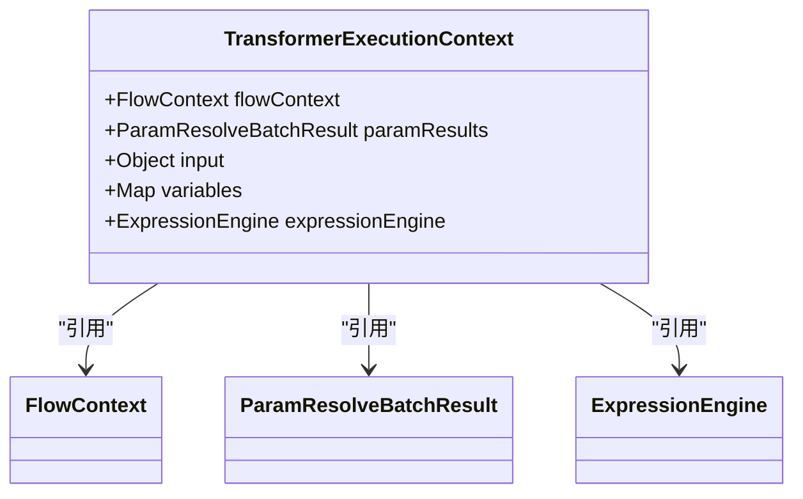
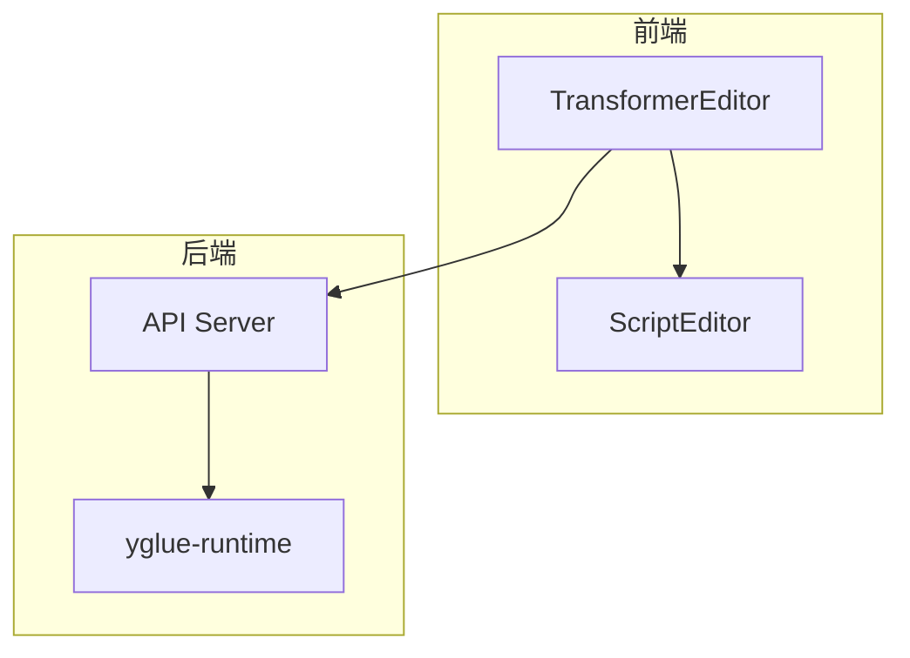

# Transformer DSL

<cite>
**本文档引用的文件**  
- [TransformerTemplate.java](file://yglue-runtime/src/main/java/org/yglue/flow/runtime/core/transformer/dsl/TransformerTemplate.java)
- [TransformerStepType.java](file://yglue-runtime/src/main/java/org/yglue/flow/runtime/core/transformer/dsl/TransformerStepType.java)
- [TransformerStep.java](file://yglue-runtime/src/main/java/org/yglue/flow/runtime/core/transformer/dsl/TransformerStep.java)
- [TransformerFieldStep.java](file://yglue-runtime/src/main/java/org/yglue/flow/runtime/core/transformer/dsl/TransformerFieldStep.java)
- [TransformerObjectStep.java](file://yglue-runtime/src/main/java/org/yglue/flow/runtime/core/transformer/dsl/TransformerObjectStep.java)
- [TransformerCollectionStep.java](file://yglue-runtime/src/main/java/org/yglue/flow/runtime/core/transformer/dsl/TransformerCollectionStep.java)
- [TransformerConditionStep.java](file://yglue-runtime/src/main/java/org/yglue/flow/runtime/core/transformer/dsl/TransformerConditionStep.java)
- [TransformerScriptStep.java](file://yglue-runtime/src/main/java/org/yglue/flow/runtime/core/transformer/dsl/TransformerScriptStep.java)
- [DefaultTransformerExecutor.java](file://yglue-runtime/src/main/java/org/yglue/flow/runtime/core/transformer/runtime/DefaultTransformerExecutor.java)
- [TransformerExecutionContext.java](file://yglue-runtime/src/main/java/org/yglue/flow/runtime/core/transformer/runtime/TransformerExecutionContext.java)
- [TransformerEditor.vue](file://apps/ygflow-orchestrator-ui/src/components/TransformerEditor.vue)
- [TRANSFORMER_USAGE.md](file://apps/ygflow-orchestrator-ui/docs/TRANSFORMER_USAGE.md)
</cite>

## 目录
1. [简介](#简介)
2. [核心概念](#核心概念)
3. [步骤类型详解](#步骤类型详解)
4. [TransformerTemplate 解析与执行](#transformertemplate-解析与执行)
5. [执行上下文](#执行上下文)
6. [可视化编辑体验](#可视化编辑体验)
7. [最佳实践与示例](#最佳实践与示例)
8. [总结](#总结)

## 简介

Transformer DSL 是一个用于数据映射、转换和过滤的领域特定语言（DSL），它允许用户通过声明式的方式定义复杂的数据转换逻辑。该 DSL 被设计为灵活且易于使用，支持多种步骤类型，包括对象、集合、字段、条件和脚本等。通过 Transformer DSL，用户可以轻松地将输入数据转换为目标格式，满足各种业务需求。

**本节来源**
- [TRANSFORMER_USAGE.md](file://apps/ygflow-orchestrator-ui/docs/TRANSFORMER_USAGE.md#概述)

## 核心概念

Transformer DSL 的核心概念包括 `TransformerTemplate`、`TransformerStep` 和 `TransformerStepType`。`TransformerTemplate` 是一个记录类，包含模板名称、输出模式和步骤列表。`TransformerStep` 是一个接口，定义了所有步骤类型必须实现的 `type()` 方法。`TransformerStepType` 是一个枚举类，定义了所有可用的步骤类型。



**图示来源**
- [TransformerTemplate.java](file://yglue-runtime/src/main/java/org/yglue/flow/runtime/core/transformer/dsl/TransformerTemplate.java)
- [TransformerStep.java](file://yglue-runtime/src/main/java/org/yglue/flow/runtime/core/transformer/dsl/TransformerStep.java)
- [TransformerStepType.java](file://yglue-runtime/src/main/java/org/yglue/flow/runtime/core/transformer/dsl/TransformerStepType.java)

**本节来源**
- [TransformerTemplate.java](file://yglue-runtime/src/main/java/org/yglue/flow/runtime/core/transformer/dsl/TransformerTemplate.java)
- [TransformerStep.java](file://yglue-runtime/src/main/java/org/yglue/flow/runtime/core/transformer/dsl/TransformerStep.java)
- [TransformerStepType.java](file://yglue-runtime/src/main/java/org/yglue/flow/runtime/core/transformer/dsl/TransformerStepType.java)

## 步骤类型详解

### 字段步骤 (Field Step)

字段步骤用于将源字段的值映射到目标字段。它可以处理简单的值映射，也可以进行类型转换和默认值设置。



**图示来源**
- [TransformerFieldStep.java](file://yglue-runtime/src/main/java/org/yglue/flow/runtime/core/transformer/dsl/TransformerFieldStep.java)

**本节来源**
- [TransformerFieldStep.java](file://yglue-runtime/src/main/java/org/yglue/flow/runtime/core/transformer/dsl/TransformerFieldStep.java)

### 对象步骤 (Object Step)

对象步骤用于创建嵌套的对象结构。它允许用户定义一个目标字段，并在其中添加多个子步骤来构建复杂的对象。



**图示来源**
- [TransformerObjectStep.java](file://yglue-runtime/src/main/java/org/yglue/flow/runtime/core/transformer/dsl/TransformerObjectStep.java)

**本节来源**
- [TransformerObjectStep.java](file://yglue-runtime/src/main/java/org/yglue/flow/runtime/core/transformer/dsl/TransformerObjectStep.java)

### 集合步骤 (Collection Step)

集合步骤用于处理集合类型的输入数据。它可以遍历集合中的每个元素，并对每个元素应用一系列子步骤。



**图示来源**
- [TransformerCollectionStep.java](file://yglue-runtime/src/main/java/org/yglue/flow/runtime/core/transformer/dsl/TransformerCollectionStep.java)

**本节来源**
- [TransformerCollectionStep.java](file://yglue-runtime/src/main/java/org/yglue/flow/runtime/core/transformer/dsl/TransformerCollectionStep.java)

### 条件步骤 (Condition Step)

条件步骤允许用户根据某个条件表达式的值来决定执行哪一组子步骤。这使得 DSL 具备了分支逻辑的能力。



**图示来源**
- [TransformerConditionStep.java](file://yglue-runtime/src/main/java/org/yglue/flow/runtime/core/transformer/dsl/TransformerConditionStep.java)

**本节来源**
- [TransformerConditionStep.java](file://yglue-runtime/src/main/java/org/yglue/flow/runtime/core/transformer/dsl/TransformerConditionStep.java)

### 脚本步骤 (Script Step)

脚本步骤允许用户嵌入 Groovy 脚本或其他语言的代码片段，以执行复杂的逻辑处理。这是最灵活的步骤类型，适用于无法通过其他步骤类型实现的复杂场景。



**图示来源**
- [TransformerScriptStep.java](file://yglue-runtime/src/main/java/org/yglue/flow/runtime/core/transformer/dsl/TransformerScriptStep.java)

**本节来源**
- [TransformerScriptStep.java](file://yglue-runtime/src/main/java/org/yglue/flow/runtime/core/transformer/dsl/TransformerScriptStep.java)

## TransformerTemplate 解析与执行

`TransformerTemplate` 是 Transformer DSL 的核心数据结构，它包含了整个转换逻辑的定义。`DefaultTransformerExecutor` 类负责解析和执行 `TransformerTemplate`。执行过程从 `execute` 方法开始，依次处理每个步骤，并根据步骤类型调用相应的处理方法。



**图示来源**
- [DefaultTransformerExecutor.java](file://yglue-runtime/src/main/java/org/yglue/flow/runtime/core/transformer/runtime/DefaultTransformerExecutor.java)

**本节来源**
- [DefaultTransformerExecutor.java](file://yglue-runtime/src/main/java/org/yglue/flow/runtime/core/transformer/runtime/DefaultTransformerExecutor.java)

## 执行上下文

`TransformerExecutionContext` 提供了执行 Transformer DSL 所需的所有上下文信息，包括流程上下文、参数解析结果、输入数据、变量和表达式引擎。这些信息在执行过程中被用来解析表达式、访问数据和执行逻辑。



**图示来源**
- [TransformerExecutionContext.java](file://yglue-runtime/src/main/java/org/yglue/flow/runtime/core/transformer/runtime/TransformerExecutionContext.java)

**本节来源**
- [TransformerExecutionContext.java](file://yglue-runtime/src/main/java/org/yglue/flow/runtime/core/transformer/runtime/TransformerExecutionContext.java)

## 可视化编辑体验

`TransformerEditor.vue` 组件提供了 Transformer DSL 的可视化编辑界面。用户可以通过图形化的方式配置各种步骤类型，而无需直接编写 JSON 或代码。编辑器提供了智能提示、语法高亮和实时预览等功能，极大地提升了开发效率。



**图示来源**
- [TransformerEditor.vue](file://apps/ygflow-orchestrator-ui/src/components/TransformerEditor.vue)

**本节来源**
- [TransformerEditor.vue](file://apps/ygflow-orchestrator-ui/src/components/TransformerEditor.vue)

## 最佳实践与示例

### 场景1：将 String 转换为 Map

```groovy
[
    success: true,
    message: input,
    projectKey: ctx['request.path.projectKey'],
    timestamp: System.currentTimeMillis()
]
```

### 场景2：处理集合数据

```groovy
mapValues(resolved.items) { item ->
  [id: item.id, qty: item.count]
}
```

### 场景3：条件分支

```groovy
if (input.status == 'success') {
    [result: 'ok', code: 200]
} else {
    [result: 'error', code: 400]
}
```

**本节来源**
- [TRANSFORMER_USAGE.md](file://apps/ygflow-orchestrator-ui/docs/TRANSFORMER_USAGE.md#使用场景示例)

## 总结

Transformer DSL 提供了一种强大而灵活的方式来定义数据转换逻辑。通过组合不同的步骤类型，用户可以构建出复杂的转换流程。结合可视化编辑器，即使是非技术人员也能轻松上手。未来可以考虑增加对脚本步骤的支持，进一步提升 DSL 的灵活性和表达能力。

**本节来源**
- [TRANSFORMER_USAGE.md](file://apps/ygflow-orchestrator-ui/docs/TRANSFORMER_USAGE.md#最佳实践)