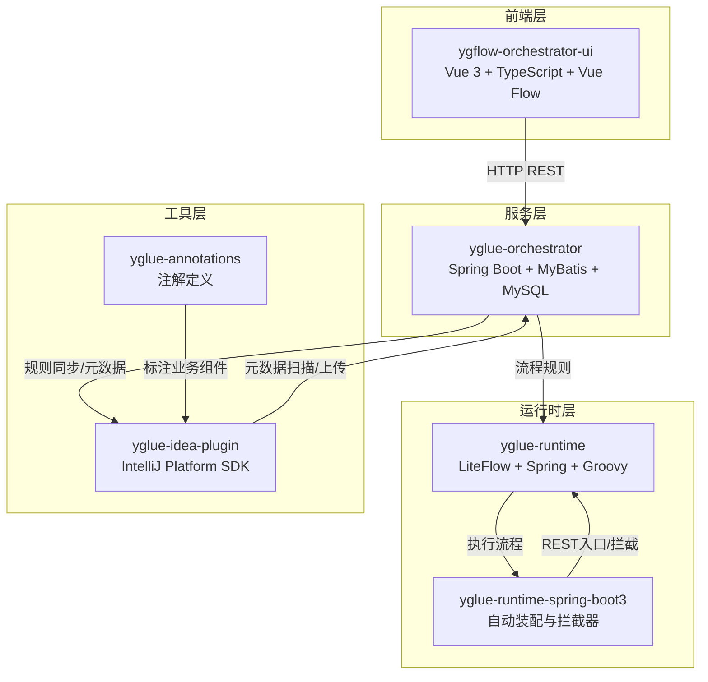
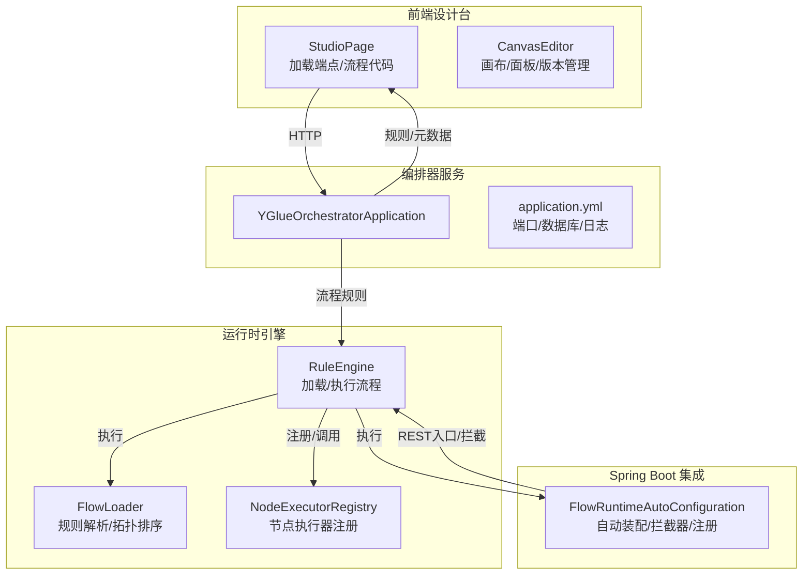
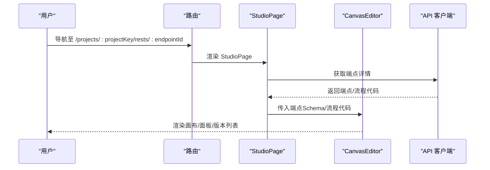
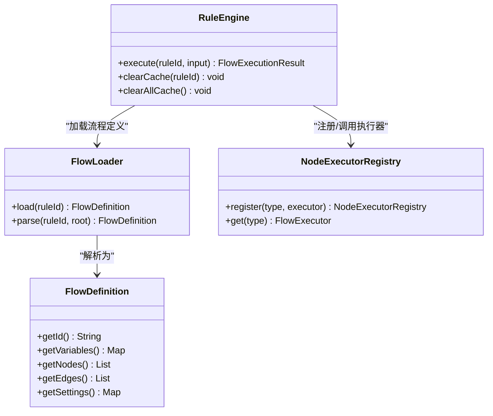
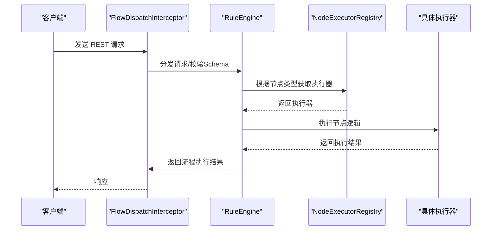
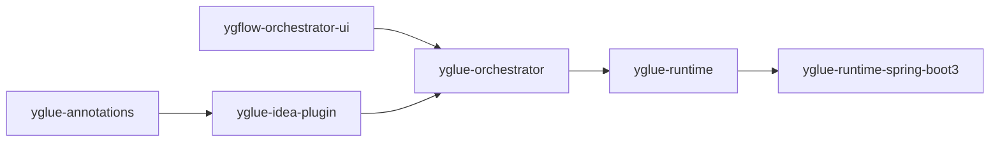

# 产品介绍

<cite>
**本文引用的文件**
- [README.md](file://README.md)
- [pom.xml](file://pom.xml)
- [apps/ygflow-orchestrator-ui/src/main.ts](file://apps/ygflow-orchestrator-ui/src/main.ts)
- [apps/ygflow-orchestrator-ui/src/App.vue](file://apps/ygflow-orchestrator-ui/src/App.vue)
- [apps/ygflow-orchestrator-ui/src/router/index.ts](file://apps/ygflow-orchestrator-ui/src/router/index.ts)
- [apps/ygflow-orchestrator-ui/src/pages/StudioPage.vue](file://apps/ygflow-orchestrator-ui/src/pages/StudioPage.vue)
- [apps/ygflow-orchestrator-ui/src/components/CanvasEditor.vue](file://apps/ygflow-orchestrator-ui/src/components/CanvasEditor.vue)
- [apps/ygflow-orchestrator-ui/package.json](file://apps/ygflow-orchestrator-ui/package.json)
- [yglue-orchestrator/src/main/java/org/yglue/flow/orch/YGlueOrchestratorApplication.java](file://yglue-orchestrator/src/main/java/org/yglue/flow/orch/YGlueOrchestratorApplication.java)
- [yglue-orchestrator/src/main/resources/application.yml](file://yglue-orchestrator/src/main/resources/application.yml)
- [yglue-runtime/src/main/java/org/yglue/flow/runtime/RuleEngine.java](file://yglue-runtime/src/main/java/org/yglue/flow/runtime/RuleEngine.java)
- [yglue-runtime/src/main/java/org/yglue/flow/runtime/core/definition/FlowLoader.java](file://yglue-runtime/src/main/java/org/yglue/flow/runtime/core/definition/FlowLoader.java)
- [yglue-runtime/src/main/java/org/yglue/flow/runtime/core/definition/FlowDefinition.java](file://yglue-runtime/src/main/java/org/yglue/flow/runtime/core/definition/FlowDefinition.java)
- [yglue-runtime/src/main/java/org/yglue/flow/runtime/core/NodeExecutorRegistry.java](file://yglue-runtime/src/main/java/org/yglue/flow/runtime/core/NodeExecutorRegistry.java)
- [yglue-runtime/src/main/java/org/yglue/flow/runtime/core/FlowExecutor.java](file://yglue-runtime/src/main/java/org/yglue/flow/runtime/core/FlowExecutor.java)
- [yglue-runtime-spring-boot3/src/main/java/org/yglue/flow/runtime/spring/FlowRuntimeAutoConfiguration.java](file://yglue-runtime-spring-boot3/src/main/java/org/yglue/flow/runtime/spring/FlowRuntimeAutoConfiguration.java)
- [yglue-idea-plugin/build.gradle.kts](file://yglue-idea-plugin/build.gradle.kts)
- [yglue-annotations/src/main/java/org/yglue/flow/annotations/FlowApi.java](file://yglue-annotations/src/main/java/org/yglue/flow/annotations/FlowApi.java)
- [yglue-annotations/src/main/java/org/yglue/flow/annotations/FlowModel.java](file://yglue-annotations/src/main/java/org/yglue/flow/annotations/FlowModel.java)
</cite>

## 目录
1. [引言](#引言)
2. [项目结构](#项目结构)
3. [核心组件](#核心组件)
4. [架构总览](#架构总览)
5. [组件详解](#组件详解)
6. [依赖关系分析](#依赖关系分析)
7. [性能考量](#性能考量)
8. [故障排查指南](#故障排查指南)
9. [结论](#结论)
10. [附录](#附录)

## 引言
YGFlow Suite（易构流程套件）是一个面向企业级业务流程的低代码编排平台，覆盖“开发者 IDE → 可视化设计台 → 运行时引擎”的全链路，实现入参治理、数据转换和流程调度的统一管理。产品专注于降低研发联调成本、提升上线效率，并提供可扩展的生态能力。

- 设计目标
  - 通过可视化流程设计与规则驱动，简化复杂业务编排。
  - 统一参数解析、数据转换与流程执行，形成闭环的流程治理。
  - 以插件化与注解体系支撑生态扩展，满足多语言与多框架集成。

- 核心价值主张
  - 降低研发联调成本：通过可视化与规则同步，减少手工对接。
  - 提升上线效率：版本管理、发布与预览一体化，缩短交付周期。
  - 可扩展生态：注解与插件机制，支持多语言与多运行时集成。

- 关键业务问题
  - 参数来源多样且复杂，难以统一治理。
  - 数据转换逻辑分散，缺乏集中式转换引擎。
  - 流程执行缺乏可观测与可追踪，影响运维与排障。
  - 开发者与运行时之间存在规则同步断点，导致版本不一致。

**章节来源**
- [README.md](file://README.md#L1-L120)

## 项目结构
YGFlow Suite 采用多模块聚合工程，围绕“前端设计台 + 编排器服务 + 运行时引擎 + IDEA 插件 + 注解定义”的分层架构展开，模块职责清晰、边界明确。

**图表来源**
- [pom.xml](file://pom.xml#L19-L26)
- [README.md](file://README.md#L168-L193)

**章节来源**
- [pom.xml](file://pom.xml#L19-L26)
- [README.md](file://README.md#L168-L193)

## 核心组件
- 可视化设计台（ygflow-orchestrator-ui）
  - 基于 Vue 3 + TypeScript + Vue Flow，提供流程画布、节点配置、版本管理与规则预览。
  - 通过路由与页面组件组织，StudioPage 负责加载端点与流程代码，CanvasEditor 负责画布交互。

- 编排器服务（yglue-orchestrator）
  - Spring Boot 应用，提供流程定义、入口点、元数据与规则同步的 REST API。
  - 默认端口与数据库配置在 application.yml 中定义。

- 运行时引擎（yglue-runtime）
  - 基于 LiteFlow 的流程执行引擎，负责加载与执行流程规则。
  - RuleEngine 作为门面，封装 FlowLoader 与 LiteFlowRuleEngine；FlowLoader 支持新旧两种规则格式解析与拓扑排序。

- Spring Boot 集成（yglue-runtime-spring-boot3）
  - 自动装配 RuleEngine、拦截器、REST 入口注册与请求校验。
  - 通过 NodeExecutorRegistry 注册各类节点执行器（服务、分支、转换、REST 等）。

- IDEA 插件（yglue-idea-plugin）
  - 提供元数据扫描、规则文件同步与自动上传，加速开发与调试。
  - Gradle 配置约束 JDK 与平台版本，确保兼容性。

- 注解定义（yglue-annotations）
  - FlowApi 与 FlowModel 注解用于标记业务组件与领域模型，支撑元数据扫描与规则生成。

**章节来源**
- [apps/ygflow-orchestrator-ui/src/main.ts](file://apps/ygflow-orchestrator-ui/src/main.ts#L1-L9)
- [apps/ygflow-orchestrator-ui/src/App.vue](file://apps/ygflow-orchestrator-ui/src/App.vue#L1-L9)
- [apps/ygflow-orchestrator-ui/src/router/index.ts](file://apps/ygflow-orchestrator-ui/src/router/index.ts#L1-L18)
- [apps/ygflow-orchestrator-ui/src/pages/StudioPage.vue](file://apps/ygflow-orchestrator-ui/src/pages/StudioPage.vue#L1-L120)
- [apps/ygflow-orchestrator-ui/src/components/CanvasEditor.vue](file://apps/ygflow-orchestrator-ui/src/components/CanvasEditor.vue#L1-L140)
- [yglue-orchestrator/src/main/java/org/yglue/flow/orch/YGlueOrchestratorApplication.java](file://yglue-orchestrator/src/main/java/org/yglue/flow/orch/YGlueOrchestratorApplication.java#L1-L12)
- [yglue-orchestrator/src/main/resources/application.yml](file://yglue-orchestrator/src/main/resources/application.yml#L1-L23)
- [yglue-runtime/src/main/java/org/yglue/flow/runtime/RuleEngine.java](file://yglue-runtime/src/main/java/org/yglue/flow/runtime/RuleEngine.java#L1-L126)
- [yglue-runtime/src/main/java/org/yglue/flow/runtime/core/definition/FlowLoader.java](file://yglue-runtime/src/main/java/org/yglue/flow/runtime/core/definition/FlowLoader.java#L1-L180)
- [yglue-runtime/src/main/java/org/yglue/flow/runtime/core/definition/FlowDefinition.java](file://yglue-runtime/src/main/java/org/yglue/flow/runtime/core/definition/FlowDefinition.java#L10-L77)
- [yglue-runtime/src/main/java/org/yglue/flow/runtime/core/NodeExecutorRegistry.java](file://yglue-runtime/src/main/java/org/yglue/flow/runtime/core/NodeExecutorRegistry.java#L6-L24)
- [yglue-runtime/src/main/java/org/yglue/flow/runtime/core/FlowExecutor.java](file://yglue-runtime/src/main/java/org/yglue/flow/runtime/core/FlowExecutor.java#L2-L4)
- [yglue-runtime-spring-boot3/src/main/java/org/yglue/flow/runtime/spring/FlowRuntimeAutoConfiguration.java](file://yglue-runtime-spring-boot3/src/main/java/org/yglue/flow/runtime/spring/FlowRuntimeAutoConfiguration.java#L1-L155)
- [yglue-idea-plugin/build.gradle.kts](file://yglue-idea-plugin/build.gradle.kts#L1-L64)
- [yglue-annotations/src/main/java/org/yglue/flow/annotations/FlowApi.java](file://yglue-annotations/src/main/java/org/yglue/flow/annotations/FlowApi.java#L1-L33)
- [yglue-annotations/src/main/java/org/yglue/flow/annotations/FlowModel.java](file://yglue-annotations/src/main/java/org/yglue/flow/annotations/FlowModel.java#L1-L49)

## 架构总览
系统采用分层架构与微内核模式：
- 分层架构：前端设计台、编排器服务、运行时引擎、IDEA 插件与注解定义逐层解耦，职责清晰。
- 微内核模式：运行时引擎以 RuleEngine 为核心，通过 NodeExecutorRegistry 注册节点执行器，支持插件化扩展。
- 插件化设计：IDEA 插件与注解体系为生态扩展提供基础，支持多语言与多框架集成。

**图表来源**
- [apps/ygflow-orchestrator-ui/src/pages/StudioPage.vue](file://apps/ygflow-orchestrator-ui/src/pages/StudioPage.vue#L1-L120)
- [apps/ygflow-orchestrator-ui/src/components/CanvasEditor.vue](file://apps/ygflow-orchestrator-ui/src/components/CanvasEditor.vue#L1-L140)
- [yglue-orchestrator/src/main/java/org/yglue/flow/orch/YGlueOrchestratorApplication.java](file://yglue-orchestrator/src/main/java/org/yglue/flow/orch/YGlueOrchestratorApplication.java#L1-L12)
- [yglue-orchestrator/src/main/resources/application.yml](file://yglue-orchestrator/src/main/resources/application.yml#L1-L23)
- [yglue-runtime/src/main/java/org/yglue/flow/runtime/RuleEngine.java](file://yglue-runtime/src/main/java/org/yglue/flow/runtime/RuleEngine.java#L1-L126)
- [yglue-runtime/src/main/java/org/yglue/flow/runtime/core/definition/FlowLoader.java](file://yglue-runtime/src/main/java/org/yglue/flow/runtime/core/definition/FlowLoader.java#L1-L180)
- [yglue-runtime/src/main/java/org/yglue/flow/runtime/core/NodeExecutorRegistry.java](file://yglue-runtime/src/main/java/org/yglue/flow/runtime/core/NodeExecutorRegistry.java#L6-L24)
- [yglue-runtime-spring-boot3/src/main/java/org/yglue/flow/runtime/spring/FlowRuntimeAutoConfiguration.java](file://yglue-runtime-spring-boot3/src/main/java/org/yglue/flow/runtime/spring/FlowRuntimeAutoConfiguration.java#L1-L155)

## 组件详解

### 前端设计台（ygflow-orchestrator-ui）
- 页面与路由
  - ProjectsPage、RestLayout、StudioPage 通过 Vue Router 组织，StudioPage 负责加载端点与流程代码，支持从端点或入口配置中提取流程代码。
  - CanvasEditor 作为画布容器，整合工具栏、画布表面、检查器与侧边板，支持节点/连线操作与版本管理。

- 技术栈
  - Vue 3 + TypeScript + Vue Flow + Monaco Editor + Vite，提供流畅的可视化体验与代码编辑能力。

**图表来源**
- [apps/ygflow-orchestrator-ui/src/router/index.ts](file://apps/ygflow-orchestrator-ui/src/router/index.ts#L1-L18)
- [apps/ygflow-orchestrator-ui/src/pages/StudioPage.vue](file://apps/ygflow-orchestrator-ui/src/pages/StudioPage.vue#L1-L120)
- [apps/ygflow-orchestrator-ui/src/components/CanvasEditor.vue](file://apps/ygflow-orchestrator-ui/src/components/CanvasEditor.vue#L1-L140)

**章节来源**
- [apps/ygflow-orchestrator-ui/src/router/index.ts](file://apps/ygflow-orchestrator-ui/src/router/index.ts#L1-L18)
- [apps/ygflow-orchestrator-ui/src/pages/StudioPage.vue](file://apps/ygflow-orchestrator-ui/src/pages/StudioPage.vue#L1-L120)
- [apps/ygflow-orchestrator-ui/src/components/CanvasEditor.vue](file://apps/ygflow-orchestrator-ui/src/components/CanvasEditor.vue#L1-L140)
- [apps/ygflow-orchestrator-ui/package.json](file://apps/ygflow-orchestrator-ui/package.json#L1-L34)

### 编排器服务（yglue-orchestrator）
- 启动与配置
  - Spring Boot 应用入口，application.yml 定义数据库连接、MyBatis 映射位置、服务端口与日志输出。

- 职责
  - 提供流程定义、入口点、元数据与规则同步的 REST API，支撑前端设计台与 IDEA 插件。

**章节来源**
- [yglue-orchestrator/src/main/java/org/yglue/flow/orch/YGlueOrchestratorApplication.java](file://yglue-orchestrator/src/main/java/org/yglue/flow/orch/YGlueOrchestratorApplication.java#L1-L12)
- [yglue-orchestrator/src/main/resources/application.yml](file://yglue-orchestrator/src/main/resources/application.yml#L1-L23)

### 运行时引擎（yglue-runtime）
- RuleEngine
  - 作为流程执行门面，封装 FlowLoader 与 LiteFlowRuleEngine；支持开发/生产两种规则加载策略（缓存/重载）。
  - 提供缓存清理接口，便于热更新与调试。

- FlowLoader
  - 支持两种规则格式：旧格式（vars/steps）与新格式（nodes/edges/settings）。
  - 解析节点配置，支持 if/branch/call/set/log/delay 等节点类型；对新格式按 edges 进行拓扑排序，保证执行顺序。

- FlowDefinition
  - 封装流程标识、变量、节点列表、边列表与设置；settings 中包含日志策略等配置。

- NodeExecutorRegistry
  - 注册节点执行器（log、delay、set、if、branch、call、transformer、rest、service 等），实现节点类型与执行器的解耦。

**图表来源**
- [yglue-runtime/src/main/java/org/yglue/flow/runtime/RuleEngine.java](file://yglue-runtime/src/main/java/org/yglue/flow/runtime/RuleEngine.java#L1-L126)
- [yglue-runtime/src/main/java/org/yglue/flow/runtime/core/definition/FlowLoader.java](file://yglue-runtime/src/main/java/org/yglue/flow/runtime/core/definition/FlowLoader.java#L1-L180)
- [yglue-runtime/src/main/java/org/yglue/flow/runtime/core/definition/FlowDefinition.java](file://yglue-runtime/src/main/java/org/yglue/flow/runtime/core/definition/FlowDefinition.java#L10-L77)
- [yglue-runtime/src/main/java/org/yglue/flow/runtime/core/NodeExecutorRegistry.java](file://yglue-runtime/src/main/java/org/yglue/flow/runtime/core/NodeExecutorRegistry.java#L6-L24)
- [yglue-runtime/src/main/java/org/yglue/flow/runtime/core/FlowExecutor.java](file://yglue-runtime/src/main/java/org/yglue/flow/runtime/core/FlowExecutor.java#L2-L4)

**章节来源**
- [yglue-runtime/src/main/java/org/yglue/flow/runtime/RuleEngine.java](file://yglue-runtime/src/main/java/org/yglue/flow/runtime/RuleEngine.java#L1-L126)
- [yglue-runtime/src/main/java/org/yglue/flow/runtime/core/definition/FlowLoader.java](file://yglue-runtime/src/main/java/org/yglue/flow/runtime/core/definition/FlowLoader.java#L1-L180)
- [yglue-runtime/src/main/java/org/yglue/flow/runtime/core/definition/FlowDefinition.java](file://yglue-runtime/src/main/java/org/yglue/flow/runtime/core/definition/FlowDefinition.java#L10-L77)
- [yglue-runtime/src/main/java/org/yglue/flow/runtime/core/NodeExecutorRegistry.java](file://yglue-runtime/src/main/java/org/yglue/flow/runtime/core/NodeExecutorRegistry.java#L6-L24)
- [yglue-runtime/src/main/java/org/yglue/flow/runtime/core/FlowExecutor.java](file://yglue-runtime/src/main/java/org/yglue/flow/runtime/core/FlowExecutor.java#L2-L4)

### Spring Boot 集成（yglue-runtime-spring-boot3）
- 自动装配
  - 注入 SpringAware、FlowExecutor、RestEntryPointRegistry、RequestSchemaValidator。
  - 注册 RuleEngine、EventBus、LoggingExecutionInterceptor、NodeExecutorRegistry 与 FlowOrchestratedAspect。

- 拦截与注册
  - FlowDispatchInterceptor 作为 MVC 拦截器，配合 RuleEngine 与 RestEntryPointRegistry 实现请求分发。
  - RestInvocationRegistry 注册 Bean 与 HTTP 两类 REST 调用策略，支持服务节点与 REST 节点的统一调用。

**图表来源**
- [yglue-runtime-spring-boot3/src/main/java/org/yglue/flow/runtime/spring/FlowRuntimeAutoConfiguration.java](file://yglue-runtime-spring-boot3/src/main/java/org/yglue/flow/runtime/spring/FlowRuntimeAutoConfiguration.java#L1-L155)

**章节来源**
- [yglue-runtime-spring-boot3/src/main/java/org/yglue/flow/runtime/spring/FlowRuntimeAutoConfiguration.java](file://yglue-runtime-spring-boot3/src/main/java/org/yglue/flow/runtime/spring/FlowRuntimeAutoConfiguration.java#L1-L155)

### IDEA 插件（yglue-idea-plugin）
- 功能
  - 元数据扫描与上传、规则文件同步、自动上传与心跳机制，保障开发与运行时的一致性。
- 构建
  - Gradle 配置约束 JDK 与平台版本，确保与 IntelliJ IDEA 2024.2 兼容。

**章节来源**
- [yglue-idea-plugin/build.gradle.kts](file://yglue-idea-plugin/build.gradle.kts#L1-L64)

### 注解定义（yglue-annotations）
- FlowApi
  - 用于标记 Flow API 类，支持 bean 名称、显示名称、描述与版本。
- FlowModel
  - 用于标记在流程编排中可复用的领域模型，支持标识、名称、描述、分类、版本与标签。

**章节来源**
- [yglue-annotations/src/main/java/org/yglue/flow/annotations/FlowApi.java](file://yglue-annotations/src/main/java/org/yglue/flow/annotations/FlowApi.java#L1-L33)
- [yglue-annotations/src/main/java/org/yglue/flow/annotations/FlowModel.java](file://yglue-annotations/src/main/java/org/yglue/flow/annotations/FlowModel.java#L1-L49)

## 依赖关系分析
- 模块依赖
  - yglue-runtime 与 yglue-runtime-spring-boot3 依赖 LiteFlow 与 Spring 生态。
  - yglue-orchestrator 依赖 MyBatis 与 MySQL，提供持久化与 REST API。
  - yglue-idea-plugin 依赖 IntelliJ 平台 SDK，提供 IDE 集成能力。
  - yglue-annotations 为注解定义模块，被 IDEA 插件与业务代码使用。

- 组件耦合
  - 前端设计台与编排器服务通过 REST API 解耦；编排器服务与运行时引擎通过规则文件解耦。
  - 运行时引擎通过 NodeExecutorRegistry 与具体执行器解耦，支持插件化扩展。

**图表来源**
- [pom.xml](file://pom.xml#L19-L26)
- [README.md](file://README.md#L168-L193)

**章节来源**
- [pom.xml](file://pom.xml#L19-L26)
- [README.md](file://README.md#L168-L193)

## 性能考量
- 规则加载策略
  - 生产环境建议启用缓存（RuleEngine 默认行为），以减少重复加载带来的开销。
  - 开发环境可开启重载（reloadOnExecution），便于快速迭代。

- 拓扑排序
  - FlowLoader 在新格式下根据 edges 进行拓扑排序，确保执行顺序正确，避免不必要的回溯与错误。

- 拦截与注册
  - FlowDispatchInterceptor 与 NodeExecutorRegistry 的组合，使请求分发与节点执行解耦，有利于性能优化与扩展。

**章节来源**
- [yglue-runtime/src/main/java/org/yglue/flow/runtime/RuleEngine.java](file://yglue-runtime/src/main/java/org/yglue/flow/runtime/RuleEngine.java#L1-L126)
- [yglue-runtime/src/main/java/org/yglue/flow/runtime/core/definition/FlowLoader.java](file://yglue-runtime/src/main/java/org/yglue/flow/runtime/core/definition/FlowLoader.java#L1-L180)
- [yglue-runtime-spring-boot3/src/main/java/org/yglue/flow/runtime/spring/FlowRuntimeAutoConfiguration.java](file://yglue-runtime-spring-boot3/src/main/java/org/yglue/flow/runtime/spring/FlowRuntimeAutoConfiguration.java#L1-L155)

## 故障排查指南
- 前端无法加载端点或流程代码
  - 检查 StudioPage 的端点加载逻辑与 API 客户端调用链，确认网络与权限。
  - 查看 CanvasEditor 的状态消息与错误提示，定位画布渲染问题。

- 编排器服务启动失败
  - 检查 application.yml 中数据库连接、端口与日志配置，确认 MySQL 可访问且账号密码正确。

- 运行时执行异常
  - 检查 RuleEngine 的缓存与重载配置，必要时清理缓存后重试。
  - 确认 FlowLoader 的规则格式与节点配置，特别是 if/branch/call/set/log/delay 等节点的配置是否完整。

- Spring Boot 集成问题
  - 检查 FlowRuntimeAutoConfiguration 中的 Bean 注册与拦截器配置，确认 RuleEngine、NodeExecutorRegistry 与 RestEntryPointRegistry 初始化成功。

**章节来源**
- [apps/ygflow-orchestrator-ui/src/pages/StudioPage.vue](file://apps/ygflow-orchestrator-ui/src/pages/StudioPage.vue#L1-L120)
- [apps/ygflow-orchestrator-ui/src/components/CanvasEditor.vue](file://apps/ygflow-orchestrator-ui/src/components/CanvasEditor.vue#L1-L140)
- [yglue-orchestrator/src/main/resources/application.yml](file://yglue-orchestrator/src/main/resources/application.yml#L1-L23)
- [yglue-runtime/src/main/java/org/yglue/flow/runtime/RuleEngine.java](file://yglue-runtime/src/main/java/org/yglue/flow/runtime/RuleEngine.java#L1-L126)
- [yglue-runtime-spring-boot3/src/main/java/org/yglue/flow/runtime/spring/FlowRuntimeAutoConfiguration.java](file://yglue-runtime-spring-boot3/src/main/java/org/yglue/flow/runtime/spring/FlowRuntimeAutoConfiguration.java#L1-L155)

## 结论
YGFlow Suite 通过“前端设计台 + 编排器服务 + 运行时引擎 + IDEA 插件 + 注解定义”的分层架构与微内核模式，实现了低代码流程编排的全链路闭环。其插件化设计与注解体系为生态扩展提供了坚实基础，能够有效降低研发联调成本、提升上线效率，并支持多语言与多框架集成。

## 附录
- 快速开始与环境要求
  - Java 17+、Maven 3.8+、Node.js 18+（前端）、MySQL 8.0+（编排器服务）、IntelliJ IDEA 2024.2+（IDEA 插件）。
- 技术栈概览
  - 后端：Spring Boot、MyBatis、LiteFlow、Groovy、MySQL。
  - 前端：Vue 3、TypeScript、Vue Flow、Monaco Editor、Vite。
  - 工具：IntelliJ Platform SDK、Gradle、Maven。

**章节来源**
- [README.md](file://README.md#L66-L167)