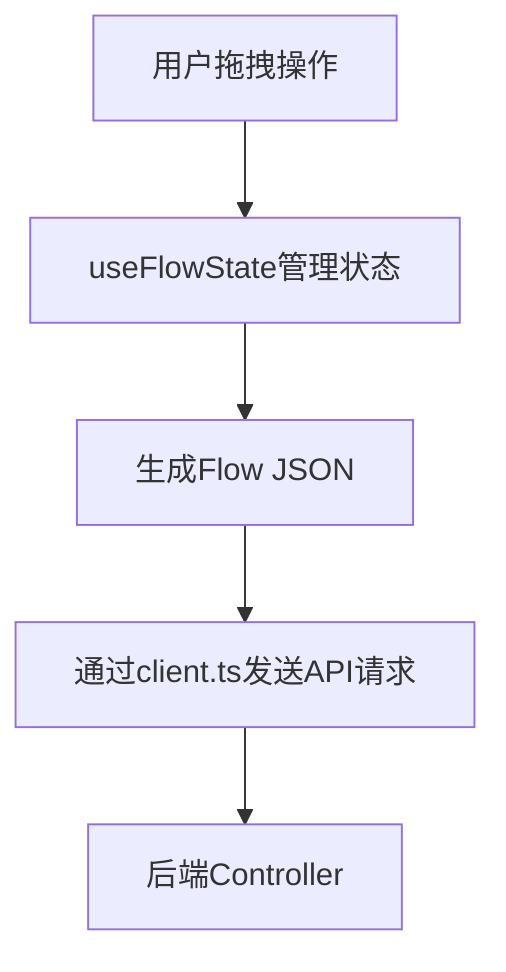
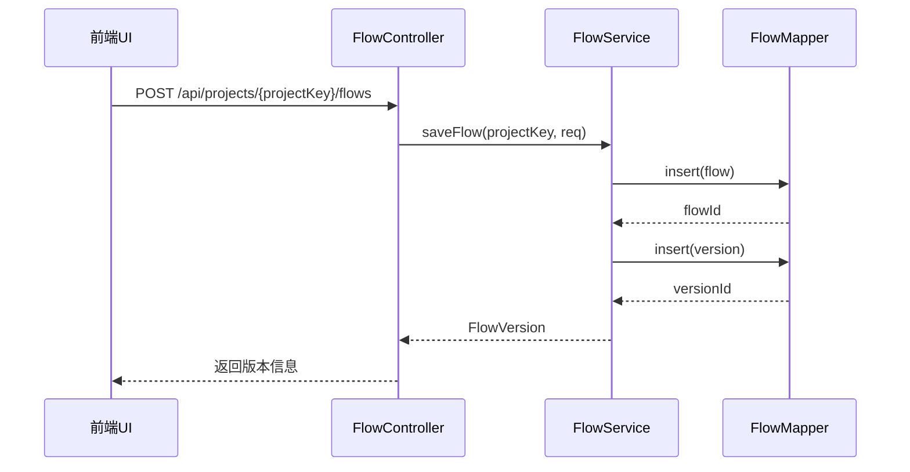
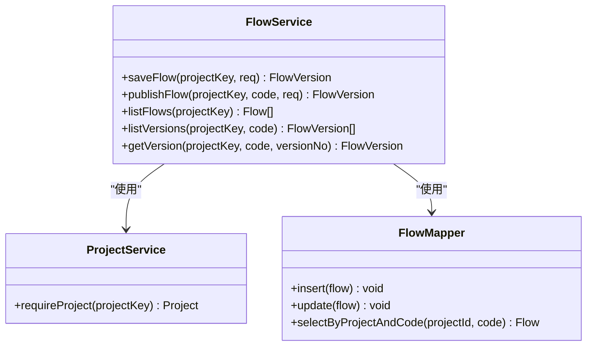
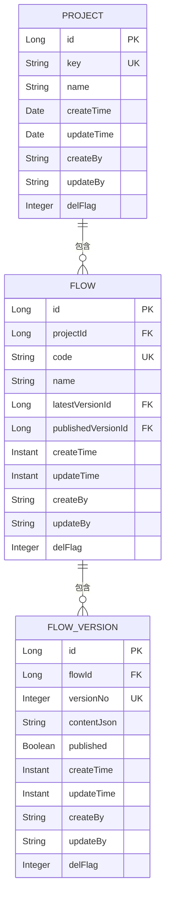
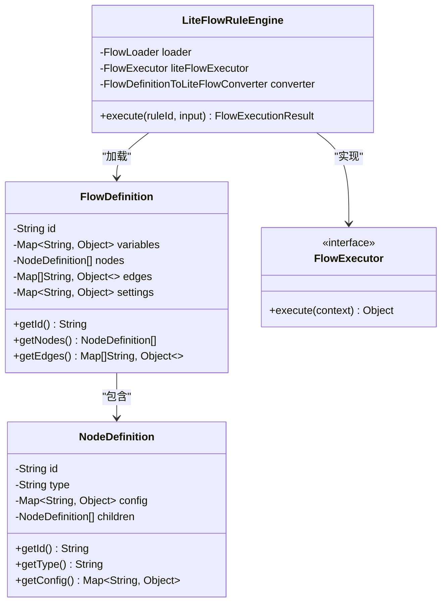
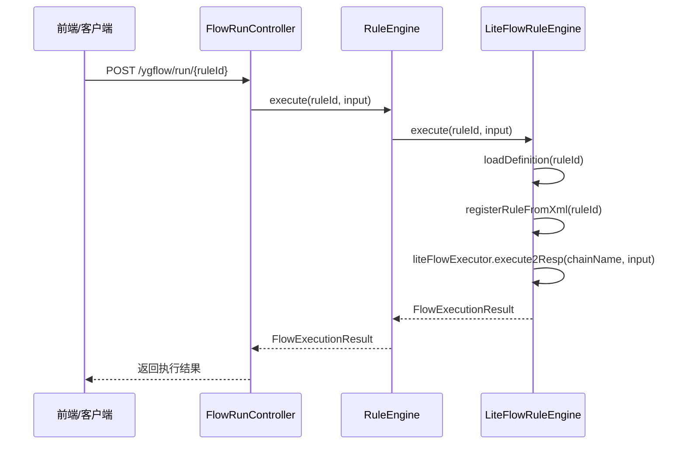
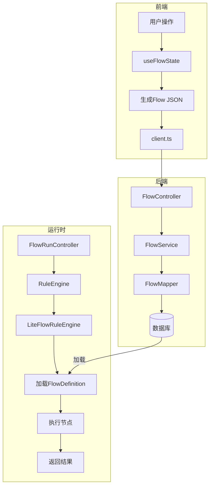

# 数据流设计

<cite>
**本文档引用的文件**
- [main.ts](file://apps/ygflow-orchestrator-ui/src/main.ts)
- [App.vue](file://apps/ygflow-orchestrator-ui/src/App.vue)
- [client.ts](file://apps/ygflow-orchestrator-ui/src/api/client.ts)
- [useFlowState.ts](file://apps/ygflow-orchestrator-ui/src/components/composables/useFlowState.ts)
- [FlowController.java](file://yglue-orchestrator/src/main/java/org/yglue/flow/orch/web/controller/FlowController.java)
- [Flow.java](file://yglue-orchestrator/src/main/java/org/yglue/flow/orch/domain/Flow.java)
- [Project.java](file://yglue-orchestrator/src/main/java/org/yglue/flow/orch/domain/Project.java)
- [FlowService.java](file://yglue-orchestrator/src/main/java/org/yglue/flow/orch/service/FlowService.java)
- [FlowMapper.xml](file://yglue-orchestrator/src/main/resources/mapper/FlowMapper.xml)
- [FlowExecutor.java](file://yglue-runtime/src/main/java/org/yglue/flow/runtime/core/FlowExecutor.java)
- [FlowDefinition.java](file://yglue-runtime/src/main/java/org/yglue/flow/runtime/core/definition/FlowDefinition.java)
- [NodeDefinition.java](file://yglue-runtime/src/main/java/org/yglue/flow/runtime/core/definition/NodeDefinition.java)
- [LiteFlowRuleEngine.java](file://yglue-runtime/src/main/java/org/yglue/flow/runtime/liteflow/LiteFlowRuleEngine.java)
- [FlowRunController.java](file://samples/yglue-sample-service/src/main/java/org/yglue/flow/sample/web/FlowRunController.java)
</cite>

## 目录
1. [简介](#简介)
2. [前端数据流](#前端数据流)
3. [后端控制器与服务](#后端控制器与服务)
4. [数据持久化](#数据持久化)
5. [运行时执行引擎](#运行时执行引擎)
6. [完整数据流图示](#完整数据流图示)

## 简介
本文档详细描述了ygflow-suite系统内部的数据流设计。从用户在前端UI进行拖拽操作开始，到生成REST API请求，再到编排器服务处理并持久化数据，最终由运行时引擎执行的完整数据路径。重点分析了关键数据模型（如Flow、Node、Project）在各层间的传递与转换过程。

## 前端数据流

前端应用使用Vue 3和Vue Flow库构建可视化编排界面。用户在画布上的操作通过composables进行状态管理，并最终通过API客户端发送到后端。



**图示来源**
- [useFlowState.ts](file://apps/ygflow-orchestrator-ui/src/components/composables/useFlowState.ts)
- [client.ts](file://apps/ygflow-orchestrator-ui/src/api/client.ts)

**本节来源**
- [useFlowState.ts](file://apps/ygflow-orchestrator-ui/src/components/composables/useFlowState.ts)
- [client.ts](file://apps/ygflow-orchestrator-ui/src/api/client.ts)

## 后端控制器与服务

后端使用Spring Boot框架，通过Controller接收HTTP请求，经由Service层处理业务逻辑。

### FlowController
`FlowController`负责处理与流程相关的HTTP请求，包括保存、发布、查询等操作。



**图示来源**
- [FlowController.java](file://yglue-orchestrator/src/main/java/org/yglue/flow/orch/web/controller/FlowController.java)
- [FlowService.java](file://yglue-orchestrator/src/main/java/org/yglue/flow/orch/service/FlowService.java)

### FlowService
`FlowService`是核心业务逻辑层，负责处理流程的保存、发布和查询。



**图示来源**
- [FlowService.java](file://yglue-orchestrator/src/main/java/org/yglue/flow/orch/service/FlowService.java)
- [FlowMapper.java](file://yglue-orchestrator/src/main/java/org/yglue/flow/orch/persistence/mapper/FlowMapper.java)

**本节来源**
- [FlowController.java](file://yglue-orchestrator/src/main/java/org/yglue/flow/orch/web/controller/FlowController.java)
- [FlowService.java](file://yglue-orchestrator/src/main/java/org/yglue/flow/orch/service/FlowService.java)

## 数据持久化

系统使用MyBatis作为ORM框架，将Java对象映射到数据库表。

### 数据模型
核心数据模型包括`Flow`、`Project`和`FlowVersion`。



**图示来源**
- [Flow.java](file://yglue-orchestrator/src/main/java/org/yglue/flow/orch/domain/Flow.java)
- [Project.java](file://yglue-orchestrator/src/main/java/org/yglue/flow/orch/domain/Project.java)
- [FlowVersion.java](file://yglue-orchestrator/src/main/java/org/yglue/flow/orch/domain/FlowVersion.java)

### MyBatis映射
`FlowMapper.xml`定义了Java对象与数据库表的映射关系。

```xml
<insert id="insert" parameterType="org.yglue.flow.orch.domain.Flow" useGeneratedKeys="true" keyProperty="id">
    INSERT INTO yglue_flow (project_id, code, name, latest_version_id, create_by, update_by)
    VALUES (#{projectId}, #{code}, #{name}, #{latestVersionId}, #{createBy}, #{updateBy})
</insert>
```

**本节来源**
- [Flow.java](file://yglue-orchestrator/src/main/java/org/yglue/flow/orch/domain/Flow.java)
- [Project.java](file://yglue-orchestrator/src/main/java/org/yglue/flow/orch/domain/Project.java)
- [FlowMapper.xml](file://yglue-orchestrator/src/main/resources/mapper/FlowMapper.xml)

## 运行时执行引擎

运行时引擎负责执行已发布的流程定义。

### 核心组件
运行时引擎的核心组件包括`FlowDefinition`、`NodeDefinition`和`FlowExecutor`。



**图示来源**
- [FlowDefinition.java](file://yglue-runtime/src/main/java/org/yglue/flow/runtime/core/definition/FlowDefinition.java)
- [NodeDefinition.java](file://yglue-runtime/src/main/java/org/yglue/flow/runtime/core/definition/NodeDefinition.java)
- [FlowExecutor.java](file://yglue-runtime/src/main/java/org/yglue/flow/runtime/core/FlowExecutor.java)
- [LiteFlowRuleEngine.java](file://yglue-runtime/src/main/java/org/yglue/flow/runtime/liteflow/LiteFlowRuleEngine.java)

### 执行流程
`FlowRunController`接收执行请求，通过`RuleEngine`执行流程。



**图示来源**
- [FlowRunController.java](file://samples/yglue-sample-service/src/main/java/org/yglue/flow/sample/web/FlowRunController.java)
- [LiteFlowRuleEngine.java](file://yglue-runtime/src/main/java/org/yglue/flow/runtime/liteflow/LiteFlowRuleEngine.java)

**本节来源**
- [FlowDefinition.java](file://yglue-runtime/src/main/java/org/yglue/flow/runtime/core/definition/FlowDefinition.java)
- [NodeDefinition.java](file://yglue-runtime/src/main/java/org/yglue/flow/runtime/core/definition/NodeDefinition.java)
- [LiteFlowRuleEngine.java](file://yglue-runtime/src/main/java/org/yglue/flow/runtime/liteflow/LiteFlowRuleEngine.java)
- [FlowRunController.java](file://samples/yglue-sample-service/src/main/java/org/yglue/flow/sample/web/FlowRunController.java)

## 完整数据流图示



**图示来源**
- [useFlowState.ts](file://apps/ygflow-orchestrator-ui/src/components/composables/useFlowState.ts)
- [client.ts](file://apps/ygflow-orchestrator-ui/src/api/client.ts)
- [FlowController.java](file://yglue-orchestrator/src/main/java/org/yglue/flow/orch/web/controller/FlowController.java)
- [FlowService.java](file://yglue-orchestrator/src/main/java/org/yglue/flow/orch/service/FlowService.java)
- [FlowMapper.xml](file://yglue-orchestrator/src/main/resources/mapper/FlowMapper.xml)
- [FlowDefinition.java](file://yglue-runtime/src/main/java/org/yglue/flow/runtime/core/definition/FlowDefinition.java)
- [LiteFlowRuleEngine.java](file://yglue-runtime/src/main/java/org/yglue/flow/runtime/liteflow/LiteFlowRuleEngine.java)
- [FlowRunController.java](file://samples/yglue-sample-service/src/main/java/org/yglue/flow/sample/web/FlowRunController.java)

**本节来源**
- [useFlowState.ts](file://apps/ygflow-orchestrator-ui/src/components/composables/useFlowState.ts)
- [client.ts](file://apps/ygflow-orchestrator-ui/src/api/client.ts)
- [FlowController.java](file://yglue-orchestrator/src/main/java/org/yglue/flow/orch/web/controller/FlowController.java)
- [FlowService.java](file://yglue-orchestrator/src/main/java/org/yglue/flow/orch/service/FlowService.java)
- [FlowMapper.xml](file://yglue-orchestrator/src/main/resources/mapper/FlowMapper.xml)
- [FlowDefinition.java](file://yglue-runtime/src/main/java/org/yglue/flow/runtime/core/definition/FlowDefinition.java)
- [LiteFlowRuleEngine.java](file://yglue-runtime/src/main/java/org/yglue/flow/runtime/liteflow/LiteFlowRuleEngine.java)
- [FlowRunController.java](file://samples/yglue-sample-service/src/main/java/org/yglue/flow/sample/web/FlowRunController.java)