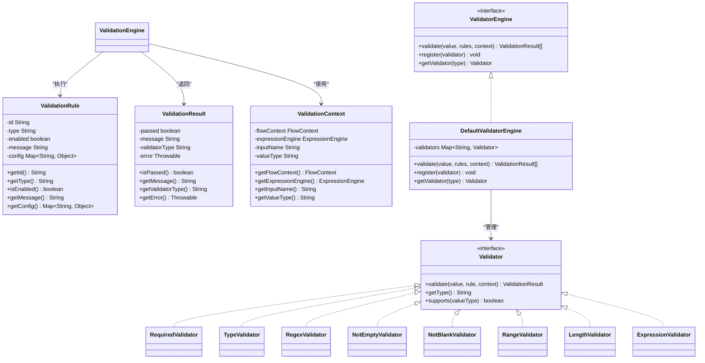
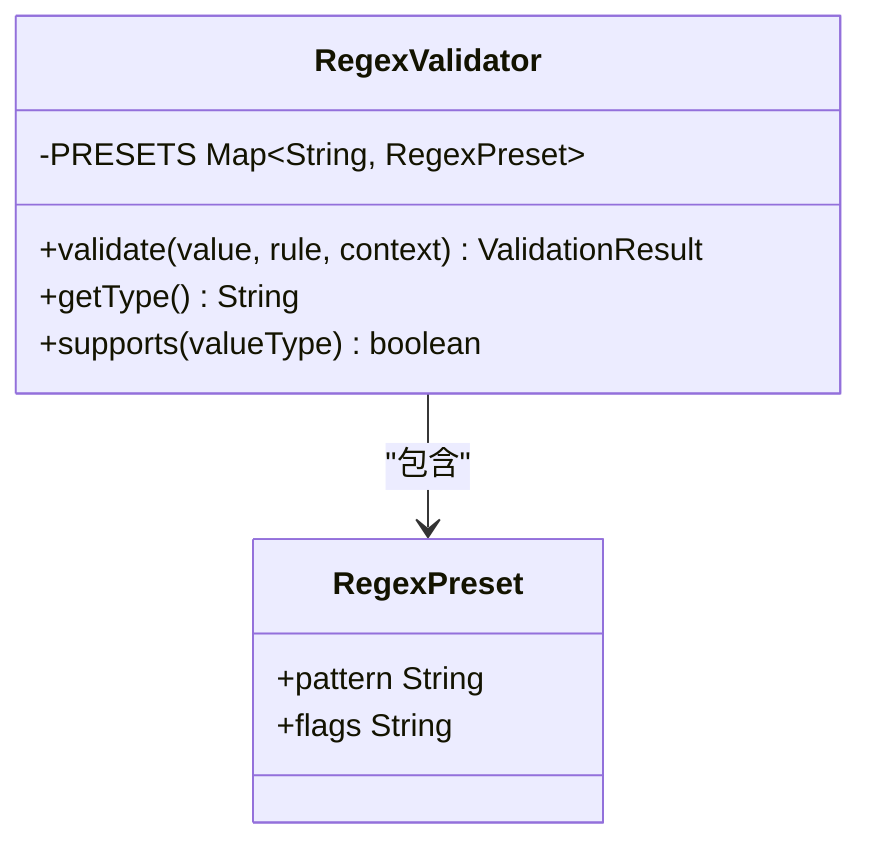
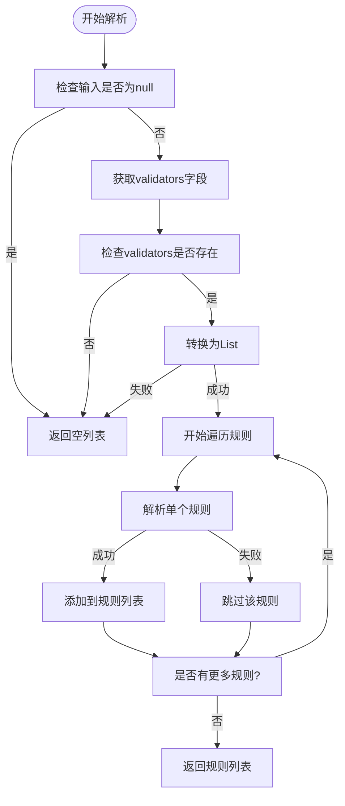
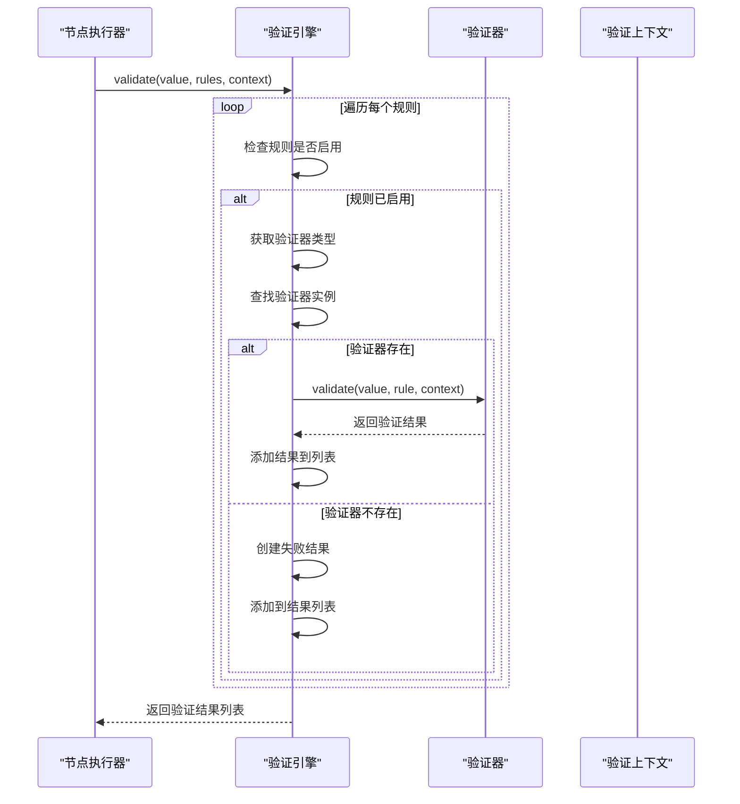
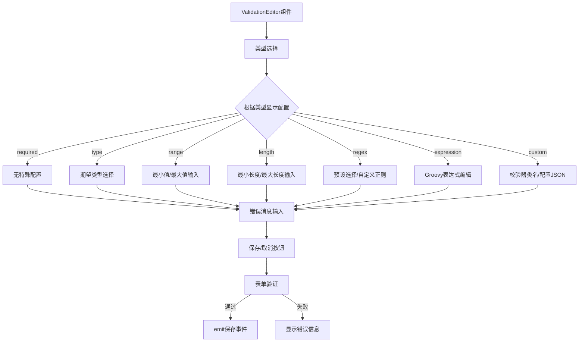
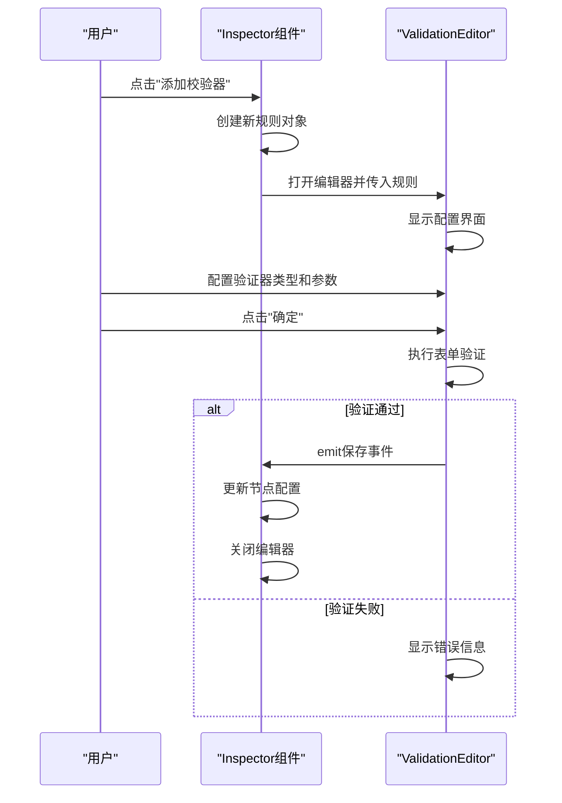

# 节点验证设计

<cite>
**本文档引用文件**  
- [ValidationEditor.vue](file://apps/ygflow-orchestrator-ui/src/components/ValidationEditor.vue)
- [Inspector.vue](file://apps/ygflow-orchestrator-ui/src/components/Inspector.vue)
- [ValidatorEngine.java](file://yglue-runtime/src/main/java/org/yglue/flow/runtime/core/validator/ValidatorEngine.java)
- [DefaultValidatorEngine.java](file://yglue-runtime/src/main/java/org/yglue/flow/runtime/core/validator/DefaultValidatorEngine.java)
- [ValidationRuleParser.java](file://yglue-runtime/src/main/java/org/yglue/flow/runtime/core/validator/ValidationRuleParser.java)
- [ValidationRule.java](file://yglue-runtime/src/main/java/org/yglue/flow/runtime/core/validator/ValidationRule.java)
- [Validator.java](file://yglue-runtime/src/main/java/org/yglue/flow/runtime/core/validator/Validator.java)
- [ValidationResult.java](file://yglue-runtime/src/main/java/org/yglue/flow/runtime/core/validator/ValidationResult.java)
- [ValidationContext.java](file://yglue-runtime/src/main/java/org/yglue/flow/runtime/core/validator/ValidationContext.java)
- [RequiredValidator.java](file://yglue-runtime/src/main/java/org/yglue/flow/runtime/core/validator/validators/RequiredValidator.java)
- [TypeValidator.java](file://yglue-runtime/src/main/java/org/yglue/flow/runtime/core/validator/validators/TypeValidator.java)
- [RegexValidator.java](file://yglue-runtime/src/main/java/org/yglue/flow/runtime/core/validator/validators/RegexValidator.java)
- [NotEmptyValidator.java](file://yglue-runtime/src/main/java/org/yglue/flow/runtime/core/validator/validators/NotEmptyValidator.java)
- [NotBlankValidator.java](file://yglue-runtime/src/main/java/org/yglue/flow/runtime/core/validator/validators/NotBlankValidator.java)
- [RangeValidator.java](file://yglue-runtime/src/main/java/org/yglue/flow/runtime/core/validator/validators/RangeValidator.java)
- [LengthValidator.java](file://yglue-runtime/src/main/java/org/yglue/flow/runtime/core/validator/validators/LengthValidator.java)
- [ExpressionValidator.java](file://yglue-runtime/src/main/java/org/yglue/flow/runtime/core/validator/validators/ExpressionValidator.java)
- [ServiceNodeExecutor.java](file://yglue-runtime/src/main/java/org/yglue/flow/runtime/core/executors/ServiceNodeExecutor.java)
</cite>

## 目录
1. [简介](#简介)
2. [验证器设计模式](#验证器设计模式)
3. [内置验证器实现](#内置验证器实现)
4. [验证规则解析机制](#验证规则解析机制)
5. [验证引擎执行流程](#验证引擎执行流程)
6. [前端验证编辑器](#前端验证编辑器)
7. [前后端协同工作流程](#前后端协同工作流程)
8. [验证上下文与错误处理](#验证上下文与错误处理)

## 简介
节点验证机制是流程编排系统中的关键组件，用于确保流程节点输入参数的正确性和有效性。该机制通过一套完整的验证体系，包括前端配置界面、规则解析、验证执行和结果反馈，实现了对节点输入的全面校验。系统支持多种内置验证器，并提供灵活的扩展机制，满足不同场景下的验证需求。

## 验证器设计模式

节点验证机制采用策略模式和责任链模式相结合的设计。核心组件包括验证器（Validator）、验证规则（ValidationRule）、验证引擎（ValidatorEngine）和验证结果（ValidationResult）。每个验证器实现统一的`Validator`接口，负责具体的验证逻辑。验证引擎作为协调者，管理所有验证器实例，并按规则顺序执行验证。

**图示来源**  
- [Validator.java](file://yglue-runtime/src/main/java/org/yglue/flow/runtime/core/validator/Validator.java)
- [ValidationRule.java](file://yglue-runtime/src/main/java/org/yglue/flow/runtime/core/validator/ValidationRule.java)
- [ValidationResult.java](file://yglue-runtime/src/main/java/org/yglue/flow/runtime/core/validator/ValidationResult.java)
- [ValidationContext.java](file://yglue-runtime/src/main/java/org/yglue/flow/runtime/core/validator/ValidationContext.java)
- [ValidatorEngine.java](file://yglue-runtime/src/main/java/org/yglue/flow/runtime/core/validator/ValidatorEngine.java)
- [DefaultValidatorEngine.java](file://yglue-runtime/src/main/java/org/yglue/flow/runtime/core/validator/DefaultValidatorEngine.java)

**本节来源**  
- [Validator.java](file://yglue-runtime/src/main/java/org/yglue/flow/runtime/core/validator/Validator.java)
- [ValidationRule.java](file://yglue-runtime/src/main/java/org/yglue/flow/runtime/core/validator/ValidationRule.java)
- [ValidationResult.java](file://yglue-runtime/src/main/java/org/yglue/flow/runtime/core/validator/ValidationResult.java)
- [ValidationContext.java](file://yglue-runtime/src/main/java/org/yglue/flow/runtime/core/validator/ValidationContext.java)
- [ValidatorEngine.java](file://yglue-runtime/src/main/java/org/yglue/flow/runtime/core/validator/ValidatorEngine.java)

## 内置验证器实现

系统提供了多种内置验证器，每种验证器针对特定的验证场景。所有验证器都实现了`Validator`接口，并在`DefaultValidatorEngine`启动时自动注册。

### 必填验证器（RequiredValidator）
`RequiredValidator`用于检查参数是否存在且不为null。它支持所有数据类型，是最基础的验证器。当值为null时，返回失败结果；否则返回成功。该验证器不依赖配置，仅通过类型标识进行区分。

**本节来源**  
- [RequiredValidator.java](file://yglue-runtime/src/main/java/org/yglue/flow/runtime/core/validator/validators/RequiredValidator.java)

### 类型验证器（TypeValidator）
`TypeValidator`用于检查参数类型是否匹配。它支持基本类型（STRING、NUMBER、BOOLEAN、ARRAY、OBJECT）和完整类名的匹配。配置中可指定`expectedType`（基本类型）或`expectedTypeName`（完整类名），两者可同时使用。验证器通过`getActualType`方法确定实际类型，并与期望类型进行比较。

**本节来源**  
- [TypeValidator.java](file://yglue-runtime/src/main/java/org/yglue/flow/runtime/core/validator/validators/TypeValidator.java)

### 正则表达式验证器（RegexValidator）
`RegexValidator`用于检查字符串是否匹配正则表达式。它支持预设正则表达式（如邮箱、手机号、身份证号等）和自定义正则表达式。预设表达式存储在`PRESETS`常量中，包含常用格式的正则模式和标志。验证器根据配置选择预设或自定义模式，并编译为`Pattern`对象进行匹配。

**图示来源**  
- [RegexValidator.java](file://yglue-runtime/src/main/java/org/yglue/flow/runtime/core/validator/validators/RegexValidator.java)

**本节来源**  
- [RegexValidator.java](file://yglue-runtime/src/main/java/org/yglue/flow/runtime/core/validator/validators/RegexValidator.java)

### 其他内置验证器
系统还提供了`NotEmptyValidator`（检查集合/数组/Map是否不为空）、`NotBlankValidator`（检查字符串是否不为空白）、`RangeValidator`（检查数字是否在指定范围内）、`LengthValidator`（检查字符串/数组长度）和`ExpressionValidator`（使用Groovy表达式进行自定义校验）。这些验证器根据其特定逻辑实现验证功能，并通过`supports`方法声明支持的数据类型。

**本节来源**  
- [NotEmptyValidator.java](file://yglue-runtime/src/main/java/org/yglue/flow/runtime/core/validator/validators/NotEmptyValidator.java)
- [NotBlankValidator.java](file://yglue-runtime/src/main/java/org/yglue/flow/runtime/core/validator/validators/NotBlankValidator.java)
- [RangeValidator.java](file://yglue-runtime/src/main/java/org/yglue/flow/runtime/core/validator/validators/RangeValidator.java)
- [LengthValidator.java](file://yglue-runtime/src/main/java/org/yglue/flow/runtime/core/validator/validators/LengthValidator.java)
- [ExpressionValidator.java](file://yglue-runtime/src/main/java/org/yglue/flow/runtime/core/validator/validators/ExpressionValidator.java)

## 验证规则解析机制

`ValidationRuleParser`负责将节点配置中的验证规则解析为`ValidationRule`对象。解析过程从输入参数配置的`validators`字段开始，支持JSON数组格式的规则列表。每个规则对象包含id、type、enabled、message和config等属性。

**图示来源**  
- [ValidationRuleParser.java](file://yglue-runtime/src/main/java/org/yglue/flow/runtime/core/validator/ValidationRuleParser.java)

**本节来源**  
- [ValidationRuleParser.java](file://yglue-runtime/src/main/java/org/yglue/flow/runtime/core/validator/ValidationRuleParser.java)

## 验证引擎执行流程

`ValidatorEngine`是验证机制的核心执行者。`DefaultValidatorEngine`作为其默认实现，在构造时自动注册所有内置验证器。验证过程按规则列表顺序执行，对于每个启用的规则，引擎查找对应的验证器并执行验证。

**图示来源**  
- [DefaultValidatorEngine.java](file://yglue-runtime/src/main/java/org/yglue/flow/runtime/core/validator/DefaultValidatorEngine.java)
- [ValidatorEngine.java](file://yglue-runtime/src/main/java/org/yglue/flow/runtime/core/validator/ValidatorEngine.java)

**本节来源**  
- [DefaultValidatorEngine.java](file://yglue-runtime/src/main/java/org/yglue/flow/runtime/core/validator/DefaultValidatorEngine.java)

## 前端验证编辑器

`ValidationEditor`组件为用户提供图形化界面来配置验证规则。该组件支持所有内置验证器的配置，并根据验证器类型动态显示相应的配置选项。编辑器通过props接收当前规则和值类型，通过emit事件将保存的规则返回给父组件。

**图示来源**  
- [ValidationEditor.vue](file://apps/ygflow-orchestrator-ui/src/components/ValidationEditor.vue)

**本节来源**  
- [ValidationEditor.vue](file://apps/ygflow-orchestrator-ui/src/components/ValidationEditor.vue)

## 前后端协同工作流程

验证机制的前后端协同工作流程始于用户在`Inspector`组件中配置节点输入的验证规则。当用户点击"添加校验器"时，系统创建新的验证规则并打开`ValidationEditor`进行详细配置。

**图示来源**  
- [Inspector.vue](file://apps/ygflow-orchestrator-ui/src/components/Inspector.vue)
- [ValidationEditor.vue](file://apps/ygflow-orchestrator-ui/src/components/ValidationEditor.vue)

**本节来源**  
- [Inspector.vue](file://apps/ygflow-orchestrator-ui/src/components/Inspector.vue)
- [ValidationEditor.vue](file://apps/ygflow-orchestrator-ui/src/components/ValidationEditor.vue)

## 验证上下文与错误处理

`ValidationContext`为验证过程提供必要的上下文信息，包括流程上下文（FlowContext）、表达式引擎（ExpressionEngine）、输入参数名称（inputName）和值类型（valueType）。这些信息在验证过程中被验证器使用，例如`ExpressionValidator`需要表达式引擎来执行Groovy表达式。

当验证失败时，系统生成`ValidationResult`对象，包含失败状态、错误消息、验证器类型和可能的异常。在`ServiceNodeExecutor`中，这些结果被收集并根据`failPolicy`（失败策略）进行处理。支持的策略包括"throw"（抛出异常）、"skip"（跳过节点）和"default"（继续执行，使用默认值）。

**本节来源**  
- [ValidationContext.java](file://yglue-runtime/src/main/java/org/yglue/flow/runtime/core/validator/ValidationContext.java)
- [ValidationResult.java](file://yglue-runtime/src/main/java/org/yglue/flow/runtime/core/validator/ValidationResult.java)
- [ServiceNodeExecutor.java](file://yglue-runtime/src/main/java/org/yglue/flow/runtime/core/executors/ServiceNodeExecutor.java)