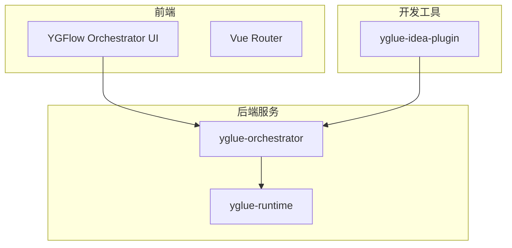
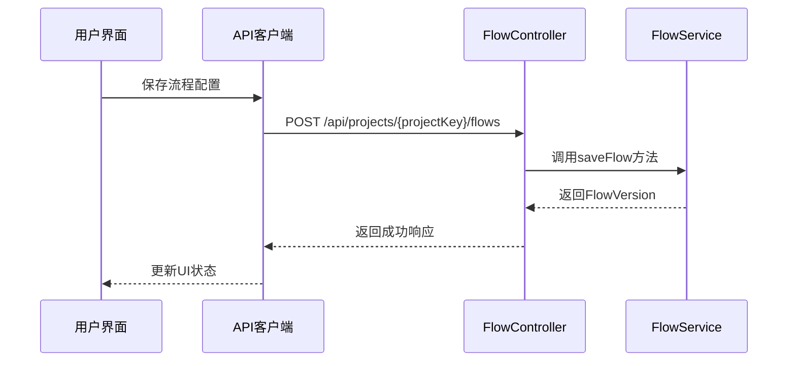
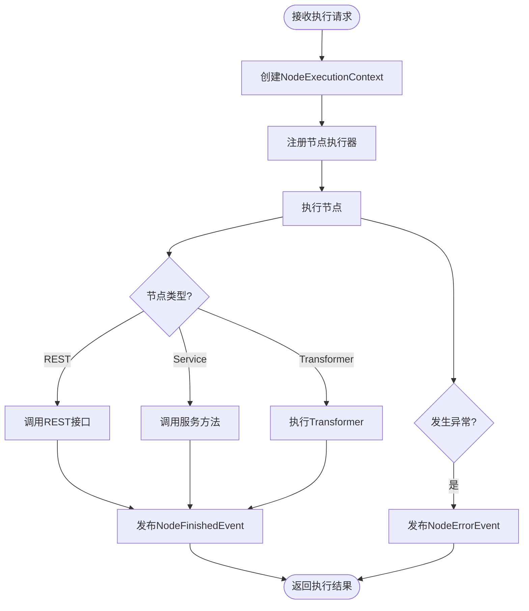
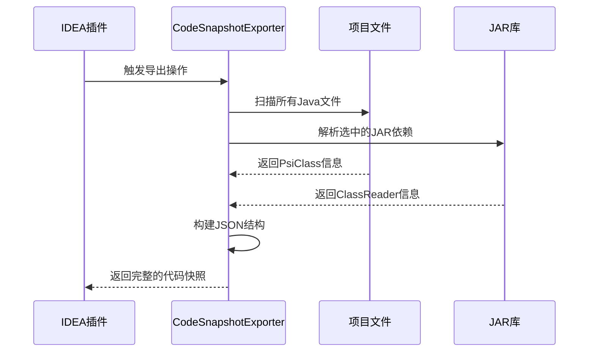
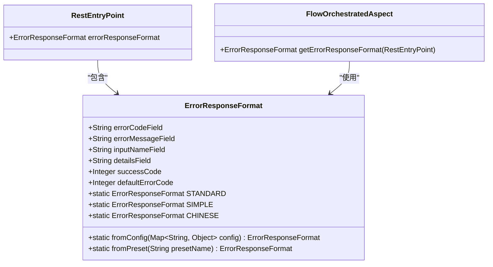
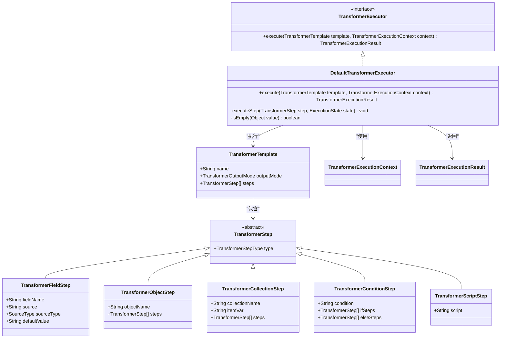
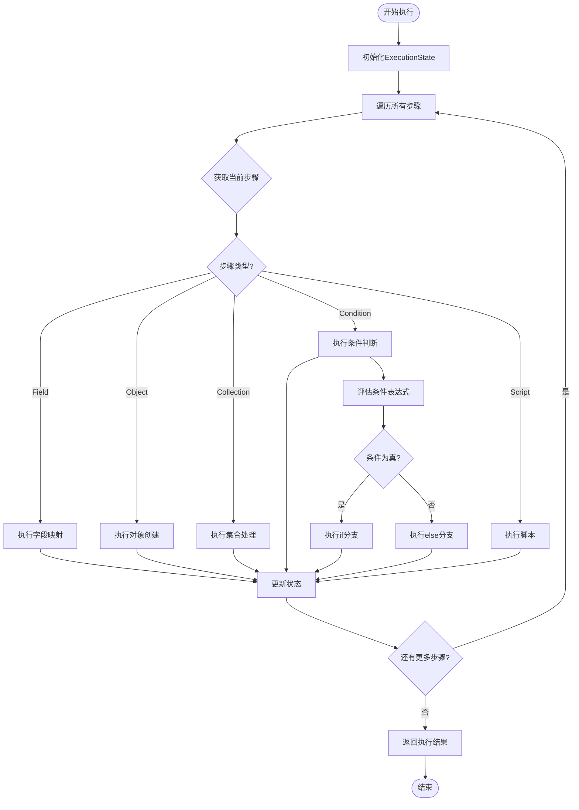

# 设计文档

<cite>
**本文档中引用的文件**  
- [pom.xml](file://pom.xml)
- [YGlueOrchestratorApplication.java](file://yglue-orchestrator/src/main/java/org/yglue/flow/orch/YGlueOrchestratorApplication.java)
- [App.vue](file://apps/ygflow-orchestrator-ui/src/App.vue)
- [plugin.xml](file://yglue-idea-plugin/src/main/resources/META-INF/plugin.xml)
- [client.ts](file://apps/ygflow-orchestrator-ui/src/api/client.ts)
- [FlowController.java](file://yglue-orchestrator/src/main/java/org/yglue/flow/orch/web/controller/FlowController.java)
- [CodeSnapshotExporter.java](file://yglue-idea-plugin/src/main/java/org/yglue/flow/idea/snapshot/CodeSnapshotExporter.java)
- [ErrorResponseFormat.java](file://yglue-runtime/src/main/java/org/yglue/flow/runtime/core/definition/ErrorResponseFormat.java)
- [TransformerTemplate.java](file://yglue-runtime/src/main/java/org/yglue/flow/runtime/core/transformer/dsl/TransformerTemplate.java)
- [NodeExecutorRegistry.java](file://yglue-runtime/src/main/java/org/yglue/flow/runtime/core/NodeExecutorRegistry.java)
- [NodeExecutionContext.java](file://yglue-runtime/src/main/java/org/yglue/flow/runtime/core/NodeExecutionContext.java)
- [FlowExecutor.java](file://yglue-runtime/src/main/java/org/yglue/flow/runtime/core/FlowExecutor.java)
- [TransformerExecutor.java](file://yglue-runtime/src/main/java/org/yglue/flow/runtime/core/transformer/runtime/TransformerExecutor.java)
- [DefaultTransformerExecutor.java](file://yglue-runtime/src/main/java/org/yglue/flow/runtime/core/transformer/runtime/DefaultTransformerExecutor.java)
- [NodeStartedEvent.java](file://yglue-runtime/src/main/java/org/yglue/flow/runtime/events/NodeStartedEvent.java)
- [NodeFinishedEvent.java](file://yglue-runtime/src/main/java/org/yglue/flow/runtime/events/NodeFinishedEvent.java)
- [NodeErrorEvent.java](file://yglue-runtime/src/main/java/org/yglue/flow/runtime/events/NodeErrorEvent.java)
</cite>

## 目录
1. [系统架构概览](#系统架构概览)
2. [数据流与执行流程](#数据流与执行流程)
3. [IDEA插件元数据结构](#idea插件元数据结构)
4. [节点验证设计模式](#节点验证设计模式)
5. [统一错误响应格式](#统一错误响应格式)
6. [Transformer DSL语法](#transformer-dsl语法)

## 系统架构概览

YGFlow Suite 是一个基于微服务架构的流程编排系统，由多个核心组件构成：编排器服务（Orchestrator）、运行时引擎（Runtime）、前端UI和IDEA插件。系统采用Spring Boot作为基础框架，通过Maven进行模块化管理。



**图示来源**
- [pom.xml](file://pom.xml)
- [App.vue](file://apps/ygflow-orchestrator-ui/src/App.vue)
- [YGlueOrchestratorApplication.java](file://yglue-orchestrator/src/main/java/org/yglue/flow/orch/YGlueOrchestratorApplication.java)

## 数据流与执行流程

### 用户操作到编排器的数据流

当用户在前端界面进行操作时，数据通过REST API流向编排器服务。前端通过`client.ts`中的API客户端发送请求，编排器的`FlowController`接收并处理这些请求。



**图示来源**
- [client.ts](file://apps/ygflow-orchestrator-ui/src/api/client.ts)
- [FlowController.java](file://yglue-orchestrator/src/main/java/org/yglue/flow/orch/web/controller/FlowController.java)

### 运行时引擎执行流程

运行时引擎的执行流程从接收请求开始，经历节点注册、上下文创建、节点执行和事件发布等阶段。



**图示来源**
- [NodeExecutionContext.java](file://yglue-runtime/src/main/java/org/yglue/flow/runtime/core/NodeExecutionContext.java)
- [NodeExecutorRegistry.java](file://yglue-runtime/src/main/java/org/yglue/flow/runtime/core/NodeExecutorRegistry.java)
- [FlowExecutor.java](file://yglue-runtime/src/main/java/org/yglue/flow/runtime/core/FlowExecutor.java)

## IDEA插件元数据结构

IDEA插件负责扫描项目中的Java代码并生成元数据，这些元数据用于在编排器中提供代码补全和类型检查功能。

### 元数据生成流程



**图示来源**
- [plugin.xml](file://yglue-idea-plugin/src/main/resources/META-INF/plugin.xml)
- [CodeSnapshotExporter.java](file://yglue-idea-plugin/src/main/java/org/yglue/flow/idea/snapshot/CodeSnapshotExporter.java)

### 元数据JSON结构

IDEA插件生成的元数据包含项目基本信息、类结构和依赖信息：

```json
{
  "projectId": "string",
  "projectName": "string",
  "snapshotKey": "string",
  "generatedAt": "ISO8601时间戳",
  "ide": {
    "platform": "string",
    "productName": "string",
    "version": "string",
    "build": "string"
  },
  "classes": [
    {
      "qualifiedName": "完整类名",
      "simpleName": "简单类名",
      "packageName": "包名",
      "kind": "class|interface|enum",
      "fields": [
        {
          "name": "字段名",
          "type": "字段类型",
          "static": "布尔值"
        }
      ],
      "methods": [
        {
          "name": "方法名",
          "returnType": "返回类型",
          "static": "布尔值",
          "parameters": [
            {
              "name": "参数名",
              "type": "参数类型"
            }
          ]
        }
      ]
    }
  ],
  "dependencies": [
    {
      "id": "依赖ID",
      "name": "依赖名称",
      "groupId": "Maven Group ID",
      "artifactId": "Maven Artifact ID",
      "version": "版本号",
      "coordinate": "坐标字符串"
    }
  ],
  "selectedJars": ["选中的JAR坐标"],
  "jarMetadata": [
    {
      "id": "JAR ID",
      "name": "JAR名称",
      "groupId": "Group ID",
      "artifactId": "Artifact ID",
      "version": "版本",
      "coordinate": "坐标",
      "classes": "类列表",
      "contentHash": "内容哈希"
    }
  ],
  "contentHash": "整体内容哈希"
}
```

**图示来源**
- [CodeSnapshotExporter.java](file://yglue-idea-plugin/src/main/java/org/yglue/flow/idea/snapshot/CodeSnapshotExporter.java)

## 节点验证设计模式

系统采用策略模式实现节点验证功能，通过`ValidatorEngine`统一管理各种验证器。

### 验证器类图

```mermaid
classDiagram
class ValidatorEngine {
+validate(Object target, ValidationRule rule) ValidationResult
-getValidator(String type) Validator
}
class Validator {
<<interface>>
+validate(Object value, Map~String, Object~ config) ValidationResult
}
class ValidationRule {
+String type
+Map~String, Object~ config
}
class ValidationResult {
+boolean isValid()
+ResolveError[] getErrors()
}
class ResolveError {
+String field
+String message
+Object value
}
class RequiredValidator {
+validate(Object value, Map~String, Object~ config) ValidationResult
}
class TypeValidator {
+validate(Object value, Map~String, Object~ config) ValidationResult
}
class RangeValidator {
+validate(Object value, Map~String, Object~ config) ValidationResult
}
class LengthValidator {
+validate(Object value, Map~String, Object~ config) ValidationResult
}
class RegexValidator {
+validate(Object value, Map~String, Object~ config) ValidationResult
}
class NotBlankValidator {
+validate(Object value, Map~String, Object~ config) ValidationResult
}
class NotEmptyValidator {
+validate(Object value, Map~String, Object~ config) ValidationResult
}
class ExpressionValidator {
+validate(Object value, Map~String, Object~ config) ValidationResult
}
ValidatorEngine --> Validator : "使用"
ValidatorEngine --> ValidationRule : "接收"
ValidatorEngine --> ValidationResult : "返回"
Validator <|.. RequiredValidator
Validator <|.. TypeValidator
Validator <|.. RangeValidator
Validator <|.. LengthValidator
Validator <|.. RegexValidator
Validator <|.. NotBlankValidator
Validator <|.. NotEmptyValidator
Validator <|.. ExpressionValidator
ValidationResult --> ResolveError : "包含"
```



**图示来源**
- [yglue-runtime/src/main/java/org/yglue/flow/runtime/core/validator](file://yglue-runtime/src/main/java/org/yglue/flow/runtime/core/validator)

## 统一错误响应格式

系统定义了统一的错误响应格式规范，支持多种预设格式和自定义配置。

### 错误响应格式配置



**图示来源**
- [ErrorResponseFormat.java](file://yglue-runtime/src/main/java/org/yglue/flow/runtime/core/definition/ErrorResponseFormat.java)

### 预设错误格式

系统提供了三种预设的错误响应格式：

1. **标准格式 (STANDARD)**: `{errorCode, message, data}`
2. **简化格式 (SIMPLE)**: `{code, message}`
3. **中文格式 (CHINESE)**: `{错误码, 错误信息, 参数名, 详情}`

通过`ErrorResponseFormat.fromPreset("standard")`等方法可以获取预设格式实例。

## Transformer DSL语法

Transformer DSL用于定义数据转换规则，支持链式调用和条件判断。

### Transformer执行器接口



**图示来源**
- [TransformerExecutor.java](file://yglue-runtime/src/main/java/org/yglue/flow/runtime/core/transformer/runtime/TransformerExecutor.java)
- [DefaultTransformerExecutor.java](file://yglue-runtime/src/main/java/org/yglue/flow/runtime/core/transformer/runtime/DefaultTransformerExecutor.java)
- [TransformerTemplate.java](file://yglue-runtime/src/main/java/org/yglue/flow/runtime/core/transformer/dsl/TransformerTemplate.java)

### Transformer执行流程



**图示来源**
- [DefaultTransformerExecutor.java](file://yglue-runtime/src/main/java/org/yglue/flow/runtime/core/transformer/runtime/DefaultTransformerExecutor.java)