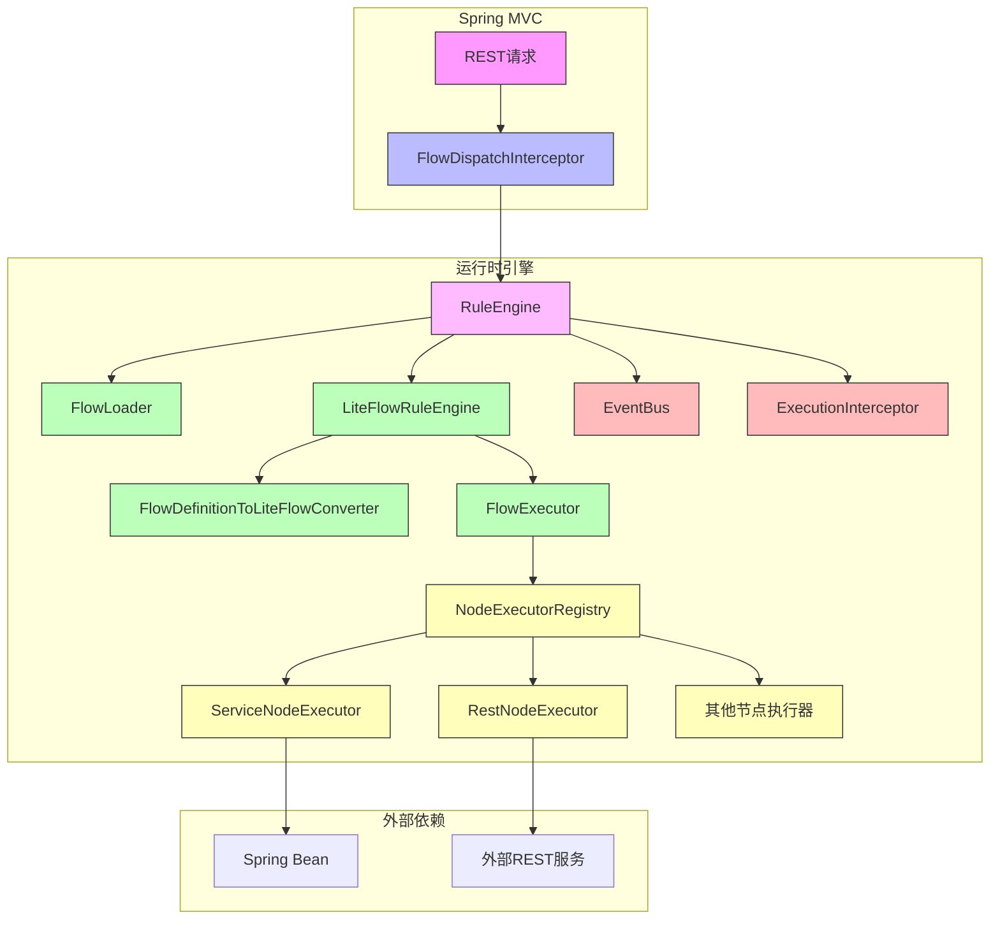
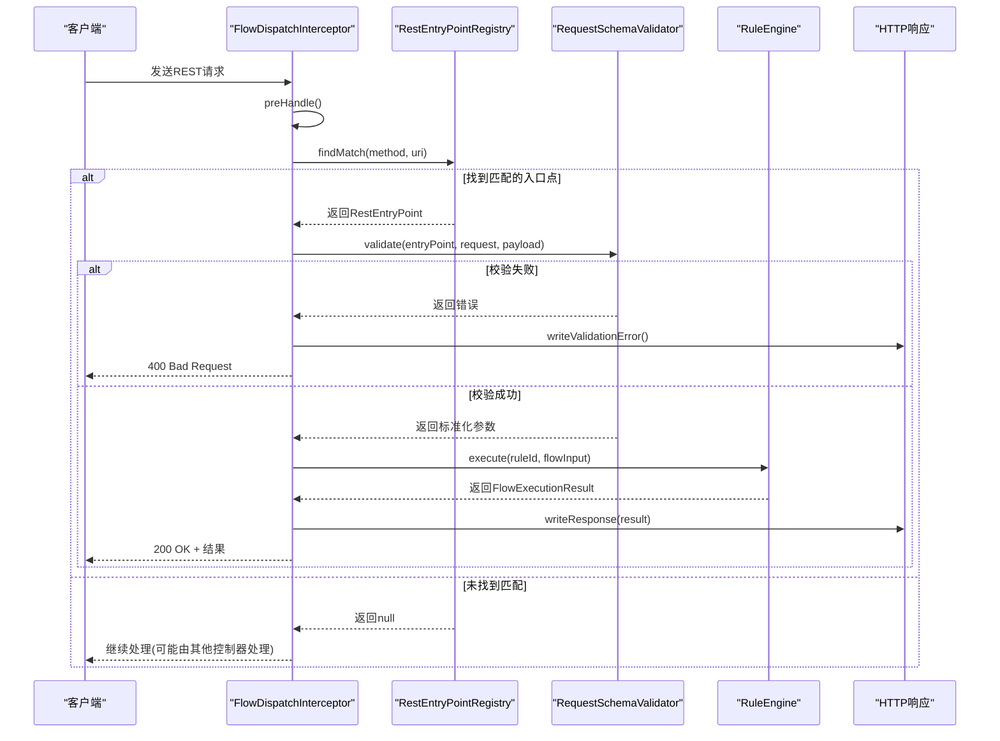
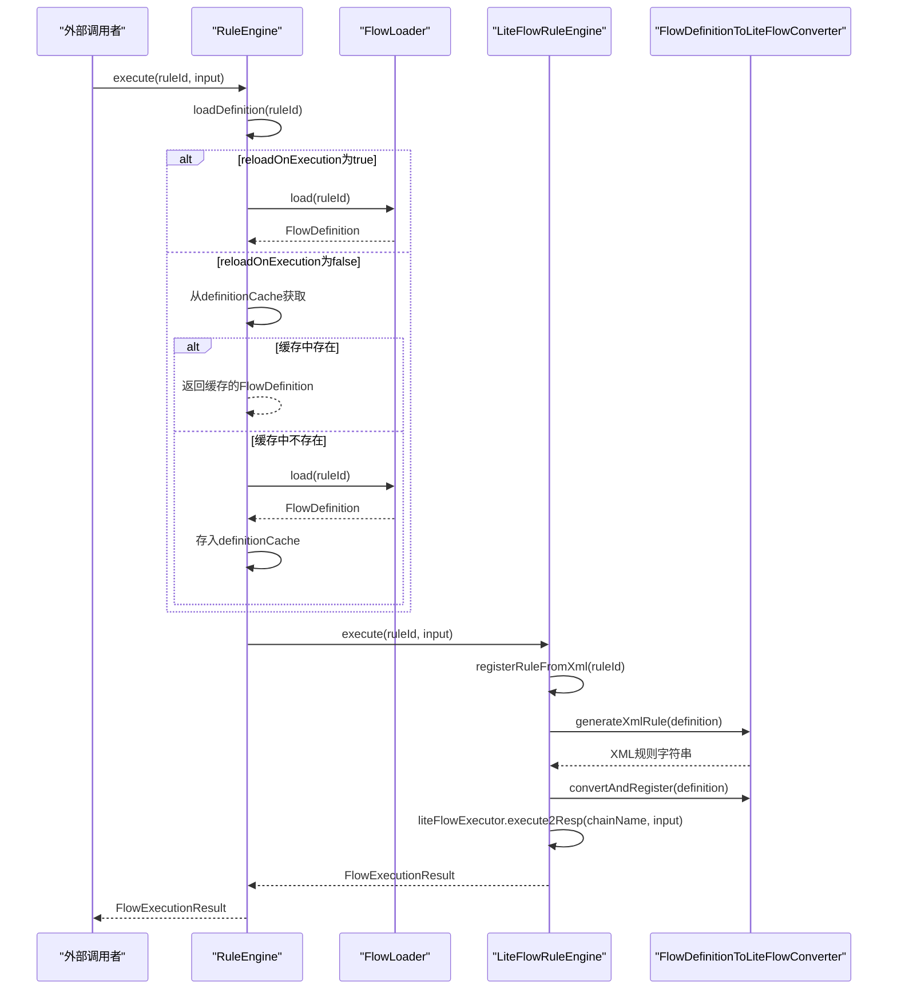
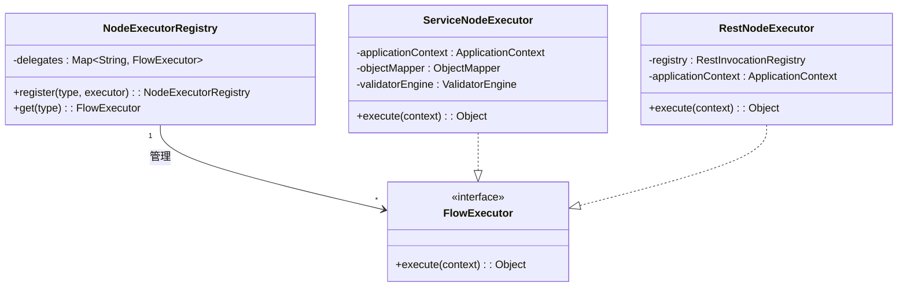
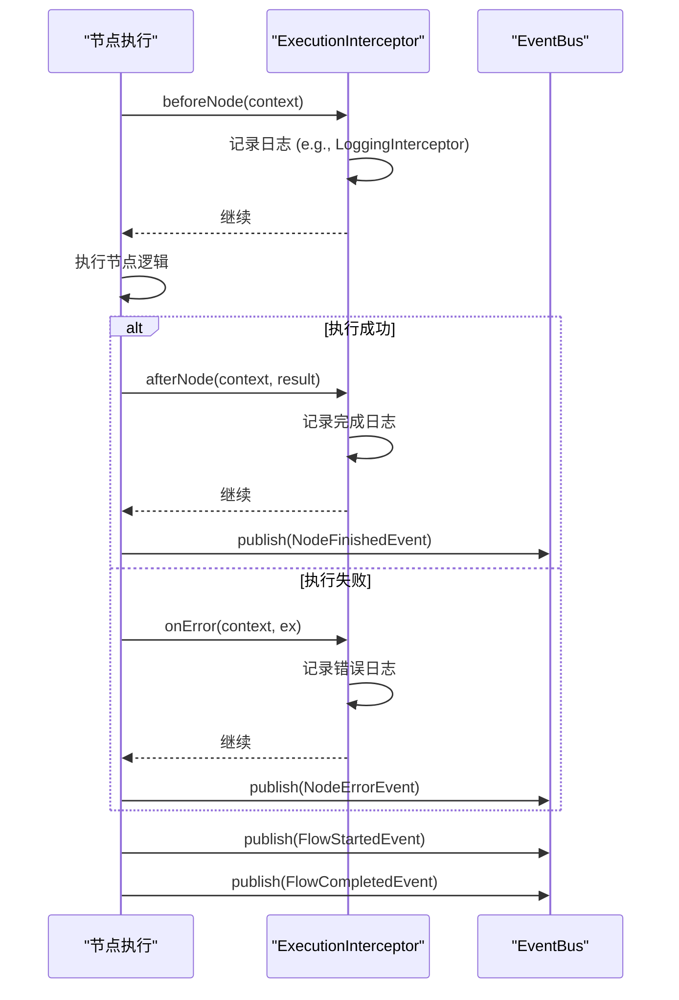

# 运行时执行流程

<cite>
**本文档引用的文件**  
- [FlowContext.java](file://yglue-runtime/src/main/java/org/yglue/flow/runtime/FlowContext.java)
- [FlowDispatchInterceptor.java](file://yglue-runtime-spring-boot3/src/main/java/org/yglue/flow/runtime/spring/FlowDispatchInterceptor.java)
- [RuleEngine.java](file://yglue-runtime/src/main/java/org/yglue/flow/runtime/RuleEngine.java)
- [LiteFlowRuleEngine.java](file://yglue-runtime/src/main/java/org/yglue/flow/runtime/liteflow/LiteFlowRuleEngine.java)
- [FlowExecutor.java](file://yglue-runtime/src/main/java/org/yglue/flow/runtime/core/FlowExecutor.java)
- [NodeExecutorRegistry.java](file://yglue-runtime/src/main/java/org/yglue/flow/runtime/core/NodeExecutorRegistry.java)
- [ServiceNodeExecutor.java](file://yglue-runtime/src/main/java/org/yglue/flow/runtime/core/executors/ServiceNodeExecutor.java)
- [RestNodeExecutor.java](file://yglue-runtime/src/main/java/org/yglue/flow/runtime/core/executors/RestNodeExecutor.java)
- [ExecutionInterceptor.java](file://yglue-runtime/src/main/java/org/yglue/flow/runtime/core/ExecutionInterceptor.java)
- [LoggingInterceptor.java](file://yglue-runtime/src/main/java/org/yglue/flow/runtime/interceptors/LoggingInterceptor.java)
- [EventBus.java](file://yglue-runtime/src/main/java/org/yglue/flow/runtime/events/EventBus.java)
</cite>

## 目录
1. [引言](#引言)
2. [核心组件与架构](#核心组件与架构)
3. [执行流程总览](#执行流程总览)
4. [请求拦截与分发](#请求拦截与分发)
5. [流程定义加载与执行](#流程定义加载与执行)
6. [节点执行器调度机制](#节点执行器调度机制)
7. [上下文与数据流转](#上下文与数据流转)
8. [执行拦截与事件处理](#执行拦截与事件处理)
9. [详细执行流程图解](#详细执行流程图解)

## 引言

本文档旨在深入解析运行时引擎的执行流程，从接收到一个REST请求开始，到流程执行完成并返回响应的完整生命周期。文档将详细阐述`FlowDispatchInterceptor`如何拦截请求，`FlowExecutor`如何加载并执行流程定义，`NodeExecutorRegistry`如何根据节点类型调度具体的执行器（如`ServiceNodeExecutor`、`RestNodeExecutor`），以及`ExecutionInterceptor`如何处理执行过程中的事件。同时，结合代码实例，说明上下文（`FlowContext`）的传递和节点间的数据流转机制。

**本文档不分析具体源文件，因此不提供章节来源。**

## 核心组件与架构

运行时引擎的核心架构围绕几个关键组件构建，它们协同工作以实现流程的编排与执行。



**图表来源**
- [FlowDispatchInterceptor.java](file://yglue-runtime-spring-boot3/src/main/java/org/yglue/flow/runtime/spring/FlowDispatchInterceptor.java)
- [RuleEngine.java](file://yglue-runtime/src/main/java/org/yglue/flow/runtime/RuleEngine.java)
- [LiteFlowRuleEngine.java](file://yglue-runtime/src/main/java/org/yglue/flow/runtime/liteflow/LiteFlowRuleEngine.java)
- [NodeExecutorRegistry.java](file://yglue-runtime/src/main/java/org/yglue/flow/runtime/core/NodeExecutorRegistry.java)
- [ServiceNodeExecutor.java](file://yglue-runtime/src/main/java/org/yglue/flow/runtime/core/executors/ServiceNodeExecutor.java)
- [RestNodeExecutor.java](file://yglue-runtime/src/main/java/org/yglue/flow/runtime/core/executors/RestNodeExecutor.java)
- [EventBus.java](file://yglue-runtime/src/main/java/org/yglue/flow/runtime/events/EventBus.java)
- [ExecutionInterceptor.java](file://yglue-runtime/src/main/java/org/yglue/flow/runtime/core/ExecutionInterceptor.java)

## 执行流程总览

一个完整的流程执行生命周期可以分为以下几个阶段：
1.  **请求拦截**：`FlowDispatchInterceptor`拦截所有进入的HTTP请求。
2.  **请求匹配**：根据请求的路径和方法，在`RestEntryPointRegistry`中查找匹配的流程入口点。
3.  **参数提取与校验**：使用`FlowRequestPayloadExtractor`提取请求体、路径参数、查询参数等，并通过`RequestSchemaValidator`进行参数校验。
4.  **流程执行**：调用`RuleEngine`的`execute`方法，传入流程ID和输入参数。
5.  **流程定义加载**：`RuleEngine`通过`FlowLoader`加载指定ID的`FlowDefinition`。
6.  **流程编排与执行**：`LiteFlowRuleEngine`将`FlowDefinition`转换为LiteFlow可识别的规则，并通过LiteFlow框架执行流程。
7.  **节点调度**：在流程执行过程中，`NodeExecutorRegistry`根据节点的`type`字段查找并调用对应的`FlowExecutor`（如`ServiceNodeExecutor`）。
8.  **上下文管理**：`FlowContext`贯穿整个执行过程，用于在节点间传递数据。
9.  **事件与拦截**：`ExecutionInterceptor`（如`LoggingInterceptor`）在节点执行前后及发生错误时被调用，`EventBus`发布流程开始、结束等事件。
10. **响应生成**：将`FlowExecutionResult`写入HTTP响应。

**本节概述了整体流程，未直接分析具体源文件，因此不提供章节来源。**

## 请求拦截与分发

`FlowDispatchInterceptor`是整个执行流程的起点，它是一个Spring MVC的`HandlerInterceptor`，负责拦截所有进入的请求。



**图表来源**
- [FlowDispatchInterceptor.java](file://yglue-runtime-spring-boot3/src/main/java/org/yglue/flow/runtime/spring/FlowDispatchInterceptor.java)
- [RestEntryPointRegistry.java](file://yglue-runtime-spring-boot3/src/main/java/org/yglue/flow/runtime/spring/RestEntryPointRegistry.java)
- [RequestSchemaValidator.java](file://yglue-runtime-spring-boot3/src/main/java/org/yglue/flow/runtime/spring/RequestSchemaValidator.java)
- [RuleEngine.java](file://yglue-runtime/src/main/java/org/yglue/flow/runtime/RuleEngine.java)

**章节来源**
- [FlowDispatchInterceptor.java](file://yglue-runtime-spring-boot3/src/main/java/org/yglue/flow/runtime/spring/FlowDispatchInterceptor.java#L39-L68)

## 流程定义加载与执行

`RuleEngine`是流程执行的核心协调者，它负责加载流程定义并委托给`LiteFlowRuleEngine`进行实际的流程编排。



**图表来源**
- [RuleEngine.java](file://yglue-runtime/src/main/java/org/yglue/flow/runtime/RuleEngine.java#L79-L80)
- [LiteFlowRuleEngine.java](file://yglue-runtime/src/main/java/org/yglue/flow/runtime/liteflow/LiteFlowRuleEngine.java#L62-L77)
- [FlowLoader.java](file://yglue-runtime/src/main/java/org/yglue/flow/runtime/core/definition/FlowLoader.java)
- [FlowDefinitionToLiteFlowConverter.java](file://yglue-runtime/src/main/java/org/yglue/flow/runtime/liteflow/FlowDefinitionToLiteFlowConverter.java)

**章节来源**
- [RuleEngine.java](file://yglue-runtime/src/main/java/org/yglue/flow/runtime/RuleEngine.java#L79-L80)
- [LiteFlowRuleEngine.java](file://yglue-runtime/src/main/java/org/yglue/flow/runtime/liteflow/LiteFlowRuleEngine.java#L62-L77)

## 节点执行器调度机制

`NodeExecutorRegistry`是节点执行器的注册中心，它根据节点的类型（`type`）来调度具体的`FlowExecutor`实现。



**图表来源**
- [NodeExecutorRegistry.java](file://yglue-runtime/src/main/java/org/yglue/flow/runtime/core/NodeExecutorRegistry.java)
- [FlowExecutor.java](file://yglue-runtime/src/main/java/org/yglue/flow/runtime/core/FlowExecutor.java)
- [ServiceNodeExecutor.java](file://yglue-runtime/src/main/java/org/yglue/flow/runtime/core/executors/ServiceNodeExecutor.java)
- [RestNodeExecutor.java](file://yglue-runtime/src/main/java/org/yglue/flow/runtime/core/executors/RestNodeExecutor.java)

**章节来源**
- [NodeExecutorRegistry.java](file://yglue-runtime/src/main/java/org/yglue/flow/runtime/core/NodeExecutorRegistry.java#L11-L23)
- [ServiceNodeExecutor.java](file://yglue-runtime/src/main/java/org/yglue/flow/runtime/core/executors/ServiceNodeExecutor.java#L102-L240)
- [RestNodeExecutor.java](file://yglue-runtime/src/main/java/org/yglue/flow/runtime/core/executors/RestNodeExecutor.java#L21-L30)

## 上下文与数据流转

`FlowContext`是流程执行过程中的数据载体，它在节点间传递数据，确保了流程的状态一致性。

```mermaid
flowchart TD
A[REST请求] --> |提取| B[FlowContext.data()]
B --> C[ServiceNodeExecutor]
C --> |ctx.request.path.xxx| D[执行Groovy脚本]
D --> |返回值| E[设置为输入参数]
E --> F[调用Spring Bean方法]
F --> |返回值| G[保存到FlowContext]
G --> H[RestNodeExecutor]
H --> |从FlowContext获取参数| I[调用外部REST服务]
I --> |响应| J[保存到FlowContext]
J --> K[...后续节点]
K --> L[流程结束]
L --> |FlowContext.data()| M[生成响应]
```

**图表来源**
- [FlowContext.java](file://yglue-runtime/src/main/java/org/yglue/flow/runtime/FlowContext.java)
- [ServiceNodeExecutor.java](file://yglue-runtime/src/main/java/org/yglue/flow/runtime/core/executors/ServiceNodeExecutor.java#L644-L673)
- [RestNodeExecutor.java](file://yglue-runtime/src/main/java/org/yglue/flow/runtime/core/executors/RestNodeExecutor.java#L22-L28)

**章节来源**
- [FlowContext.java](file://yglue-runtime/src/main/java/org/yglue/flow/runtime/FlowContext.java#L18-L120)
- [ServiceNodeExecutor.java](file://yglue-runtime/src/main/java/org/yglue/flow/runtime/core/executors/ServiceNodeExecutor.java#L644-L673)

## 执行拦截与事件处理

`ExecutionInterceptor`和`EventBus`提供了在流程执行过程中插入自定义逻辑的机制，用于日志记录、监控或错误处理。



**图表来源**
- [ExecutionInterceptor.java](file://yglue-runtime/src/main/java/org/yglue/flow/runtime/core/ExecutionInterceptor.java)
- [LoggingInterceptor.java](file://yglue-runtime/src/main/java/org/yglue/flow/runtime/interceptors/LoggingInterceptor.java)
- [EventBus.java](file://yglue-runtime/src/main/java/org/yglue/flow/runtime/events/EventBus.java)
- [LiteFlowRuleEngine.java](file://yglue-runtime/src/main/java/org/yglue/flow/runtime/liteflow/LiteFlowRuleEngine.java)

**章节来源**
- [ExecutionInterceptor.java](file://yglue-runtime/src/main/java/org/yglue/flow/runtime/core/ExecutionInterceptor.java#L5-L12)
- [LoggingInterceptor.java](file://yglue-runtime/src/main/java/org/yglue/flow/runtime/interceptors/LoggingInterceptor.java#L13-L24)
- [EventBus.java](file://yglue-runtime/src/main/java/org/yglue/flow/runtime/events/EventBus.java#L12-L18)

## 详细执行流程图解

以下流程图综合了上述所有阶段，展示了从接收到请求到返回响应的完整生命周期。

```mermaid
flowchart TD
A[客户端发起REST请求] --> B{FlowDispatchInterceptor}
B --> C{请求是否匹配<br/>HandlerMethod?}
C --> |是| D[不处理，交由AOP切面]
C --> |否| E{在RestEntryPointRegistry中<br/>查找匹配的入口点}
E --> |未找到| F[继续处理，可能由其他控制器处理]
E --> |找到| G[使用RequestSchemaValidator<br/>校验请求参数]
G --> |校验失败| H[返回400错误]
G --> |校验成功| I[构建FlowContext<br/>包含请求数据]
I --> J[调用RuleEngine.execute()]
J --> K{reloadOnExecution?}
K --> |是| L[FlowLoader.load()<br/>重新加载流程定义]
K --> |否| M[从definitionCache获取<br/>或加载并缓存]
L --> N[LiteFlowRuleEngine执行]
M --> N
N --> O{节点类型}
O --> |service| P[NodeExecutorRegistry.get('service')<br/>-> ServiceNodeExecutor]
O --> |rest| Q[NodeExecutorRegistry.get('rest')<br/>-> RestNodeExecutor]
O --> |其他| R[NodeExecutorRegistry.get(type)<br/>-> 对应的Executor]
P --> S[通过Groovy脚本解析输入参数<br/>调用Spring Bean方法<br/>将结果存入FlowContext]
Q --> T[从FlowContext获取参数<br/>调用外部REST服务<br/>将结果存入FlowContext]
R --> U[执行节点逻辑<br/>更新FlowContext]
S --> V{所有节点执行完毕?}
T --> V
U --> V
V --> |否| O
V --> |是| W[生成FlowExecutionResult]
W --> X[通过ExecutionInterceptor<br/>记录日志]
X --> Y[通过EventBus<br/>发布事件]
Y --> Z[将结果写入HTTP响应]
Z --> A
```

**图表来源**
- [FlowDispatchInterceptor.java](file://yglue-runtime-spring-boot3/src/main/java/org/yglue/flow/runtime/spring/FlowDispatchInterceptor.java)
- [RuleEngine.java](file://yglue-runtime/src/main/java/org/yglue/flow/runtime/RuleEngine.java)
- [LiteFlowRuleEngine.java](file://yglue-runtime/src/main/java/org/yglue/flow/runtime/liteflow/LiteFlowRuleEngine.java)
- [NodeExecutorRegistry.java](file://yglue-runtime/src/main/java/org/yglue/flow/runtime/core/NodeExecutorRegistry.java)
- [ServiceNodeExecutor.java](file://yglue-runtime/src/main/java/org/yglue/flow/runtime/core/executors/ServiceNodeExecutor.java)
- [RestNodeExecutor.java](file://yglue-runtime/src/main/java/org/yglue/flow/runtime/core/executors/RestNodeExecutor.java)
- [ExecutionInterceptor.java](file://yglue-runtime/src/main/java/org/yglue/flow/runtime/core/ExecutionInterceptor.java)
- [EventBus.java](file://yglue-runtime/src/main/java/org/yglue/flow/runtime/events/EventBus.java)

**章节来源**
- [FlowDispatchInterceptor.java](file://yglue-runtime-spring-boot3/src/main/java/org/yglue/flow/runtime/spring/FlowDispatchInterceptor.java#L39-L68)
- [RuleEngine.java](file://yglue-runtime/src/main/java/org/yglue/flow/runtime/RuleEngine.java#L79-L80)
- [LiteFlowRuleEngine.java](file://yglue-runtime/src/main/java/org/yglue/flow/runtime/liteflow/LiteFlowRuleEngine.java#L62-L77)
- [NodeExecutorRegistry.java](file://yglue-runtime/src/main/java/org/yglue/flow/runtime/core/NodeExecutorRegistry.java#L18-L22)
- [ServiceNodeExecutor.java](file://yglue-runtime/src/main/java/org/yglue/flow/runtime/core/executors/ServiceNodeExecutor.java#L102-L240)
- [RestNodeExecutor.java](file://yglue-runtime/src/main/java/org/yglue/flow/runtime/core/executors/RestNodeExecutor.java#L21-L30)
- [ExecutionInterceptor.java](file://yglue-runtime/src/main/java/org/yglue/flow/runtime/core/ExecutionInterceptor.java#L5-L12)
- [EventBus.java](file://yglue-runtime/src/main/java/org/yglue/flow/runtime/events/EventBus.java#L12-L18)