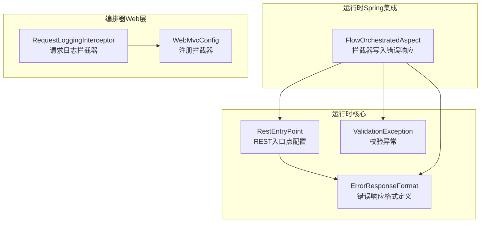
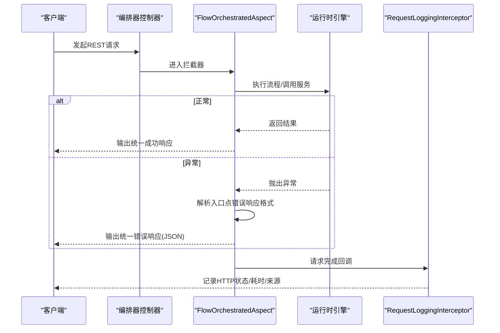
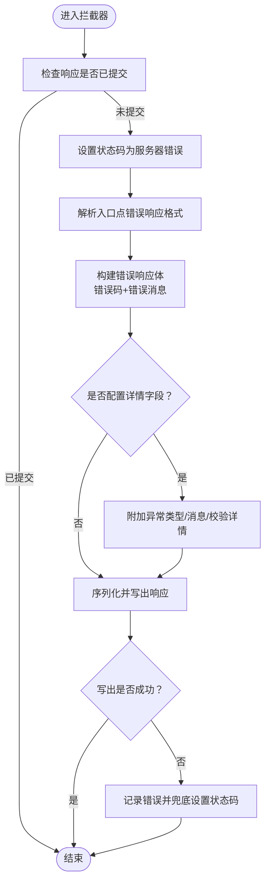
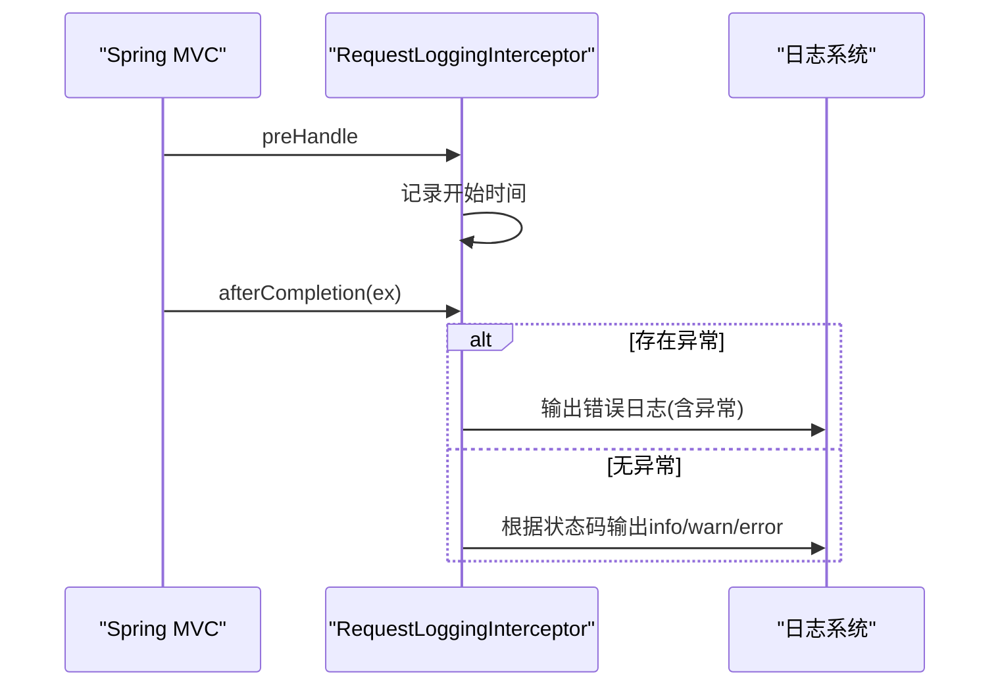
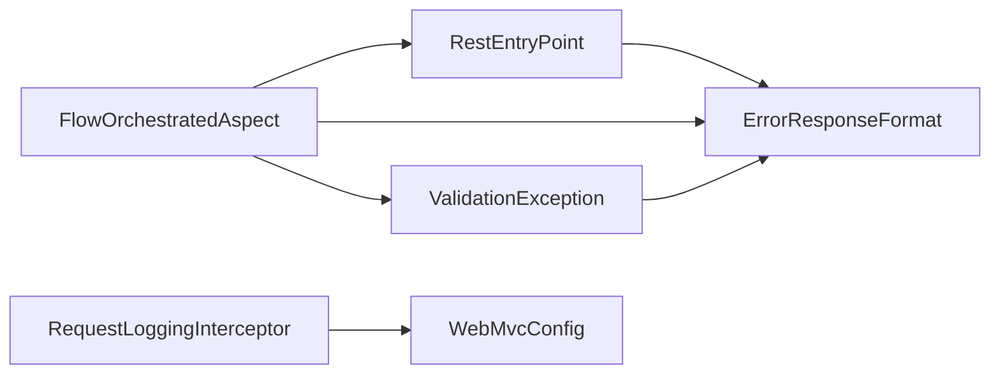

# 错误响应格式

<cite>
**本文引用的文件列表**
- [ErrorResponseFormat.java](file://yglue-runtime/src/main/java/org/yglue/flow/runtime/core/definition/ErrorResponseFormat.java)
- [RestEntryPoint.java](file://yglue-runtime/src/main/java/org/yglue/flow/runtime/core/definition/RestEntryPoint.java)
- [FlowOrchestratedAspect.java](file://yglue-runtime-spring-boot3/src/main/java/org/yglue/flow/runtime/spring/FlowOrchestratedAspect.java)
- [RequestLoggingInterceptor.java](file://yglue-orchestrator/src/main/java/org/yglue/flow/orch/web/RequestLoggingInterceptor.java)
- [WebMvcConfig.java](file://yglue-orchestrator/src/main/java/org/yglue/flow/orch/web/WebMvcConfig.java)
- [ValidationException.java](file://yglue-runtime/src/main/java/org/yglue/flow/runtime/core/validator/ValidationException.java)
</cite>

## 目录
1. [简介](#简介)
2. [项目结构](#项目结构)
3. [核心组件](#核心组件)
4. [架构总览](#架构总览)
5. [组件详解](#组件详解)
6. [依赖关系分析](#依赖关系分析)
7. [性能与一致性考量](#性能与一致性考量)
8. [故障排查指南](#故障排查指南)
9. [结论](#结论)

## 简介
本规范文档聚焦于统一错误响应格式的设计与落地，明确 ErrorResponseFormat 类的结构与字段语义，并阐述其在编排器服务与运行时引擎中的应用方式。同时，结合 RequestLoggingInterceptor 的日志记录机制，帮助开发者快速定位与诊断问题。

## 项目结构
围绕错误响应格式的关键代码分布在以下模块：
- 运行时核心定义：提供错误响应格式模型与入口点配置
- 运行时Spring集成：在拦截器中生成统一错误响应
- 编排器Web层：通过拦截器记录请求与错误日志

图表来源
- [ErrorResponseFormat.java](file://yglue-runtime/src/main/java/org/yglue/flow/runtime/core/definition/ErrorResponseFormat.java#L1-L187)
- [RestEntryPoint.java](file://yglue-runtime/src/main/java/org/yglue/flow/runtime/core/definition/RestEntryPoint.java#L1-L58)
- [FlowOrchestratedAspect.java](file://yglue-runtime-spring-boot3/src/main/java/org/yglue/flow/runtime/spring/FlowOrchestratedAspect.java#L500-L674)
- [RequestLoggingInterceptor.java](file://yglue-orchestrator/src/main/java/org/yglue/flow/orch/web/RequestLoggingInterceptor.java#L1-L57)
- [WebMvcConfig.java](file://yglue-orchestrator/src/main/java/org/yglue/flow/orch/web/WebMvcConfig.java#L1-L20)

章节来源
- [ErrorResponseFormat.java](file://yglue-runtime/src/main/java/org/yglue/flow/runtime/core/definition/ErrorResponseFormat.java#L1-L187)
- [RestEntryPoint.java](file://yglue-runtime/src/main/java/org/yglue/flow/runtime/core/definition/RestEntryPoint.java#L1-L58)
- [FlowOrchestratedAspect.java](file://yglue-runtime-spring-boot3/src/main/java/org/yglue/flow/runtime/spring/FlowOrchestratedAspect.java#L500-L674)
- [RequestLoggingInterceptor.java](file://yglue-orchestrator/src/main/java/org/yglue/flow/orch/web/RequestLoggingInterceptor.java#L1-L57)
- [WebMvcConfig.java](file://yglue-orchestrator/src/main/java/org/yglue/flow/orch/web/WebMvcConfig.java#L1-L20)

## 核心组件
- ErrorResponseFormat：定义错误响应的字段映射、默认错误码、默认成功码及预设格式（标准、简化、中文）。
- RestEntryPoint：承载REST入口点配置，包含数据响应格式配置（预设名称或自定义配置），并据此解析出错误响应格式。
- FlowOrchestratedAspect：在拦截器中根据入口点配置生成统一的错误响应体，填充错误码、错误消息与可选的详情字段。
- RequestLoggingInterceptor：在请求完成后输出HTTP状态、耗时、来源等日志；当发生异常时输出错误日志，便于快速定位问题。

章节来源
- [ErrorResponseFormat.java](file://yglue-runtime/src/main/java/org/yglue/flow/runtime/core/definition/ErrorResponseFormat.java#L1-L187)
- [RestEntryPoint.java](file://yglue-runtime/src/main/java/org/yglue/flow/runtime/core/definition/RestEntryPoint.java#L1-L58)
- [FlowOrchestratedAspect.java](file://yglue-runtime-spring-boot3/src/main/java/org/yglue/flow/runtime/spring/FlowOrchestratedAspect.java#L500-L674)
- [RequestLoggingInterceptor.java](file://yglue-orchestrator/src/main/java/org/yglue/flow/orch/web/RequestLoggingInterceptor.java#L1-L57)

## 架构总览
统一错误响应格式在运行时引擎与编排器服务之间的协作流程如下：

图表来源
- [FlowOrchestratedAspect.java](file://yglue-runtime-spring-boot3/src/main/java/org/yglue/flow/runtime/spring/FlowOrchestratedAspect.java#L500-L674)
- [RequestLoggingInterceptor.java](file://yglue-orchestrator/src/main/java/org/yglue/flow/orch/web/RequestLoggingInterceptor.java#L1-L57)

## 组件详解

### ErrorResponseFormat 类规范
- 字段与语义
  - 错误码字段名：用于标识错误码的键名（例如 errorCode 或 code）。
  - 错误消息字段名：用于标识错误消息的键名（例如 message）。
  - 输入参数名字段名：用于标识输入参数名的键名（例如 field），用于校验异常的字段级错误。
  - 详情字段名：用于标识错误详情的键名（例如 data 或 details），承载异常类型、消息、校验错误等。
  - 成功码：默认成功时的错误码值（例如 1）。
  - 默认错误码：默认失败时的错误码值（例如 -1）。
- 预设格式
  - 标准格式：包含错误码、错误消息与详情字段。
  - 简化格式：仅包含错误码与错误消息。
  - 中文格式：使用中文字段名，适合中文环境。
- 配置来源
  - 预设名称：通过名称选择标准/简化/中文格式。
  - 自定义配置：通过Map配置字段名与默认码值，支持从JSON配置加载。

章节来源
- [ErrorResponseFormat.java](file://yglue-runtime/src/main/java/org/yglue/flow/runtime/core/definition/ErrorResponseFormat.java#L1-L187)

### RestEntryPoint 与错误响应格式解析
- 数据响应格式配置
  - 支持预设名称（如 standard、simple、chinese）或自定义Map配置。
- 错误响应格式解析
  - 当配置为字符串时，按预设名称解析。
  - 当配置为Map时，按字段映射与默认码值解析。
  - 若未配置，默认采用标准格式。

章节来源
- [RestEntryPoint.java](file://yglue-runtime/src/main/java/org/yglue/flow/runtime/core/definition/RestEntryPoint.java#L1-L58)

### FlowOrchestratedAspect 的错误响应生成
- 生成策略
  - 设置HTTP状态为服务器错误。
  - 根据入口点配置解析错误响应格式。
  - 构建错误响应体：包含错误码与错误消息；若配置了详情字段，则附加异常类型、消息与校验错误详情。
  - 在写入失败时进行兜底设置状态码。
- 校验异常处理
  - 当异常的根因是校验异常时，提取其错误详情并合并到详情字段中。

图表来源
- [FlowOrchestratedAspect.java](file://yglue-runtime-spring-boot3/src/main/java/org/yglue/flow/runtime/spring/FlowOrchestratedAspect.java#L500-L674)
- [ValidationException.java](file://yglue-runtime/src/main/java/org/yglue/flow/runtime/core/validator/ValidationException.java#L75-L161)

章节来源
- [FlowOrchestratedAspect.java](file://yglue-runtime-spring-boot3/src/main/java/org/yglue/flow/runtime/spring/FlowOrchestratedAspect.java#L500-L674)
- [ValidationException.java](file://yglue-runtime/src/main/java/org/yglue/flow/runtime/core/validator/ValidationException.java#L75-L161)

### RequestLoggingInterceptor 的错误日志记录
- 记录内容
  - 请求方法、URI、查询参数、远程地址、耗时与状态码。
- 日志级别
  - 发生异常时输出错误日志。
  - 5xx状态码输出错误日志；4xx状态码输出警告日志；其他输出信息日志。
- 作用
  - 提供统一的请求链路观测，辅助定位异常与性能问题。

图表来源
- [RequestLoggingInterceptor.java](file://yglue-orchestrator/src/main/java/org/yglue/flow/orch/web/RequestLoggingInterceptor.java#L1-L57)
- [WebMvcConfig.java](file://yglue-orchestrator/src/main/java/org/yglue/flow/orch/web/WebMvcConfig.java#L1-L20)

章节来源
- [RequestLoggingInterceptor.java](file://yglue-orchestrator/src/main/java/org/yglue/flow/orch/web/RequestLoggingInterceptor.java#L1-L57)
- [WebMvcConfig.java](file://yglue-orchestrator/src/main/java/org/yglue/flow/orch/web/WebMvcConfig.java#L1-L20)

## 依赖关系分析
- 运行时核心
  - RestEntryPoint 依赖 ErrorResponseFormat 来解析错误响应格式。
  - ValidationException 提供错误详情转换能力，供拦截器在生成错误响应时复用。
- 运行时Spring集成
  - FlowOrchestratedAspect 依赖 RestEntryPoint 获取错误响应格式，并在异常时生成统一错误响应。
- 编排器Web层
  - RequestLoggingInterceptor 通过 WebMvcConfig 注册，对所有路径生效，负责记录请求与错误日志。

图表来源
- [RestEntryPoint.java](file://yglue-runtime/src/main/java/org/yglue/flow/runtime/core/definition/RestEntryPoint.java#L1-L58)
- [ErrorResponseFormat.java](file://yglue-runtime/src/main/java/org/yglue/flow/runtime/core/definition/ErrorResponseFormat.java#L1-L187)
- [FlowOrchestratedAspect.java](file://yglue-runtime-spring-boot3/src/main/java/org/yglue/flow/runtime/spring/FlowOrchestratedAspect.java#L500-L674)
- [ValidationException.java](file://yglue-runtime/src/main/java/org/yglue/flow/runtime/core/validator/ValidationException.java#L75-L161)
- [RequestLoggingInterceptor.java](file://yglue-orchestrator/src/main/java/org/yglue/flow/orch/web/RequestLoggingInterceptor.java#L1-L57)
- [WebMvcConfig.java](file://yglue-orchestrator/src/main/java/org/yglue/flow/orch/web/WebMvcConfig.java#L1-L20)

章节来源
- [RestEntryPoint.java](file://yglue-runtime/src/main/java/org/yglue/flow/runtime/core/definition/RestEntryPoint.java#L1-L58)
- [ErrorResponseFormat.java](file://yglue-runtime/src/main/java/org/yglue/flow/runtime/core/definition/ErrorResponseFormat.java#L1-L187)
- [FlowOrchestratedAspect.java](file://yglue-runtime-spring-boot3/src/main/java/org/yglue/flow/runtime/spring/FlowOrchestratedAspect.java#L500-L674)
- [ValidationException.java](file://yglue-runtime/src/main/java/org/yglue/flow/runtime/core/validator/ValidationException.java#L75-L161)
- [RequestLoggingInterceptor.java](file://yglue-orchestrator/src/main/java/org/yglue/flow/orch/web/RequestLoggingInterceptor.java#L1-L57)
- [WebMvcConfig.java](file://yglue-orchestrator/src/main/java/org/yglue/flow/orch/web/WebMvcConfig.java#L1-L20)

## 性能与一致性考量
- 一致性
  - 通过 RestEntryPoint 的数据响应格式配置与 ErrorResponseFormat 的预设/自定义解析，确保各入口点的错误响应结构一致。
  - FlowOrchestratedAspect 在异常时统一生成错误响应，避免多处散落的错误处理逻辑。
- 性能
  - 拦截器仅在请求完成后记录日志，开销极低。
  - 错误响应生成时对异常详情进行条件性附加，避免不必要的序列化成本。
- 可维护性
  - 通过预设格式与配置化字段映射，降低对接方理解成本。
  - 校验异常详情的统一转换，提升错误信息的可读性与可诊断性。

[本节为通用指导，无需列出具体文件来源]

## 故障排查指南
- 如何快速定位问题
  - 查看 RequestLoggingInterceptor 的日志输出，确认请求方法、URI、状态码与耗时，判断是4xx还是5xx错误。
  - 若存在异常，拦截器会输出带异常堆栈的日志，优先查看该日志。
- 错误响应字段核对
  - 确认入口点配置的数据响应格式是否正确（预设名称或自定义Map）。
  - 确认错误码字段名、错误消息字段名、详情字段名与对接方约定一致。
- 校验异常详情
  - 当异常根因是校验异常时，拦截器会在详情字段中附加校验错误列表，便于定位具体字段与错误信息。

章节来源
- [RequestLoggingInterceptor.java](file://yglue-orchestrator/src/main/java/org/yglue/flow/orch/web/RequestLoggingInterceptor.java#L1-L57)
- [FlowOrchestratedAspect.java](file://yglue-runtime-spring-boot3/src/main/java/org/yglue/flow/runtime/spring/FlowOrchestratedAspect.java#L500-L674)
- [ValidationException.java](file://yglue-runtime/src/main/java/org/yglue/flow/runtime/core/validator/ValidationException.java#L75-L161)

## 结论
通过 ErrorResponseFormat 的标准化设计与 RestEntryPoint 的配置化解析，配合 FlowOrchestratedAspect 的统一错误响应生成与 RequestLoggingInterceptor 的日志记录，实现了编排器服务与运行时引擎之间一致、可观测、可诊断的错误响应体系。建议在新增入口点时明确数据响应格式配置，并在异常处理与日志记录层面保持一致的实践，以提升整体系统的稳定性与可维护性。