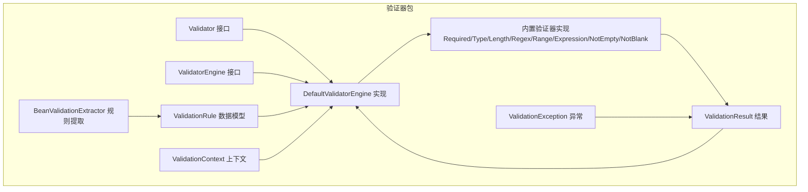
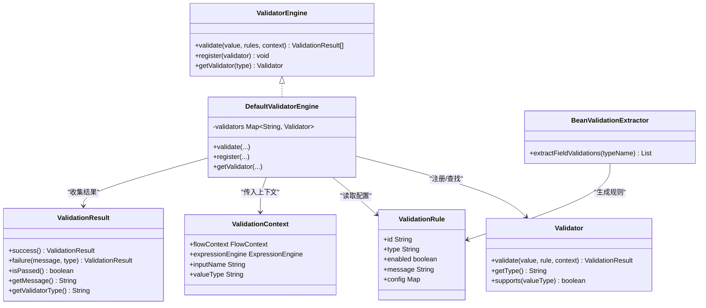
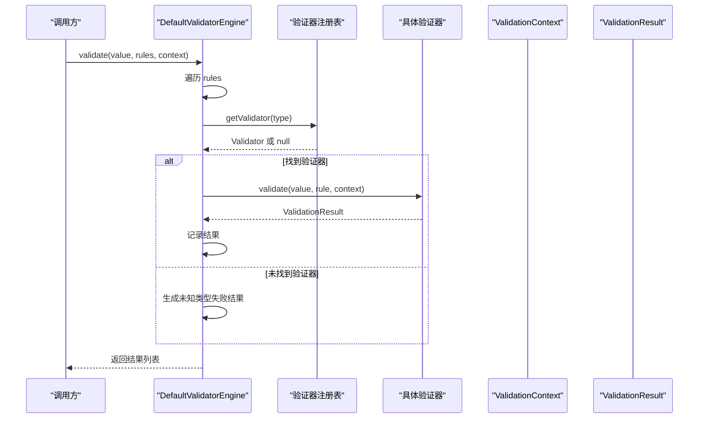
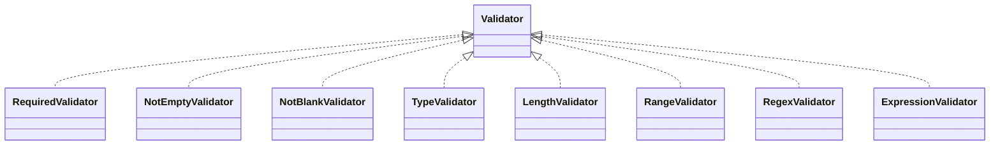
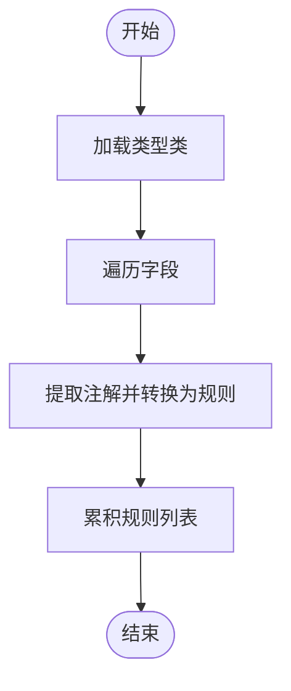
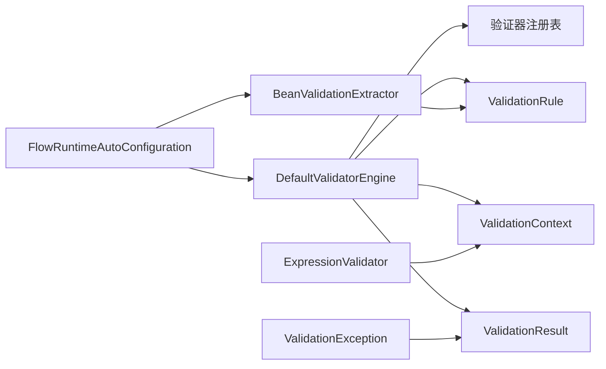

# 验证器包设计

<cite>
**本文引用的文件**
- [Validator.java](file://yglue-runtime/src/main/java/org/yglue/flow/runtime/core/validator/Validator.java)
- [ValidatorEngine.java](file://yglue-runtime/src/main/java/org/yglue/flow/runtime/core/validator/ValidatorEngine.java)
- [DefaultValidatorEngine.java](file://yglue-runtime/src/main/java/org/yglue/flow/runtime/core/validator/DefaultValidatorEngine.java)
- [ValidationContext.java](file://yglue-runtime/src/main/java/org/yglue/flow/runtime/core/validator/ValidationContext.java)
- [ValidationResult.java](file://yglue-runtime/src/main/java/org/yglue/flow/runtime/core/validator/ValidationResult.java)
- [ValidationRule.java](file://yglue-runtime/src/main/java/org/yglue/flow/runtime/core/validator/ValidationRule.java)
- [BeanValidationExtractor.java](file://yglue-runtime/src/main/java/org/yglue/flow/runtime/core/validator/BeanValidationExtractor.java)
- [RequiredValidator.java](file://yglue-runtime/src/main/java/org/yglue/flow/runtime/core/validator/validators/RequiredValidator.java)
- [TypeValidator.java](file://yglue-runtime/src/main/java/org/yglue/flow/runtime/core/validator/validators/TypeValidator.java)
- [LengthValidator.java](file://yglue-runtime/src/main/java/org/yglue/flow/runtime/core/validator/validators/LengthValidator.java)
- [RegexValidator.java](file://yglue-runtime/src/main/java/org/yglue/flow/runtime/core/validator/validators/RegexValidator.java)
- [RangeValidator.java](file://yglue-runtime/src/main/java/org/yglue/flow/runtime/core/validator/validators/RangeValidator.java)
- [ExpressionValidator.java](file://yglue-runtime/src/main/java/org/yglue/flow/runtime/core/validator/validators/ExpressionValidator.java)
- [NotEmptyValidator.java](file://yglue-runtime/src/main/java/org/yglue/flow/runtime/core/validator/validators/NotEmptyValidator.java)
- [NotBlankValidator.java](file://yglue-runtime/src/main/java/org/yglue/flow/runtime/core/validator/validators/NotBlankValidator.java)
- [ValidationException.java](file://yglue-runtime/src/main/java/org/yglue/flow/runtime/core/validator/ValidationException.java)
- [FlowRuntimeAutoConfiguration.java](file://yglue-runtime-spring-boot3/src/main/java/org/yglue/flow/runtime/spring/FlowRuntimeAutoConfiguration.java)
</cite>

## 目录
1. [引言](#引言)
2. [项目结构](#项目结构)
3. [核心组件](#核心组件)
4. [架构总览](#架构总览)
5. [详细组件分析](#详细组件分析)
6. [依赖分析](#依赖分析)
7. [性能考虑](#性能考虑)
8. [故障排查指南](#故障排查指南)
9. [结论](#结论)
10. [附录](#附录)

## 引言
本文件面向高级用户与维护者，系统性阐述验证器包（Validator Package）的设计与实现，重点说明：
- Validator 接口的职责与契约
- DefaultValidatorEngine 如何作为核心调度器，协调多个 Validator 实例完成验证任务
- 验证器的注册、发现与执行机制
- 通过 Bean Validation 注解自动提取规则的能力
- 与 Spring Boot 自动装配的集成方式
- 通过 SPI 或依赖注入扩展自定义验证器的路径

目标是帮助读者快速理解验证器包的模块化与可插拔特性，并提供扩展与排障的实践指导。

## 项目结构
验证器包位于运行时模块的 core.validator 子包内，围绕“规则-上下文-结果-引擎”的核心模型组织代码；同时提供一组内置验证器实现与 Bean Validation 规则提取工具。

图表来源
- [Validator.java](file://yglue-runtime/src/main/java/org/yglue/flow/runtime/core/validator/Validator.java#L1-L40)
- [ValidatorEngine.java](file://yglue-runtime/src/main/java/org/yglue/flow/runtime/core/validator/ValidatorEngine.java#L1-L45)
- [DefaultValidatorEngine.java](file://yglue-runtime/src/main/java/org/yglue/flow/runtime/core/validator/DefaultValidatorEngine.java#L1-L83)
- [ValidationRule.java](file://yglue-runtime/src/main/java/org/yglue/flow/runtime/core/validator/ValidationRule.java#L1-L74)
- [ValidationContext.java](file://yglue-runtime/src/main/java/org/yglue/flow/runtime/core/validator/ValidationContext.java#L1-L56)
- [ValidationResult.java](file://yglue-runtime/src/main/java/org/yglue/flow/runtime/core/validator/ValidationResult.java#L1-L72)
- [BeanValidationExtractor.java](file://yglue-runtime/src/main/java/org/yglue/flow/runtime/core/validator/BeanValidationExtractor.java#L1-L463)
- [RequiredValidator.java](file://yglue-runtime/src/main/java/org/yglue/flow/runtime/core/validator/validators/RequiredValidator.java#L1-L38)
- [TypeValidator.java](file://yglue-runtime/src/main/java/org/yglue/flow/runtime/core/validator/validators/TypeValidator.java#L1-L93)
- [LengthValidator.java](file://yglue-runtime/src/main/java/org/yglue/flow/runtime/core/validator/validators/LengthValidator.java#L1-L95)
- [RegexValidator.java](file://yglue-runtime/src/main/java/org/yglue/flow/runtime/core/validator/validators/RegexValidator.java#L1-L109)
- [RangeValidator.java](file://yglue-runtime/src/main/java/org/yglue/flow/runtime/core/validator/validators/RangeValidator.java#L1-L84)
- [ExpressionValidator.java](file://yglue-runtime/src/main/java/org/yglue/flow/runtime/core/validator/validators/ExpressionValidator.java#L1-L91)
- [NotEmptyValidator.java](file://yglue-runtime/src/main/java/org/yglue/flow/runtime/core/validator/validators/NotEmptyValidator.java#L1-L58)
- [NotBlankValidator.java](file://yglue-runtime/src/main/java/org/yglue/flow/runtime/core/validator/validators/NotBlankValidator.java#L1-L51)
- [ValidationException.java](file://yglue-runtime/src/main/java/org/yglue/flow/runtime/core/validator/ValidationException.java#L1-L162)

章节来源
- [Validator.java](file://yglue-runtime/src/main/java/org/yglue/flow/runtime/core/validator/Validator.java#L1-L40)
- [ValidatorEngine.java](file://yglue-runtime/src/main/java/org/yglue/flow/runtime/core/validator/ValidatorEngine.java#L1-L45)
- [DefaultValidatorEngine.java](file://yglue-runtime/src/main/java/org/yglue/flow/runtime/core/validator/DefaultValidatorEngine.java#L1-L83)

## 核心组件
- Validator 接口：定义单个验证器的最小契约，包括 validate、getType、supports 三个方法，确保类型识别与类型支持判断。
- ValidatorEngine 接口：定义统一的验证入口，负责按规则顺序执行验证、注册与发现验证器。
- DefaultValidatorEngine：默认实现，内置注册常用验证器，按规则顺序执行并收集 ValidationResult。
- ValidationRule：规则数据模型，包含 id、type、enabled、message、config 等字段。
- ValidationContext：验证上下文，封装 FlowContext、表达式引擎、输入名与值类型等。
- ValidationResult：验证结果模型，提供 success/failure 工厂方法与状态访问。
- BeanValidationExtractor：从 Bean Validation 注解（JSR-303/JSR-380）自动提取规则，生成 ValidationRule 列表。
- ValidationException：验证异常，提供错误码、输入名与错误详情，支持转为标准错误响应体。

章节来源
- [Validator.java](file://yglue-runtime/src/main/java/org/yglue/flow/runtime/core/validator/Validator.java#L1-L40)
- [ValidatorEngine.java](file://yglue-runtime/src/main/java/org/yglue/flow/runtime/core/validator/ValidatorEngine.java#L1-L45)
- [DefaultValidatorEngine.java](file://yglue-runtime/src/main/java/org/yglue/flow/runtime/core/validator/DefaultValidatorEngine.java#L1-L83)
- [ValidationRule.java](file://yglue-runtime/src/main/java/org/yglue/flow/runtime/core/validator/ValidationRule.java#L1-L74)
- [ValidationContext.java](file://yglue-runtime/src/main/java/org/yglue/flow/runtime/core/validator/ValidationContext.java#L1-L56)
- [ValidationResult.java](file://yglue-runtime/src/main/java/org/yglue/flow/runtime/core/validator/ValidationResult.java#L1-L72)
- [BeanValidationExtractor.java](file://yglue-runtime/src/main/java/org/yglue/flow/runtime/core/validator/BeanValidationExtractor.java#L1-L463)
- [ValidationException.java](file://yglue-runtime/src/main/java/org/yglue/flow/runtime/core/validator/ValidationException.java#L1-L162)

## 架构总览
验证器包采用“策略+调度器”的分层架构：
- 策略层：各 Validator 实现遵循统一接口，支持类型识别与类型支持判断，便于扩展。
- 调度层：DefaultValidatorEngine 统一管理 Validator 注册表，按规则顺序执行验证，聚合结果。
- 规则来源：ValidationRule 作为规则载体；BeanValidationExtractor 支持从 Bean 注解自动抽取规则。
- 上下文与结果：ValidationContext 提供执行所需上下文；ValidationResult 统一结果表示；ValidationException 提供错误语义。

图表来源
- [Validator.java](file://yglue-runtime/src/main/java/org/yglue/flow/runtime/core/validator/Validator.java#L1-L40)
- [ValidatorEngine.java](file://yglue-runtime/src/main/java/org/yglue/flow/runtime/core/validator/ValidatorEngine.java#L1-L45)
- [DefaultValidatorEngine.java](file://yglue-runtime/src/main/java/org/yglue/flow/runtime/core/validator/DefaultValidatorEngine.java#L1-L83)
- [ValidationRule.java](file://yglue-runtime/src/main/java/org/yglue/flow/runtime/core/validator/ValidationRule.java#L1-L74)
- [ValidationContext.java](file://yglue-runtime/src/main/java/org/yglue/flow/runtime/core/validator/ValidationContext.java#L1-L56)
- [ValidationResult.java](file://yglue-runtime/src/main/java/org/yglue/flow/runtime/core/validator/ValidationResult.java#L1-L72)
- [BeanValidationExtractor.java](file://yglue-runtime/src/main/java/org/yglue/flow/runtime/core/validator/BeanValidationExtractor.java#L1-L463)

## 详细组件分析

### DefaultValidatorEngine：核心调度器
- 注册机制：构造函数自动注册内置验证器；可通过 register 手动扩展。
- 发现机制：按规则 type 查找对应 Validator；未找到时记录失败结果。
- 执行机制：遍历规则列表，跳过禁用规则；调用对应 Validator.validate 并收集结果；当前版本未实现 failPolicy 细粒度控制，建议在上层组合逻辑中处理。
- 复杂度：每次执行对规则数量线性开销 O(n)，查找验证器为 O(1) 哈希表操作。

图表来源
- [DefaultValidatorEngine.java](file://yglue-runtime/src/main/java/org/yglue/flow/runtime/core/validator/DefaultValidatorEngine.java#L1-L83)
- [ValidatorEngine.java](file://yglue-runtime/src/main/java/org/yglue/flow/runtime/core/validator/ValidatorEngine.java#L1-L45)
- [ValidationContext.java](file://yglue-runtime/src/main/java/org/yglue/flow/runtime/core/validator/ValidationContext.java#L1-L56)
- [ValidationResult.java](file://yglue-runtime/src/main/java/org/yglue/flow/runtime/core/validator/ValidationResult.java#L1-L72)

章节来源
- [DefaultValidatorEngine.java](file://yglue-runtime/src/main/java/org/yglue/flow/runtime/core/validator/DefaultValidatorEngine.java#L1-L83)

### Validator 接口与内置验证器
- 接口契约：validate/valueType/type/supports 四要素，保证类型识别与类型支持判断。
- 内置验证器覆盖常见场景：
  - Required：必填校验
  - NotEmpty/NotBlank：集合/字符串非空校验
  - Type：类型匹配校验
  - Length：字符串/集合/数组长度校验
  - Range：数值范围校验
  - Regex：正则校验（支持预设与自定义）
  - Expression：Groovy 表达式自定义校验
- 扩展点：新增验证器只需实现 Validator 接口并通过 DefaultValidatorEngine.register 注册。

图表来源
- [Validator.java](file://yglue-runtime/src/main/java/org/yglue/flow/runtime/core/validator/Validator.java#L1-L40)
- [RequiredValidator.java](file://yglue-runtime/src/main/java/org/yglue/flow/runtime/core/validator/validators/RequiredValidator.java#L1-L38)
- [NotEmptyValidator.java](file://yglue-runtime/src/main/java/org/yglue/flow/runtime/core/validator/validators/NotEmptyValidator.java#L1-L58)
- [NotBlankValidator.java](file://yglue-runtime/src/main/java/org/yglue/flow/runtime/core/validator/validators/NotBlankValidator.java#L1-L51)
- [TypeValidator.java](file://yglue-runtime/src/main/java/org/yglue/flow/runtime/core/validator/validators/TypeValidator.java#L1-L93)
- [LengthValidator.java](file://yglue-runtime/src/main/java/org/yglue/flow/runtime/core/validator/validators/LengthValidator.java#L1-L95)
- [RangeValidator.java](file://yglue-runtime/src/main/java/org/yglue/flow/runtime/core/validator/validators/RangeValidator.java#L1-L84)
- [RegexValidator.java](file://yglue-runtime/src/main/java/org/yglue/flow/runtime/core/validator/validators/RegexValidator.java#L1-L109)
- [ExpressionValidator.java](file://yglue-runtime/src/main/java/org/yglue/flow/runtime/core/validator/validators/ExpressionValidator.java#L1-L91)

章节来源
- [Validator.java](file://yglue-runtime/src/main/java/org/yglue/flow/runtime/core/validator/Validator.java#L1-L40)
- [RequiredValidator.java](file://yglue-runtime/src/main/java/org/yglue/flow/runtime/core/validator/validators/RequiredValidator.java#L1-L38)
- [TypeValidator.java](file://yglue-runtime/src/main/java/org/yglue/flow/runtime/core/validator/validators/TypeValidator.java#L1-L93)
- [LengthValidator.java](file://yglue-runtime/src/main/java/org/yglue/flow/runtime/core/validator/validators/LengthValidator.java#L1-L95)
- [RegexValidator.java](file://yglue-runtime/src/main/java/org/yglue/flow/runtime/core/validator/validators/RegexValidator.java#L1-L109)
- [RangeValidator.java](file://yglue-runtime/src/main/java/org/yglue/flow/runtime/core/validator/validators/RangeValidator.java#L1-L84)
- [ExpressionValidator.java](file://yglue-runtime/src/main/java/org/yglue/flow/runtime/core/validator/validators/ExpressionValidator.java#L1-L91)
- [NotEmptyValidator.java](file://yglue-runtime/src/main/java/org/yglue/flow/runtime/core/validator/validators/NotEmptyValidator.java#L1-L58)
- [NotBlankValidator.java](file://yglue-runtime/src/main/java/org/yglue/flow/runtime/core/validator/validators/NotBlankValidator.java#L1-L51)

### BeanValidationExtractor：规则提取与集成
- 功能：从 Bean 类型名加载类，反射提取字段注解，转换为 ValidationRule 列表。
- 支持注解：NotNull、NotEmpty、NotBlank、Size、Min/Max、DecimalMin/DecimalMax、Email、Pattern、Positive/Negative 及其 Jakarta 对应版本。
- 输出：每个字段生成若干 ValidationRule，类型映射到内置验证器（如 required、notEmpty、length、range、regex 等）。
- 典型用途：在节点定义或请求参数校验中，基于 DTO 字段注解自动生成规则集。

图表来源
- [BeanValidationExtractor.java](file://yglue-runtime/src/main/java/org/yglue/flow/runtime/core/validator/BeanValidationExtractor.java#L1-L463)

章节来源
- [BeanValidationExtractor.java](file://yglue-runtime/src/main/java/org/yglue/flow/runtime/core/validator/BeanValidationExtractor.java#L1-L463)

### ValidationRule/ValidationContext/ValidationResult：数据模型与结果
- ValidationRule：承载规则标识、类型、启用状态、消息与配置，是规则执行的输入。
- ValidationContext：封装 FlowContext、表达式引擎、输入名与值类型，为验证器提供上下文能力（如表达式校验器）。
- ValidationResult：统一的成功/失败结果，携带验证器类型与可选异常，便于上层聚合与展示。

章节来源
- [ValidationRule.java](file://yglue-runtime/src/main/java/org/yglue/flow/runtime/core/validator/ValidationRule.java#L1-L74)
- [ValidationContext.java](file://yglue-runtime/src/main/java/org/yglue/flow/runtime/core/validator/ValidationContext.java#L1-L56)
- [ValidationResult.java](file://yglue-runtime/src/main/java/org/yglue/flow/runtime/core/validator/ValidationResult.java#L1-L72)

### ValidationException：错误建模与响应
- 错误码：提供 VALIDATION_FAILED、REQUIRED_MISSING、TYPE_MISMATCH、FORMAT_INVALID、OUT_OF_RANGE、LENGTH_INVALID、EXPRESSION_FAILED 等标准错误码。
- 错误详情：支持单条或多条 ValidationError，便于前端或网关统一处理。
- 响应转换：提供 toErrorBody 方法，支持标准错误响应格式。

章节来源
- [ValidationException.java](file://yglue-runtime/src/main/java/org/yglue/flow/runtime/core/validator/ValidationException.java#L1-L162)

## 依赖分析
- DefaultValidatorEngine 与内置验证器：构造函数中集中注册，形成强耦合但易于使用；扩展时通过 register 松耦合接入。
- BeanValidationExtractor 与 ValidationRule：提取过程与规则模型解耦，便于在不同场景复用。
- ExpressionValidator 与表达式引擎：依赖 ValidationContext 中的 ExpressionEngine，体现上下文驱动的扩展能力。
- Spring Boot 集成：FlowRuntimeAutoConfiguration 通过条件化装配与组件扫描，确保运行时环境具备必要的基础设施（如 RuleEngine、拦截器、REST 注册等），为验证器在请求链路中的应用提供支撑。

图表来源
- [DefaultValidatorEngine.java](file://yglue-runtime/src/main/java/org/yglue/flow/runtime/core/validator/DefaultValidatorEngine.java#L1-L83)
- [BeanValidationExtractor.java](file://yglue-runtime/src/main/java/org/yglue/flow/runtime/core/validator/BeanValidationExtractor.java#L1-L463)
- [ExpressionValidator.java](file://yglue-runtime/src/main/java/org/yglue/flow/runtime/core/validator/validators/ExpressionValidator.java#L1-L91)
- [ValidationException.java](file://yglue-runtime/src/main/java/org/yglue/flow/runtime/core/validator/ValidationException.java#L1-L162)
- [FlowRuntimeAutoConfiguration.java](file://yglue-runtime-spring-boot3/src/main/java/org/yglue/flow/runtime/spring/FlowRuntimeAutoConfiguration.java#L1-L155)

章节来源
- [FlowRuntimeAutoConfiguration.java](file://yglue-runtime-spring-boot3/src/main/java/org/yglue/flow/runtime/spring/FlowRuntimeAutoConfiguration.java#L1-L155)

## 性能考虑
- 查找复杂度：DefaultValidatorEngine 使用 Map 存储验证器，查找为 O(1)；规则遍历为 O(n)。
- 类型判定：部分验证器在 supports 中限制类型，减少无效调用。
- 表达式执行：ExpressionValidator 依赖表达式引擎，建议在配置层面控制表达式复杂度与缓存策略。
- 批量规则：建议在上层合并规则、去重与排序，减少重复校验。

## 故障排查指南
- 未知验证器类型：当规则 type 未注册时，DefaultValidatorEngine 会生成失败结果；检查是否已通过 register 注册或拼写是否正确。
- 规则未生效：确认 ValidationRule.enabled 为 true；检查 BeanValidationExtractor 是否正确加载类与注解。
- 表达式校验失败：检查 ExpressionValidator 的表达式语法与上下文变量（value、input.name、input.valueType）是否正确。
- 类型不匹配：TypeValidator 会比较 expectedType 与实际类型；注意 expectedTypeName 与 expectedType 的差异。
- 正则校验问题：RegexValidator 支持预设与自定义，检查 preset/pattern/flags 配置是否正确。
- 错误响应：使用 ValidationException.toErrorBody 输出标准错误体，便于统一处理。

章节来源
- [DefaultValidatorEngine.java](file://yglue-runtime/src/main/java/org/yglue/flow/runtime/core/validator/DefaultValidatorEngine.java#L1-L83)
- [ExpressionValidator.java](file://yglue-runtime/src/main/java/org/yglue/flow/runtime/core/validator/validators/ExpressionValidator.java#L1-L91)
- [TypeValidator.java](file://yglue-runtime/src/main/java/org/yglue/flow/runtime/core/validator/validators/TypeValidator.java#L1-L93)
- [RegexValidator.java](file://yglue-runtime/src/main/java/org/yglue/flow/runtime/core/validator/validators/RegexValidator.java#L1-L109)
- [ValidationException.java](file://yglue-runtime/src/main/java/org/yglue/flow/runtime/core/validator/ValidationException.java#L1-L162)

## 结论
验证器包通过清晰的接口与默认实现，提供了高内聚、低耦合的验证框架。DefaultValidatorEngine 作为调度器，结合 BeanValidationExtractor 的规则提取能力，既满足开箱即用，又支持灵活扩展。通过 register 机制与 Spring Boot 自动装配，用户可以便捷地引入自定义验证器，实现模块化与可插拔的验证体系。

## 附录

### 扩展验证器的推荐步骤
- 实现 Validator 接口，定义 getType 与 supports，并在 validate 中依据 ValidationRule.config 与 ValidationContext 执行校验。
- 在合适时机调用 DefaultValidatorEngine.register 注册你的验证器。
- 若需从 Bean 注解自动提取规则，可在 BeanValidationExtractor 中增加注解映射或直接生成 ValidationRule。
- 在 Spring Boot 环境中，确保 FlowRuntimeAutoConfiguration 生效，以便运行时组件可用。

章节来源
- [Validator.java](file://yglue-runtime/src/main/java/org/yglue/flow/runtime/core/validator/Validator.java#L1-L40)
- [DefaultValidatorEngine.java](file://yglue-runtime/src/main/java/org/yglue/flow/runtime/core/validator/DefaultValidatorEngine.java#L1-L83)
- [BeanValidationExtractor.java](file://yglue-runtime/src/main/java/org/yglue/flow/runtime/core/validator/BeanValidationExtractor.java#L1-L463)
- [FlowRuntimeAutoConfiguration.java](file://yglue-runtime-spring-boot3/src/main/java/org/yglue/flow/runtime/spring/FlowRuntimeAutoConfiguration.java#L1-L155)