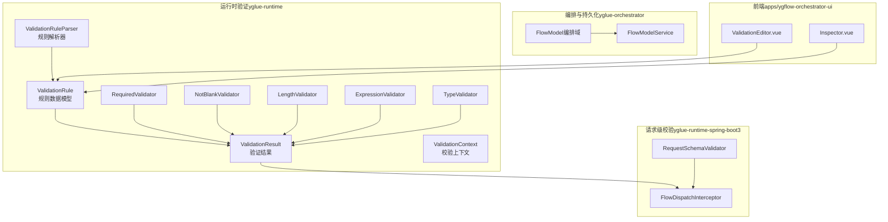
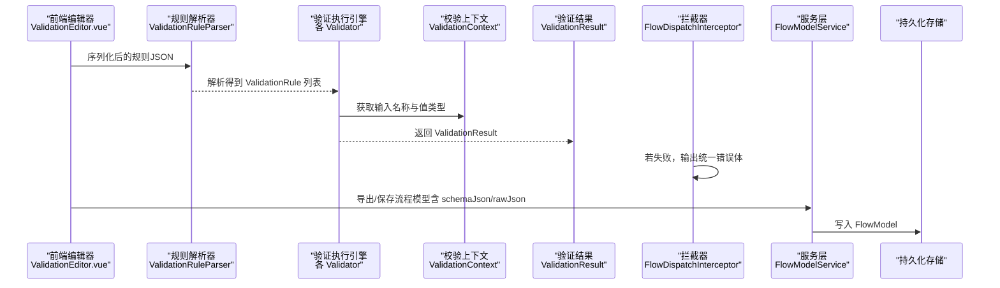
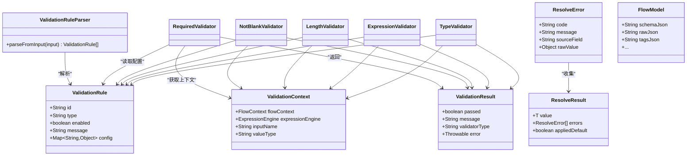

# 验证数据结构

<cite>
**本文引用的文件**
- [ValidationRule.java](file://yglue-runtime/src/main/java/org/yglue/flow/runtime/core/validator/ValidationRule.java)
- [ValidationResult.java](file://yglue-runtime/src/main/java/org/yglue/flow/runtime/core/validator/ValidationResult.java)
- [ValidationContext.java](file://yglue-runtime/src/main/java/org/yglue/flow/runtime/core/validator/ValidationContext.java)
- [ValidationRuleParser.java](file://yglue-runtime/src/main/java/org/yglue/flow/runtime/core/validator/ValidationRuleParser.java)
- [RequiredValidator.java](file://yglue-runtime/src/main/java/org/yglue/flow/runtime/core/validator/validators/RequiredValidator.java)
- [NotBlankValidator.java](file://yglue-runtime/src/main/java/org/yglue/flow/runtime/core/validator/validators/NotBlankValidator.java)
- [LengthValidator.java](file://yglue-runtime/src/main/java/org/yglue/flow/runtime/core/validator/validators/LengthValidator.java)
- [ExpressionValidator.java](file://yglue-runtime/src/main/java/org/yglue/flow/runtime/core/validator/validators/ExpressionValidator.java)
- [TypeValidator.java](file://yglue-runtime/src/main/java/org/yglue/flow/runtime/core/validator/validators/TypeValidator.java)
- [ResolveError.java](file://yglue-runtime/src/main/java/org/yglue/flow/runtime/core/param/ResolveError.java)
- [ResolveResult.java](file://yglue-runtime/src/main/java/org/yglue/flow/runtime/core/param/ResolveResult.java)
- [FlowModel.java（编排域）](file://yglue-orchestrator/src/main/java/org/yglue/flow/orch/domain/FlowModel.java)
- [FlowModel.java（注解）](file://yglue-annotations/src/main/java/org/yglue/flow/annotations/FlowModel.java)
- [FlowModelService.java](file://yglue-orchestrator/src/main/java/org/yglue/flow/orch/service/FlowModelService.java)
- [RequestSchemaValidator.java（Spring Boot 3）](file://yglue-runtime-spring-boot3/src/main/java/org/yglue/flow/runtime/spring/RequestSchemaValidator.java)
- [FlowDispatchInterceptor.java](file://yglue-runtime-spring-boot2/src/main/java/org/yglue/flow/runtime/spring/FlowDispatchInterceptor.java)
- [ValidationEditor.vue](file://apps/ygflow-orchestrator-ui/src/components/ValidationEditor.vue)
- [Inspector.vue](file://apps/ygflow-orchestrator-ui/src/components/Inspector.vue)
</cite>

## 目录
1. [引言](#引言)
2. [项目结构](#项目结构)
3. [核心组件](#核心组件)
4. [架构总览](#架构总览)
5. [详细组件分析](#详细组件分析)
6. [依赖关系分析](#依赖关系分析)
7. [性能考量](#性能考量)
8. [故障排查指南](#故障排查指南)
9. [结论](#结论)
10. [附录](#附录)

## 引言
本文件聚焦于“验证数据结构”的设计与使用，系统性地定义并解释以下关键数据契约：
- ValidationRule：验证规则的数据结构，包含规则类型、启用状态、错误消息模板与参数配置。
- ValidationResult：验证结果的数据结构，包含通过标志、错误消息、触发的校验器类型及异常信息。
- ResolveError：参数解析阶段的错误详情，用于记录来源字段与原始值等上下文信息。
- FlowModel：流程模型对象，承载序列化后的流程定义与元数据，便于持久化与跨模块传输。

同时，文档说明这些数据结构在流程定义中的引用方式、在序列化（如 JSON）与持久化过程中的表现形式，并给出开发者进行自定义验证或结果分析的最佳实践。

## 项目结构
围绕验证数据结构的关键代码分布在以下模块：
- yglue-runtime：运行时验证核心（ValidationRule、ValidationResult、ValidationContext、ValidationRuleParser、各类Validator实现）
- yglue-runtime-spring-boot3：请求级 Schema 校验（RequestSchemaValidator），与 Flow 运行时拦截器配合输出统一错误体
- yglue-orchestrator：流程模型持久化（FlowModel、FlowModelService），以及前端导出/导入流程时的 JSON 字段映射
- apps/ygflow-orchestrator-ui：可视化编辑器对 ValidationRule 的 UI 编辑与序列化

图表来源
- [ValidationRule.java](file://yglue-runtime/src/main/java/org/yglue/flow/runtime/core/validator/ValidationRule.java#L1-L73)
- [ValidationResult.java](file://yglue-runtime/src/main/java/org/yglue/flow/runtime/core/validator/ValidationResult.java#L1-L72)
- [ValidationContext.java](file://yglue-runtime/src/main/java/org/yglue/flow/runtime/core/validator/ValidationContext.java#L1-L56)
- [ValidationRuleParser.java](file://yglue-runtime/src/main/java/org/yglue/flow/runtime/core/validator/ValidationRuleParser.java#L1-L121)
- [RequiredValidator.java](file://yglue-runtime/src/main/java/org/yglue/flow/runtime/core/validator/validators/RequiredValidator.java#L1-L38)
- [NotBlankValidator.java](file://yglue-runtime/src/main/java/org/yglue/flow/runtime/core/validator/validators/NotBlankValidator.java#L1-L51)
- [LengthValidator.java](file://yglue-runtime/src/main/java/org/yglue/flow/runtime/core/validator/validators/LengthValidator.java#L1-L95)
- [ExpressionValidator.java](file://yglue-runtime/src/main/java/org/yglue/flow/runtime/core/validator/validators/ExpressionValidator.java#L1-L90)
- [TypeValidator.java](file://yglue-runtime/src/main/java/org/yglue/flow/runtime/core/validator/validators/TypeValidator.java#L1-L69)
- [RequestSchemaValidator.java（Spring Boot 3）](file://yglue-runtime-spring-boot3/src/main/java/org/yglue/flow/runtime/spring/RequestSchemaValidator.java#L35-L426)
- [FlowDispatchInterceptor.java](file://yglue-runtime-spring-boot2/src/main/java/org/yglue/flow/runtime/spring/FlowDispatchInterceptor.java#L103-L131)
- [FlowModel.java（编排域）](file://yglue-orchestrator/src/main/java/org/yglue/flow/orch/domain/FlowModel.java#L1-L29)
- [FlowModelService.java](file://yglue-orchestrator/src/main/java/org/yglue/flow/orch/service/FlowModelService.java#L73-L96)
- [ValidationEditor.vue](file://apps/ygflow-orchestrator-ui/src/components/ValidationEditor.vue#L39-L262)
- [Inspector.vue](file://apps/ygflow-orchestrator-ui/src/components/Inspector.vue#L1-L60)

章节来源
- [ValidationRule.java](file://yglue-runtime/src/main/java/org/yglue/flow/runtime/core/validator/ValidationRule.java#L1-L73)
- [ValidationResult.java](file://yglue-runtime/src/main/java/org/yglue/flow/runtime/core/validator/ValidationResult.java#L1-L72)
- [ValidationContext.java](file://yglue-runtime/src/main/java/org/yglue/flow/runtime/core/validator/ValidationContext.java#L1-L56)
- [ValidationRuleParser.java](file://yglue-runtime/src/main/java/org/yglue/flow/runtime/core/validator/ValidationRuleParser.java#L1-L121)
- [FlowModel.java（编排域）](file://yglue-orchestrator/src/main/java/org/yglue/flow/orch/domain/FlowModel.java#L1-L29)
- [FlowModelService.java](file://yglue-orchestrator/src/main/java/org/yglue/flow/orch/service/FlowModelService.java#L73-L96)
- [ValidationEditor.vue](file://apps/ygflow-orchestrator-ui/src/components/ValidationEditor.vue#L39-L262)
- [Inspector.vue](file://apps/ygflow-orchestrator-ui/src/components/Inspector.vue#L1-L60)

## 核心组件
本节定义并解释验证数据结构的核心契约，确保开发者在扩展或自定义时遵循一致的数据格式。

- ValidationRule（验证规则）
  - 字段
    - id：规则唯一标识（可选）
    - type：规则类型（字符串），例如 required、notEmpty、notBlank、type、range、length、regex、expression、custom 等
    - enabled：是否启用该规则（布尔）
    - message：错误消息模板（字符串），若未设置将使用默认提示
    - config：规则配置对象（键值对），不同 type 对应不同的配置项
  - 用途
    - 作为节点配置的一部分，被解析器提取并交由对应 Validator 执行
    - 支持在 UI 中编辑与序列化为 JSON，便于持久化与跨端传输
  - 关键行为
    - 解析器会从输入参数配置中读取 validators 列表，逐条解析为 ValidationRule 实例
    - config 中的键值会被转换为 Map<String, Object>，供具体校验器读取

- ValidationResult（验证结果）
  - 字段
    - passed：是否通过（布尔）
    - message：错误消息（字符串）
    - validatorType：触发的校验器类型（字符串）
    - error：异常对象（Throwable，可选）
  - 用途
    - 所有 Validator 在完成一次校验后返回 ValidationResult
    - 用于统一错误输出与日志记录

- ValidationContext（校验上下文）
  - 字段
    - flowContext：流程上下文
    - expressionEngine：表达式引擎实例
    - inputName：当前输入参数名称
    - valueType：当前输入值类型（如 STRING、NUMBER、BOOLEAN、ARRAY、OBJECT 等）
  - 用途
    - 为表达式校验器等提供运行时上下文能力（变量注入、表达式求值）

- ResolveError（解析错误）
  - 字段
    - code：错误码（字符串）
    - message：错误消息（字符串）
    - sourceField：来源字段（字符串）
    - rawValue：原始值（对象）
  - 用途
    - 记录参数解析阶段的错误详情，便于定位问题与生成诊断信息

- FlowModel（流程模型）
  - 字段
    - identifier/name/className/description/category/version/tagsJson/schemaJson/rawJson 等
  - 用途
    - 作为编排域的持久化载体，承载流程定义与元数据
    - 通过服务层写入数据库，前端导出/导入时使用 JSON 字段

章节来源
- [ValidationRule.java](file://yglue-runtime/src/main/java/org/yglue/flow/runtime/core/validator/ValidationRule.java#L1-L73)
- [ValidationResult.java](file://yglue-runtime/src/main/java/org/yglue/flow/runtime/core/validator/ValidationResult.java#L1-L72)
- [ValidationContext.java](file://yglue-runtime/src/main/java/org/yglue/flow/runtime/core/validator/ValidationContext.java#L1-L56)
- [ResolveError.java](file://yglue-runtime/src/main/java/org/yglue/flow/runtime/core/param/ResolveError.java#L1-L71)
- [FlowModel.java（编排域）](file://yglue-orchestrator/src/main/java/org/yglue/flow/orch/domain/FlowModel.java#L1-L29)

## 架构总览
下图展示了验证数据结构在系统中的交互路径：从 UI 编辑到规则解析、执行校验、统一错误输出，再到持久化存储。

图表来源
- [ValidationEditor.vue](file://apps/ygflow-orchestrator-ui/src/components/ValidationEditor.vue#L39-L262)
- [ValidationRuleParser.java](file://yglue-runtime/src/main/java/org/yglue/flow/runtime/core/validator/ValidationRuleParser.java#L1-L121)
- [RequiredValidator.java](file://yglue-runtime/src/main/java/org/yglue/flow/runtime/core/validator/validators/RequiredValidator.java#L1-L38)
- [NotBlankValidator.java](file://yglue-runtime/src/main/java/org/yglue/flow/runtime/core/validator/validators/NotBlankValidator.java#L1-L51)
- [LengthValidator.java](file://yglue-runtime/src/main/java/org/yglue/flow/runtime/core/validator/validators/LengthValidator.java#L1-L95)
- [ExpressionValidator.java](file://yglue-runtime/src/main/java/org/yglue/flow/runtime/core/validator/validators/ExpressionValidator.java#L1-L90)
- [TypeValidator.java](file://yglue-runtime/src/main/java/org/yglue/flow/runtime/core/validator/validators/TypeValidator.java#L1-L69)
- [ValidationContext.java](file://yglue-runtime/src/main/java/org/yglue/flow/runtime/core/validator/ValidationContext.java#L1-L56)
- [ValidationResult.java](file://yglue-runtime/src/main/java/org/yglue/flow/runtime/core/validator/ValidationResult.java#L1-L72)
- [FlowDispatchInterceptor.java](file://yglue-runtime-spring-boot2/src/main/java/org/yglue/flow/runtime/spring/FlowDispatchInterceptor.java#L103-L131)
- [FlowModelService.java](file://yglue-orchestrator/src/main/java/org/yglue/flow/orch/service/FlowModelService.java#L73-L96)

## 详细组件分析

### ValidationRule 数据契约
- 结构要点
  - id：用于区分同一节点内的多条规则
  - type：规则类型，决定 config 的语义与校验逻辑
  - enabled：控制规则是否参与校验
  - message：错误消息模板，可覆盖默认提示
  - config：按 type 定义的配置对象，如 length 的 minLength/maxLength、regex 的 pattern/flags、expression 的 expression、type 的 expectedType/expectedTypeName 等
- 解析流程
  - 解析器从输入参数配置中读取 validators 数组，逐条解析为 ValidationRule
  - config 会尝试转换为 Map<String, Object>，若失败则忽略该配置
- 序列化与持久化
  - UI 编辑器会将规则序列化为 JSON 并传递给后端
  - FlowModelService 将 schemaJson/rawJson 等 JSON 字段写入数据库，便于后续导入/导出

章节来源
- [ValidationRule.java](file://yglue-runtime/src/main/java/org/yglue/flow/runtime/core/validator/ValidationRule.java#L1-L73)
- [ValidationRuleParser.java](file://yglue-runtime/src/main/java/org/yglue/flow/runtime/core/validator/ValidationRuleParser.java#L1-L121)
- [ValidationEditor.vue](file://apps/ygflow-orchestrator-ui/src/components/ValidationEditor.vue#L39-L262)
- [Inspector.vue](file://apps/ygflow-orchestrator-ui/src/components/Inspector.vue#L1-L60)
- [FlowModelService.java](file://yglue-orchestrator/src/main/java/org/yglue/flow/orch/service/FlowModelService.java#L73-L96)

### ValidationResult 数据契约
- 结构要点
  - passed：布尔标志，true 表示通过，false 表示失败
  - message：失败时的错误消息
  - validatorType：触发的校验器类型（如 required、length、expression 等）
  - error：失败时携带的异常对象（可选）
- 使用场景
  - 所有 Validator 在 validate 后返回 ValidationResult
  - FlowDispatchInterceptor 在拦截到校验失败时，将 ValidationResult 转换为统一错误体并输出

章节来源
- [ValidationResult.java](file://yglue-runtime/src/main/java/org/yglue/flow/runtime/core/validator/ValidationResult.java#L1-L72)
- [FlowDispatchInterceptor.java](file://yglue-runtime-spring-boot2/src/main/java/org/yglue/flow/runtime/spring/FlowDispatchInterceptor.java#L103-L131)

### ValidationContext 数据契约
- 结构要点
  - flowContext：流程上下文，提供流程级变量与状态
  - expressionEngine：表达式引擎，用于执行 expression 类型的校验
  - inputName/valueType：当前输入参数的名称与类型，供错误消息与校验逻辑使用
- 使用场景
  - ExpressionValidator 等需要表达式求值的校验器会使用该上下文

章节来源
- [ValidationContext.java](file://yglue-runtime/src/main/java/org/yglue/flow/runtime/core/validator/ValidationContext.java#L1-L56)
- [ExpressionValidator.java](file://yglue-runtime/src/main/java/org/yglue/flow/runtime/core/validator/validators/ExpressionValidator.java#L1-L90)

### ResolveError 数据契约
- 结构要点
  - code：错误码，用于标识错误类别
  - message：错误消息
  - sourceField：来源字段，指示错误发生在哪个输入字段
  - rawValue：原始值，便于调试与定位
- 使用场景
  - 参数解析阶段出现错误时，构建 ResolveError 并加入 ResolveResult，用于后续分析与展示

章节来源
- [ResolveError.java](file://yglue-runtime/src/main/java/org/yglue/flow/runtime/core/param/ResolveError.java#L1-L71)
- [ResolveResult.java](file://yglue-runtime/src/main/java/org/yglue/flow/runtime/core/param/ResolveResult.java#L51-L83)

### 规则类型与配置详解
以下为常见规则类型与其典型配置项（基于实现与 UI 编辑器支持）：

- required
  - 作用：检查参数是否存在且不为 null
  - 配置：无
  - 典型错误：参数不能为空

- notBlank
  - 作用：检查字符串去除空白后是否非空
  - 配置：无
  - 典型错误：参数不能为空白

- length
  - 作用：检查字符串/数组/集合长度范围
  - 配置：
    - minLength：最小长度（整数）
    - maxLength：最大长度（整数）
  - 典型错误：长度超出范围

- type
  - 作用：检查参数类型是否匹配
  - 配置：
    - expectedType：简要类型名（如 STRING、NUMBER、BOOLEAN、ARRAY）
    - expectedTypeName：完整类名（如 java.lang.String）
  - 典型错误：类型不匹配

- expression
  - 作用：使用表达式进行自定义校验
  - 配置：
    - expression：Groovy 表达式字符串
  - 典型错误：表达式执行失败或返回非真值

- custom
  - 作用：使用自定义校验器类进行校验
  - 配置：
    - validator：校验器类名
    - validatorConfig：校验器配置对象（JSON）
  - 典型错误：自定义校验器抛出异常或返回失败

章节来源
- [RequiredValidator.java](file://yglue-runtime/src/main/java/org/yglue/flow/runtime/core/validator/validators/RequiredValidator.java#L1-L38)
- [NotBlankValidator.java](file://yglue-runtime/src/main/java/org/yglue/flow/runtime/core/validator/validators/NotBlankValidator.java#L1-L51)
- [LengthValidator.java](file://yglue-runtime/src/main/java/org/yglue/flow/runtime/core/validator/validators/LengthValidator.java#L1-L95)
- [TypeValidator.java](file://yglue-runtime/src/main/java/org/yglue/flow/runtime/core/validator/validators/TypeValidator.java#L1-L69)
- [ExpressionValidator.java](file://yglue-runtime/src/main/java/org/yglue/flow/runtime/core/validator/validators/ExpressionValidator.java#L1-L90)
- [ValidationEditor.vue](file://apps/ygflow-orchestrator-ui/src/components/ValidationEditor.vue#L39-L262)

### FlowModel 与序列化/持久化
- 字段说明
  - schemaJson：流程请求/响应 Schema 的 JSON 文本
  - rawJson：流程原始 JSON 文本
  - 其他元数据：identifier、name、className、description、category、version、tagsJson 等
- 持久化流程
  - FlowModelService 将上述字段写入数据库；导入/导出时读取并更新
- 与验证的关系
  - FlowModel 本身不直接包含 ValidationRule 列表，但其 schemaJson/rawJson 可能包含与验证相关的元信息（如请求 Schema 的 x-required、x-source 等）
  - 请求 Schema 的校验由 RequestSchemaValidator 负责，失败时输出统一错误体

章节来源
- [FlowModel.java（编排域）](file://yglue-orchestrator/src/main/java/org/yglue/flow/orch/domain/FlowModel.java#L1-L29)
- [FlowModelService.java](file://yglue-orchestrator/src/main/java/org/yglue/flow/orch/service/FlowModelService.java#L73-L96)
- [RequestSchemaValidator.java（Spring Boot 3）](file://yglue-runtime-spring-boot3/src/main/java/org/yglue/flow/runtime/spring/RequestSchemaValidator.java#L35-L426)

## 依赖关系分析
- 组件耦合
  - ValidationRuleParser 依赖 Jackson ObjectMapper 进行 JSON 到 Map 的转换
  - 各 Validator 依赖 ValidationRule 与 ValidationContext 获取配置与上下文
  - ValidationResult 作为统一返回类型，被 FlowDispatchInterceptor 用于错误输出
  - ResolveError/ResolveResult 服务于参数解析阶段的错误收集与结果封装
- 外部依赖
  - Spring MVC 拦截器用于统一输出错误体
  - 数据库持久化由 FlowModelService 负责

图表来源
- [ValidationRule.java](file://yglue-runtime/src/main/java/org/yglue/flow/runtime/core/validator/ValidationRule.java#L1-L73)
- [ValidationResult.java](file://yglue-runtime/src/main/java/org/yglue/flow/runtime/core/validator/ValidationResult.java#L1-L72)
- [ValidationContext.java](file://yglue-runtime/src/main/java/org/yglue/flow/runtime/core/validator/ValidationContext.java#L1-L56)
- [ValidationRuleParser.java](file://yglue-runtime/src/main/java/org/yglue/flow/runtime/core/validator/ValidationRuleParser.java#L1-L121)
- [RequiredValidator.java](file://yglue-runtime/src/main/java/org/yglue/flow/runtime/core/validator/validators/RequiredValidator.java#L1-L38)
- [NotBlankValidator.java](file://yglue-runtime/src/main/java/org/yglue/flow/runtime/core/validator/validators/NotBlankValidator.java#L1-L51)
- [LengthValidator.java](file://yglue-runtime/src/main/java/org/yglue/flow/runtime/core/validator/validators/LengthValidator.java#L1-L95)
- [ExpressionValidator.java](file://yglue-runtime/src/main/java/org/yglue/flow/runtime/core/validator/validators/ExpressionValidator.java#L1-L90)
- [TypeValidator.java](file://yglue-runtime/src/main/java/org/yglue/flow/runtime/core/validator/validators/TypeValidator.java#L1-L69)
- [ResolveError.java](file://yglue-runtime/src/main/java/org/yglue/flow/runtime/core/param/ResolveError.java#L1-L71)
- [ResolveResult.java](file://yglue-runtime/src/main/java/org/yglue/flow/runtime/core/param/ResolveResult.java#L51-L83)
- [FlowModel.java（编排域）](file://yglue-orchestrator/src/main/java/org/yglue/flow/orch/domain/FlowModel.java#L1-L29)

## 性能考量
- 规则解析
  - ValidationRuleParser 使用 ObjectMapper 进行转换，建议避免在热路径频繁构造大对象
- 校验执行
  - 各 Validator 的 validate 方法应尽量短路判断（如 null 值优先处理），减少不必要的计算
  - expression 类型的校验会调用表达式引擎，应避免复杂表达式或频繁重复求值
- 错误输出
  - FlowDispatchInterceptor 将错误体序列化为 JSON，建议保持错误体简洁，仅包含必要字段

## 故障排查指南
- 常见问题
  - 规则未生效：检查 enabled 字段是否为 true；确认 type 与 valueType 匹配
  - 配置解析失败：检查 config 是否为合法 JSON；确认键名拼写正确
  - 表达式校验失败：检查 expression 是否可被表达式引擎求值；捕获异常并查看 error 字段
  - 类型不匹配：核对 expectedType/expectedTypeName 与实际值类型是否一致
- 排查步骤
  - 在 UI 中导出流程模型（schemaJson/rawJson），比对规则配置
  - 查看拦截器输出的统一错误体，定位失败的 validatorType 与 message
  - 使用 ResolveError 记录 sourceField 与 rawValue，辅助定位输入源

章节来源
- [FlowDispatchInterceptor.java](file://yglue-runtime-spring-boot2/src/main/java/org/yglue/flow/runtime/spring/FlowDispatchInterceptor.java#L103-L131)
- [ValidationResult.java](file://yglue-runtime/src/main/java/org/yglue/flow/runtime/core/validator/ValidationResult.java#L1-L72)
- [ResolveError.java](file://yglue-runtime/src/main/java/org/yglue/flow/runtime/core/param/ResolveError.java#L1-L71)

## 结论
本文系统性地定义了验证数据结构（ValidationRule、ValidationResult、ValidationContext、ResolveError）及其在流程模型（FlowModel）中的引用与持久化方式。通过明确的字段语义、解析与执行流程，以及统一的错误输出机制，开发者可以安全地扩展自定义校验器或进行结果分析，同时保证与前端编辑器与后端拦截器的良好协作。

## 附录
- 规则类型与配置参考
  - required：无配置
  - notBlank：无配置
  - length：minLength、maxLength（整数）
  - type：expectedType、expectedTypeName
  - expression：expression（Groovy 表达式）
  - custom：validator、validatorConfig（JSON 对象）