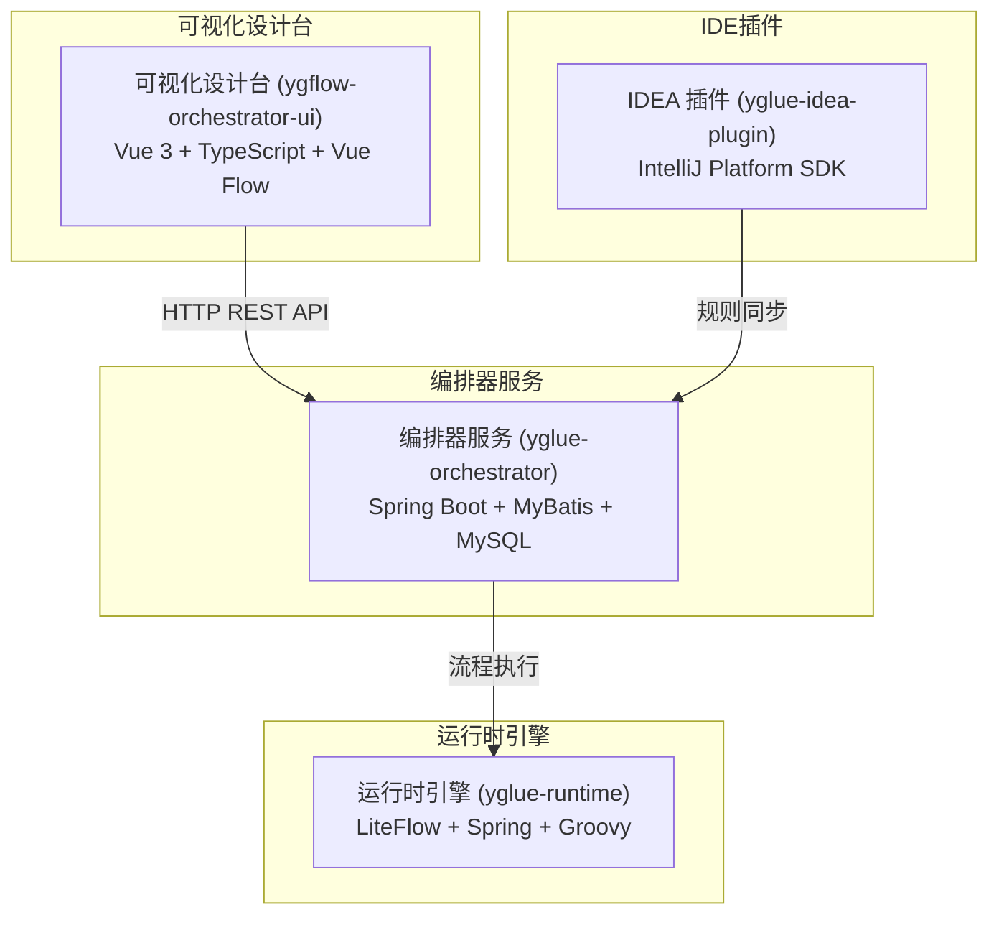
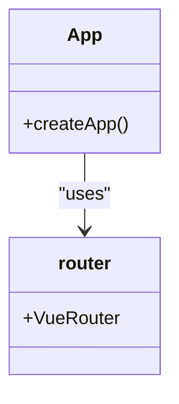
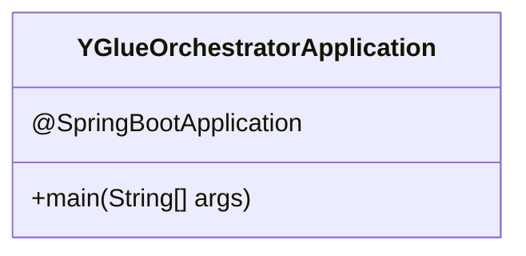
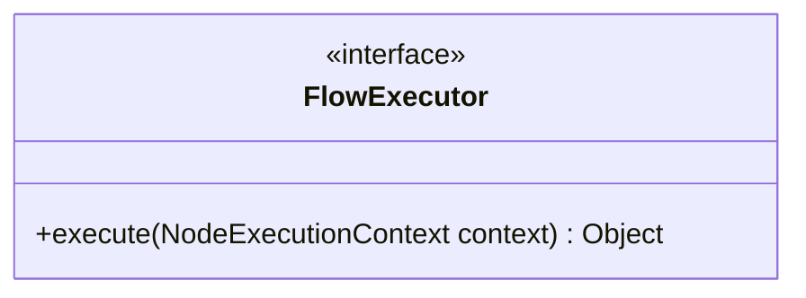
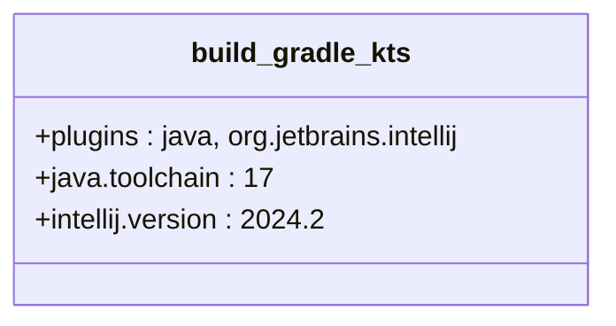
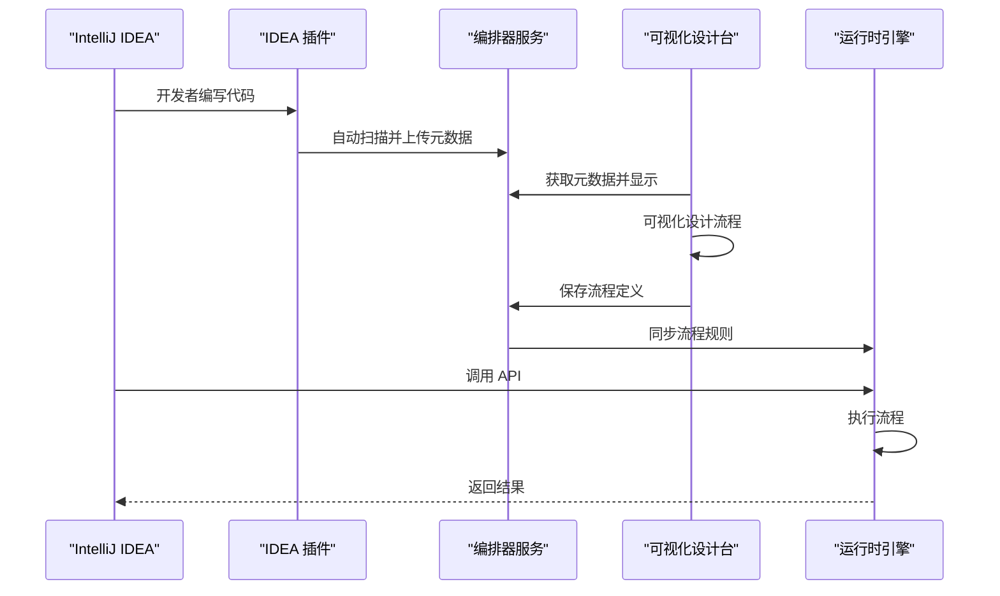

# 项目概述

<cite>
**本文档引用的文件**
- [README.md](file://README.md)
- [pom.xml](file://pom.xml)
- [main.ts](file://apps/ygflow-orchestrator-ui/src/main.ts)
- [YGlueOrchestratorApplication.java](file://yglue-orchestrator/src/main/java/org/yglue/flow/orch/YGlueOrchestratorApplication.java)
- [FlowExecutor.java](file://yglue-runtime/src/main/java/org/yglue/flow/runtime/core/FlowExecutor.java)
- [package.json](file://apps/ygflow-orchestrator-ui/package.json)
- [build.gradle.kts](file://yglue-idea-plugin/build.gradle.kts)
- [FlowRuntimeAutoConfiguration.java](file://yglue-runtime-spring-boot3/src/main/java/org/yglue/flow/runtime/spring/FlowRuntimeAutoConfiguration.java)
</cite>

## 目录
1. [简介](#简介)
2. [项目结构](#项目结构)
3. [核心特性](#核心特性)
4. [架构设计](#架构设计)
5. [核心概念](#核心概念)
6. [技术栈](#技术栈)
7. [模块详解](#模块详解)
8. [工作流程](#工作流程)

## 简介

YGFlow Suite（易构流程套件）是一个面向企业级业务流程的低代码编排平台，覆盖"开发者 IDE → 可视化设计台 → 运行时引擎"的全链路，实现入参治理、数据转换和流程调度的统一管理。产品专注于降低研发联调成本、提升上线效率，并提供可扩展的生态能力。

**Section sources**
- [README.md](file://README.md#L5-L6)

## 项目结构

YGFlow Suite 采用多模块架构，各模块职责清晰，主要包括核心模块、服务模块和工具模块。

### 核心模块

- **yglue-annotations**: 注解定义模块，提供用于标记和描述业务流程相关组件的 Java 注解，定义元数据标注规范。
- **yglue-runtime**: 运行时核心引擎，包含流程执行引擎（基于 LiteFlow）、节点执行器、参数解析引擎、数据转换引擎、表达式引擎（SpEL）、验证器引擎等核心功能。
- **yglue-runtime-spring-boot2**: Spring Boot 2.x 集成模块，提供 Spring Boot 2.x 自动配置、REST 接口 AOP 拦截、流程规则匹配和执行等功能。
- **yglue-runtime-spring-boot3**: Spring Boot 3.x 集成模块，提供 Spring Boot 3.x 自动配置、REST 接口 AOP 拦截、Jakarta EE 9+ 适配等功能。

### 服务模块

- **yglue-orchestrator**: 编排器服务，负责流程定义管理、入口点管理、元数据管理、规则同步服务和 REST API 服务。

### 工具模块

- **yglue-idea-plugin**: IntelliJ IDEA 插件，提供元数据扫描和上传、规则文件同步、自动同步机制等功能。
- **ygflow-orchestrator-ui**: 可视化设计台，提供流程设计画布、节点配置面板、版本管理界面和规则预览功能。

**Section sources**
- [README.md](file://README.md#L18-L65)

## 核心特性

YGFlow Suite 具备以下核心特性：

- **可视化流程设计**: 基于拖拽画布的流程编排，支持多种节点类型和复杂流程控制。
- **参数解析与验证**: 支持多种参数来源和验证规则，确保数据合法性。
- **数据转换引擎**: 支持 DSL 驱动的数据转换和 Groovy 脚本执行。
- **版本管理**: 完整的流程版本控制和发布管理。
- **IDE 集成**: IntelliJ IDEA 插件支持，实现元数据自动扫描和规则同步。
- **运行时引擎**: 基于 LiteFlow 的高性能流程执行引擎。

**Section sources**
- [README.md](file://README.md#L9-L14)

## 架构设计

YGFlow Suite 采用分层架构设计，各组件之间通过明确的接口进行通信。



**Diagram sources**
- [README.md](file://README.md#L172-L191)

## 核心概念

### 流程（Flow）

流程是由多个节点组成的业务编排逻辑，支持顺序执行、条件分支、并行执行等复杂场景。

### 节点（Node）

流程中的基本执行单元，包括：
- **入口节点**: 流程的起始点
- **服务节点**: 调用业务服务方法
- **转换节点**: 执行数据转换
- **分支节点**: 根据条件选择执行路径
- **事务节点**: 事务控制
- **出口节点**: 流程的结束点

### 参数解析器（Param Resolver）

用于从不同来源解析参数值，支持：
- HTTP 请求参数（路径变量、查询参数、请求体）
- 流程上下文变量
- SpEL 表达式计算结果
- 常量值

### 数据转换器（Transformer）

用于执行数据转换，支持：
- 字段映射
- 集合处理
- 条件转换
- Groovy 脚本执行

### 验证器（Validator）

用于验证参数合法性，支持：
- 必填验证
- 类型验证
- 长度验证
- 范围验证
- 正则表达式验证
- 表达式验证

**Section sources**
- [README.md](file://README.md#L196-L234)

## 技术栈

### 后端技术

- **Spring Boot**: 3.3.4
- **MyBatis**: 3.0.3
- **LiteFlow**: 2.12.1
- **Groovy**: 3.0.20
- **MySQL**: 8.0+

### 前端技术

- **Vue**: 3.5.x
- **TypeScript**: 5.6.x
- **Vue Flow**: 1.47.0
- **Monaco Editor**: 0.50.0
- **Vite**: 5.4.x

### 开发工具

- **IntelliJ Platform SDK**: 2024.2+
- **Gradle**: 8.x
- **Maven**: 3.8+

**Section sources**
- [README.md](file://README.md#L146-L167)

## 模块详解

### 前端模块 (ygflow-orchestrator-ui)

前端模块基于 Vue 3 和 TypeScript 构建，使用 Vue Flow 实现流程图的可视化编辑功能。主要依赖包括 Vue、Vue Router、@vue-flow/core 等。



**Diagram sources**
- [main.ts](file://apps/ygflow-orchestrator-ui/src/main.ts#L1-L9)
- [package.json](file://apps/ygflow-orchestrator-ui/package.json#L1-L34)

### 编排器服务 (yglue-orchestrator)

编排器服务是基于 Spring Boot 构建的后端服务，负责管理流程定义、元数据和提供 REST API。



**Diagram sources**
- [YGlueOrchestratorApplication.java](file://yglue-orchestrator/src/main/java/org/yglue/flow/orch/YGlueOrchestratorApplication.java#L1-L12)

### 运行时引擎 (yglue-runtime)

运行时引擎是流程执行的核心，提供流程执行、节点执行、参数解析、数据转换等核心功能。



**Diagram sources**
- [FlowExecutor.java](file://yglue-runtime/src/main/java/org/yglue/flow/runtime/core/FlowExecutor.java#L1-L6)

### IDEA 插件 (yglue-idea-plugin)

IDEA 插件基于 IntelliJ Platform SDK 构建，使用 Gradle 作为构建工具，目标 JDK 版本为 17。



**Diagram sources**
- [build.gradle.kts](file://yglue-idea-plugin/build.gradle.kts#L1-L64)

### Spring Boot 集成模块

Spring Boot 集成模块通过自动配置将运行时引擎集成到 Spring Boot 应用中。

```mermaid
classDiagram
class FlowRuntimeAutoConfiguration {
+@Configuration
+@ConditionalOnClass(HandlerInterceptor.class)
+@EnableConfigurationProperties(FlowRuntimeProperties.class)
+@ConditionalOnProperty(prefix = "yglue.runtime.flow", name = "enabled", havingValue = "true", matchIfMissing = true)
+@EnableAspectJAutoProxy
+@ComponentScan(basePackages = {"org.yglue.flow.runtime", "org.yglue.flow.runtime.liteflow", "org.yglue.flow.runtime.liteflow.adapter"})
}
class RuleEngine {
+RuleEngine(ApplicationContext, List<ExecutionInterceptor>, EventBus, boolean)
}
class NodeExecutorRegistry {
+register(String, NodeExecutor)
}
FlowRuntimeAutoConfiguration --> RuleEngine : "creates"
FlowRuntimeAutoConfiguration --> NodeExecutorRegistry : "configures"
```

**Diagram sources**
- [FlowRuntimeAutoConfiguration.java](file://yglue-runtime-spring-boot3/src/main/java/org/yglue/flow/runtime/spring/FlowRuntimeAutoConfiguration.java#L1-L155)

## 工作流程

YGFlow Suite 的典型工作流程如下：



该工作流程展示了从开发者在 IDE 中编写代码开始，到通过可视化界面设计流程，最终在运行时执行的完整链路。IDE 插件自动扫描代码中的元数据并上传到编排器服务，可视化设计台从编排器获取元数据并提供可视化设计功能，设计好的流程定义保存在编排器中，并同步到运行时引擎执行。

**Diagram sources**
- [README.md](file://README.md#L5-L6)
- [README.md](file://README.md#L172-L191)